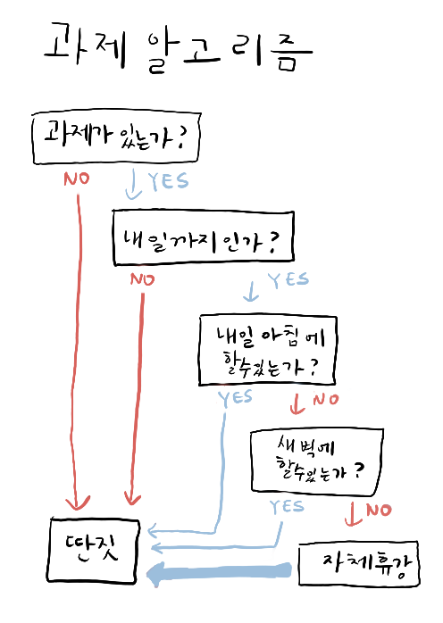
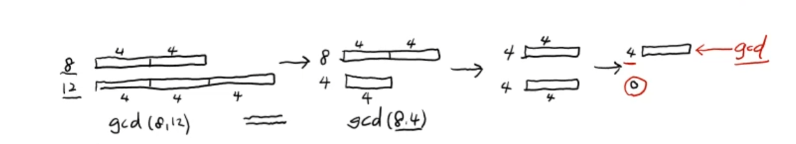
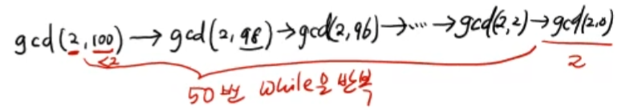

# 알고리즘 소개

<br/>

> 참고 자료 : 「알고리즘」 학부 수업 자료 (신찬수 교수님)

<br/>

### 목차

- <a href="">알고리즘 (Algorithm) 이란</a>
- <a href="">인류 최초의 알고리즘</a>

<br/><br/>

## 🗨 알고리즘 (Algorithm) 이란

&nbsp;&nbsp;&nbsp;&nbsp;&nbsp;&nbsp; 
<br/>
&nbsp;&nbsp;&nbsp;&nbsp;&nbsp;&nbsp; (<a href="https://m.blog.naver.com/PostView.naver?isHttpsRedirect=true&blogId=dydrogud22&logNo=221368334994"> 사진 출처 </a> )

<br/>

- 문제를 푸는 논리적인 절차

- 입력된 데이터에 <strong>유한한 횟수의 연산을 반복</strong>하여 원하는 결과값을 출력하는 과정

<br/>

### 알고리즘의 어원

- 기원전 페르시아의 Algebra(대수학) 수학자 Al-Khwarizmi이 대수와 0에 관한 책을 썼다.

- 그 책이 라틴어로 변역되는 과정에서 책의 저자가 Algorismus로 바뀌었다.

- Algorismus + Arithmos(수) = Algorithm

- (믿거나 말거나 이지만 정설로 받아들여지고 있음)

<br/><br/>

## 인류 최초의 알고리즘

### 최대공약수 (GCD) 계산 알고리즘 (By 유클리드)

- ex) gcd(8, 12) = max(1, 2, 4) = 4

  

- <strong>(큰 수) = (큰 수) - (작은 수)</strong> ← 두 수 중 하나가 0이 될 때까지 이 과정을 반복

  ```python
  def gcd_sub(a, b):
      while a != 0 and b != 0:
          if a > b:  a = a - b
          else:  b = b - a
      return a + b
  ```

<br/>

- 하지만 이 방법은 <strong>비효율적</strong>이다.

  - gcd(2, 100)을 계산하려면 50번 정도 while문을 반복해야 한다.

    

<br/>

- (큰 수) - (작은 수)를 반복하는 것은 큰 수를 작은 수로 나눈 나머지를 구하는 것과 결과가 동일하다.

  ```python
  def gcd_sub(a, b):
      while a != 0 and b != 0:
          if a > b:  a = a % b
          else:  b = b % a
      return a + b
  ```
