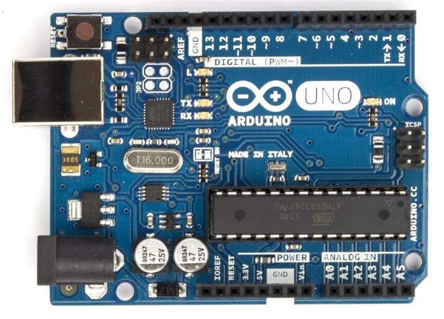

# 아두이노 소개

>  참고 자료 : 대학교 학부 수업 「컴퓨터 시스템 입문」,  
「따라하다보면 알게 되는 아두이노 배우기」(D.B.Info 출판, 김성필/홍선기/한경연 공저)

<br/>

## 🗨 아두이노(Arduino)란

* 간단한 <strong>마이크로컨트롤러 보드</strong>를 기반으로 한 오픈 소스 물리적 컴퓨팅 플랫폼

* 아두이노 보드에서 실행될 소프트웨어를 작성하는 개발환경을 포함하여 이르는 말

* 하드웨어 : 마이크로컨트롤러 보드의 일종

* 소프트웨어 : 프로그랭 개발 환경 (전용 라이브러리 포함)  
 ☞ 모두 오픈 소스 쟁책에 따라 공개되어 있음

 
 (사진 : 아두이노 우노)

<br/>
<br/>


## 마이크로컨트롤러 (uC)

* '하나의 칩'으로 구성된 컴퓨터

* CPU 역할을 하는 소자

* 메인보드 + 일부 HDD 기능

<br/>

## 아두이노의 장점
* 가격이 저렴하다.

* 다양한 플랫폼을 지원한다.

* 프로그래밍 환경이 입문자에게 사용하기 쉽도록 되어 있다.

* 오픈 소스 형태로 발표되어 소프트웨어가 확장 가능하다.

<br/>

## 스케치 (sketch)

* 아두이노를 사용하여 작성된 프로그램을 '스케치(sketch)'라고 부른다.

* C/C++를 기반으로 한다.

* main 함수는 숨겨져 있고 2개의 기본 함수로 구성되어 있다.

```c
void setup(void)
{

}

void loop(void)
{

}
```

* 【setup 함수】: 최초 1회만 실행

* 【loop 함수】: setup 이후 무한 반복 실행

<br/>

## 통합개발환경 구축

* <a href="https://www.arduino.cc/">IDE 다운로드</a>