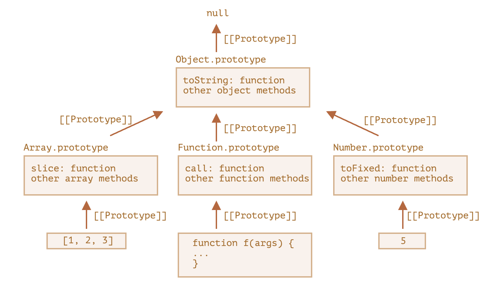

# JavaScript - Object Prototypes (프로토타입)

<br/>

## 사전 지식: 자바스크립트 언어의 특징

- 자바스크립트는 명령형, 함수형, 프로토타입 기반, 객체지향 프로그래밍을 지원하는 멀티 패러다임 프로그래밍 언어이다.

- 자바스크립트는 객체 기반 언어이며, 원시(Primitive) 타입을 제외한 모든 것이 객체다.

<br/>

- ES2015부터 자바스크립트에 Class가 생겼고, class에서 제공하는 constructor라는 생성자가 주어졌다. class를 new 키워드로 호출하면 constructor가 자동호출 된다.

- 이는 현대에서 가장 많이 쓰이는 객체 생성 방식이다.

- constructor는 객체(instance)를 생성해서 반환한다.

<br/><br/>

## 자바스크립트의 상속과 프로토타입

- 객체지향의 프로그래밍의 핵심 개념 중 하나인 상속이 자바스크립트에서는 프로토타입을 기반으로 구현되어 있다.

- 이 덕분에 불필요한 중복을 제거하여 메모리 낭비를 방지할 수 있다. (코드 재사용 가능)

```javascript
function Health(name, lastTime) {
  this.name = name;
  this.lastTime = lastTime;

  // return this; (new로 객체 생성 시 this를 리턴하는 것처럼 동작함)
}

Health.prototype.showHealth = function () {
  return this.name + "님 오늘은 " + this.lastTime + "에 운동을 하셨네요!";
};

var person1 = new Health("Lee", "AM 10:10");
var person2 = new Health("Kim", "AM 11:10");

console.log(person1.showHealth === person2.showHealth); // true
```

<br/><br/>

## 프로토타입의 이해

- 모든 객체에는 `[[Prototype]]`라고 하는 속성이 존재하는데, 이 속성은 모든 오브젝트의 조상(최상위에 존재하는 객체)인 Object라는 것을 가리키고 있다.

- 어떤 객체에서 메소드나 속성을 호출하면, 우선 그 객체가 가지고 있는 메소드(속성)를 찾아본 후, 없다면 그 객체가 가지고 있는 `[[Prototype]]`가 가리키는 객체에 해당 메소드(속성)가 있는지 찾아본다. (없으면 undefined)

  - 이를 '프로토타입 상속'이라 부른다.

  - `__proto__`는 `[[Prototype]]`용 getter·setter이라고 한다.

- 그렇다면 모든 객체에 있는 프로토타입 속성을 서로 연결시켜주면..?

```javascript
const c1 = {
  name: "C1",
  color: "red",
};

const c2 = {
  name: "C2",
  width: 300,
};

const c3 = {
  name: "C3",
  height: 100,
};

c1.__proto__ = c3;
c3.__proto__ = c2;

console.log(c1.width); // 300
```

- 각각의 객체는 자신 고유의 데이터와 메소드만 가지고 있고, 공통적으로 사용될 만한 것들은 상위 객체에 만들어놓은 다음, 프로토타입을 연결만 시켜서 재활용 할 수 있다.

- 이것이 **프로토타입 체이닝**이다.

<br/>

- 프로토타입 체이닝은, 순환 참조는 허용되지 않으며, `__proto__`의 값은 객체 혹은 null만 가능하다는 제약사항이 존재한다.

- 또한, 객체에는 (당연히도) 오직 하나의 `[[Prototype]]`만 존재할 수 있다.

<br/><br/>

## 내장 객체의 프로토타입과 계층 구조

- 자바스크립트의 프로토타입은 한 종류만 존재하는 것이 아닌, 다양한 종류가 존재하며, 프로토타입들은 계층적으로 연결되어 있다.

  - 모든 객체는 `Object.prototype`을 상속받거나, `null`을 상속받는다.

  - `Function`은 특별한 객체로서, `Function.prototype`을 가지며, 이는 `Object.prototype`을 상속받는다.

  - 내장 객체들은 각각의 프로토타입을 가지고 있으며, 모두 `Object.prototype`으로 연결된다.

  - 사용자 정의 객체도 프로토타입 체인을 통해 `Object.prototype`까지 연결된다.

```javascript
null
│
└── Object.prototype
    │
    ├── Array.prototype
    ├── Function.prototype
    ├── String.prototype
    ├── Number.prototype
    ├── Boolean.prototype
    ├── Date.prototype
    ├── RegExp.prototype
    ├── Promise.prototype
    │
    ├── 사용자 정의 객체 (Custom Object.prototype)
    │   ├── Person.prototype
    │   └── Animal.prototype

```

<br/>

- Array, Date, Function 세 내장 객체의 내부 구조 (출처: 코어 자바스크립트)

<div align="center">



</div>

- 명세서에선 모든 내장 프로토타입의 상속 트리 꼭대기엔 Object.prototype이 있어야 한다고 규정한다.

- 이런 명세 때문에 몇몇 사람들은 "모든 것은 객체를 상속받는다."라는 말을 하기도 한다.

<br/><br/>

## 함수의 프로토타입

- 함수도 자바스크립트에선 객체이므로, 프로토타입이 존재한다.

- 함수로 객체를 만들 수 있는 방법 중, new 연산자를 통해 인스턴스 객체를 만들 수 있다.

```js
function Func() {
  this.name = name;
}

const f = new Func("Yoon");

console.log(f.name); // Yoon
```

- `Func` 함수는 객체이므로 `__proto__` 속성이 역시 존재한다.

- 그리고 함수는 일반 객체와 달리 `prototype`이라고 하는 풀 네임을 갖고 있는 속성도 가지고 있다.

```js
function Func() {
  this.name = name;
}

const f = new Func("Yoon");

Func.prototype.newProperty = "Hello";

console.log(f); // Yoon
console.log9(f.newProperty); // Hello
```

- 어떻게 이러한 결과가 나올까?

- 여기서 new가 하는 일은..

```js
function Func() {
  this.name = name;
  this.__proto__ = Func.prototype; // <- 이 일!!
}
```

- 이렇게 new 연산자를 통해서 함수의 인스턴스 객체를 만들면, 일반 객체 프로토타입을 코드로 연결시켜 놓은 것을 훨씬 더 단순하고 간편하게 객체의 상속 관계를 만들어준다.

- 하지만 이조차도 꽤 번거롭다는 의견이 굉장이 많았기 때문에 ES6에 class 문법이 등장하였다.

- 그렇지만 ES6의 class 자체도 이 동작 메커니즘은 완전히 같으므로, 내부 메커니즘을 이해하는 면에서 이를 잘 알아두면 좋다.

<br/>
