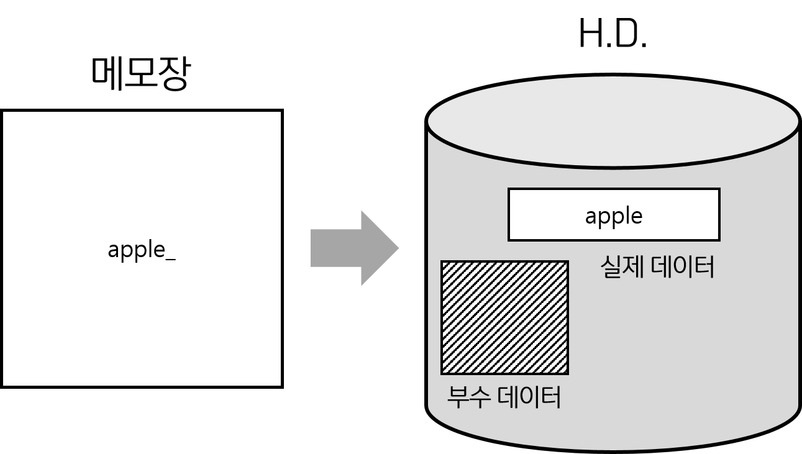

# C언어 - 파일 입출력

> 참고 자료 : <a href="https://www.youtube.com/playlist?list=PLVsNizTWUw7EYNg_fyTEFYgd84p2uK-aS">[혼자 공부하는 C 언어] 저자 강의</a>

<br/>

### 목차

- <a href="https://github.com/SangYoonLee1231/TIL/blob/main/C/file.md#%EC%8B%9C%EC%8A%A4%ED%85%9C%EC%97%90%EC%84%9C-txt-%ED%8C%8C%EC%9D%BC%EC%9D%84-%EC%B2%98%EB%A6%AC%ED%95%98%EB%8A%94-%EB%82%B4%EB%B6%80-%EA%B3%BC%EC%A0%95">시스템에서 txt 파일을 처리하는 내부 과정</a>
- <a href="https://github.com/SangYoonLee1231/TIL/blob/main/C/file.md#%EC%8A%A4%ED%8A%B8%EB%A6%BC-%ED%8C%8C%EC%9D%BC-stream-file-%EC%83%9D%EC%84%B1">스트림 파일 (stream file) 생성</a>
- <a href="https://github.com/SangYoonLee1231/TIL/blob/main/C/file.md#fopen-%ED%95%A8%EC%88%98-fclose-%ED%95%A8%EC%88%98"><code>fopen</code> 함수, <code>fclose</code> 함수</a>
- <a href=""></a>
- <a href=""></a>
- <a href=""></a>
- <a href=""></a>
- <a href=""></a>

<br/><br/>

## 시스템에서 txt 파일을 처리하는 내부 과정



<br/>

- 만일 메모장에 "apple"이라 타이핑하고 저장하면,  
  운영체제는 하드 디스크에 실제 데이터 "apple"과 함께 부수적인 데이터를 저장시킨다.

- 부수적인 데이터 : 데이터 블록, 작성 날따, 작성자 ID, 파일 크기 등등..

<br/><br/>

## 스트림 파일 (stream file) 생성

- H.D.(하드 디스크)에 저장된 데이터를 읽어서 화면에 출력하는 프로그램을 작성하고자 한다.

- 그러기 위해 우선 H.D.에 있는 부수적인 데이터를 메모리에 올려준다.

- 그렇게 하면, 부수적인 데이터를 통해 실제 데이터에도 올바르게 접근할 수 있다.

<br/>


<br/>

- 메인 메모리에 FILE 구조체 변수를 선언하여 부수적인 데이터를 넣어준다.

- buffer는 실제 데이터가 저장되는 공간으로, FILE 구조체 변수에 있는 부수 데이터를 통해 접근할 수 있다.

- FILE 구조체 변수와 buffer을 묶어 <strong>스트림 파일(stream file)</strong>이라 한다.

<br/><br/>

## <code>fopen</code> 함수, <code>fclose</code> 함수

- <strong><code>fopen</code></strong> 함수는 <strong>스트림 파일(stream file)을 생성</strong>해주는 함수이다.

  ```
  fopen("파일 이름", "개방 모드");
  ```

<br/>

- fopen 함수는 개방하고자 하는 파일 구조체 변수의 시작 주솟값을 반환한다.

  ```c
  FILE *fp;
  fp = fopen("a.txt", "r");
  ```

<br/>

- 그러나, fopen 작업이 성공적으로 수행되지 못하면 NULL 포인터 <code>(void\*) 0</code>를 반환한다.

- 따라서 fopen 작업이 성공적으로 수행되었는지 <strong>반드시 검사</strong>를 할 필요가 있다.

  ```c
  FILE *fp;
  fp = fopen("a.txt", "r");

  if (fp === NULL) {
    printf("파일이 없어요");
    exit(1); // 프로그램을 비정상적으로 종료
  }

  ...

  fclose(fp);
  ```

- fopen 함수로 파일을 개방했으면, 모든 작업을 종료하고 <strong>반드시 <code>fclose</code> 함수를 통해 파일을 닫아주어야 한다.</strong>

- <strong><code>fclose</code></strong> 함수는 메모리에 있는 fp관련 모든 데이처를 제거해주는 함수이다.

<br/><br/>

### 개방모드

<br/><br/>

## 기본 개방 스트림 파일

<br/><br/>

## 다양한 입출력 함수

<br/><br/>

## 버퍼 공유 문제와 <code>fflush</code> 함수

<br/><br/>

## <code>fread</code>, <code>fwrite</code> 함수
