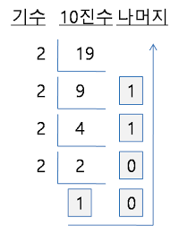

# 2진수 체계

 

> 참고 자료 : 전공 서적 『디지털 디자인』 (M. Morris Mano, Michael D. Ciletti 저 / 퍼스트북 출판),  
> 『논리 회로』 학부 수업 자료

 

### 목차

- <a href="https://github.com/SangYoonLee1231/TIL/blob/main/ComputerSystem/computer_system_binary_system.md#%EB%94%94%EC%A7%80%ED%84%B8-%EC%8B%9C%EC%8A%A4%ED%85%9C">디지털 시스템</a>
- <a href="https://github.com/SangYoonLee1231/TIL/blob/main/ComputerSystem/computer_system_binary_system.md#2%EC%A7%84%EC%88%98--8%EC%A7%84%EC%88%98-16%EC%A7%84%EC%88%98">2진수 (+ 8진수, 16진수)</a>
- <a href="https://github.com/SangYoonLee1231/TIL/blob/main/ComputerSystem/computer_system_binary_system.md#%EA%B8%B0%EC%88%98-%EB%B3%80%ED%99%98">기수 변환</a>
- <a href="https://github.com/SangYoonLee1231/TIL/blob/main/ComputerSystem/computer_system_binary_system.md#%EC%88%98%EC%9D%98-%EB%B3%B4%EC%88%98">수의 보수</a>
- <a href="https://github.com/SangYoonLee1231/TIL/blob/main/ComputerSystem/computer_system_binary_system.md#%EB%B3%B4%EC%88%98%EB%A5%BC-%EC%9D%B4%EC%9A%A9%ED%95%9C-%EB%BA%84%EC%85%88">보수를 이용한 뺄셈</a>

  

## 디지털 시스템

- <strong>디지털 시스템</strong> : 0과 1을 조합해서 여러가지 정보를 얻어낼 수 있는 시스템

 

- 아날로그 시스템 (<strong>연속적</strong>) → 디지털 시스템 (<strong>이산적</strong>)

- <strong>이산 정보</strong>

  - 하나의 요소를 특정지을 수 있는 정보

  - 유한개의 원소로 이루어진 모든 집합

  - ex) 10진 자리수, 알파벳 26개 문자, 체스판 64개의 칸, ..

- <strong>Signal</strong>

  - 이산적인 요소를 물리적 양으로 표현한 것

  - ex) 전얍의 양, 전류의 양

 

- 이산 정보 요소를 2진 코드(0과 1)로 불리는 비트(bit)들의 그룹으로 표현 → 디지털 정보

  - 비트(bit) : 데이터를 저장하는 물리적인 소자

  

## 2진수 (+ 8진수, 16진수)

<strong>[10진수]</strong> &nbsp; 7392 = (7 \* 10^3) + (3 \* 10^2) + (9 \* 10^1) + (2 \* 10^0)

<strong>[2진수]</strong> &nbsp; 11010.11(2) = (1 \* 2^4) + (1 \* 2^3) +(0 \* 2^2) + (1 \* 2^1) + (0 \* 2^0) + (1 \* 2^-1) + (1 \* 2^-2)

 

- <strong>디지털에서 8진수와 16진수도 쓰는 이유</strong>

  : 2진수보다 자리를 덜 차지하여 bit를 절약할 수 있다. (1byte = 8bit)

<strong>[8진수]</strong> &nbsp; 254(8) = (2 \* 8^2) + (5 \* 8^1) + (4 \* 8^0)

 

- 16진수에서 10 = A, 11 = B, ... , 15 = F

<strong>[16진수]</strong> &nbsp; F9(16) = (15 \* 16^1) + (9 + 16^0)

  

## 기수 변환

- 10진수 19를 2진수로 변환

  : 10011(2)

    

 

- 2진수 10011을 10진수로 변환

      : 19(10)

      (1 * 2^4) + (0 * 2^3) + (0 * 2^2) + (1 * 2^1) + (1 * 2^0)

  = 16 + 0 + 0 + 2 + 1

 

- 10진수 소수 0.6875을 2진수로 변환

  : 0.1011(2)

  &nbsp;&nbsp; 0.6875 X 2 = 《1》 + 0.3750

  &nbsp;&nbsp; 0.3750 X 2 = 《0》 + 0.7500

  &nbsp;&nbsp; 0.7500 X 2 = 《1》 + 0.5000

  &nbsp;&nbsp; 0.5000 X 2 = 《1》 + 0.0000

 

### 2진수를 8진수나 16진수로 쉽게 변환하는 법

- <strong>2진수로 구성된 숫자 3 bit는 하나의 8진수에 대응한다.</strong>

  10110001101011.111100000110(2)를 8진수로 변환해보자.

  - 10/110/001/101/011.111/100/000/110(2)  
    &nbsp;&nbsp; 2 / 6 / 1 / 5 / 3 . 7 / 4 / 0 / 6  
    → 26153.7406(8)

 

- <strong>2진수로 구성된 숫자 4 bit는 하나의 16진수에 대응한다.</strong>

  10110001101011.111100000110(2)를 16진수로 변환해보자.

  - 10/1100/0110/1011.1111/0000/0110(2)  
    &nbsp;&nbsp; 2 / 12 / 6 / 11 . 15 / 0 / 6  
    → 2C6B.F06(16)

  

## 수의 보수

- <strong>보수를 사용하는 이유</strong>

  : 보수를 이용하면, 덧셈 하나로 뺄셈(및 다른 사칙 연산)을 함께 처리할 수 있게 되므로, <strong>자원을 절약</strong>할 수 있다.

  (보수를 만드는 과정은 비트에 변화만 주면 되기 때문에, 감산기를 만드는 것보다 훨씬 간단하다)

 

- 기수 r의 체계에 대해 <strong>두 가지 형</strong>의 보수가 있다.

 

### 감소된 기저 보수

- 어떤 10진수의 <strong>9의 보수</strong>는, <strong>9에서 각 자리 숫자를 뺌</strong>으로써 얻어진다.

  - 10진수 546700에 대한 9의 보수 = 999999-546700 = 453299

  - 10진수 012398애 대한 9의 보수 = 999999-012398 = 987601

 

- 어떤 2진수의 <strong>1의 보수</strong>는, <strong>1에서 각 자리 숫자를 뺌</strong>으로써 얻어진다.  
  또는, 1을 0으로, 0을 1로 바꿔줌으로써 얻을 수 있다.

      * 2진수 1011000에 대한 1의 보수 = 1111111-1011000 = 0100111

      * 2진수 0101101에 대한 1의 보수 = 1111111-0101101 = 1010010

 

### 기저 보수

- 어떤 10진수의 <strong>10의 보수</strong>는, <strong>(9의 보수) + 1</strong>을 통해 얻어진다.

  - 10진수 246700에 대한 10의 보수 = 1000000-246700 = 753300

  - 10진수 012398에 대한 10의 보수 = 1000000-012398 = 987602

 

- 어떤 2진수의 <strong>2의 보수</strong>는, <strong>(1의 보수) + 1</strong>을 통해 얻어진다.

  또는, <strong>일의 자리부터 첫번째로 1이 등장할 때까지의 모든 유효숫자 0과 그 첫번째 1은 바꾸지 않고</strong>, 그보다 높은 나머지 모든 자리 숫자를 1 → 0, 0 → 1로 바꿔서 얻을 수 있다.

      * 2진수 1101100에 대한 2의 보수 = 10000000-1101100 = 0010100

      * 2진수 0110111애 대한 2의 보수 = 10000000-0110111 = 1001001

  

## 보수를 이용한 뺄셈

- 보수와 덧셈을 이용하여 뺄셈 연산을 하는 법을 알아보자.

- <strong>A - B</strong>에서 <strong>A</strong>는 '<strong>피감수</strong>', <strong>B</strong>는 '<strong>감수</strong>'라 부른다.

- ✨ <strong>연산 과정</strong>

  - Step 0) 피감수와 감수 자리수 통일 (빈 곳은 0으로 채운다)

  - Step 1) 감수에 r의 보수를 취한다. (A, B는 모두 r진수)

  - Step 2) 피감수 + (감수의 r의 보수)

  - Step 3)  
     if 피감수 > 감수 : 끝자리 올림 삭제  
     elif 피감수 < 감수 : 결과값에 다시 r의 보수 취하고 마이너스(-) 붙이기

 

- <strong>(예1) 10진수 계산 : 72532 - 3250</strong>

  - Step 0) 피감수 73252, 감수 03250 자리수 통일

  - Step 1) 감수 03250에 10의 보수 취한다. → 96750

  - Step 2) 피감수 73252 + 감수의 10의 보수 96750 = 169282

  - Step 3) 피감수 > 감수이므로, 끝자리 올림 100000 버리고 남은 값 69282가 답이다.

 

- <strong>(예2) 10진수 계산 : 3250 - 72532</strong>

  - Step 0) 피감수 03250, 감수 73252 자리수 통일

  - Step 1) 감수 73252에 10의 보수 취한다. → 26748

  - Step 2) 피감수 03250 + 감수의 10의 보수 26748 = 30718

  - Step 3-1) 피감수 < 감수이므로, 결괏값 30718에 다시 10의 보수를 취한다.

  - Step 3-2) 계산값 69282에 마이너스를 붙인 -69282가 답이다.

 

- <strong>(예3) 2진수 계산 : 1010100 - 1000011</strong>

  - Step 0) 피감수 1010100, 감수 1000011 자리수 통일 (자리수 동일하므로 생략)

  - Step 1) 감수 1000011에 2의 보수 취한다. → 0111101

  - Step 2) 피감수 1010100 + 감수의 2의 보수 0111101 = 10010001

  - Step 3) 피감수 > 감수이므로, 끝자리 올림 10000000 버리고 남은 값 0010001이 답이다.

 

- <strong>(예4) 2진수 계산 : 1000011 - 1010100</strong>

  - Step 0) 피감수 1000011, 감수 1010100 자리수 통일

  - Step 1) 감수 1010100에 2의 보수 취한다. → 0101100

  - Step 2) 피감수 1000011 + 감수의 2의 보수 0101100 = 1101111

  - Step 3-1) 피감수 < 감수이므로, 결괏값 1101111에 다시 2의 보수를 취한다.

  - Step 3-2) 계산값 0010001에 마이너스를 붙인 -0010001이 답이다.

  

> 사진 출처 : <a href="https://m.blog.naver.com/piyoro/221770535071">10진수를 2진수로 변환, 2진수를 10진수로 변환 (개인 블로그)</a>
