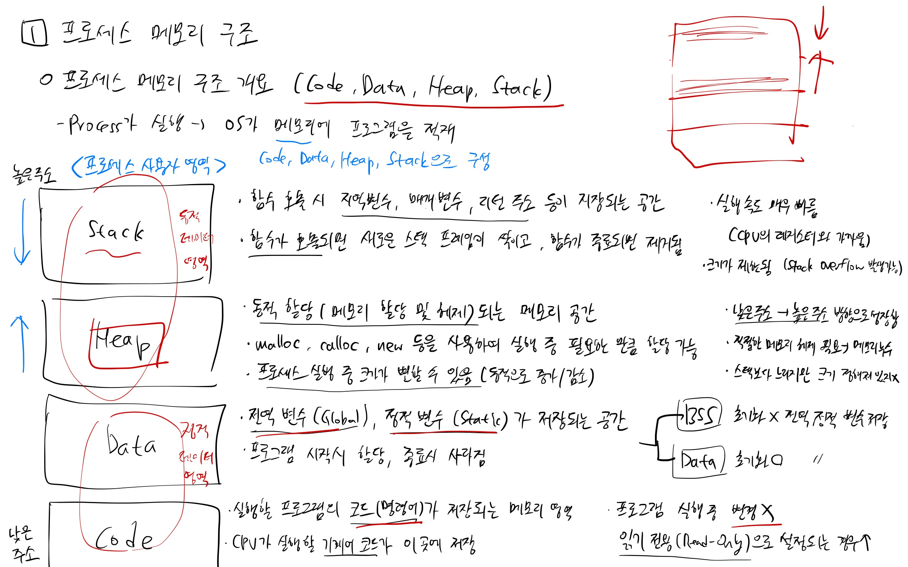

# 프로세스 메모리의 네 가지 영역 그리고 힙(Heap)

<br/>

> 참고 자료 : 개발 도서 『혼자 공부하는 컴퓨터구조+운영체제』 (강민철 저 / 한빛미디어 출판), ChatGPT 등

<br/>

## 프로세스 메모리 구조 개요

- 프로세스 메모리 구조는 크게 4가지 영역으로 나뉜다.

  - 높은 주소에서 낮은 주소 순으로 **Stack, Heap, Data, Code**

<br/>

- 각 메모리 구조의 특징 및 역할은 간단히 아래와 같다.

    <div align="center">

    

    </div>

<br/>

- 이번에는 특히 동적 할당을 담당하는 영역인 Heap에 대해 중점적으로 다룬다.

<br/><br/>

## 힙 메모리의 위치와 역할

#### 위치

- 일반적으로 전역 변수들이 위치하는 데이터(Data) 영역의 위쪽 주소 영역에 존재한다.

- <strong>힙(Heap)</strong>은 운영체제가 혀용하는 범위 내에서 <strong>낮은 메모리 주소에서 높은 메모리 주소 방향</strong>으로 확장된다.

- 반면 <strong>스택(Stack)</strong>은 <strong>높은 메모리 주소에서 낮은 메모리 주소 방향</strong>으로 내려오며, 힙과 스택 사이의 공간이 힙이 확장될 수 있는 영역이 된다.

<br/>

#### 역할

- <strong>프로그램 실행 중 크기가 변할 수 있는 데이터(배열, 객체 등)를 저장한다.</strong>

- 프로그램 실행 중 지속적으로 유지되는 데이터를 저장한다.

- 사용자가 직접 필요한 시점에 malloc을 통해 메모리를 할당 받고, 사용을 마친 후 free를 통해 직접 해제한다. 사용자가 명시적으로 해제해주지 않으면 <strong>메모리 누수(Memory Leak)</strong>가 발생할 수 있다.

  - 다만, Java, C#, Python, JS 등의 언어에서는 <strong>가비지 컬렉터(GC)</strong>가 힙 메모리의 할당과 반환을 자동으로 수행한다.

- 크기 제한이 거의 없어 운영체제의 가상 메모리 시스템이 허용하는 한도까지 확장이 가능하다.

- 비록 힙은 연산속도가 느리고 관리 비용이 크지만, 메모리 활용도가 높은 영역이다.

<br/><br/>

## 힙 메모리의 할당 방식

### 1) 메모리 할당과 해제 (malloc, free 개념)

#### 메모리 할당 (malloc)

- 동적 메모리 관리자는 내부적으로 프리 리스트(Free List) 등의 자료구조를 활용하여 사용하지 않는 힙 영역을 추적한다.

- 힙에서 메모리를 요청하면 (`malloc(size)`), size 바이트만큼의 연속적인 힙 메모리를 내부적으로 찾아 할당하고, 할당된 첫 번째 바이트의 포인터를 반환한다.

- 할당된 메모리 블록은 사용 중인 상태로 표시된다.

- 만일 할당에 실패한다면, NULL 포인터를 반환한다.

```c
// 예제 (C에서의 malloc)

int _arr = (int _)malloc(4 \* sizeof(int)); // 4개의 int 크기만큼 메모리 할당
```

<br/>

#### 메모리 해제 (free)

- `free(pointer)`은 malloc()으로 할당된 메모리를 반환(해제)한다.

- 사용이 끝난 블록을 free하면, 다시 프리 리스트(Free List)에 이 블록을 반환하여 재사용 가능 상태로 바꾼다.

- 해제된 메모리는 다시 할당이 가능하지만, 기존 데이터는 유지되지 않는다.

- 반드시 free를 호출하여 메모리 누수(Memory Leak)를 방지해야 한다.

```c
free(arr); // arr이 가리키는 메모리를 해제
```

<br/>

#### JavaScript에서 힙 할당

- JavaScript는 자동으로 메모리를 관리하지만, ArrayBuffer를 사용하면 힙 할당을 직접 시뮬레이션할 수 있다.

```js
let buffer = new ArrayBuffer(1024); // 1024 바이트 힙 메모리 할당
let view = new DataView(buffer); // 데이터 조작용 뷰 생성
```

<br/>

### 2) 메모리 패딩(Padding) 및 정렬(Alignment)

#### (1) 정렬(Alignment)

- CPU는 특정 크기(예: 4바이트, 8바이트) 단위로 메모리를 읽는다.

- 메모리를 올바르게 정렬하면 CPU가 빠르게 접근할 수 있지만, 일부 공간이 낭비될 수 있다.

#### 예제: 8바이트 정렬이 필요한 경우

```c
struct Example {
char a; // 1 byte
char b; // 1 byte
int c; // 4 bytes
double d; // 8 bytes (8바이트 정렬 필요)
};
```

위 구조체는 16바이트가 아니라 24바이트를 차지할 수 있다.

<br/>

#### (2) 패딩(Padding)

- 작은 데이터 타입을 사용할 때, 정렬을 유지하기 위해 불필요한 빈 공간을 추가하는 것을 말한다.

- 패딩은 내부 단편화를 유발하지만, 대신 CPU가 메모리에 더욱 빠르게 접근할 수 있도록 도와준다.

<br/>

### 3) 내부 단편화 vs 외부 단편화

- 힙 메모리를 사용할 때 <strong>단편화(fragmentation)</strong> 문제가 발생할 수 있다.

#### (1) 내부 단편화 (Internal Fragmentation)

- 정렬(Alignment) 및 패딩으로 인해 사용되지 않는 공간이 생기는 것을 말한다.

- 예를 들어, 4바이트 정렬이 필요한 시스템에서 3바이트짜리 데이터를 저장하면 1바이트가 낭비된다.

- 작은 크기의 메모리를 할당할 때도 최소 블록 크기(예: 8바이트)로 인해 불필요한 공간이 생길 수 있다.

```c
struct Example {
char a; // 1 byte
int b; // 4 bytes (정렬을 위해 3바이트 패딩)
};
```

구조체의 크기는 5바이트가 아니라 8바이트(3바이트 패딩 포함)가 된다.

<br/>

#### (2) 외부 단편화 (External Fragmentation)

- 연속된 메모리 블록이 충분하지만, 중간에 사용 중인 블록 때문에 큰 공간을 할당할 수 없는 상황이다.

- 예를 들어, 10KB의 힙 공간이 남아 있지만, 여러 개의 작은 블록이 흩어져 있으면 8KB 블록을 할당할 수 없을 수도 있다.

- 해결 방법

  - 메모리 압축(compaction)을 통해 사용되지 않는 블록을 모아 연속된 큰 블록을 확보
  - 동적 메모리 관리 전략(Fit 전략)을 활용하여 더 효율적으로 메모리 할당

<br/><br/>

## 힙(Heap) 동적 메모리 관리 전략

- 힙에서 메모리를 효율적으로 할당하기 위해 <strong>First-Fit, Best-Fit, Worst-Fit</strong> 등의 전략이 사용된다.

### (1) First-Fit (최초 적합)

- 첫 번째로 적절한 크기의 빈 공간을 찾아 할당하는 방식이다.

- 속도가 빠르지만, 외부 단편화가 발생할 가능성이 있다.

```less
빈 공간: [10KB] [4KB] [6KB] [8KB]
요청: 5KB 할당 → [6KB] 블록 사용됨 → 남은 공간 [1KB]
```

큰 블록이 쪼개져서 외부 단편화가 발생할 수 있음.

<br/>

### (2) Best-Fit (최적 적합)

- 가장 작은 적절한 크기의 빈 공간을 찾아 할당한다.

- 공간 활용도가 높지만, 속도가 느릴 수 있다. (모든 블록을 검색해야 함)

```less
빈 공간: [10KB] [4KB] [6KB] [8KB]
요청: 5KB 할당 → [6KB] 블록 사용됨 → 남은 공간 [1KB]
```

First-Fit보다 공간 낭비가 적지만, 할당 속도가 느릴 수 있음.

<br/>

### (3) Worst-Fit (최악 적합)

- 가장 큰 빈 공간을 찾아 할당하여 이후에도 충분한 공간이 남을 수 있도록 한다.
- 외부 단편화가 줄어들지만, 큰 블록이 빠르게 조각나 사라질 수 있다.

```less
빈 공간: [10KB] [4KB] [6KB] [8KB]
요청: 5KB 할당 → [10KB] 블록 사용됨 → 남은 공간 [5KB]
```

Best-Fit과 반대로, 큰 블록을 먼저 사용하여 공간이 효율적으로 활용되지 않을 수 있음.

<br/><br/>

## 힙 메모리 관련 주요 이슈

#### 메모리 누수(Memory Leak)

- 동적으로 할당받은 힙 메모리를 free하지 않고 참조도 잃어버리는 경우, 해당 메모리는 더 이상 사용 불가능해지고 시스템 리소스만 차지하게 된다.

- 장시간 동작하는 서버 프로그램 등에서는 메모리 누수가 큰 문제가 될 수 있다.

<br/>

#### 뱀 물림(Segmentation Fault) / 잘못된 접근

- 이미 free된 힙 블록에 접근하거나, 할당된 범위를 벗어나는 메모리 영역에 쓰기 연산을 할 경우 프로그램이 비정상 종료(세그멘테이션 폴트)할 수 있다.

<br/>

#### 단편화(Fragmentation)

- 앞서 말한 것처럼 힙에서는 크고 작은 블록이 여러 개 할당되고 해제되면서 메모리 단편화가 발생하기 쉽다.

- 동적 할당이 자주 발생하는 경우, 가능한 한 할당 과정과 해제 과정을 짝지어 적절한 시점에 메모리를 해제하는 전략이 중요하다.

<br/>

#### 자동 메모리 관리(가비지 컬렉션) 여부

- C/C++에서는 개발자가 명시적으로 malloc과 free(또는 new/delete)를 호출해야 하지만, Java, C#, Python, JS 등의 언어에서는 <strong>가비지 컬렉터(GC)</strong>가 힙 메모리를 자동으로 관리한다.

- GC가 있을 경우 힙에 할당된 객체 중 참조 불가능한 객체를 자동으로 해제하여 메모리 누수를 방지한다.

<br/>
