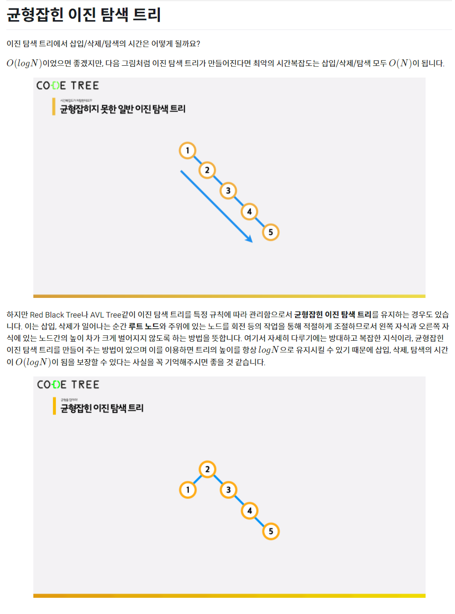

# 균형잡힌 이진 탐색 트리 (Balanced BST)

 

> 참고 자료 : 《<a href="https://github.com/SangYoonLee1231/TIL/blob/main/DataStructure/data_structure_introduction.md">자료구조 소개</a>》 페이지 참고

 

### 목차

- 
- 
- 
- 

  

나중에 다시 정리하겠습니다..

</img>
