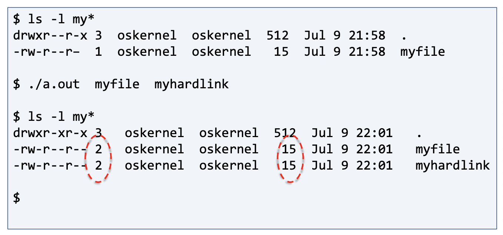

# 리눅스 파일 관리 시스템 Part 2 (v-node, Link)

<br/>

> 참고 자료 : '시스템 프로그래밍' 학부 수업 자료

<br/><br/>

### 목차

- <a href="https://github.com/SangYoonLee1231/TIL/blob/main/Operating_System/System_Programming_Linux/linux_file_system_pt2.md#%ED%8C%8C%EC%9D%BC-%EB%94%94%EC%8A%A4%ED%81%AC%EB%A6%BD%ED%84%B0-%EC%8B%9C%EC%8A%A4%ED%85%9C%EA%B3%BC-v-node">파일 디스크립터 시스템과 v-node</a>

  - <a href="https://github.com/SangYoonLee1231/TIL/blob/main/Operating_System/System_Programming_Linux/linux_file_system_pt2.md#%ED%8C%8C%EC%9D%BC-%EB%94%94%EC%8A%A4%ED%81%AC%EB%A6%BD%ED%84%B0-in-linux">파일 디스크립터 (in Linux)</a>
  - <a href="https://github.com/SangYoonLee1231/TIL/blob/main/Operating_System/System_Programming_Linux/linux_file_system_pt2.md#%ED%8C%8C%EC%9D%BC-%ED%85%8C%EC%9D%B4%EB%B8%94-file-table">파일 테이블 (File Table)</a>
  - <a href="https://github.com/SangYoonLee1231/TIL/blob/main/Operating_System/System_Programming_Linux/linux_file_system_pt2.md#v-node">v-node</a>

- <a href="https://github.com/SangYoonLee1231/TIL/blob/main/Operating_System/System_Programming_Linux/linux_file_system_pt2.md#hard-link-vs-soft-link-symbolic-link-link-%EA%B4%80%EB%A0%A8-%EC%8B%9C%EC%8A%A4%ED%85%9C-%EC%BD%9C">Hard Link vs Soft Link (Symbolic Link), Link 관련 시스템 콜</a>

  - <a href="https://github.com/SangYoonLee1231/TIL/blob/main/Operating_System/System_Programming_Linux/linux_file_system_pt2.md#hard-link">Hard Link</a>
  - <a href="https://github.com/SangYoonLee1231/TIL/blob/main/Operating_System/System_Programming_Linux/linux_file_system_pt2.md#soft-link">Soft Link</a>
  - <a href="https://github.com/SangYoonLee1231/TIL/blob/main/Operating_System/System_Programming_Linux/linux_file_system_pt2.md#hard-link-example">Hard Link Example</a>
  - <a href="https://github.com/SangYoonLee1231/TIL/blob/main/Operating_System/System_Programming_Linux/linux_file_system_pt2.md#%EA%B4%80%EB%A0%A8-%EC%8B%9C%EC%8A%A4%ED%85%9C-%EC%BD%9C">관련 시스템 콜</a>
  <!-- - <a href=""></a> -->

<br/><br/>

## 파일 디스크립터 시스템과 v-node

### 파일 디스크립터 (in Linux)


- 프로그램을 하나 실행시키면 프로세스가 생성

- 한 프로세스 안에는 그 프로세스가 오픈한 파일들의 리스트를 관리하는 테이블이 하나 있음

  → **파일 디스크립터 테이블**

- 파일 디스크립터 (넘버) : 각 엔트리에 할당된 인덱스

  - **0, 1, 2** : 표준 입력 장치, 표준 출력 장치, 표준 에러 장치

  - (파일 포인터가) 장치를 가리킴 = 시스템이 관리하는 그 장치에 관련된 정보를 가리킴

  - OS 안에 장치와 관련된 구조체들이 있음 → 파일 테이블

<br/>

### 파일 테이블 (File Table)

- **file status flag** : read용인지 write용인지, 어떤 permission인지

- **current file offset** : 현재 Offset의 값

- **v-node pointer** : 하드 디스크의 v-node 테이블을 가리키는 포인터

- 파일 테이블은 **커널 메모리**에서 관리된다.

<br/>

### v-node

- 리눅스에서 쓰는 i-node도 있고, 다른 형태의 파일 시스템도 있을 수 있다. (하둡 등)

- 이들을 통일된 형태로 인터페이스를 (위에서) 제공해주어야 한다.

  → **v-node**라는 이름으로 확장된 인터페이스 제공

- 리눅스만 쓰는 시스템에선 **v-node = i-node**

- **vnode는 하드 디스크에 있다.**

<br/>

#### dup

- 기존의 오픈된 파일 디스크립터와 똑같은 엔트리를 만듦

- `int dup(int fd);`

  - 쉘에서 **파이프**를 구현하려면 dup 함수가 필요함

    - **파이프** : 쉘에서 앞에서 작용한 표준 출력 결과를 뒤 프로세스에 넘겨주는 오퍼레이터

<br/><br/>

## Hard Link vs Soft Link (Symbolic Link), Link 관련 시스템 콜


### Hard Link

- 어떤 파일이 존재한다고 해보자.

- **이 파일에는 대응하는 하나의 inode가 있다.**

  - **inode는 이 파일에 대한 모든 정보를 가지고 있는 정보 구조체이다.**

  - **디렉토리** : 파일 이름과 inode의 집합

<br/>

- `myfile.txt`를 만들면, OS에서 그것에 해당하는 inode를 자동으로 부여해준다.

- 경우에 따라 다른 지점에다가 `my-hard-link`라는 다른 이름의 파일을 만들 수 있다.

- 그리고 `myfile.txt`의 inode를 가리키도록 묶어줄 수 있다.

- 이렇게 하면 `myfile.txt` 뿐만 아니라 `my-hard-link` 파일로도 같은 파일에 접근할 수 있게 된다.

- 이렇게 같은 파일로 접근할 수 있도록 만든 링크를 **Hard Link**라 한다.

  - 이점 : 다른 이름으로 원하는 파일에 접근할 수 있다.

<br/>

### Soft Link

- 어떤 아주 짧은 파일을 만들어 놓는다.

- 그 안에는 (내가 접근하려고 하는) 경로명이 들어있다.

- `my-soft-link`라는 파일을 Soft Link 방식으로 만들어 놓으면, 내가 그 안에 있는 “myfile.txt”라는 이름을 읽고 그 파일로 이동한다.

- `my-soft-link`는 파일 그 자체가 경로명을 갖고 있는 short file이다.

- 이런 방식의 링크를 <strong>Symbolic Link (Soft Link)</strong>라 한다.

> - 윈도우즈의 단축 아이콘은 Hard Link가 아닌 Soft Link이다.

<br/>

### Hard Link vs Soft Link

- Hard Link와 Soft Link 이 둘의 목적은 별반 다르지 않다.

  - 다만 **Hard Link가 좀 더 빠르게 동작한다.**

  - Soft Link은 파일을 매번 읽어서 경로를 찾아가야 하기 때문이다.

- Hard Link는 하나의 링크를 끊는다고 해서 inode를 바로 삭제하지 않는다.

  - inode에는 **count**가 있다. (몇 개의 파일이 나를 가리키고 있는지)

  - 정확히는 **reference count**라 부른다.

    - 이 count가 0이 되어야 비로소 inode가 청소된다.

- 그럼에도 불구하고 **Soft Link가 유용한 이유**

  - 한 디스크에서 파일 시스템이 만들어지고, 다른 디스크에 또 다른 파일 시스템이 만들어질 수 있다.

  - 리눅스나 유닉스에선 이 둘을 연결하는 구조를 지원한다.

  - 그러나 **inode는 한 개의 파일 시스템 내에서만 unique**하다.

    - inode는 한 개의 파일 시스템 안에서 고유한 번호이다.

  - **즉, 서로 다른 파일 시스템 간에는 Hard Link를 할 수 없다.**

    - 같은 파일 시스템 내에서만 Hard Link를 만들어놓을 수 있다.

  - 따라서 서로 다른 파일 시스템끼리 연결하고 싶으면 **Symbolic Link를 써야 한다.**

<br/>

### Hard Link Example

  

```shell
$ ls -l my\*
drwxr-xr-x 3 oskernel oskernel 512 Jul 9 22:01 .
```

- 파일들에 대한 정보를 출력

- 여기서 3은 그 파일의 inode가 갖는 hard link의 수 (count 정확히는 reference count)

- 15는 파일 사이즈

<br/>

- 파일 네임은 링크이다. (심볼릭 링크도 있고 일반 파일 네임도 있음)


- 링크와 관련된 여러 시스템 콜들이 있는데,

- 이 중에서, (symbolic link든 hard link든) 어떤 link가 있을 경우, 그 link가 가리키는 최종 목적지 파일(target file)에 가서 target file의 정보를 가져오는 시스템 콜이 있다. → 이것이 일반적이다.

- But, **link가 있으면 link 그 자체를 파일이라 생각하고, 그 link 파일에 오퍼레이션을 수행하는 명령어가 존재한다.**

- 즉, 이 명령어들은 target file까지 따라가지 않는다.

- symbolic link 파일에 오퍼레이션을 수행한다는 의미다.

- 이러한 명령어는 6개가 있다.

  - **lchown** : link change owner (링크의 사용자 변경)

  - **lstat** : link 파일의 status 정보를 읽어낸다

  - **remove** : 대상 link 파일을 제거하거나 디렉토리를 제거한다. (rm + rmdir)

    - [비교] rmdir : 리눅스 명령어

  - **readlink** : link 파일에 있는 경로명을 읽어오는 명령어

  - **rename** : link 파일 이름을 바꾸는 명령어

  - **unlink** : 대상 link를 제거한다.

<br/><br/>

### 관련 시스템 콜

#### `stat` 함수 : `int stat(const char *pathname, struct stat *statbuf);`

- stat 함수는 리눅스 C 파일 입출력에서 파일의 정보를 얻어오는 함수이다.

- 이 함수를 사용하여 파일의 종류, 크기, 수정 시간 등의 정보를 얻을 수 있다.

- stat 함수의 선언은 다음과 같다.

  ```c
  int stat(const char *pathname, struct stat *statbuf);
  ```

  - 첫 번째 인자인 `pathname`은 파일의 경로를 나타내는 문자열이다.

  - 두 번째 인자인 `statbuf`는 `stat` 구조체에 대한 포인터로, 파일 정보가 저장된다.

<br/>

- stat 구조체는 다음과 같이 정의된다.

  ```c
  struct stat {
    dev_t     st_dev;         /* 파일이 위치한 장치의 ID */
    ino_t     st_ino;         /* 파일의 inode 번호 */
    mode_t    st_mode;        /* 파일의 종류 및 접근 권한 */
    nlink_t   st_nlink;       /* 파일을 참조하는 하드 링크의 수 */
    uid_t     st_uid;         /* 파일의 소유자 ID */
    gid_t     st_gid;         /* 파일의 그룹 ID */
    dev_t     st_rdev;        /* 특수 파일의 장치 ID */
    off_t     st_size;        /* 파일의 크기(바이트) */
    blksize_t st_blksize;     /* 파일 시스템의 I/O 블록 크기 */
    blkcnt_t  st_blocks;      /* 할당된 블록 수 */
    time_t    st_atime;       /* 마지막으로 접근한 시간 */
    time_t    st_mtime;       /* 마지막으로 수정한 시간 */
    time_t    st_ctime;       /* 마지막으로 상태가 변경된 시간 */
  };
  ```

<br/>

- `st_mode` 멤버 변수는 파일의 종류와 접근 권한을 나타내는데, 이 값은 다음과 같은 **매크로 함수**를 사용하여 해석할 수 있다.

  

  - `S_ISREG(mode)`: 일반 파일인 경우
  - `S_ISDIR(mode)`: 디렉토리인 경우
  - `S_ISCHR(mode)`: 문자 장치 파일인 경우
  - `S_ISBLK(mode)`: 블록 장치 파일인 경우
  - `S_ISFIFO(mode)`: FIFO 파일인 경우
  - `S_ISLNK(mode)`: 심볼릭 링크인 경우
  - `S_ISSOCK(mode)`: 소켓 파일인 경우

<br/>

- 이외에도 `stat` 함수를 통해 얻을 수 있는 정보는 다양하다.

- `man 2 stat` 명령어를 입력하면 `stat` 함수에 대한 더 자세한 정보를 얻을 수 있다.

<br/><br/>

#### `lstat` 함수 : `int lstat(const char *path, struct stat *buf);`

- `lstat`는 그 링크가 가리키는 target 파일이 **아닌** 그 llnk 파일의 정보를 가져온다.

- return 값 → 정상 : 0, 비정상 : 1 (perror 함수를 불러 에러의 원인을 출력할 수 있도록 한다)

<br/>

#### `fstat` 함수 : `int fstat(int fd, struct stat *buf);`

- 파일을 하나 열면 파일 디스크립터가 하나 할당

- 그 이미 열린 오픈된 파일의 파일 디스크립터를 이용해서 파일 정보를 가져온다.

- 경로명이 필요 없음

- `fd` : 파일 디스크립터 (번호)

<br/>
