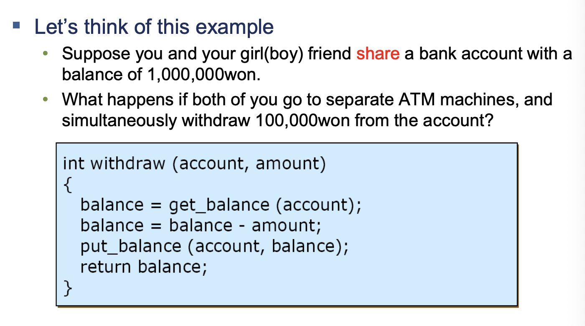
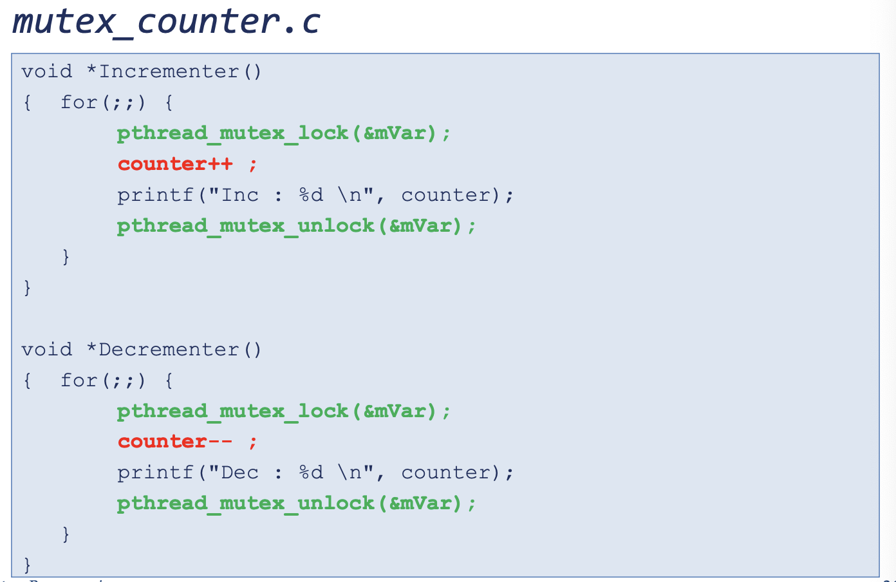
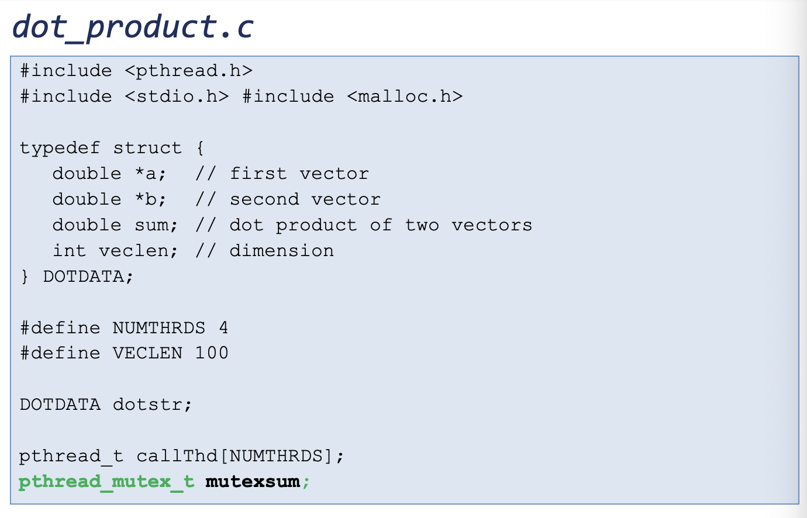
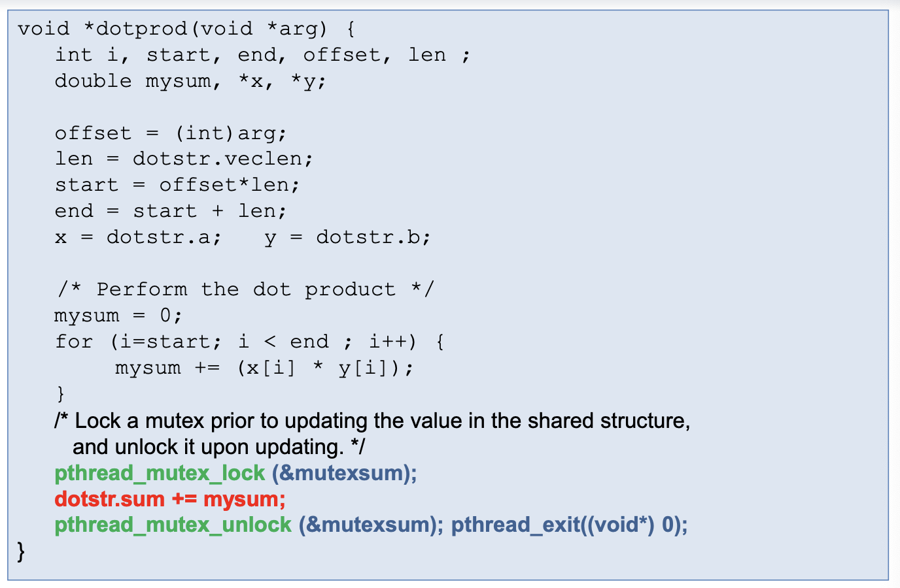
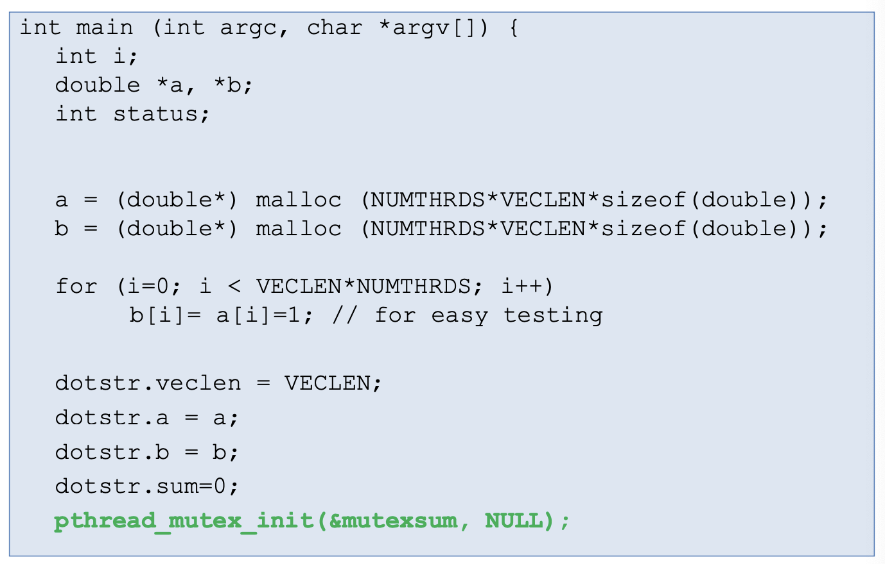
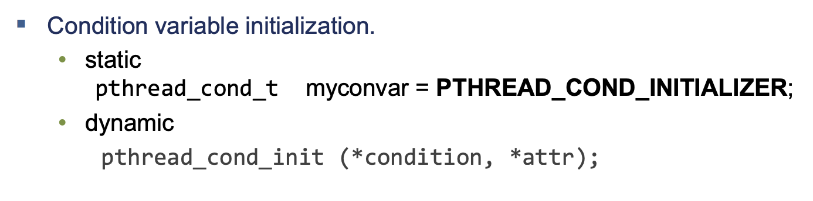

# 리눅스 프로세스 관리 Part 5 (Mutex)

<br/>

> 참고 자료 : '시스템 프로그래밍' 학부 수업 자료

<br/><br/>

### 목차

- <a href="https://github.com/SangYoonLee1231/TIL/blob/main/Operating_System/System_Programming_Linux/linux_process_control_pt5.md#mutex-%EB%AE%A4%ED%85%8D%EC%8A%A4">Mutex (뮤텍스)</a>

  - <a href="https://github.com/SangYoonLee1231/TIL/blob/main/Operating_System/System_Programming_Linux/linux_process_control_pt5.md#mutex-%EC%84%A0%EC%96%B8-%EB%B0%A9%EB%B2%95">Mutex 선언 방법</a>
  - <a href="https://github.com/SangYoonLee1231/TIL/blob/main/Operating_System/System_Programming_Linux/linux_process_control_pt5.md#mutex-lock--unlock">Mutex Lock / Unlock</a>
  - <a href="https://github.com/SangYoonLee1231/TIL/blob/main/Operating_System/System_Programming_Linux/linux_process_control_pt5.md#mutex-%EC%98%88%EC%8B%9C-%EC%BD%94%EB%93%9C">Mutex 예시 코드</a>

- <a href="https://github.com/SangYoonLee1231/TIL/blob/main/Operating_System/System_Programming_Linux/linux_process_control_pt5.md#condition-variables-%EC%A1%B0%EA%B1%B4-%EB%B3%80%EC%88%98">Condition Variables (조건 변수)</a>

  - <a href="https://github.com/SangYoonLee1231/TIL/blob/main/Operating_System/System_Programming_Linux/linux_process_control_pt5.md#%EC%A3%BC%EC%9D%98%ED%95%A0-%EC%A0%90">주의할 점</a>
  - <a href="https://github.com/SangYoonLee1231/TIL/blob/main/Operating_System/System_Programming_Linux/linux_process_control_pt5.md#%EC%A4%91%EC%9A%94%ED%95%9C-operation%EB%93%A4">중요한 Operation들</a>
  - <a href="https://github.com/SangYoonLee1231/TIL/blob/main/Operating_System/System_Programming_Linux/linux_process_control_pt5.md#cv-example-cond-varc">CV example (`cond-var.c`)</a>

<br/><br/>

## Mutex (뮤텍스)

- 뮤택스는 서로 다른 쓰레드가 데이터를 공유할 때 필요하다.

<br/>

> ### ☝🏻 Q. Mutex란 무엇인가요? (ChatGPT 질의응답)
>
> A. mutex는 프로그램에서 공유 자원에 대한 접근을 조율하기 위한 동기화 기법 중 하나입니다. 여러 개의 스레드나 프로세스가 동시에 공유 자원에 접근하면 경쟁 상태(race condition)가 발생하여 예상치 못한 결과를 초래할 수 있습니다. 이를 방지하기 위해 mutex는 여러 스레드가 동시에 공유 자원에 접근하지 못하도록 제어합니다.
>
> Mutex는 뮤텍스(mutex) 또는 뮤틱스(mutual exclusion)의 줄임말로, 상호 배제(mutual exclusion)를 의미합니다. 상호 배제란, 어떤 스레드가 공유 자원을 사용할 때 다른 스레드는 해당 자원에 대한 접근을 할 수 없도록 잠그는 것을 말합니다. 따라서, mutex는 공유 자원에 대한 접근을 잠그고 특정 스레드만 접근할 수 있도록 보호합니다.
>
> 일반적으로 mutex는 뮤텍스 객체(mutex object)라는 변수로 구현됩니다. 이 변수는 공유 자원에 대한 접근을 조율하는데 사용됩니다. mutex는 두 가지 상태를 가집니다. 첫째, 잠겨진(locked) 상태로, 이 상태에서는 다른 스레드는 mutex를 획득할 수 없습니다. 둘째, 잠금 해제(unlocked) 상태로, 이 상태에서는 다른 스레드가 mutex를 획득할 수 있습니다.
>
> mutex를 사용하는 방법은 일반적으로 다음과 같습니다.
>
> > 1. mutex를 초기화합니다.
> > 2. 공유 자원에 접근하는 코드 부분에서 mutex를 잠급니다.
> > 3. 공유 자원에 대한 작업을 수행합니다.
> > 4. mutex를 잠금 해제합니다.
>
> 이렇게 함으로써 여러 스레드가 동시에 같은 리소스에 접근하지 않도록 할 수 있습니다.

<br/>

- 예 :

  

  - 쓰레드 2개가 동시에 동일한 코드를 실행한다.

  - 코드의 일련의 과정이 한 번에 일어나야 계산에 오류가 없는데,

  - 쓰레드 하나가 계산 결과를 채 저장하기 전에 다른 쓰레드로 CPU가 switching이 되서 계산 결과가 뒤섞이면,

  - 우리가 예상하지 못했던 최종 결과를 얻게 된다.

  - 이렇게 실행시킬 때마다 content_switch로 인해 계산 결과가 뒤섞는 현상을 **Race Condition**이라 한다.

  - 이러한 현상을 막기 위한 방법으로 **mutex가 쓰인다.**

- 서로 다른 두 쓰레드 간에 데이터를 공유하는 코드 데이터 영역을 Critical Section 이라 한다.

- 작업 실행 중에 다른 프로세스가 끼어들지 못하도록 Critical Section을 보호하면서 작업해야 한다.

- 이러한 기능을 제공하는 오브젝트를 **Mutex(뮤택스)**라 한다.

- 비유

  - 자기가 방 안에 들어가서 다른 사람이 들어오지 못하도록 방 문을 lock한다.
  - 다른 사람이 들어와도 되는 상황이면 방 문을 unlock한다.

<br/><br/>

### Mutex 선언 방법

```c
#include <pthread.h>

pthread_mutex_t mutex_name = PTHREAD_MUTEX_INITIALIZER;
```

- mutex 변수를 선언했으면 **초기화를 해주어야 한다.**

- 초기화 방법

  1. 값을 지정하는 방식 (Static)

  2. mutex_init 함수를 통해 초기화

- mutex는 초기화하면 항상 기본적으로 **풀린 (unlock) 상태**이다.

  - 그래야 누군가가 mutex를 쓸 수 있기 때문

<br/>

- pthread_mutexattr (mutex 개체의 속성)

  - priorty inversion 현상은 어떻게 처리할 것인지

  - prioceiling (priorty ceiling) : 최상위의 우선순위 값을 설정

  - process-shared : 어떤 mutex는 한 프로세스 내의 쓰레드 끼리만 데이터를 공유, 어떤 mutex는 process들 간에도 데이터 공유 → 이를 지정하는 속성

  - attribute를 사용하지 않는다면 NULL값으로 설정하면 된다.

  - (이번 학기에는 attribute를 사용하지 않음 → NULL 값으로 설정)

<br/><br/>

### Mutex Lock / Unlock

#### Mutex Lock

- 뮤텍스를 잠그러 들어갔는데, 누군가 쓰고 있다.

- 그럼 나는 mutex가 해제될 때까지 **잠시 대기**하고 있어야 한다.

  → **blocking call** (blocking 함수)

- 일반적으로 우리가 사용하는 대부분의 입출력 함수는 blocking 함수이다.

<br/>

#### Trylock

- 그런데 어떤 쓰레드가 매우 중요한 일을 하고 있어서 mutex lock이 필요한 상황이라 가정하자.

- 만일 lock이 없으면, 일단 나와서 다른 port를 모니터링 해야 한다.

- 이 쓰레드는 여기에 붙들려 대기할 상황이 아니다. 그런데 lock은 필요하다.

- 그래서 **대기하지 않고** lock이 available한 지 간을 본다.

- 있으면 좋고, 없으면 아쉽고.

- 이런 형태의 함수를 **nonblocking call**이라 한다.

- 이 때 **Condition Variable**를 같이 사용할 수 있다. (아래서 자세히 다룸)

<br/>

- 프로그램 코드에서 어떤 변수가 공유될 때, 이 변수를 Lock / Unlock으로 보호하면서 써야하는데

  - 실수로 어떤 쓰레드의 코드에 Lock이나 Unlock을 하나라도 빠뜨리면 망가져버린다.

  - 매우 신경써야 함!!

<br/>

- mutex를 할 때 우리가 필요한 크리티컬 섹션의 목적에 맞게 mutex 오브젝트를 여러 개 둘 수 있다.

  

  - Thread 1 - Mutex A, Thread 2 - Mutex B, Thread 3 - Mutex C라 가정

  - Thread 1에서는 mutex A를 Lock, 그리고 A를 Unlock

  - Thread 2에서는 mutex B를 Lock, 그리고 B를 Unlock

  - 이 때 **쓰레드 1와 2는 전혀 관계가 없는 오퍼레이션이 된다.**

  - 설령 이 안에 크리티컬 섹션에 변수를 두고 보호하는 것처럼 보이지만, 쓰레드 1과 2는 **서로 동작이 순서화 (싱크로나이즈) 되지 않는다.**

  - 쓰레드 C에도 Lock, Unlock이 들어가야 함

<br/><br/>

### Mutex 예시 코드

#### mutex_counter.c (1)

  

- 여기서도 Race Condition 현상이 발생할 수 있다.

  - 바로 한 번에 완벽하게 실행될 거라는 기대를 가지면 안된다.

  - 비정상적인 상황이 어쩌다 한 번씩 걸릴 수 있음 ← 이 한 번이 매우 치명적

#### mutex_counter.c (2)

  

- mutex lock과 unlock으로 보호해준다. (같은 mVar을 사용)

<br/><br/>

#### 멀티 쓰레드 Dot-Product 예시

- dot-product : 두 벡터의 내적 (하나는 행벡터, 다른 하나는 열벡터)

  - 대응하는 원소들의 곱을 더한 값

  - for all i, sum += A[i]\*B[i]

- 만일 벡터가 무지하게 길면 (예 : 행벡터, 열벡터 원소 개수가 100만개)

  - 백만번의 곱과 덧셈이 이루어져야 함

  - CPU의 멀티 코어로 쓰레드를 생성하여 협업하면, 계산 과정의 일부를 부분부분 할당시킬 수 있음 ← 쓰레드를 분배

    - local_sum

    - sum += local_sum of the thread

  - 협력하는 코드 예시 (dot_product.c)

    

    

    

    

<br/><br/>

## Condition Variables (조건 변수)

- 내가 크리티컬 섹션에 들어갈려고 mutex lock을 하나 잡아 들어감

- 그 후 내가 무슨 일 할려고 봤더니 내가 원하는 상황이 안 만들어짐

  - 예 : 데이터를 꺼내려고 했는데 데이터가 없네?

- 그럼 일단 뮤텍스를 반납하고 빠져나와야 하는데, 그냥 그러기에는 석연치 않음

- 내가 원하는 상황이 만들어 질 때까지 조금은 기다리고 싶다.

- 이렇게 본인이 기대하는 상황을 기대하고 싶을 때 → **Condition Variable을** 사용한다.

<br/>

### 주의할 점

- 예 : mutex를 가진 쓰레드가 자신이 원하는 상황이 만들어질 때까지 기다린다.

- 이 때, 계속 기다리면 다른 쓰레드들이 그 뮤텍스를 사용할 수 없다.

- 따라서 모두가 기다리지 않도록, **자신이 기다리는 동안은 일시적으로 mutex를 반납하고 기다리도록 한다.**

- 이후 원하는 상황이 될 경우, 누군가가 잠자는(대기하는) 쓰레드를 깨워줘야 한다 → **wakeup**

- 깨어난 그 쓰레드 친구는 반납한 뮤텍스를 내부적으로 다시 획득한다.

- **Condition variables는 어떤 뮤텍스랑 항상 같이 사용하는 것이다.**

- Condition Variable을 쓰러면 타입을 선언하고 mutex처럼 초기화를 시켜줘야 한다.

  

  - Condition Variable 안에는 **대기 큐**가 있다.

    - 누가 들어와서 기다리고 있는지를 관리하는 자료구조

  - condition variable도 자기가 원하는 설정(속성)을 사용해서 사용할 수 있다.

    

<br/><br/>

### 중요한 Operation들

#### `**pthread_cond_wait** (condition, mutex);`

- 원하는 상황이 안 만들어졌을 때, 나 잠깐 들어와서 기다릴래

- condition : 내가 들어가서 기다릴 공간 (대기 룸)

- mutex : 내가 갖고 있는 mutex, 잠시 반납할 mutex

  - 시스템이 해당 mutex를 잠시 회수해서 다른 사람이 쓸 수 있도록 해준다.

<br/>

#### `**pthread_cond_signal** (condition);`

- 대기하고 있는 쓰레드 깨우는 신호. “야 너 일어나”

- condition에서 자고 있는 대기 1순위를 wakeup 시킨다.

- condition : 들어올 공간 (대기 룸)

- 만일 기다리는 쓰레드가 없는 condition variable에 신호가 갈 경우, 이는 무시되고 사라진다.

<br/>

#### `**pthread_cond_broadcast** (condition);` : “야 모두 다 일어나봐”

- return 값 : 0 (성공) / 에러 코드 (에러)

<br/>

### CV example (`cond-var.c`)


#### 코드 설명 By ChatGPT

> 이 코드는 pthread 라이브러리를 사용하여 쓰레드 간의 동기화를 보장하고 공유 변수인 count 값을 증가시키는 기능을 수행합니다.
>
> 이 코드는 세 개의 쓰레드를 생성하며, 두 개의 쓰레드는 inc_count() 함수를 실행하고, 한 개의 쓰레드는 watch_count() 함수를 실행합니다.
>
> inc_count() 함수는 count 변수를 증가시키며, count 값이 COUNT_LIMIT와 같아지면 다른 쓰레드를 깨우기 위해 pthread_cond_signal() 함수를 호출합니다. 그리고 for 루프를 통해 일정 시간 동안 busy-waiting을 수행합니다.
>
> watch_count() 함수는 count 변수가 COUNT_LIMIT와 같아질 때까지 pthread_cond_wait() 함수를 호출하여 대기하다가, count_threshold_cv 조건 변수가 시그널되면 실행을 재개합니다.
>
> main() 함수는 세 개의 쓰레드를 생성하고, pthread_join() 함수를 호출하여 모든 쓰레드가 종료될 때까지 대기합니다. 마지막으로 pthread_exit() 함수를 호출하여 프로그램을 종료합니다.
>
> 또한 이 코드에서는 pthread_mutex_t와 pthread_cond_t 타입의 변수를 사용하여 뮤텍스와 조건 변수(Condition variable)를 초기화하고 쓰레드 간의 동기화를 담당합니다.

<br/>
