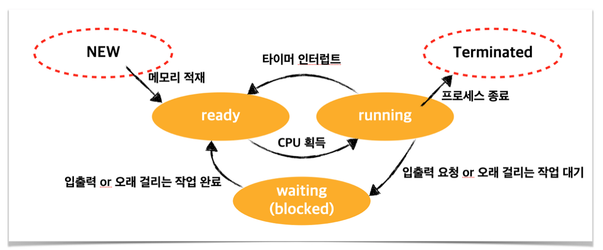

# 프로세스가 만들어지는 과정 (라이프사이클)

 

## 전체 과정 요약

- 프로세스는 실행중인 프로그램을 말한다.

- 프로세스가 만들어지는 과정은 크게 4가지이다. 이 모든 일은 운영체제가 한다.

  - <strong>프로그램 로딩</strong>: 디스크에서 실행할 파일을 찾아 메모리(RAM)에 적재

  - <strong>PCB 생성</strong>: 프로세스를 관리하기 위한 PCB(Process Control Block) 생성
  - <strong>New → Ready 상태</strong>: 프로세스가 생성(New) 상태에서 준비(Ready) 상태가 되어 CPU가 실행할 준비를 함
  - <strong>Ready → Running 상태</strong>: CPU 스케줄러가 준비(Ready) 상태의 프로세스 중 하나를 선택하여 실행
  - <strong>Terminated 상태</strong>: 프로세스 실행이 완료 혹은 강제 종료, PCB 삭제하고 사용했던 메모리 해제

 

### 프로세스 상태도 다시 살펴보기

👉<a href="https://zangzangs.tistory.com/108">사진 출처</a>

  

## 1. 프로그램 로딩 (Load Program into Memory)

- 디스크(파일 시스템)에서 실행할 프로그램을 찾고, 이를 메모리(RAM)에 적재하는 과정

- 실행할 프로그램은 실행 파일(.exe, .out 등)의 형태로 저장되어 있으며, 운영체제가 이를 메모리에 로드함

 

## 2. PCB (Process Control Block) 생성 및 초기화

- OS가 새로운 프로세스를 관리하기 위해 PCB를 생성
- 프로세스가 초기화되어 생성(New) 상태에 들어감

- PCB에 저장되는 주요 정보

  - PID(Process ID): 프로세스의 고유한 식별자
  - 프로세스 상태: New, Ready, Running, Waiting, Terminated 중 하나
  - 프로세스 카운터(PC): 현재 실행 중인 명령어의 주소
  - 레지스터(Register) 값: 프로세스 실행 중 CPU 레지스터 값
  - 메모리 정보: 코드, 데이터, 스택, 힙 메모리 영역 정보
  - 파일 디스크립터(File Descriptor): 프로세스가 사용하는 정보
  - 입출력 정보: 프로세스와 연결된 입출력 장치 정보

- 이 PCB가 운영체제의 프로세스 테이블에 등록되면서, 프로세스가 본격적으로 운영체제의 관리 대상이 됨

 

## 3. 프로세스 상태 변화 (New → Ready)

- 프로세스가 준비(Ready) 상태가 되어, CPU가 이 프로세스를 실행할 준비를 함

- 운영체제의 스케줄러가 프로세스를 Ready Queue에 추가

 

## 4. CPU 스케줄링 및 실행 (Ready → Running)

- CPU 스케줄러가 Ready 상태의 프로세스 중 하나를 선택하여 실행
- 선택받은 프로세스는 CPU를 할당받고 Running 상태로 변경
- CPU는 프로그램 카운터(PC)를 이용해 프로세스의 명령어를 실행

- 여러 개의 프로세스가 동시에 실행될 경우, 운영체제가 CPU를 번갈아가며 할당하는 컨텍스트 스위칭(Context Switching)이 일어남
- 이 떄, 기존 프로세스의 PCB 정보를 저장하고, 새로운 프로세스의 PCB 정보를 복원하여 실행

 

## 5. 프로세스 종료 (Terminated)

- 프로세스 실행이 완료되거나 강제로 종료될 경우, Terminated 상태가 됨
- 운영체제는 PCB를 삭제하고, 프로세스가 사용했던 메모리(코드, 데이터, 스택, 힙)를 해제
- 만일 부모 프로세스가 자식 상태의 종료 상태를 수거(wait)하지 않으면, 좀비 프로세스가 될 위험이 있음

 
