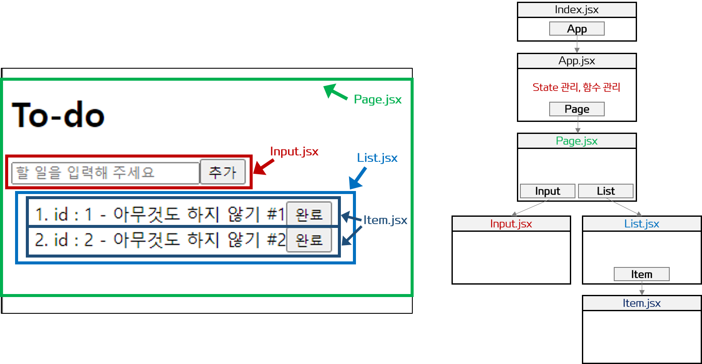
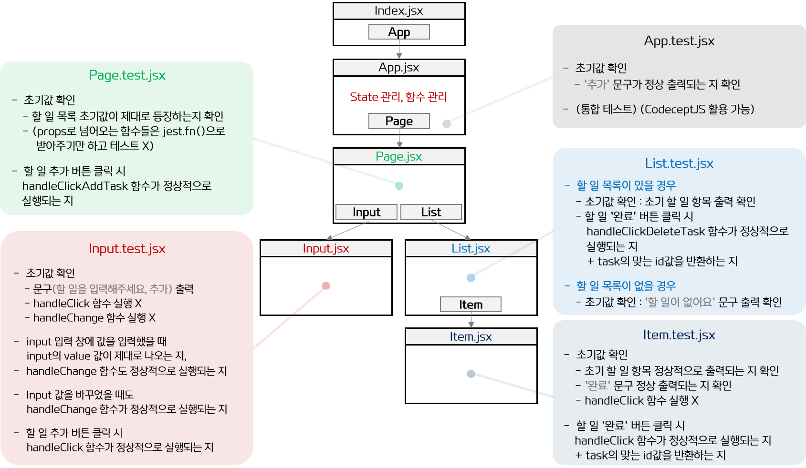

# 3주차 Day 6-7 TIL

#### 2022.08.20 - 2022.08.21

 

## 배운 것 (간략히 정리)

### 【1】 과제 해설 강의를 보며, 테스트 작성법에 능숙해지기 위한 계획 수립 => 실천

 

- 👉 <a href="TIL\CodeSoom\Week 3\ToDoAppSrc">ToDo 앱 소스코드 바로가기</a>

 

#### 0. ToDo 앱의 각 컴포넌트에 역할(관심사) 정리

 

  

#### 1. ToDo 앱의 각 컴포넌트에 무엇을 테스트하는지 파악하기

- 목적 : 컴포넌트에서 어떤 항목을 테스트해야 하는지 감 잡기

 

 

- <strong>컴포넌트를 테스트 할 때 무엇을 테스트할 지 결정하는 방법</strong>

    - 해당 컴포넌트의 매개변수 props 우선 확인

    - 초기값으로 무엇을 테스트할 지 고민

    - 컴포넌트가 앱에서 어떤 기능을 담당하는지 생각해보면, 무엇을 테스트해야 할 지 보인다.

  

#### 2. 테스트 항목을 각각 실제 코드로 어떻게 구현하는지 살펴보기

- <strong></strong>