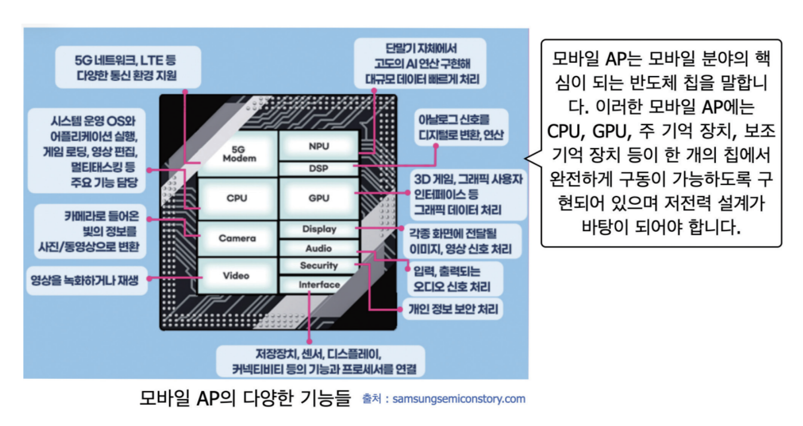

# CPU 개요

 

> 참고 자료 : 'PC 하드웨어' 교양 수업 자료

  

### 목차

- <a href="">CPU의 개념</a>
- <a href="">코어 (Core)</a>
- <a href="">모바일 중앙 처리 장치</a>
- <a href="">CPU-오버클럭 (Over-clock)</a>
- <a href="">CISC와 RISC</a>
<!-- -  -->

  

## CPU의 개념

- **CPU : 중앙처리장치** (**Central Processing Unit**)

  - **마이크로프로세서** 또는 **프로세서**라고도 부른다.

  - 컴퓨터의 코어, 두뇌에 해당하는 부분이다. (요즘은 PC에 CPU를 2개 이상 가지고 있다.)

  - 기계어로 **명령어를 수행하고 데이터를 처리한다. (CPU가 하는 일)**

  - 구성요소 : 연산장치(ALU), 제어장치(CU), 레지스터(register)

    - **연산장치** : 계산 장치

    - **제어장치** : 명령, 제어

    - **레지스터** : 저장소 (가장 빠른 메모리)

  

## 코어 (Core)

- 병렬 처리에 사용하는 GPU와 CPU의 핵심 연산 장치이다.

- 코어는 CPU의 성능을 대부분 좌우한다.

  - (CPU의 주된 목적은 **컴퓨터의 연산과 제어**)

- 식당의 비유

  - **CPU 코어** : (셰프) 핵심 연산 장치

  - **캐쉬** : (음식 바구니의 크기, 재료의 양) 임시 메모리의 크기

  - **테스크** : (완성된 음식) 수행하는 일

  - **쓰레드** : (음식 조리 도구) 일하는 단위 , 코어가 쓰는 도구

 

### 순차 처리 vs 병렬 처리

- 순차 처리 (코어 1개) vs 병렬 처리 (코어 여러 개)

- 주전력에 사용하는 코어와 저전력에 사용하는 코어가 각각 존재한다.

- i7-3세대 > i3-7세대

 

### 멀티 코어

- 한 개의 칩셋에 여러 개의 연산을 처리할 수 있는 장치를 연결한 것

- 캐시 메모리 : 굉장히 빠른 메모리

  

## 모바일 중앙 처리 장치

- 모든 결과를 내는 것은 연산이 필요하며, 아를 수행하는 곳은 CPU이다.

- 모바일 디바이스에서도 당연히 CPU가 들어가 있다.

- **모바일 AP** : Mobile Application Processor (모바일 중앙 처리 장치)

  - 스마트 폰의 두뇌

  - **SoC** : 반도체와 유사힌 시스템, 시스템온칩 (기억해둘 것)

    

  

> **(참고) ARM**
>
> - CPU 코어를 설계하는 영국 회사
> - 설계만 하고, 기기 제품을 실제로 만들진 않음
> - 현존하는 CPU 코어 중 소비전력측면에서 가장 우수
>
> - 모바일 기기에서 거의 다 ARM 코어를 사용
> - 발열 낮음, 저전력
> - 마이크로소프트 윈도우즈 - ARM버전 CPU 있음
> - 맥에서도 ARM 코어를 다 씀
> - 파운드리 : CPU 설계도면을 보고 그대로 만드는 것
>
>   - 파운드리를 만들 수 있는 회사는 그리 많지 않다.
>
>     - 나노 공정 기술을 가지고 있어야 하므로
>
>     - 가능한 회사 : 삼성, TSMC(?)
>
> - 인텔사의 성공으로 AMD사와 사이릭스사는 유사한 구조를 가진 칩을 뒤따라 출시시켜 자신들의 CPU가 인텔사의 칩과 호환이 되도록 하였는데, 이러한 종류의 마이크로프로세서들을 시장에서는 x86 계열 마이크로프로세서로 지칭한다.

 

> **(참고) CPU 쿨러**
>
> - 공냉 : 공기로 식힘 (냉매 : 기체)
> - 수냉 : 물로 식힘 (냉매 : 냉각수) ← 아주 좋음 but 누수 시 골로 간다
> - 데시벨 : 소음 측정 단위

  

## CPU-오버클럭 (Over-clock)

- 헤르츠(hz) : 1초에 몇 번 파동하느냐

- 한 주기에 하나의 일을 수행할 수 있다 → 클럭

- 대부분의 CPU에서는 안정적으로 일을 수행할 수 있는 쿨럭이 정해져 있다.

- **오버클럭 : 기존보다 더 빠르게 클럭을 출력 하는 것**

  - 발열 심함, 전원이 불안정

    - 따라서 정말 조심해서 해야한다.

  - CPU, 메모리, 그래픽 카드 모두 오버클럭 가능

  

## CISC와 RISC

### CISC (Complex Instruction Set Computer) : 복합 명령어 집합 컴퓨터

- 내부적으로 복잡하고 많은 명령어를 가진 컴퓨터

- 데스크톱 컴퓨터 및 윈도우 시스템은 CISC 사용

 

### RISC (Reduce Instruction Set Computer) : 축소 명령어 집합 컴퓨터

- 명령어를 축소해서 만든 컴퓨터

- 구조가 단순 → 실행속도 빠름

- 전력소모 적음

- 모든 모바일 기기는 RISC 사용

 

