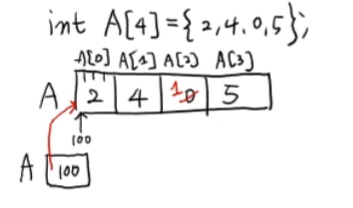
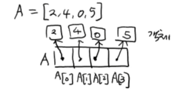
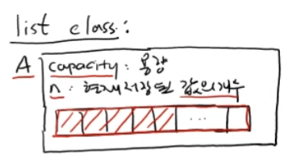

# 순차적 자료구조 : 배열 vs 리스트

<br/>

>  참고 자료 : 《<a href="https://github.com/SangYoonLee1231/TIL/blob/main/DataStructure/data_structure_introduction.md">자료구조 소개</a>》 페이지 참고

<br/>

## 배열 (Array) - C언어

* 배열은 같은 자료형의 변수가 모여, 직선 모양으로 줄지어 있는 자료구조다.

* <strong>연속적인 메모리 공간</strong>을 할당하여 데이터를 저장한다.

* <strong>인덱스(index)</strong>를 통해 각각의 값에 <strong>매우 빠르게</strong> 접근 가능하다.

* 【읽기】와 【쓰기】만을 연산으로 제공한다. (제한된 자료구조)  
   
   * 수행시간 = O(1) (RAM : Random Access Memory)

   * 배열의 시작 주소, 데이터 타입, 인덱스 3가지 정보만으로 값이 저장된 곳의 주소를 단위 시간 내에 계산할 수 있다.



* 배열의 이름과 동일한 변수 A에 A[0]의 첫 번째 byte의 주소가 저장된다.

<br/>

## 리스트 (List) - 파이썬

* 리스트는 배열과 동일하게 같은 자료형의 변수를 모은 자료구조로, 역시 인덱스(index)를 통해 각각의 값에 빠르게 접근 가능하다.

* 그러나, 배열보다 훨씬 더 <strong>다양하고 유용한 연산</strong>을 제공한다. (리스트의 장점)



* 리스트의 각 요소의 실제 값은 다른 메모리에 객체 형태로 저장되어 있다.

* 리스트의 각 요소는 이 객체들의 주소를 가리킨다.

* 리스트의 다양한 연산

  * 【삽입】 <strong>A.append(6)</strong> : 맨 뒤에 6을 삽입

  * 【삽입】 <strong>A.insert(1, 10)</strong> : A[1]에 10을 삽입

  * 【삭제】 <strong>A.pop()</strong> : 마지막 요소를 지우고 해당 값을 리턴
  
  * 【삭제】 <strong>A.pop(1)</strong> : A[1]을 지우고 해당 값을 리턴

  * 【삭제】 <strong>A.remove(value)</strong> : A에서 해당 value값 찾아서 제거 (2개 이상 존재 시 첫 번째만 제거)

  * 【탐색】 <strong>A.index(value)</strong> : A에서 해당 value값 찾아서 그 요소의 index를 리턴

  * 【탐색】 <strong>A.count(value)</strong> : A에서 해당 value값을 가진 요소의 개수 리턴


<br/>

## 리스트는 Dynamic Array(동적 배열)이다.

* 리스트는 배열과 달리, <strong>자신의 용량을 자동으로 조절한다.</strong> (리스트를 Dyanamic Array라고도 부르는 이유)

```python
import sys

A = [] # 빈 리스트
print(sys.getsizeof(A)) # 28 bytes

A.append(18) # A = [18]
print(sys.getsizeof(A)) # 44 bytes
```

* 파이썬에선, 자동으로 리스트의 공간이 모자르면 크기를 늘리고, 반대로 공간이 남으면 크기를 줄이는 작업을 수시로 한다.  
(메모리 자동 조절 기능)

<br/>



```python
A.append(x):
    if A.n < A.capacity:
        # 리스트 용량이 넉넉한 경우
        A[n] = x
        A.n = n + 1
    else: # A.n == A.capacity
        # 리스트 용량이 더 필요한 경우 (자동으로 용량 크기 ↑)
        B = A.capacity * 2 # B는 임시용 리스트, *2는 용량 확대의 예시
        for i in range(n):
            B[i] = A[i]
        A = B
        del B
        A[n] = x
        A.n = n + 1
```

<br/>

## 리스트 연산 수행시간

* <strong>A.append , A.pop</strong> : O(1) 평균

* <strong>A.insert , A.remove</strong> : O(n) Worst Case

* <strong>A.index , A.count</strong> : O(n) Worst Case