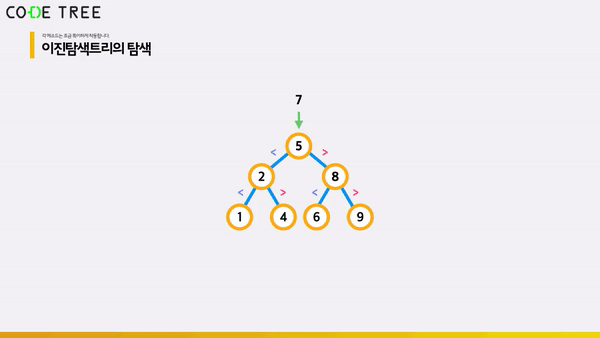

# 이진 탐색 트리 (Binary Search Tree / BST)

<br/>

> 참고 자료 : 《<a href="https://github.com/SangYoonLee1231/TIL/blob/main/DataStructure/data_structure_introduction.md">자료구조 소개</a>》 페이지 참고

<br/>

### 목차

- <a href="">이진 탐색 트리란?</a>
- <a href="">이진 탐색 트리의 탐색</a>
- <a href="">이진 탐색 트리의 삽입</a>

<br/><br/>

## 이진 탐색 트리란?

- <strong>부모의 왼쪽 서브 트리 (모든) Node들은 부모보다 값이 작고, 오른쪽 서브 트리 (모든) Node들은 부모보다 값이 큰 이진 트리</strong>

    

<br/>

- 다음은 6의 값을 갖는 노드로 인해 이진 탐색 트리가 아니다.

    

- ✨ 부모와 자식 관계만 고려한다면 이렇게 이진 탐색 트리가 아닌 것을 맞다고 착각할 수 있으니 조심하자.

<br/><br/>

## 이진 탐색 트리의 탐색

- 이진 탐색 트리에 어떤 값 x가 있는지 찾고자 한다.

<br/>

- <strong>우선 루트 노드와 x값을 비교</strong>한다.

  - 루트 노드 기준으로 <strong>x값이 더 크면</strong>, 우측 서브 트리에 x가 있을 가능성이 있으므로, <strong>우측으로 이동</strong>한다.

  - 루트 노드 기준으로 <strong>x값이 더 작으면</strong>, 좌측 서브 트리에 x가 있을 가능성이 있으므로, <strong>좌측으로 이동</strong>한다.

  - 이 과정을 <strong>반복</strong>한다.

  

  - 만일 찾으려는 값이 <strong>없다면</strong> 노드가 맨 아래 비어있는 위치(<strong>null</strong> 위치)로 이동하게 될 것이다.

<br/>

- <strong>수도 코드</strong>

  ```python
  function bst.search(x)
      set node = bst.root  # root에서 시작합니다.
      while node != null and node.value != x  # node에 들어있는 값이 x가 되기 전까지 계속 반복합니다.
          if node.value > x  # 노드에 있는 값이 x보다 크다면
              node = node.left  # 왼쪽 자식으로 내려와 탐색을 진행합니다.
          else  # 노드에 있는 값이 x보다 작다면
              node = node.right  # 오른쪽 자식으로 내려와 탐색을 진행합니다.

      return node  # 최종 위치를 반환합니다.
  ```

<br/><br/>

## 이진 탐색 트리의 삽입

- 이진 탐색 트리에 어떤 값 x를 삽입하고자 한다.

<br/>

- 이진 탐색 트리의 탐색 과정처럼 <strong>x를 우선 루트 노드와 비교</strong>하고, 그 결과에 따라 <strong>계속 아래 쪽으로 이동</strong>한다.

- 리프 노드의 자식인 <strong>null에 도달할 때까지</strong> 탐색을 진행한다.

- 이 때 <strong>parent 정보</strong>가 함께 필요한데, 그 이유는 이 null 정보 만으론 x값이 든 새 노드를 좌측에 삽압할 지, 우측에 삽입할 지 알 수 없기 때문이다.

  

<br/>

- Case 1> <strong>parent 값 == null</strong> 이라면

  - 트리에 노드가 전혀 없는 경우이므로, 이진 탐색 트리의 <strong>root</strong>를 node(x)로 설정한다.

- Case 2> <strong>parent 값 > x값</strong> 이라면

  - parent의 <strong>좌측</strong>에 node(x)를 삽입한다.

- Case 3> <strong>parent 값 < x값</strong> 이라면

  - parent의 <strong>우측</strong>에 node(x)를 삽입한다.

  

<br/>

- <strong>수도 코드로 구현</strong>

  ```python
  function bst.insert(x)
    set node = bst.root   # root에서 시작합니다.
    set parent = bst.root    # parent도 root로 설정하고 시작합니다.

    while node != null    # node가 null이 되기 전까지 반복합니다.
        parent = node    # parent는 항상 node가 움직이기 직전의 위치로 갱신해줍니다.
        if node.value > x    # node에 적혀있는 값이 x보다 크다면
            node = node.left    # 왼쪽 자식으로 이동해야 합니다.
        else    # node에 적혀있는 값이 x보다 작다면
            node = node.right    # 오른쪽 자식으로 이동해야 합니다.

    if parent == null    # Case 1. 비어있는 tree라면
        bst.root = node(x)    # root를 node(x)로 설정해줍니다.
    else if parent.value > x    # Case 2. parent에 적혀있는 값이 추가하려는 값 x보다 크다면
        parent.left = node(x)    # parent의 왼쪽에 node(x)를 넣어줍니다.
    else    # Case 3. parent에 적혀있는 값이 추가하려는 값 x보다 작다면
        parent.right = node(x)    # parent의 오른쪽에 node(x)를 넣어줍니다.
  ```

<br/><br/>

> 사진 출처 : <a href="https://youtu.be/kGZoEShMcSQ">신찬수 교수님 유튜브 강의</a>, <a href="https://www.codetree.ai/missions">Code Tree - Novice High</a> (사진 자료 사용 허락 받음)
