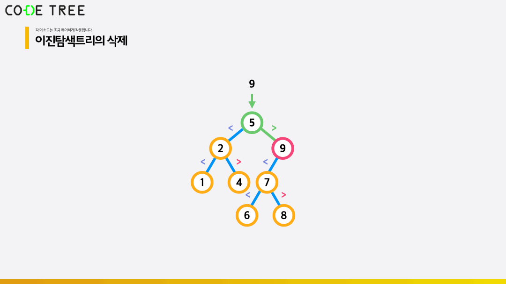
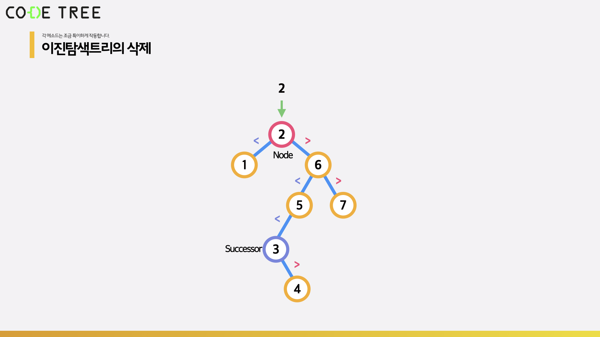
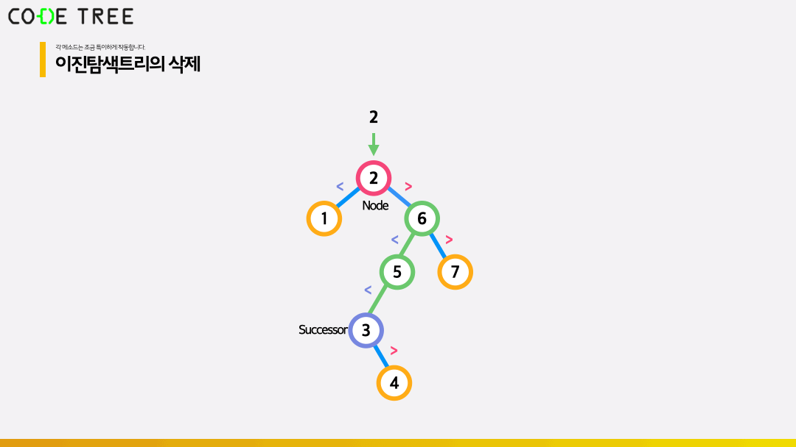
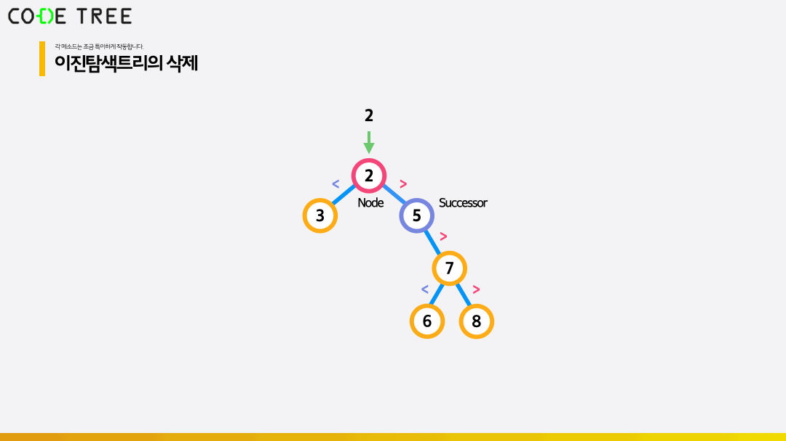

# 이진 탐색 트리 (Binary Search Tree / BST) 의 삭제 연산

<br/>

> 참고 자료 : 《<a href="https://github.com/SangYoonLee1231/TIL/blob/main/DataStructure/data_structure_introduction.md">자료구조 소개</a>》 페이지 참고

<br/>

### 목차

- <a href=""></a>
- <a href=""></a>
- <a href=""></a>
- <a href=""></a>
- <a href=""></a>

<br/><br/>

## 이진 탐색 트리의 삭제

- 이진 탐색 트리에 어떤 값 x를 삭제하고자 한다.

<br/>

- 우선 이진 탐색 트리를 탐색하며 x를 찾는다.

- 해당 x값이 든 Node를 삭제한다.

  - Case 1 > 삭제할 Node의 <strong>왼쪽</strong>이 비어있으면, Node의 <strong>오른쪽 서브 트리</strong>를 그대로 위로 올려준다.

    

    <br/>

  - Case 2 > 삭제할 Node의 <strong>오른쪽</strong>이 비어있으면, Node의 <strong>왼쪽 서브 트리</strong>를 그대로 위로 올려준다.

    

    <br/>

  - Case 3 > 삭제할 Node의 양쪽에 자식이 모두 존재한다면, 자식 Node 중 가장 작은 수(successor)를 찾아 삭제할 Node의 위치로 옮긴다. 그 후, 빈 successor의 자리는 그 오른쪽 서브 트리로 채워준다.

    - successor은 현재 Node의 오른쪽 자식인 node.right를 기준으로 왼쪽으로 쭉 끝까지 내려가서 찾는다.

      

      

      <br/>

    - 만일 successor가 node의 (바로) 오른쪽 자신인 경우, 단순히 오른쪽 서브 트리를 올려주면 된다.

      

<br/>

- <strong>수도 코드</strong>

  ```python
  function bst.search(x)
      set node = bst.root
      while node != null and node.value != x
          if node.value > x
              node = node.left
          else
              node = node.right

      return node

  function bst.minimum(node)  # node 하위 트리에서 최솟값을 구합니다.
      while node.left != null  # node의 left가 null이 아니면 계속 내려갑니다.
          node = node.left
      return node  # 최종 node의 위치를 반환합니다.

  function bst.delete(x)  # x를 찾아 삭제하는 함수입니다.
      set node = bst.search(x)  # x 값을 찾습니다.

      if node.left == null  # Case 1. node의 왼쪽 자식이 비어있다면
          move(node.right, node)  # 오른쪽 자식을 위로 올려줍니다.
      else if node.right == null  # Case 2. node의 오른쪽 자식이 비어있다면
          move(node.left, node)  # 왼쪽 자식을 위로 올려줍니다.
      else  # Case 3. 왼쪽 오른쪽 자식이 모두 채워져있다면
          set succ = bst.minimum(node.right)
          # 해당 노드의 successor를 구합니다.
          # 이는 현재 노드의 오른쪽 자식에서 시작하여 계속 왼쪽으로 내려가는 것을
          # 반복하면 가능합니다.

          if succ == node.right  # 만약 successor가 현재 노드의 오른쪽 자식이라면
              move(node.right, node)  # 오른쪽 자식을 위로 올려줍니다.
          else  # 그렇지 않은 일반적인 경우라면
              node.value = succ  # node의 값을 successor의 값으로 대체시켜준 뒤,
              move(succ.right, succ)  # successor의 오른쪽 자식을 위로 끌어올려줍니다.
  ```
