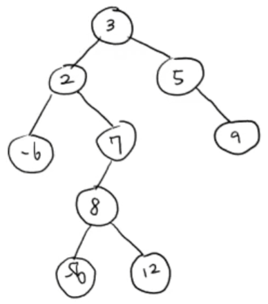
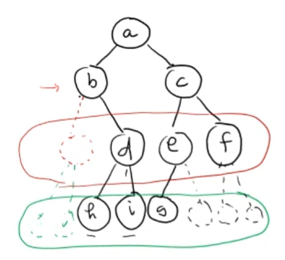
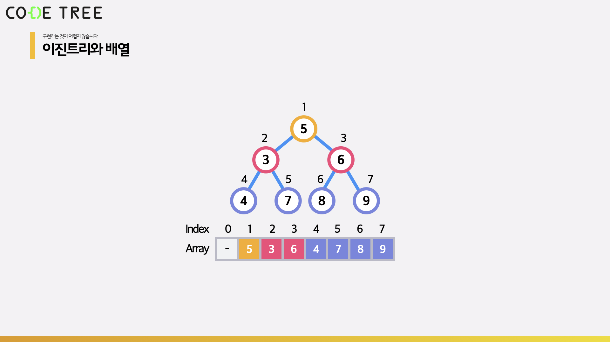
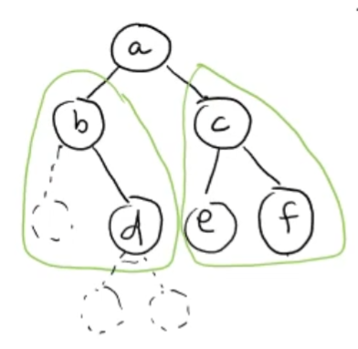
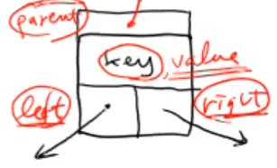
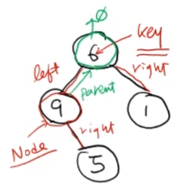
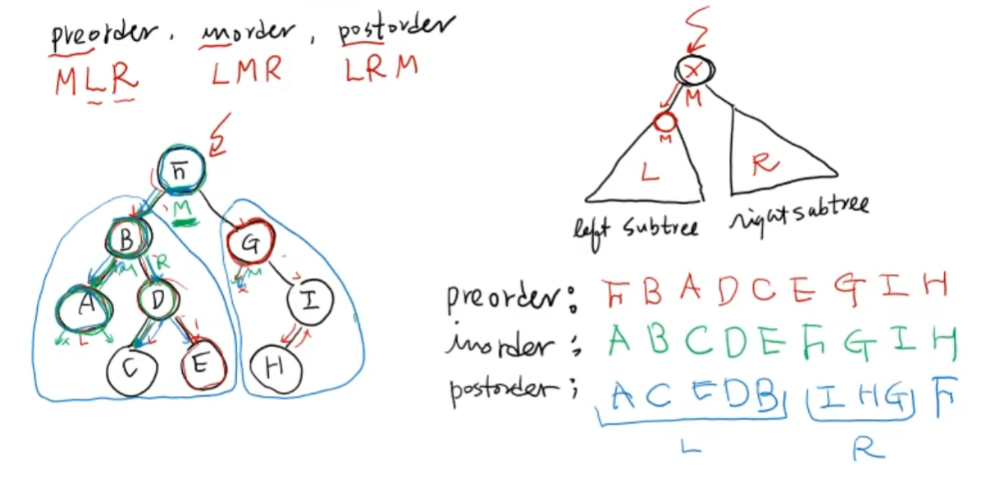
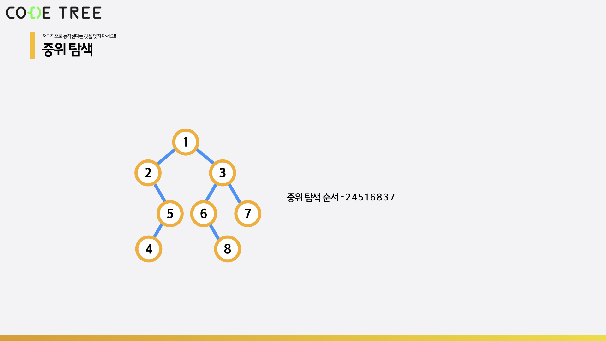

# 이진 트리 (Binary Tree)

<br/>

> 참고 자료 : 《<a href="https://github.com/SangYoonLee1231/TIL/blob/main/DataStructure/data_structure_introduction.md">자료구조 소개</a>》 페이지 참고

<br/>

### 목차

- <a href="https://github.com/SangYoonLee1231/TIL/blob/main/DataStructure/binary_tree.md#%EC%9D%B4%EC%A7%84-%ED%8A%B8%EB%A6%AC-binary-tree-1">이진 트리 (Binary Tree)</a>
- <a href="https://github.com/SangYoonLee1231/TIL/blob/main/DataStructure/binary_tree.md#%EC%9D%B4%EC%A7%84-%ED%8A%B8%EB%A6%AC-%EC%88%9C%ED%9A%8C-traversal">이진 트리 순회 (Traversal)</a>

<br/><br/>

## 이진 트리 (Binary Tree)

- 각 노드(Node)의 자식 노드가 <strong>최대 2개까지</strong> 가능한 트리를 이진 트리라 부른다.

- 트리 중 가장 간단하면서도 많이 쓰이는 자료구조이다.

    

<br/><br/>

## (코드를 통해) 이진 트리에 데이터를 저장하는 방법

### 방법1. 리스트 이용

- 이진 트리를 <strong>배열(리스트)</strong>로 표현한다. (ex. heap)

- 단점 : 메모리를 낭비할 가능성이 크다.

- 레벨1 → 레벨2 → 레벨3 → ...

  <br/>

  

```python
A = [a, b, c, None, d, e, f, None, None, h, i  g, None, None, None]
```

<br/>

- 이진트리를 배열로 구현하면 부모와 자식 노드를 <code>O(1)</code>안에 접근할 수 있다.

  

- 리스트의 0번 공간을 비우고, 1번부터 데이터를 채운다고 가정하자.

  - <code>Array[k]</code>의 <strong>왼쪽 자식 노드</strong> : <strong><code>Array[2*k]</code></strong>

  - <code>Array[k]</code>의 <strong>오른쪽 자식 노드</strong> : <strong><code>Array[2*k + 1]</code></strong>

  <br/>

  - <code>Array[k]</code>의 <strong>부모 노드</strong> : <strong><code>Array[k // 2]</code></strong>

<br/>

- 아래처럼 이진트리가 꽉 차있지 않으면, 비어있는 자식은 <strong>리스트에도 칸을 비워둬야 한다.</strong>

  

<br/><br/>

### 방법2. 리스트 이용 - 재귀적으로 표현

  

```
A = [a, [a의 왼쪽 sub tree], [a의 오른쪽 sub tree]]
```

```python
A = [ a, [ b, [], [ d, [], [] ] ] ], [ c, [ e, [], [] ], [ f, [], [] ] ]
```

<br/><br/>

### 방법3. 직접 노드를 Class로 정의

- <strong>노드 클래스를 직접 정의</strong>하고, <strong>각 노드 객체를 링크로 연결</strong>하여 표현한다.

  

  <br/>

- 원하는 노드를 만들어서 그 노드를 원하는 위치에 가져다 놓고, 부모와 자식 노드를 각각 링크를 통해 연결하면 된다.

   

  <br/>

- Node Class는 4개의 값을 가져야 한다.

  : <code>parent</code>, <code>key</code>, <code>left</code>, <code>right</code>

  ```python
  class Node:
      def __init__(self.key):
          self.key = key
          self.parent = self.left = self.right = None
      def __str__(self):
          return str(self.key)


  a = Node(6)
  b = Node(6)
  c = Node(1)
  d = Node(5)

  a.left = b
  a.right = c
  b.parent = c.parent = a
  b.right = d
  d.parent = b
  ```

<br/><br/>

## 이진 트리 순회 (Traversal)

- 노드들을 <strong>특정 순서</strong>에 따라 차례대로 빠지지 않고 방문하여 <strong>모든 key값을 출력하는 과정</strong>을 말한다.

<br/>

- 순회하는 방법은 <strong>3가지</strong>가 있다.

  

<br/>

- <strong>preorder (전위 순회)</strong> : 부모노드 → 왼쪽 자식 노드 → 오른쪽 자식 노드

  

  ```python
  # MLR
  def preorder(self):  # 현재 방문 중인 Node = self
      if self != None:
          print(self.key)
          if self.left:
              self.left.preorder()
          if self.right:
              self.right.preorder()
  ```

  <br/>

- <strong>inorder (중위 순회)</strong> : 왼쪽 자식 노드 → 부모노드 → 오른쪽 자식 노드

  

  ```python
  # LMR
  def inorder(self):
      if self != None:
          if self.left:
              self.left.preorder()
          print(self.key)
          if self.right:
              self.right.preorder()
  ```

  <br/>

- <strong>postorder (후위 순회)</strong> : 왼쪽 자식 노드 → 오른쪽 자식 노드 → 부모노드

  

  ```python
  # LRM
  def postorder(self):
      if self != None:
          if self.left:
              self.left.preorder()
          if self.right:
              self.right.preorder()
          print(self.key)
  ```

  <br/>

- <strong>탐색 순서가 헷갈리면, 재귀 함수의 탐색 순서를 생각해보자.</strong>

<br/>

### Reconstruct

- 이진 트리의 모양을 모르는 상태에서 preorder 탐색 순서, inorder 탐색 순서 정보만으로 이진 트리의 구성을 알아낼 수 있다.

<br/>

- ex) 모양을 모르는 이진 트리의 중위 탐색, 후위 탐색 결과가 아래와 같을 때, 전위 탐색의 결과를 판단하여라.

  ```
  중위 탐색: 1-8-7-5-4-2-3-6
  후위 탐색: 1-7-8-5-2-6-3-4
  ```

  

<br/><br/>

> 사진 출처 : https://ehclub.co.kr/1228 , <a href="https://youtu.be/kGZoEShMcSQ">신찬수 교수님 유튜브 강의</a>, <a href="https://www.codetree.ai/missions">Code Tree - Novice High</a> (사진 자료 사용 허락 받음)
