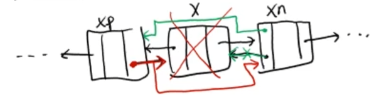
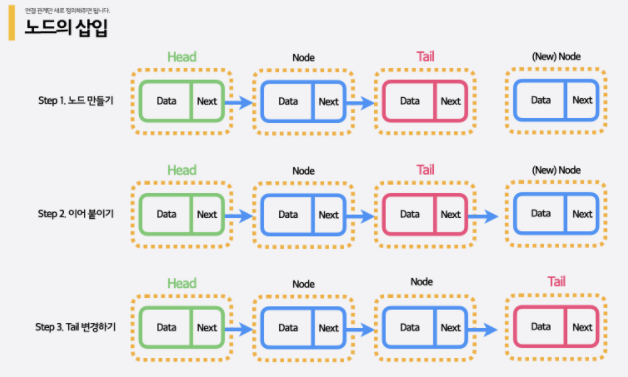

# 연결 리스트 - 양방향 연결 리스트 (원형 연결 리스트)

<br/>

> 참고 자료 : 《<a href="https://github.com/SangYoonLee1231/TIL/blob/main/DataStructure/data_structure_introduction.md">자료구조 소개</a>》 페이지 참고

<br/>

### 목차

- <a href="https://github.com/SangYoonLee1231/TIL/blob/main/DataStructure/doubly_linked_list.md#%EC%96%91%EB%B0%A9%ED%96%A5-%EC%97%B0%EA%B2%B0-%EB%A6%AC%EC%8A%A4%ED%8A%B8-singly-linked-list-%EC%86%8C%EA%B0%9C">양방향 연결 리스트 (Singly Linked List) 소개</a>
- <a href="https://github.com/SangYoonLee1231/TIL/blob/main/DataStructure/doubly_linked_list.md#%EC%96%91%EB%B0%A9%ED%96%A5-%EC%97%B0%EA%B2%B0-%EB%A6%AC%EC%8A%A4%ED%8A%B8-%EC%9B%90%ED%98%95-%EC%97%B0%EA%B2%B0-%EB%A6%AC%EC%8A%A4%ED%8A%B8-%EA%B5%AC%ED%98%84">양방향 연결 리스트 (양방향 연결 리스트 (원형 연결 리스트) 구현</a>

  - <a href="https://github.com/SangYoonLee1231/TIL/blob/main/DataStructure/doubly_linked_list.md#node-%ED%81%B4%EB%9E%98%EC%8A%A4-%EA%B5%AC%ED%98%84">Node 클래스 구현</a>
  - <a href="https://github.com/SangYoonLee1231/TIL/blob/main/DataStructure/doubly_linked_list.md#%EC%96%91%EB%B0%A9%ED%96%A5-%EC%97%B0%EA%B2%B0-%EB%A6%AC%EC%8A%A4%ED%8A%B8-%ED%81%B4%EB%9E%98%EC%8A%A4-%EA%B5%AC%ED%98%84">양방향 연결 리스트 클래스 구현</a>
  - <a href="https://github.com/SangYoonLee1231/TIL/blob/main/DataStructure/doubly_linked_list.md#%EC%97%B0%EC%82%B0-%ED%95%A8%EC%88%98-%EA%B5%AC%ED%98%84-splice-%EC%9D%B4%EB%8F%99-%EC%82%BD%EC%9E%85-%ED%83%90%EC%83%89-%EC%82%AD%EC%A0%9C">연산 함수 구현 (Splice, 이동, 삽입, 탐색, 삭제)</a>
  - <a href="https://github.com/SangYoonLee1231/TIL/blob/main/DataStructure/doubly_linked_list.md#%EA%B8%B0%ED%83%80-%EC%97%B0%EC%82%B0">기타 연산</a>

- <a href="https://github.com/SangYoonLee1231/TIL/blob/main/DataStructure/doubly_linked_list.md#%EC%97%B0%EC%82%B0%EC%9D%98-%EC%8B%9C%EA%B0%84-%EB%B3%B5%EC%9E%A1%EB%8F%84">연산의 시간 복잡도</a>

<br/><br/>

## 양방향 연결 리스트 (Singly Linked List) 소개

- Node들이 <strong>양쪽 방향으로 모두 연결된</strong> 연결 리스트이다.

- 앞으로만 이동할 수 있다는 단방향 연결 리스트의 한계를 보완하기 위해, 단일 연결 리스트에 <strong>prev를 추가</strong>한 연결 리스트이다.

<br/>

- 단방향 연결 리스트에 비해 관리해야 할 link가 2배로 늘어나는 단점이 있으나, 그로 인한 이점이 더 크다.

    

<br/>

- <strong>양방향 연결 리스트의 필요성</strong>

  - Tail Node를 지우기 위해선, 직전 prev Node를 알아야 한다.

  - 그럴려면, Head Node부터 차례대로 탐색해서 prev Node를 찾아야 하는데 (<code>O(n)</code> 걸림), 이는 매우 비효율적이다.

  - <strong>만일, 뒤로 가는 link가 있다면, <code>O(1)</code>안에 prev Node를 찾을 수 있다. (prev link 필요성 대두)</strong>

    

<br/>

- 양방향 연결 리스트 Node의 구성 요소

  - key 1개 (+ 부가 데이터 value)

  - <strong>link 2개</strong>
    - <strong>next link, prev link</strong>

<br/><br/>

## 양방향 연결 리스트 (원형 연결 리스트) 구현

- 위에서 언급한 단방향 연결 리스트의 단점을 보완하는 다음과 같은 연결 리스트를 설계해보자.

  1. <strong>이전 Node를 가리키는 link를 포함</strong>하여, 양방향으로 이동이 가능하도록 한다.

  2. <strong>마지막 Node와 첫 Node를 서로 연결</strong>하여, <strong>원형 양방향 연결 리스트 (Circularly Doubly Linked List)</strong>를 만든다.

  

    <br/>

  3. 첫 Head Node는 <strong>Dummy Node</strong>가 되도록 한다.

     - <strong>Dummy Node</strong> : 연결 리스트의 시작을 표기하기 위한 스페셜 Node (<strong>Head Node 역할</strong>)

         

     - 따라서, <strong>빈 리스트는 Dummy Node 하나로만 구성</strong>된다.

<br/>

### Node 클래스 구현

```python
class Node:
    def __init__(self, key="Name"):
        self.key = key
        self.next = self  # 자기 자신을 가리킴
        self.prev = self  # 자기 자신을 가리킴
```

- Node 자체가 하나의 (원형) 양방향 연결 리스트이다.

    

<br/>

### 양방향 연결 리스트 클래스 구현

```python
class DoublyLinkedList:
    def __init__(self):
        self.head = Node()
        self.size = 0

    def __iter__(self):    # Generator
        ...

    def __str__(self):
        return self.key

    def __len__(self):    # 리스트 크기
        return self.size
```

<br/>

### 연산 함수 구현 (Splice, 이동, 삽입, 탐색, 삭제)

- <strong><code>splice</code> 연산 구현</strong>

  - 양방향 (원형) 연결 리스트에서 다양한 종류의 삽입/삭제 연산에 쓰이는 중요한 연산 함수

  - 연결 리스트의 일부를 cut하고 다른 곳의 두 Node 사이에 삽입한다.

    

  ```python
      def splice(self, a, b, x):
          # 노드 a부터 b까지 cut한 후 노드 x 다음에 삽입하는 함수

          # 조건 1. a 노드 뒤에 b 노드가 있어야 한다.
          # 조건 2. Head Node(=Dummy Node)와 x Node가 a 노드와 b 노드 사이에 오면 X

          ap = a.prev; bn = b.next; xn = x.next    # ap, bn, xn 변수 생성
          bn.prev = ap; ap.next = bn    #

          # paste 작업
          x.next = a
          a.prev = x
          xn.prev = b
          b.next = xn
  ```

<br/>

- <strong>이동 연산 구현</strong>

    

  ```python
      def moveAfter(self, a, x):
          # 노드 a를 노드 x 다음으로 이동
          splice(a, a, x)

      def moveBefore(self, a, x):
          # 노드 a를 노드 x 이전으로 이동
          splice(a, a, x.prev)
  ```

<br/>

- <strong>삽입 연산 구현</strong>

    

  ```python
      def insertAfter(x, key):
          # key값을 가진 새로운 Node 생성 후, x 노드 다음에 삽입
          moveAfter(Node(key), x)
          self.size += 1

      def insertBefore(x, key):
          # key값을 가진 새로운 Node 생성 후, x 노드 이전에 삽입
          moveBefore(Node(key), x)
          self.size += 1
  ```

  ```python
      def pushFront(key):
          # key값을 가진 새로운 Node 생성 후, Head Node(=Dummy Node) 다음에 삽입
          insertAfter(self.head, Node(key))
          self.size += 1

      def pushBack(key):
          # key값을 가진 새로운 Node 생성 후, Head Node(=Dummy Node) 이전에 삽입
          insertBefore(self.head, Node(key))
          self.size += 1
  ```

  - 삽입 연산은 새로운 Node를 생성 후 삽입하는 연산이므로, 연산 시 리스트 크기를 1 증가시키는 과정이 있어야 한다.

<br/>

- <strong>탐색 연산 구현</strong>

  ```python
      def search(self, key):
          # key값을 갖는 Node를 찾아 리턴하고, 없으면 None을 리턴한다.

          v = self.head    # v는 Dummy Node를 가리킨다.
          while v.next != self.head:
              # 한 바퀴 순회하여 일치하는 key값 있는지 탐색
              if v.key == key:
                  return v
              v = v.next
          return None;    # 아무 값도 없으면 None 리턴
  ```

<br/>

- <strong>삭제 연산 구현</strong>

    

  ```python
      def remove(self, x):
          # Node x를 삭제

          if x == None or x == self.head:
              # x가 없거나 head일 경우는 삭제 연산 수행 X
              return
          x.next.prev = x.prev
          x.prev.next = x.next
          del x
  ```

  ```python
      def popFornt():
          # Head Node 다음 노드(Front Node)를 삭제
          remove(self.head.next)

      def popBack():
          # Head Node 이전 노드(Back Node)를 삭제
          remove(self.head.prev)
  ```

<br/>

### 기타 연산

- <strong>join 함수</strong> : 두 리스트를 하나로 합치는 함수

- <strong>split 함수</strong> : 하나의 리스트를 2개로 분리하는 함수

<br/><br/>

## Splice 연산 사용하지 않고 삽입, 삭제 연산 구현하기

### 삽입 연산 구현

- 삽입 연산 함수 2가지

  - <code>pushFront</code> : Head Node 앞에 새로운 Node를 삽입하는 함수

  - <code>pushBack</code> : Tail Node 뒤에 새로운 Node를 삽입하는 함수

<br/>

- <strong>단방향 연결 리스트 구현</strong>

    

  ```python
  class SignlyLinkedList:
      def __init__(self):
          self.head = None
          self.size = 0
  ```

<br/>

- <strong><code>pushFront</code> 함수 구현</strong>

  

  ```python
      # Head Node 앞에 새로운 Node를 삽입하는 함수
      def pushFront(self, key):
          new_node = Node(key)  # 새 Node 생성
          new_node.next = self.head  # 현 Head Node 앞에 새 Node를 연결 (link에 Head 주소 저장)
          self.head = new_node  # Head Node를 새 Node로 업데이트

          self.size += 1  # 연결 리스트 크기 1 증가
  ```

  - <code>popFront</code> 함수 수행 시간 : <strong><code>O(1)</code></strong>

<br/>

- <strong><code>pushBack</code> 함수 구현</strong>

  

  ```python
      # Tail Node 다음에 새로운 Node를 삽입하는 함수
      def pushBack(self, key):
          v = Node(key)  # 새 Node 생성

          if len(self) == 0:
              # 연결 리스트에 Node가 0개인 상태이므로,
              # 새로 삽입되는 Node v는 Tail Node인 동시에 Head Node이다.

              # v.next = None (굳이 작성할 필요 없음)
              self.head = v

          else:
              # 연결 리스트에 Node가 있는 상태이므로,
              # Tail Node를 알기 위해선, Head부터 link를 따라 추적해야 한다.

              tail = self.head  # 우선, Tail Node의 link를 Head Node 주소로 설정
              while tail.next != None:
                  tail = tail.next  # 그 후, link값이 None이 될 때까지 업데이트
              tail.next = v  # 찾은 Tail Node 다음에 v를 추가. 이제 v가 Tail Node이다.

          self.size += 1  # 연결 리스트 크기 1증가
  ```

  - <code>pushBack</code> 함수 수행 시간 : <strong><code>O(1)</code></strong>

<br/>

- <strong>삽입 함수 사용 예시</strong>

  ```python
  L = SinglyLinkedList()

  L.pushFront(-1)   # -1 → ø
  L.pushFront(9)   # 9 → -1 → ø
  L.pushFront(3)   # 3 → 9 → -1 → ø
  L.pushFront(5)   # 5 → 3 → 9 → -1 → ø

  L.pushBack(4)   # 5 → 3 → 9 → -1 → 4 → ø
  ```

<br/>

### 삭제 연산 구현

- 삭제 연산 함수 2가지

  - <code>popFront</code> : Head Node를 삭제하고 그 key값을 리턴하는 함수

  - <code>popBack</code> : Tail Node를 삭제하고 그 key값을 리턴하는 함수

<br/>

- <strong><code>popFront</code> 함수 구현</strong>

  

  

  ```python
      # Head Node를 식제하고 그 값을 리턴하는 함수
      def popFront(self):
          # Node를 지울 땐, 항상 Node가 존재하는지 확인해야 한다.

          if len(self) == 0:    # Node가 없을 때
              return None    # 삭제할 Node가 없으므로 아무것도 반환하지 않음

          else:    # 최소 하나 이상 Node 존재 시
              x = self.head    # x Node == Head Node
              key = x.key    # Head Node의 key값 저장 (반환하기 위함)
              self.head = x.next    # 연결 리스트의 head 수정
              self.size -= 1    # 연결 리스트의 size(크기) 수정
              del x    # Head 노드 객체 삭제
              return key    # 미리 저장해둔 key값 반환
  ```

  - <code>popFront</code> 함수 수행 시간 : <strong><code>O(1)</code></strong>

<br/>

- <strong><code>popBack</code> 함수 구현</strong>

    

    

  ```python

      def popBack(self):
          # Node를 지울 땐, 항상 Node가 존재하는지 확인해야 한다.

          if len(self) == 0:    # Node가 없을 때
              return None    # 삭제할 Node가 없으므로 아무것도 반환하지 않음

          else:    # 최소 하나 이상 Node 존재 시
              # running technique
              # : Previous Node와 Tail Node를 통시에 찾는 테크닉
              prev, tail = None, self.head

              while tail.next != None:
                  prev = tail
                  tail = tail.next
              if len(self) == 1:
                  # 하나 남은 Node를 삭제하면 Node 개수 == 0이 되므로
                  self.head = None    # 연결 리스트 head = None
              else:
                  prev.next = tail.next # (OR prev.next = tail.next)
              key = tail.key    # Tail Node의 key값 저장 (반환하기 위함)
              del tail    # Tail Node 객체 삭제
              self.size -= 1    # 연결 리스트의 size(크기) 수정
              return key    # 미리 저장해둔 key값 반환
  ```

  - <code>popBack</code> 함수 수행 시간 : <strong><code>O(1)</code></strong>

<br/><br/>

## 연산의 시간 복잡도

- <code>moveAfter</code>/<code>moveBefore</code> 함수: O(1)

- <code>insertAfter</code>/<code>insertBefore</code> 함수: O(1)

- <code>pushFront</code>/<code>pushBack</code> 함수: O(1)

- <code>popFront</code>/<code>popBack</code> 함수: O(1)

- <code>remove</code> 함수: O(1)

- <code>search</code> 함수: O(n)

<br/><br/>

> 사진 출처 : <a href="https://youtu.be/nQhzNRmnmt8">신찬수 교수님 유튜브 강의</a>, <a href="https://www.codetree.ai/missions">Code Tree - Novice High</a>
