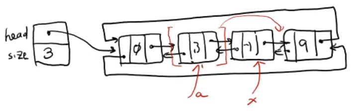
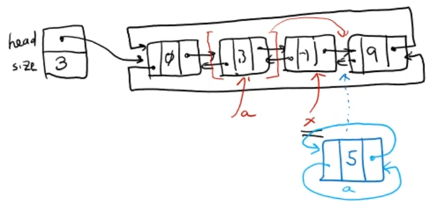

# 순차적 자료구조 : 양방향 연결 리스트 (Doubly Linked List)

<br/>

>  참고 자료 : 《<a href="https://github.com/SangYoonLee1231/TIL/blob/main/DataStructure/data_structure_introduction.md">자료구조 소개</a>》 페이지 참고

<br/>

## 양방향 연결 리스트(Singly Linked List)란

* Node들이 <strong>양쪽 방향으로 모두 연결된</strong> 연결 리스트이다.

* 단방향 연결 리스트에 비해 관리해야 할 link가 2배로 늘어나는 단점이 있으나, 그로 인한 이점이 더 크다.


<br/>

* 양방향 연결 리스트의 필요성

    * tail Node를 지우기 위해선, 직전 prev Node를 알아야 한다.

    * 그럴려면, head Node부터 차례대로 탐색해서 prev Node를 찾아야 하는데 (O(n) 걸림), 이는 매우 비효율적이다.

    * <strong>만일, 뒤로 가는 link가 있다면, O(1)안에 prev Node를 찾을 수 있다. (prev link 필요성 대두)</strong>

        

<br/>

* 양방향 연결 리스트 Node의 구성 요소
    
    * key 1개 (+ 부가 데이터 value)
    
    * <strong>link 2개</strong>
        
        * <strong>next link, prev link</strong>

<br/>

## 양방향 연결 리스트 구현

* 위에서 언급한 단방향 연결 리스트의 단점을 보완하는 다음과 같은 연결 리스트를 설계해보자.

    1. <strong>이전 Node를 가리키는 link를 포함</strong>하여, 양방향으로 이동이 가능하도록 한다.

    2. <strong>마지막 Node와 첫 Node를 서로 연결</strong>하여, <strong>원형 양방향 연결 리스트 (Circularly Doubly Linked List)</strong>를 만든다.

        

    <br/>

    3. 첫 Head Node는 <strong>Dummy Node</strong>가 되도록 한다.

        * <strong>Dummy Node</strong> : 연결 리스트의 시작을 표기하기 위한 스페셜 Node

            

        * 따라서, <strong>빈 리스트는 Dummy Node 하나로만 구성</strong>된다.

<br/>

### Node 클래스 구현

```python
class Node:
    def __init__(self, key="Name"):
        self.key = key
        self.next = self  # 자기 자신을 가리킴
        self.prev = self  # 자기 자신을 가리킴
```

* Node 자체가 하나의 (원형) 양방향 연결 리스트이다.

    

<br/>

### (원형) 양방향 연결 리스트 클래스 구현

```python
class DoublyLinkedList:
    def __init__(self):
        self.head = Node()
        self.size = 0

    def __iter__(self):    # Generator
        ...

    def __str__(self):    
        return self.key

    def __len__(self):    # 리스트 크기
        return self.size
```

<br/>

### Splice 연산 구현

* 양방향 (원형) 연결 리스트에서 다양한 종류의 삽입/삭제 연산에 쓰이는 중요한 연산 함수

* 연결 리스트의 일부를 cut하고 다른 곳의 두 Node 사이에 삽입한다.

    

```python
    def splice(self, a, b, x):
        # 노드 a부터 b까지 cut한 후 노드 x 다음에 삽입하는 함수

        # 조건 1. a 노드 뒤에 b 노드가 있어야 한다.
        # 조건 2. Head Node(=Dummy Node)와 x Node가 a 노드와 b 노드 사이에 오면 X
        
        ap = a.prev; bn = b.next; xn = x.next    # ap, bn, xn 변수 생성
        bn.prev = ap; ap.next = bn    # 

        # paste 작업
        x.next = a
        a.prev = x
        xn.prev = b
        b.next = xn
```

<br/>

### 이동 연산 구현

&nbsp;&nbsp;&nbsp;&nbsp;&nbsp;&nbsp;&nbsp;&nbsp;&nbsp;&nbsp; 

```python
    def moveAfter(self, a, x):
        # 노드 a를 노드 x 다음으로 이동
        splice(a, a, x)

    def moveBefore(self, a, x):
        # 노드 a를 노드 x 이전으로 이동
        splice(a, a, x.prev)
```

<br/>

### 삽입 연산 구현

&nbsp;&nbsp;&nbsp;&nbsp;&nbsp;&nbsp;&nbsp;&nbsp;&nbsp;&nbsp; 

```python
    def insertAfter(x, key):
        # key값을 가진 새로운 Node 생성 후, x 노드 다음에 삽입
        moveAfter(Node(key), x)
        self.size += 1
    
    def insertBefore(x, key):
        # kwy값을 가진 새로운 Node 생성 후, x 노드 이전에 삽입
        moveBefore(Node(key), x)
        self.size += 1
```

```python
    def pushFront(key):
        # key값을 가진 새로운 Node 생성 후, Head Node(=Dummy Node) 다음에 삽입
        insertAfter(self.head, Node(key))
        self.size += 1

    def pushBack(key):
        # key값을 가진 새로운 Node 생성 후, Head Node(=Dummy Node) 이전에 삽입
        insertBefore(self.head, Node(key))
        self.size += 1
```

* 삽입 연산은 새로운 Node를 생성 후 삽입하는 연산이므로, 연산 시 리스트 크기를 1 증가시키는 과정이 있어야 한다.

<br/>

### 탐색 연산 구현