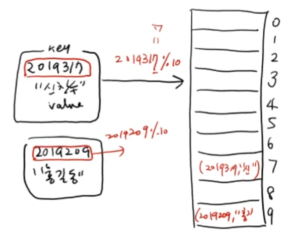
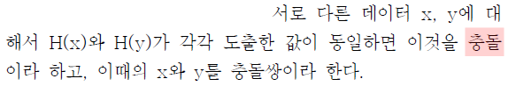

# 해시 테이블 (Hash Table) 기본 개념

 

> 참고 자료 : 《<a href="https://github.com/SangYoonLee1231/TIL/blob/main/DataStructure/data_structure_introduction.md">자료구조 소개</a>》 페이지 참고

 

### 목차

- <a href="">해시 함수와 해시 테이블의 개념</a>
- <a href="">해시 테이블 소개</a>
- <a href="">해시 테이블의 성질을 좌우하는 3가지 요소</a>

 

## 해시 함수와 해시 테이블의 개념

- <strong>해시 함수</strong>는 임의의 데이터를 <strong>고정된 길이이 특정 값으로 변환</strong>해주는 함수이다.

- 해시 함수를 통해 저장된 자료구조를 <strong>해시 테이블</strong>이라 한다.

 

- 해시 테이블은 일종의 <strong>사전(dictonary)</strong>이다.

- 해시 테이블의 데이터는 <strong>key값과 value값의 쌍</strong>으로 구성된다(고 가정한다).

  

 

- 해시 테이블의 <strong>데이터</strong>는 다음의 경우가 있다.

  - 해시 함수의 <strong>입력값</strong>

  - 해시 함수의 <strong>결과값</strong>

  - <strong>입력값</strong>을 <strong>key</strong>로, (고정된 길이의) <strong>결과값</strong>을 <strong>value</strong>로 서로 <strong>쌍</strong>을 이루어 만들어진 데이터

  

## 해시 테이블 소개

- 해시 테이블은 평균 <code>O(1)</code>안에 <strong>삽입, 삭제, 탐색 연산이 모두 가능</strong>한 매우 유용한 자료구조이다.

- 매우 광범위한 분야에 사용되는, 실용성이 뛰어난 자료구조 중 하나이다.

 

- 연산을 쉽게 할 수 있도록 자료를 <strong>서랍장</strong>처럼 저장한다.

  - 예를 들어, 양말과 장갑은 2번째 서랍에, 수건과 마스크는 4번째 서랍에 넣는 식이다.

    만일 수건을 찾고 싶다면, 수건이 저장된 서랍 번호를 계산을 통해 알아내고 (4번)

    4번째 서랍에 들어있는 아이템들을 하나씩 비교에 수건을 찾으면 된다.

     

  - 구체적인 다른 예로, key값을 10으로 나눈 나머지에 해당하는 서랍에 자료를 저장할 수 있다.

    (key값이 2019317이면, 2019317 % 10 == 7이므로, 7번째 서랍에 자료를 저장)

      

 

- 이 때, 정보가 저장될 서랍장 번호를 계산하는 함수 <code>f(key)</code>가 이 테이블의 <strong>해시 함수</strong>이다.

- 어떤 데이터를 해시 테이블에 저장하려고 할 때, 해시 함수에 의해 계산된 번호의 서랍장에 이미 다른 데이터가 있다면, 이 경우를 <strong>충돌(collision)</strong>이 발생했다고 한다.

    

   (2016학년도 9월 모의평가 국어 A형 비트코인 지문 中)

 

- 충돌이 발생하면, 저장하려 했던 데이터를 담을 다른 빈 공간을 찾아야 하는데, 이렇게 하여 충돌 문제를 피하는 방법을 <strong>충돌 해결 방법(Collision Resolution Method)</strong>이라 한다.

  

## 해시 테이블의 성질을 좌우하는 3가지 요소

- <strong>Table</strong> : List로 주로 관리 (크게 신경 쓸 필요 X)

- <strong>해시 함수 (Hash Function)</strong> : 어떤 좋은 해시 함수를 통해 key값을 인덱스로 맵핑할 것인가

- <strong>충돌 해결 방법 (Collision Resolution Method)</strong> : 충돌 해결 방법을 어떻게 잘 설계할 것인가

 

  

> 사진 출처 : <a href="https://youtu.be/Bzmepm6pYQI">신찬수 교수님 유튜브 강의</a>
