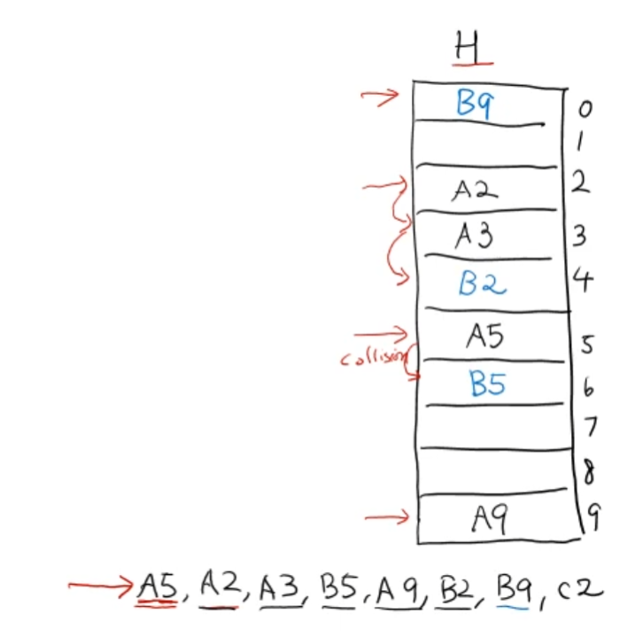

# 해시 테이블 - 충돌 회피 방법 - Open Addressing의 Linear Probing

<br/>

> 참고 자료 : 《<a href="https://github.com/SangYoonLee1231/TIL/blob/main/DataStructure/data_structure_introduction.md">자료구조 소개</a>》 페이지 참고

<br/>

## 총돌 회피 방법 (Collision Resolution Method)

- 해시 함수를 아무리 잘 설계하더라도 완벽한(perfect) 해시 함수가 될 수는 없으므로, 그 함수 또한 <strong>반드시 충돌이 발생</strong>하게 된다.

- 아이템을 해시 테이블에 저장하려는 곳에 이미 다른 데이터가 저장되어 있으면, 즉 충돌이 발생하면, <strong>다른 장소를 찾아야 한다.</strong>

- <strong>그 장소를 정하는 방법</strong>이 <strong>충돌 회피 방법(Collision Resolution Method)</strong>이다.

<br/>

## 대표적인 충돌 회피 방법 : open addressing

- 충돌이 발생했을 때, 주위에 빈 장소를 찾아서 데이터를 저장하는 방법이다.

- 주위의 빈 장소를 찾는 방법에 따라 여러 종류로 설명할 수 있다.

- chaining과 대조되는 방법이다.

### open addressing의 종류

- Linear Probing

- Quadratic Probing

- Double Hashing

<br/>

## Linear Probing

- 충돌 발생 시, 주위에 빈 장소를 찾아서 데이터를 저장하는 open addressing의 한 종류이다.

* 충돌 발생 시, 빈 공간을 찾기 위해 <strong>다음 슬롯을 순차적으로 탐색</strong>하고, 먼저 찾은 빈 공간에 데이터를 저장하는 방법이다.

* 이 때, <strong>처음 슬롯과 끝 슬롯은 고리처럼 이어져 있다</strong>고 가정한다.

<br/>

### Linear Probing 수행 방법 예시

- 해시 테이블 H의 슬롯에 하나의 값만 저장할 수 있다고 가정한다.

- 해시 테이블 H에 A5, A2, A3, B5, A9, B2, B9, C2의 값을 순서대로 저장하고자 한다.

- 각 값이 저장되는 슬롯의 번호는 알파벳 다음의 숫자이다.

  (== key값을 해시 함수로 계산하면, key값의 알파벳 다음 숫자가 된다.)


<br/>

1. 먼저 A5, A2, A3을 각각 5번, 2번, 3번 슬롯에 저장한다. 이제 B5를 저장할 차례가 되었다.

2. B5를 5번 슬롯에 저장하려 하는데, 이미 A5가 저장되어 있으므로 충돌이 발생했다.  
   따라서 다른 빈 슬롯을 찾아야 한다.

3. linear probing 방법에 따라 다음 6번 슬롯을 확인한다.

4. 6번 슬롯은 비어 있으므로 B5를 H[6]에 저장한다.


<br/>

5. 다음으로, A9, B2, B9을 순서대로 해시 테이블에 저장하려 한다.

6. A9은 9번째 슬롯이 비어있으므로 H[9]에 그대로 저장한다.

7. 그리고 B2는, 2번 슬롯이 차 있으므로, linear probing에 따라 빈 공간을 순차적으로 탐색하고 B[4]에 저장한다.

8. 다음 B9 역시 9번 슬롯이 차 있으므로, linear probing에 따라 빈 공간을 순서대로 탐색해야 하는데,  
   처음 슬롯과 끝 슬롯은 이어져있다고 보기 때문에, 9번 슬롯의 다음을 탐색할 땐, 맨 처음인 0번 슬롯으로 넘어간다.

9. 0번 슬롯은 비어있으므로 B9을 H[0]에 저장한다.



<br/>

10. 마지막으로 C2를 저장할 차례다.

11. 2번 슬롯부터 6번 슬롯까지 모두 차 있으므로, C2는 H[7]에 저장된다.

    이렇게 모든 데이터를 Linear Probing에 따라 해시 테이블 H에 저장하였다.


<br/>

- H[2] ~ H[7]처럼 데이터들이 연속된 슬롯에 모여있는 것을 <strong>cluster</strong>이라 한다.

- cluster이 많아지면 <strong>삽입 및 탐색 연산 시 시간이 더 많이 소요</strong>되기 때문에, 되도록 cluster은 생기지 않도록 하는 것이 좋다.

<br/>

## Linear Probing 연산

- <code>insert</code>, <code>search</code>, <code>remove</code> 3개의 연산이 있다.

- 3개의 연산에 공통적으로 쓰이는, 매우 중요한 함수 <code>find_slot</code>을 먼저 정의한 후, 위 세 연산들을 살펴보도록 하자.

<br/>

### find_slot 함수

- 찾고자 하는 key값이 해시 테이블에 있는지 확인하고, 그 결과를 리턴하는 함수이다.

- 만일 찾고자 하는 값이 없다면, 그 값을 새로 삽입할 빈 슬롯을 대신 찾는다. 그리고 그 위치를 리턴한다.

- 3가지의 case에 따라 리턴값이 달라진다.

  - <strong>key값이 없고, 해시 테이블이 모두 차 있는 경우</strong>  
     ☞ FULL 리턴

    (FULL은 해시 테이블이 가득 참을 나타내는 값)

  - <strong>key값이 없지만, 해시 테이블에 빈 공간이 있는 경우</strong>  
     ☞ 그 key값을 삽입할 슬롯 번호 리턴

  - <strong>key값이 있는 경우</strong>  
     ☞ 해당 key값이 있는 슬롯 번호 리턴

```python
# psuedo code
def find_slot(key):
    i = f(key)  # i는 데이터를 저장할 슬롯 번호
    start = i   # 시작점은 start로 고정

    while (H[i] == occupied) and (H[i].key != key):
    # 탐색하는 슬롯이 차 있고 다른 key값이 들어있다.

        i = (i + 1) % m   # 다음 슬롯을 탐색
        # m은 해시 테이블의 크기 (한 바퀴 회전을 위해 % 연산 진행)

        if i == start:
        # 탐색을 한 바퀴 진행 == 모든 슬롯이 다른 key값들로 차 있다.
            return FULL

    return i
    # 1. 내가 찾는 값이 없지만 비어있는 공간이 있다. (i == 탐색 중 처음으로 나온 빈 슬롯 위치, key값을 새로 삽입할 위치)
    # 2. 내가 찾는 값이 존재한다. (i == 해당 key값이 있는 위치)
```

<br/>

### search 연산

- 데이터를 key값을 통해 탐색하여 찾는 연산

- 데이터(key값)가 있으면 해당 value값 리턴, 없으면 None을 리턴한다.

```python
def search(key):
    # find_slot 함수를 이용 (결과값 i는 3가지 case)
    i = find_slot(key)

    if i == FULL:
        return None
        # 찾는 값 x, 슬롯 모두 차 있음
    if H[i].is_occpupied:
        return H[i].value
        # 찾는 값 O (i값이 무엇인지 case에 따라 다름)
    else:
        return None
        # 찾는 값 X, 빈 슬롯이 존재
```

<br/>

### insert 연산

- 데이터를 빈 공간에 삽입하는 연산

- 이미 데이터의 key값이 존재하면, value값만 Update한다. 없으면 None을 리턴한다.

```python
def set(key, value = None):
    # find_slot 함수를 이용 (결과값 i는 3가지 case)
    i = find_slot(key)

    if i == FULL:
        return None
        # 찾는 값 x, 슬롯 모두 차 있음
        # ☞ H의 용량을 키워야 함
    if H[i].is_occupied:
        H[i].value = value
        # 찾는 값 O (i값 == 찾는 값의 위치)
        # ☞ 데이터 Update
    else:
        H[i].key, H[i].value = key, value
        # 찾는 값 X, 빈 슬롯이 존재 (i값 == 첫 빈 슬롯 위치)
        # ☞ 데이터 삽입

    return key
    # 데이터가 성공적으로 삽입 or Update 되었음을 의미
```

<br/>

### delete 연산

<br/><br/>

> 사진 출처 : <a href="https://youtu.be/Bj4pd9rJp5c">신찬수 교수님 유튜브 강의</a>
