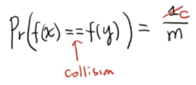

# 해시 테이블 - 해시 함수 (Hash Function)

 

> 참고 자료 : 《<a href="https://github.com/SangYoonLee1231/TIL/blob/main/DataStructure/data_structure_introduction.md">자료구조 소개</a>》 페이지 참고

 

### 목차

- <a href="">해시 함수 (Hash Function)</a>
- <a href="">좋은 성질의 해시 함수</a>
  - <a href="">완전(perfect) 해시 함수</a>
  - <a href="">universial 해시 함수</a>
  - <a href="">c-universial 해시 함수</a>
  - <a href="">해시 함수 종류 (간단 정리)</a>

 

## 해시 함수 (Hash Function)

- <strong>해시 함수 (Hash Function)</strong>는 <strong>임의의 데이터(key)</strong>를 <strong>고정된 길이이 특정 값(index)</strong>으로 변환해주는 함수이다.

- key 값을 index로 변환하는 것을 <strong>맵핑(mapping)</strong>이라 하며, 해시 함수는 보통 <code>f(key)</code>로 나타낸다.

    

  

## 좋은 성질의 해시 함수

- ✨ <strong>좋은 해시 테이블을 설계하기 위해 좋은 성질을 갖는 해시 함수를 만들어야 한다.</strong>

- 그럼 <strong>좋은 성질의 해시 함수</strong>란?

  - <strong>Less Collision</strong> : 충돌 확률이 가능하면 적도록

  - <strong>Fast Compution</strong> : 계산 속도는 최대한 빠르게

  - 위 두 조건은 서로 <strong>trade-off 관계</strong>

    - 충돌을 적게 하려면 계산 속도가 느려지고, 반대로 계산 속도를 빠르게 하려면 충돌을 어느 정도 감수해야 한다.

  - 그러므로, <strong>이 두 조건을 적절하게 균형을 맞춰 효율적인 해시 테이블을 만드는 것이 중요하다.</strong>

 

### 완전(perfect) 해시 함수

- <strong>충돌 발생 가능성이 0</strong>인 이상적인(ideal) 해시 함수

- 현실적으로 이런 함수를 찾는 것은 거의 <strong>불가능</strong>할 뿐더러, 계산 복잡성의 문제도 있다.

- 따라서 대체가 필요하다.

 

### universial 해시 함수

- 서로 다른 임의의 두 key값 x, y에 대해 <code>prob( f(x) == f(y) ) = 1 / size(H)</code>이 성립하는 해시 함수

  - (size(H)는 해시 테이블의 크기)

      

- 역시 상당히 설계하기 어려운 함수이므로, 타협안이 필요하다.

 

### c-universial 해시 함수

- 서로 다른 임의의 두 key값 x, y에 대해 <code>prob( f(x) == f(y) ) = c / size(H)</code>이 성립하는 해시 함수

  - (size(H)는 해시 테이블의 크기)

      

- universial 해시 함수의 타협안으로, 확률에 상수 c를 곱했다.

- <strong>실제로 많이 쓰는 함수</strong>이다. (그러나 역시 그리 간단한 것은 아니다)

 

### 해시 함수 종류 (간단 정리)

- 어떤 어플리케이션을 사용하는지에 따라 맞는 해시 테이블을 선택해서 사용한다.

  - Division

  - Multiplication

  - Folding

  - Mid-squares

  - Extraction

  - ...

 

- key값이 String인 해시 함수 종류

  - Additive

  - Rotating

  - Universal

  

> 사진 출처 : <a href="https://youtu.be/Bzmepm6pYQI">신찬수 교수님 유튜브 강의</a>
