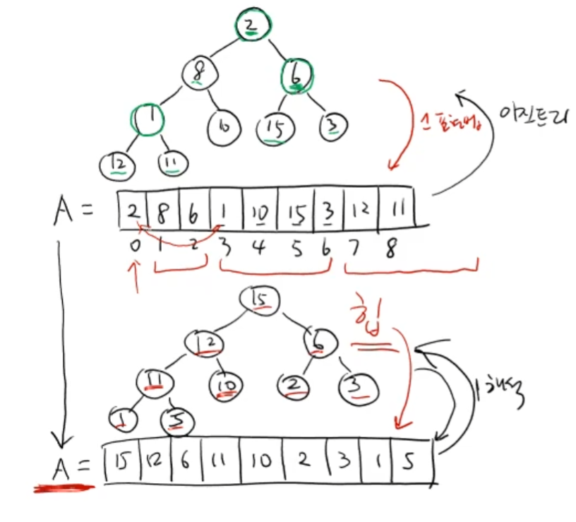

# 힙 (Heap)

 

> 참고 자료 : 《<a href="https://github.com/SangYoonLee1231/TIL/blob/main/DataStructure/data_structure_introduction.md">자료구조 소개</a>》 페이지 참고

 

### 목차

- <a href="https://github.com/SangYoonLee1231/TIL/blob/main/DataStructure/heap.md#%ED%9E%99-heap-%EC%9D%B4%EB%9E%80">힙 (Heap) 이란?</a>
- <a href="https://github.com/SangYoonLee1231/TIL/blob/main/DataStructure/heap.md#%ED%9E%99%EC%9D%98-%EC%A4%91%EC%9A%94%ED%95%9C-%EC%84%B1%EC%A7%88">힙의 중요한 성질</a>
- <a href="https://github.com/SangYoonLee1231/TIL/blob/main/DataStructure/heap.md#%ED%9E%99-%EC%A0%9C%EA%B3%B5-%EC%97%B0%EC%82%B0">힙 제공 연산</a>
  - <a href="https://github.com/SangYoonLee1231/TIL/blob/main/DataStructure/heap.md#make_heap-%EC%97%B0%EC%82%B0">make_heap 연산</a>
  - <a href="https://github.com/SangYoonLee1231/TIL/blob/main/DataStructure/heap.md#insert-%EC%97%B0%EC%82%B0">insert 연산</a>
  - <a href="https://github.com/SangYoonLee1231/TIL/blob/main/DataStructure/heap.md#find_max-%EC%97%B0%EC%82%B0">find_max 연산</a>
  - <a href="https://github.com/SangYoonLee1231/TIL/blob/main/DataStructure/heap.md#delete_max-%EC%97%B0%EC%82%B0">delete_max 연산</a>

 

## 힙 (Heap) 이란?

- <strong>힙의 조건</strong>을 만족하는 <strong>이진 트리</strong>

 

- ✨ <strong>힙 조건</strong>

  - <strong>모양 성질</strong>을 만족해야 한다.

    - <strong>모양 성질</strong> : 이진 트리의 각 레벨마다 노드가 좌측부터 순서대로 <strong>꽉 차있다.</strong> (이러한 트리를 <strong>완전 이진트리</strong>라 한다.)

  - <strong>힙 성질</strong>을 만족해야 한다.

    - <strong>힙 성질</strong> : 모든 부모 노드의 key값은 자식 노드의 key값보다 <strong>같거나 크다</strong>. (<code>max-heap</code>)

     

    

 

## 힙의 종류

- <strong><code>max-heap</code></strong> : 부모 노드의 key값이 자식 노드보타 <strong>같거나 큰</strong> 힙

- <strong><code>min-heap</code></strong> : 부모 노드의 key값이 자식 노드보다 <strong>작거나 같은</strong> 힙

  

## 힙의 중요한 성질

<strong>Case 1></strong> 배열 (리스트) A의 <code>0</code>번째 인덱스부터 값을 채웠다고 가정했을 때,

- <code>A[k]</code>의 왼쪽 자식 노드 : <code>A[2*k + 1]</code>

- <code>A[k]</code>의 오른쪽 자식 노드 : <code>A[2*k + 2]</code>

- <code>A[k]</code>의 부모 노드 : <code>A[(k-1) // 2]</code>

- <strong>루트 노드(Root Node)</strong>, 즉 <code>A[0]</code>엔 <strong>가장 큰 값</strong>이 있다.

 

<strong>Case 2></strong> 배열 (리스트) A의 <code>1</code>번째 인덱스부터 값을 채웠다고 가정했을 때,

- <code>A[k]</code>의 왼쪽 자식 노드 : <code>A[2*k]</code>

- <code>A[k]</code>의 오른쪽 자식 노드 : <code>A[2*k + 1]</code>

- <code>A[k]</code>의 부모 노드 : <code>A[k // 2]</code>

- <strong>루트 노드(Root Node)</strong>, 즉 <code>A[1]</code>엔 <strong>가장 큰 값</strong>이 있다.

 

### 힙의 장점

- 내부 요소를 모두 <code>O(1)</code>시간 안에 접근할 수 있다.

- 힙의 각 레벨마다 노드가 좌측부터 순서대로 빈 공간 없이 꽉 차있으므로, (빈 공간으로 인한) 메모리 낭비가 없다.

- ✨ 원소의 추가, 그리고 최댓값의 삭제가 빈번하게 일어나는 상황에서 현재 남아있는 원소들 중 최댓값을 빠르게 계속 얻고 싶은 경우에 heap 자료구조가 유용하다.

  

## 힙 제공 연산

### make_heap 연산

- 이진 트리를 표현하는 임의의 배열을 힙으로 만드는 (힙 성질을 만족하도록 하는) 연산

- 밑에 소개할 3개의 연산 모두에 사용되는, 가장 기초적인 연산

- 수행 시간 : <code>O(logn)</code>

 

### insert 연산

- 힙에 새로운 값을 삽입하는 연산 (힙 성질을 벗어나지 않도록)

- 수행 시간 : <code>O(logn)</code>

 

### find_max 연산

- 힙의 최댓값 <code>H[0]</code>을 찾아 반환하는 연산

- 수행 시간 : <code>O(1)</code>

 

### delete_max 연산

- 힙에서 최댓값을 <code>H[0]</code>을 제거하는 연산 (힙에서의 삭제는 루트 노드만 가능하다)

- 수행 시간 : <code>O(logn)</code>

  

> 사진 출처 : https://ehclub.co.kr/1228 , <a href="https://youtu.be/kGZoEShMcSQ">신찬수 교수님 유튜브 강의</a>
