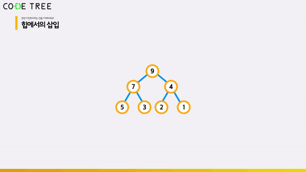

# 힙 (Heap) - <code>insert</code>, <code>find_max</code> 와 <code>delete_max</code> 연산

<br/>

> 참고 자료 : 《<a href="https://github.com/SangYoonLee1231/TIL/blob/main/DataStructure/data_structure_introduction.md">자료구조 소개</a>》 페이지 참고

<br/>

### 목차

- <a href="https://github.com/SangYoonLee1231/TIL/blob/main/DataStructure/heap_insert_delete_max.md#insert-%EC%97%B0%EC%82%B0"><code>insert</code> 연산</a>
  - <a href="https://github.com/SangYoonLee1231/TIL/blob/main/DataStructure/heap_insert_delete_max.md#heapify_up-%EC%97%B0%EC%82%B0"><code>heapify_up</code> 연산</a>
- <a href="https://github.com/SangYoonLee1231/TIL/blob/main/DataStructure/heap_insert_delete_max.md#find_max-%EC%97%B0%EC%82%B0"><code>find_max</code> 연산</a>
- <a href="https://github.com/SangYoonLee1231/TIL/blob/main/DataStructure/heap_insert_delete_max.md#delete_max-%EC%97%B0%EC%82%B0"><code>delete_max</code> 연산</a>
- <a href="https://github.com/SangYoonLee1231/TIL/blob/main/DataStructure/heap_insert_delete_max.md#heap-%EC%97%B0%EC%82%B0-%EC%A0%95%EB%A6%AC">heap 연산 정리</a>
- <a href="https://github.com/SangYoonLee1231/TIL/blob/main/DataStructure/heap_insert_delete_max.md#heap-sort-%ED%9E%99-%EC%A0%95%EB%A0%AC">heap sort (힙 정렬)</a>
- <a href="https://github.com/SangYoonLee1231/TIL/blob/main/DataStructure/heap_insert_delete_max.md#%ED%95%84%EA%B8%B0-%EB%85%B8%ED%8A%B8">필기 노트</a>

<br/><br/>

## <code>insert</code> 연산

- <code>insert</code> 연산은 다음 두 과정을 순서대로 진행하는 연산이다.

  - 노드를 트리의 <strong>맨 뒤</strong>에 삽입

  - <strong>heap 성질을 만족</strong>하도록 삽입한 노드를 <strong>위로 이동</strong> (<code>heapify_up</code>)

    

<br/>

- key값 <code>n</code>을 heap인 배열 A에 삽입하는 <code>insert</code> 함수 정의

  ```python
  A = [15, 12, 6, 11, 10, 2, 3, 1, 8]

  def insert(n):
    A.append(n)  # 배열 A의 끝에 key값 n을 삽입
    A.heapify_up(k)  # A[k]를 root 방향으로 이동하면서 heapify

  insert(14)
      ↓
  '''
  def insert(14):
    A.append(14)  # 배열 A의 끝에 14를 삽입
    A.heapify_up(9)  # A[9]를 root 방향으로 이동하면서 heapify
  '''
  ```

- 시간 복잡도 : <code>O(logn)</code>

<br/>

### <code>heapify_up</code> 연산

- 주어진 노드를 위로 이동하여 heap 성질을 만족하도록 하는 연산이다.

  ```python
  def heapify_up(k):  # A[k]를 heapify
    while k > 0 and A[(k - 1) // 2] < A[k]:
        A[k], A[(k - 1) // 2] = A[(k - 1) // 2], A[k]
        k = (k - 1) // 2
  ```

- 시간 복잡도 : <code>O(logn)</code>

<br/><br/>

## <code>find_max</code> 연산

- heap에서 가장 큰 값을 찾아서 리턴해주는 연산

- 즉, root node값을 리턴하면 된다. → <code>return A[0]</code>

- 시간 복잡도 : <code>O(1)</code>

<br/><br/>

## <code>delete_max</code> 연산

- heap에서 <strong>가장 큰 값(<code>A[0]</code>)을 지우고</strong>, <strong>맨 끝 원소의 Node를 <code>A[0]</code>으로 이동</strong>하는 연산

- 이동 후에는 <strong>힙 성질을 만족하도록</strong> <code>A[0]</code> 자리로 이동한 Node를 <strong>다시 heapify down</strong> 해주어야 한다.

  - 정리 : 맨 끝 원소를 <code>A[0]</code>으로 이동 → <code>heapify_down</code>

  <br/>

  ```python
  def delete_max():
      if len(A) == 0:  return None
      key = A[0]
      A[0], A[len(A) - 1] = A[len(A) - 1] , A[0]
      A.pop()
      heapify_down(0, len(A))

      return key
  ```

- 시간 복잡도 : <code>O(logn)</code>

<br/><br/>

## heap 연산 정리

- <code>make_heap</code> 연산 : <code>O(n)</code>, <code>O(nlogn)</code>

- <code>insert</code> 연산 : <code>O(logn)</code>

- <code>find_max</code> 연산 : <code>O(1)</code>

- <code>delete_max</code> 연산 : <code>O(logn)</code>

- <code>search</code> 연산 : ❌

- <code>heapify_down</code> 연산 : <code>O(h)</code> = <code>O(logn)</code>

- <code>heapify_up</code> 연산 : <code>O(h)</code> = <code>O(logn)</code>

<br/>

- <strong>search 함수가 heap에 없는 이유</strong>

  : Node가 heapify 될 때, 어디로 이동할 지 확정지을 수 없기 때문이다.

<br/>

- heap 자료구조는 <strong><code>insert</code>, <code>find_max</code>, <code>delete_max</code> 세 연산에 특화된 자료구조이다.</strong>

- 반면, <strong><code>search</code> 연산과는 어울리지 않는 자료구조이다.</strong>

<br/><br/>

## heap sort (힙 정렬)

- n개의 숫자를 입력받아 배열 A에 저장한다.

- make_heap 연산을 불러, A를 힙으로 구성한다.

- pop 과정을 생략한 delete_max 연산을 n번 수행하여, 제일 큰 값부터 맨 뒤로 보낸다.

  ```python
  for k in range(n):
      delete_max() # (단, pop 과정은 생략)
  ```

- 시간 복잡도 : <code>O(logn)</code>

<br/><br/>

## 필기 노트 (참고용)


