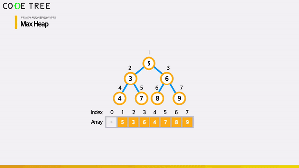

# 힙 (Heap) - <code>make_heap</code> 연산

<br/>

> 참고 자료 : 《<a href="https://github.com/SangYoonLee1231/TIL/blob/main/DataStructure/data_structure_introduction.md">자료구조 소개</a>》 페이지 참고

<br/>

### 목차

- <a href="https://github.com/SangYoonLee1231/TIL/blob/main/DataStructure/heap_make_heap.md#make_heap"><code>make_heap</code></a>
  - <a href="https://github.com/SangYoonLee1231/TIL/blob/main/DataStructure/heap_make_heap.md#-make_heap-heapify-down-%EA%B3%BC%EC%A0%95">✨ <code>make_heap</code> (<code>heapify-down</code>) 과정</a>
- <a href="https://github.com/SangYoonLee1231/TIL/blob/main/DataStructure/heap_make_heap.md#heapify-down-%ED%95%A8%EC%88%98-%EA%B5%AC%ED%98%84"><code>heapify-down</code> 함수 구현</a>
  - <a href="https://github.com/SangYoonLee1231/TIL/blob/main/DataStructure/heap_make_heap.md#%EC%8B%9C%EA%B0%84%EB%B3%B5%EC%9E%A1%EB%8F%84">시간복잡도</a>

<br/><br/>

## <code>make_heap</code>

- 힙 성질을 만족하지 않는 완전 이진 트리를 <strong>힙 성질을 만족하도록</strong> 재배치하는 것

<br/>

### ✨ <code>make_heap</code> (<code>heapify-down</code>) 과정

- (자식 노드가 존재하는) <strong>n / 2번째 Node</strong>부터 <strong>루트 Node</strong>까지 순서대로 하나씩 탐색하면서,  
  <strong>heap 성질을 만족하는 위치로 Node를 이동</strong>시킨다.

- Leaf Node는 자식 Node가 없으므로 고려 대상에서 제외된다.

<br/>

- 현재 Node와 2개의 자식 Node, 총 3개의 Node 중 <strong>가장 큰 값을 가진 Node (largest Node)</strong> 를 찾는다.

  - 만일 현재 Node 보다 <strong>자식 Node가 더 크다면</strong>, largest Node와 현재 Node의 <strong>자리를 교환</strong>한다.

  - 교환이 끝나면, 다시 largest Node 위치에서 <strong>heapify 과정을 재귀적으로 진행</strong>한다.

  - 만일 <strong>현재 Node가 largest Node</strong>라면, 비교 및 교환을 중단하고 다음 Node를 탐색한다.

    

<br/><br/>

## <code>heapify-down</code> 함수 구현

- <strong><code>heapify-down</code> 함수</strong> : 어떤 Node를 자식 노드와 서로 비교하며 heap 성질을 만족하는 위치로 내려보내는 함수

  ```python
  A = [2, 8, 6, 1, 10, 15, 3, 12, 11]  # 예시

  def make_heap(A):
      n = len(A)
      for k in range(n // 2, -1, -1):
          heapify_down(k, n)   # A[k]를 heap 성질 만족시키는 곳으로 이동
          # k : 대상 index
          # n : 원소 개수
  ```

  ```python
  def heapify_down(k, n):
      # k : 대상 index    # n : 원소 개수
      while A[k] != leaf node:
          L, R = 2*k + 1, 2*k + 2
          m = max(A[k], A[L], A[R])  # (A[k], A[L], A[R]) 이 3개 중 최댓값 index가 m에 할당
          if k != m:
              # 촤댓값 index가 자식 node일 경우 → 자리 교환
              A[k], A[m] = A[m], A[k]
              k = m
          else:
              # 최댓값 index가 자신일 경우 → 교환 종료
              break
  ```

<br/>

### 시간복잡도

- <code>heapify_down</code> 함수 : <code>O(h) \* O(1)</code> = <code>O(h)</code> = <strong><code>O(logn)</code></strong>

  - <code>h</code> = 힙의 높이

  - 최악의 경우 : heap 성질을 만족시키기 위해 root 노드가 leaf 노드까지 이동하는 경우

<br/>

- <code>make_heap</code> 함수 : <code>O(n \* t)</code> = <code>O(nh)</code> = <strong><code>O(nlogn)</code></strong> → ✨<strong><code>O(n)</code></strong>

  - <code>t</code> = heapify_down 시간

<br/><br/>

> 사진 출처 : <a href="https://www.codetree.ai/missions">Code Tree - Novice High</a> (사진 자료 사용 허락 받음)
