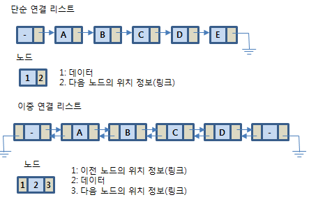

# 순차적 자료구조 : 연결 리스트 (Linked List) 기본 개념

 

>  참고 자료 : 《<a href="https://github.com/SangYoonLee1231/TIL/blob/main/DataStructure/data_structure_introduction.md">자료구조 소개</a>》 페이지 참고

 

## 연결 리스트란

* Node들이 link로 연결된 자료 구조이다.

 

* 연결 리스트는 값을 저장하는 각각의 공간이 메모리 상에 흩어져 있다.

  * 연속된 메모리 공간에 값을 저장하는 배열과 다름  

* 어떤 값의 다음 값을 알기 위해서, 한 공간에 값과 그 다음 값이 저장된 메모리의 주소를 같이 저장해야 한다.

* 값(data, key) + 다음 값의 주소(link) = 노드(Node)

* (반복) 연결 리스트란 Node들이 link로 연결된 자료 구조이다.

* 연결 방향에 따라 한방향 연결 리스트, 양방향 연결 리스트로 구분할 수 있다.

 

## 연결 리스트의 장단점 (vs 배열)

* 배열과 달리, 어떤 값에 접근 시 상수 시간 O(1) 내에 수행할 수 없다는 단점이 있다.

* 그러나 새로운 값을 중간에 삽입하는 과정은 배열보다 더 빨리 걸린다.

   
\<배열> &nbsp;&nbsp;&nbsp;&nbsp;&nbsp;&nbsp;&nbsp;&nbsp;&nbsp;&nbsp;&nbsp;&nbsp;&nbsp;&nbsp;&nbsp;&nbsp;&nbsp;&nbsp;&nbsp;&nbsp;&nbsp;&nbsp;&nbsp;&nbsp;&nbsp;&nbsp;&nbsp;&nbsp;&nbsp;&nbsp;&nbsp;&nbsp;&nbsp;&nbsp;&nbsp;&nbsp;&nbsp;&nbsp;&nbsp;&nbsp;&nbsp;&nbsp;&nbsp;&nbsp;&nbsp;&nbsp;&nbsp;&nbsp;&nbsp;&nbsp;&nbsp; \<연결 리스트>
