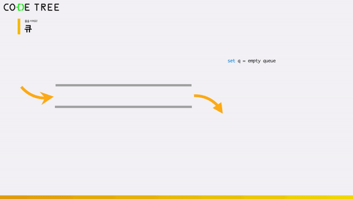
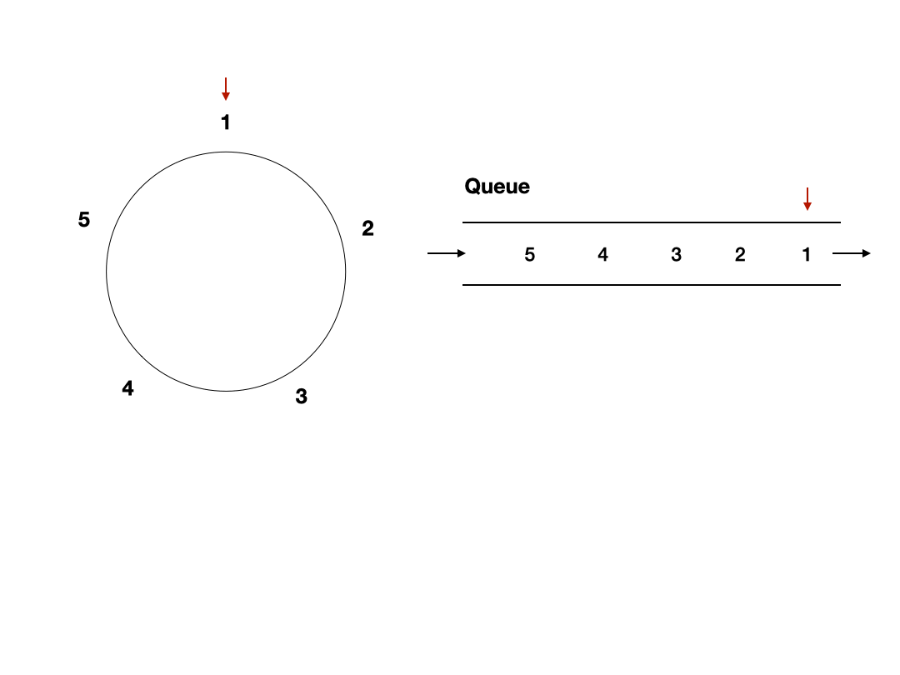

# 순차적 자료구조 : 큐 (Queue)

<br/>

> 참고 자료 : 《<a href="https://github.com/SangYoonLee1231/TIL/blob/main/DataStructure/data_structure_introduction.md">자료구조 소개</a>》 페이지 참고

<br/>

### 목차

- <a href="">큐 (Queue) 소개</a>
- <a href="">Queue 구현 (파이썬)</a>
- <a href="">Queue 연산 수행시간</a>
- <a href="">Queue 활용 예제</a>

<br/><br/>

## 큐 (Queue) 소개

- 1차원의 선형(linear) 자료구조로 Stack과 유사하다.

  

<br/>

- 그러나 Stack과 달리, 삽입하는 곳과 삭제하는 곳이 서로 반대쪽이다.

  - Stack은 '<strong>접시 쌓기</strong>', Queue는 '<strong>선착순</strong>'에 비유

<br/>

- 2가지 기본 연산을 제공한다. (다른 추가 연산도 제공)

  - 기본 연산 : <strong>enqueue(삽입), dequeue(삭제)</strong>

  - 추가 연산 : <strong>isEmpty, front, len</strong>

<br/>

- <strong>FIFO : First In First Out</strong>

  - 처음으로 들어온 요소가 제일 먼저 나간다.

    

<br/><br/>

## Queue 구현 (파이썬)

- 큐의 경우, 리스트의 맨 앞에서 요소를 삽입을 하고 맨 뒤에서 요소를 삭제를 하거나, 맨 뒤에서 삽입을 하고 맨 앞에서 삭제를 해야한다.

- 그럴 경우, <strong>삭제나 삽입 연산 시 모든 요소를 앞으로 당기거나 뒤로 미는 작업이 수반</strong>되므로, 수행 시간이 <code>O(n)</code>만큼 걸릴 수 밖에 없다.

- 이렇게 되면 큐를 사용하는 가치가 없어지기 때문에, <strong>리스트(나 배열)을 큐처럼 사용하긴 어렵다</strong>.

<br/>

- 대신, 모든 연산의 수행 시간이 <code>O(1)</code>밖애 걸리지 않는 <strong>연결 리스트</strong>를 활용하여 큐를 구현하면 이런 문제를 해결할 수 있다.

<br/>

### 연결 리스트를 이용한 구현

<br/>

### 리스트를 이용한 구현

- 큐는 삽입 및 삭제 연산의 수행시간이 <code>O(1)</code> 내로 동작해야 사용하는 의미가 있으므로 연결리스트를 활용하여 구현하는 것이 맞다.

- 그렇지만, 요소를 한 칸 씩 앞으로 당기거나 미는 작업을 하지 않게끔 구현한다면, <strong>리스트</strong>로도 두 연산의 수행시간을 <code>O(1)</code> 내 동작하게끔 할 수 있다.

<br/>

- Queue의 요소 개수를 구할 시, 2개의 index가 필요하다.

  - enqueue시 들어갈 위치 index, dequeue시 나갈 값의 위치 index

  ```python
  class Queue:
      def __init__(self):
          self.items = []
          self.front_index = 0

      def enqueue(self, val):
          self.items.append(val)

      def dequeue(self):
          if len(self.items) == 0 or self.front_index == len(self.items):
              print("Q is Empty")
          else:
              x = self.items[front_index]
              self.front_index += 1
              return x

      def front(self):  # 가장 앞에 저장된 값을 (삭제하지 않고) 리턴
          if len(self.items) == 0 or self.front_index == len(self.items):
              print("Q is Empty")
          else:
              return self.items[self.front_index]

      def __len__(self):
          return len(self.items) - self.front_index

  ```

  ```python
  Q = Queue()

  Q.enqueue(5)
  Q.enqueue(-2)
  Q.enqueue(10)

  print(Q.dequeue())
  print(Q.dequeue())
  print(Q.dequeue())
  print(Q.dequeue())
  ```

<br/><br/>

## Queue 연산 수행시간

- <code>enqueue</code>, <code>dequeue</code>, <code>front</code>, <code>len</code>, <code>isEmpty</code> : <strong>O(1)</strong>

<br/><br/>

## Queue 활용 예제

### <a href="https://www.acmicpc.net/problem/1158" target="_blank">Josephus Problem (백준 1158번)</a>

> 요세푸스가 되어서, N명이 포위당한 상황에, 계속해서 K번째 사람이 죽는다면, 몇 번 자리로 가야 살아남을 수 있을까?

- 이 문제처럼 자료구조가 추상적으로 원형처럼 연결되어 있고 이를 한 방향으로 계속 탐색하면서 얻는 데이터 순서는, 삭제한 데이터가 바로 다시 반대편으로 삽입되는 규칙을 가진 큐를 특점 지점에서 계속 관찰할 때 얻는 데이터 순서와 동일하다.



<br/><br/>

> 사진 출처 : https://galid1.tistory.com/483, <a href="https://www.codetree.ai/missions">Code Tree - Novice High</a>
