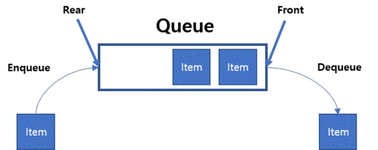

# 순차적 자료구조 : 큐

<br/>

>  참고 자료 : 《<a href="https://github.com/SangYoonLee1231/TIL/blob/main/DataStructure/data_structure_introduction.md">자료구조 소개</a>》 페이지 참고

<br/>

## 큐 (Queue) 소개

* 1차원의 선형(linear) 자료구조로 Stack과 유사하다.

* 그러나 Stack과 달리, 삽입하는 곳과 삭제하는 곳이 서로 반대쪽이다.

    * Stack은 '<strong>접시 쌓기</strong>', Queue는 '<strong>선착순</strong>'에 비유

* 2가지 기본 연산을 제공한다. (다른 추가 연산도 제공)

    * 기본 연산 : <strong>enqueue(삽입), dequeue(삭제)</strong>

    * 추가 연산 : <strong>isEmpty, front, len</strong>

* <strong>FIFO : First In First Out</strong>

    * 처음으로 들어온 요소가 제일 먼저 나간다.



<br/>

## Queue 구현 (파이썬)

* Queue의 요소 개수를 구할 시, 2개의 index가 필요

    * enqueue시 들어갈 위치 index, dequeue시 나갈 값의 위치 index

```python
class Queue:
    def __init__(self):
        self.items = []
        self.front_index = 0

    def enqueue(self, val):
        self.items.append(val)

    def dequeue(self):
        if len(self.items) == 0 or self.front_index == len(self.items):
            print("Q is Empty")
        else:
            x = self.items[front_index]
            self.front_index += 1
            return x

    def front(self):  # 가장 앞에 저장된 값을 (삭제하지 않고) 리턴
        if len(self.items) == 0 or self.front_index == len(self.items):
            print("Q is Empty")
        else:
            return self.items[self.front_index]

    def __len__(self):
        return len(self.items) - self.front_index

```
```python
Q = Queue()

Q.enqueue(5)
Q.enqueue(-2)
Q.enqueue(10)

print(Q.dequeue())
print(Q.dequeue())
print(Q.dequeue())
print(Q.dequeue())
```

<br/>

## Queue 연산 수행시간

* <code>enqueue</code>, <code>dequeue</code>, <code>front</code>, <code>len</code>, <code>isEmpty</code> : <strong>O(1)</strong>

<br/>

## Queue 활용 예제

* <a href="https://www.acmicpc.net/problem/1158" target="_blank">Josephus Problem (백준 1158번)</a>

<br/>

> 사진 출처 : https://galid1.tistory.com/483