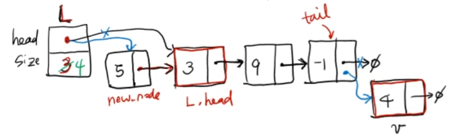
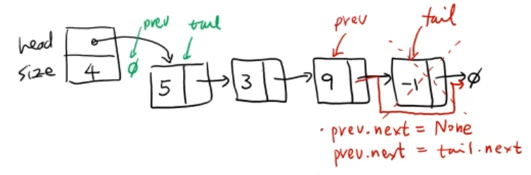

# 순차적 자료구조 : 단방향 연결 리스트 (Singly Linked List)

<br/>

>  참고 자료 : 《<a href="https://github.com/SangYoonLee1231/TIL/blob/main/DataStructure/data_structure_introduction.md">자료구조 소개</a>》 페이지 참고

<br/>

## 단방향 연결 리스트(Singly Linked List)란

* Node들이 <strong>한 쪽 방향으로만 연결된</strong> 연결 리스트이다.


* 가장 앞쪽에 있는 Node를 <strong>Head Node</strong>라 부르고, 가장 뒷쪽에 있는 Node를 <strong>Tail Node</strong>라 부른다.

* Node 1개의 구성 요소

    * 단방향 연결 리스트 : Node 1개 = key 1개, <strong>link 1개</strong> (+ 부가 데이터 value)
    
    * 양방향 연결 리스트 : Node 1개 = key 1개, <strong>link 2개</strong> (+ 부가 데이터 value)

<br/>

## 단방향 연결 리스트 구현

### Node 클래스 구현

```python
class Node:
    def __init__(self, key=None, value=None):
        self.key = key  # key값 저장
        self.next = None  # link 저장
        self.value = value  # value값 저장 (value 없으면 생략)

    def __str__(self):
        return str(self.key)
```

* <code>def \_\_str\_\_(self) </code><strong>함수를 생성하는 이유</strong>

    : v라는 Node가 있을 때, print(v.key)는 v의 key값을 출력하는 구문이다.  

    But, __str__함수를 만든다면, print(v), 즉 Node만을 매개변수로 입력해도 v의 key값을 출력할 수 있다.

    * <code>print(v) == print(v.\_\_str\_\_())</code>

```python
a = Node(3)
b = Node(9)
c = Node(-1)

a.next = b
b.next = c
# c.next = None 코드는 굳이 작성할 필요 X (이미 Node Class에 정의된 부분)
```

<br/>

### 단방향 연결 리스트 클래스와 삽입 연산 구현

* 삽입 연산 함수 2가지

    * <code>pushFront</code> : Head Node 앞에 새로운 Node를 삽입하는 함수

    * <code>pushBack</code> : Tail Node 다음에 새로운 Node를 삽입하는 함수

<br/>

&nbsp;&nbsp;&nbsp;&nbsp;&nbsp;&nbsp;&nbsp;


```python
class SignlyLinkedList:
    def __init__(self):
        self.head = None
        self.size = 0


    # Head Node 앞에 새로운 Node를 삽입하는 함수
    def pushFront(self, key):
        new_node = Node(key)    # 새 Node 생성
        new_node.next = self.head    # 현 Head Node 앞에 새 Node를 연결 (link에 Head 주소 저장)

        self.head = new_node    # Head Node를 새 Node로 업데이트
        self.size += 1    # 연결 리스트 크기 1 증가


    # Tail Node 다음에 새로운 Node를 삽입하는 함수
    def pushBack(self, key):
        v = Node(key)    # 새 Node 생성

        if len(self) == 0:
            # 연결 리스트에 Node가 0개인 상태이므로,
            # 새로 삽입되는 Node v는 Tail Node인 동시에 Head Node이다.

            # v.next = None (굳이 작성할 필요 없음)
            self.head = v

        else:
            # 연결 리스트에 Node가 있는 상태이므로,
            # Tail Node를 알기 위해선, Head부터 link를 따라 추적해야 한다.

            tail = self.head    # 우선, Tail Node의 link를 Head Node 주소로 설정
            while tail.next != None:
                tail = tail.next    # 그 후, link값이 None이 될 때까지 업데이트
            tail.next = v    # 찾은 Tail Node 다음에 v를 추가. 이제 v가 Tail Node이다.

        self.size += 1    # 연결 리스트 크기 1증가
```
```python
L = SinglyLinkedList()

L.pushFront(-1)   # -1 → ø
L.pushFront(9)   # 9 → -1 → ø
L.pushFront(3)   # 3 → 9 → -1 → ø
L.pushFront(5)   # 5 → 3 → 9 → -1 → ø

L.pushBack(4)   # 5 → 3 → 9 → -1 → 4 → ø
```

<br/>

### 삭제 연산 구현

* 삭제 연산 함수 2가지

    * <code>popFront</code> : Head Node를 삭제하고 그 key값을 리턴하는 함수

    * <code>popBack</code> : Tail Node를 삭제하고 그 key값을 리턴하는 함수

<br/>

&nbsp;&nbsp;&nbsp;&nbsp;&nbsp;&nbsp;&nbsp;


```python
    # Head Node를 식제하고 그 값을 리턴하는 함수
    def popFront(self):
        # Node를 지울 땐, 항상 Node가 존재하는지 확인해야 한다.

        if len(self) == 0:    # Node가 없을 때
            return None    # 삭제할 Node가 없으므로 아무것도 반환하지 않음

        else:    # 최소 하나 이상 Node 존재 시
            x = self.head    # x Node == Head Node
            key = x.key    # Head Node의 key값 저장 (반환하기 위함)
            self.head = x.next    # 연결 리스트의 head 수정
            self.size -= 1    # 연결 리스트의 size(크기) 수정
            del x    # Head 노드 객체 삭제
            return key    # 미리 저장해둔 key값 반환
```

<br/>

&nbsp;&nbsp;&nbsp;&nbsp;&nbsp;&nbsp;&nbsp;


```python

    def popBack(self):
        # Node를 지울 땐, 항상 Node가 존재하는지 확인해야 한다.

        if len(self) == 0:    # Node가 없을 때
            return None    # 삭제할 Node가 없으므로 아무것도 반환하지 않음

        else:    # 최소 하나 이상 Node 존재 시
            # running technique
            # : Previous Node와 Tail Node를 통시에 찾는 테크닉
            prev, tail = None, self.head

            while tail.next != None:
                prev = tail
                tail = tail.next
            if len(self) == 1:
                # 하나 남은 Node를 삭제하면 Node 개수 == 0이 되므로
                self.head = None    # 연결 리스트 head = None
            else:
                prev.next = tail.next # (OR prev.next = tail.next)
            key = tail.key    # Tail Node의 key값 저장 (반환하기 위함)
            del tail    # Tail Node 객체 삭제
            self.size -= 1    # 연결 리스트의 size(크기) 수정
            return key    # 미리 저장해둔 key값 반환
```
<br/>

### 탐색 연산 구현

* 탐색 연산 함수 : <code>search</code>

```python
def search(self, key):
    # key값의 Node를 리턴, 없으면 None을 리턴

    v = self.head
    while v != None:
        if v.key == key:
            return key;
        v = v.next
    return None    # OR return v (while 반복문 끝까지 갔으므로 v == None)
```

* <code>search</code> 함수 수행 시간: <strong>O(n) W.C.</strong>

<br/>

### 【for + in + 리스트】 구문으로 연결 리스트의 모든 Node 탐색하기

* <strong>Generator</strong>를 이용하면, while문 필요 없이 바로 아래 코드처럼 【for + in + 리스트】 반복 구문으로  

    연결 리스트의 모든 Node를 순차적으로 탐색할 수 있다.

```python
for x in L:
    print(x)
```

* 방법 : 한방향 연결리스트에 다음과 같은 <strong>특별한 Method</strong>를 선언한다.

```python
def __iterator__(self):
    v = self.head
    while v != None:
        yield v
        v = v.next
```

* Generator == yield가 있는 함수

<br/>

> 사진 출처 : https://ehclub.co.kr/1228 , <a href="https://youtu.be/kGZoEShMcSQ">신찬수 교수님 유튜브 강의</a>