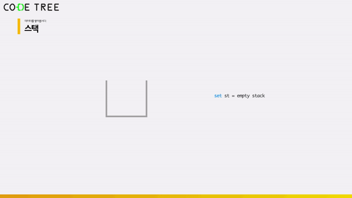
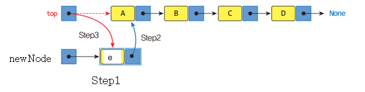
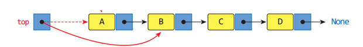
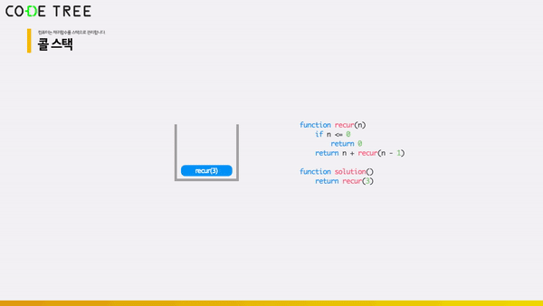

# 순차적 자료구조 : 스택 (Stack)

<br/>

> 참고 자료 : 《<a href="https://github.com/SangYoonLee1231/TIL/blob/main/DataStructure/data_structure_introduction.md">자료구조 소개</a>》 페이지 참고

<br/>

### 목차

- <a href="https://github.com/SangYoonLee1231/TIL/blob/main/DataStructure/stack.md#%EC%8A%A4%ED%83%9D-stack-%EC%86%8C%EA%B0%9C">스택 (Stack) 소개</a>
- <a href="https://github.com/SangYoonLee1231/TIL/blob/main/DataStructure/stack.md#stack-%EA%B5%AC%ED%98%84-%ED%8C%8C%EC%9D%B4%EC%8D%AC">Stack 구현 (파이썬)</a>
  - <a href="https://github.com/SangYoonLee1231/TIL/blob/main/DataStructure/stack.md#%EB%A6%AC%EC%8A%A4%ED%8A%B8%EB%B0%B0%EC%97%B4%EB%A1%9C-%EA%B5%AC%ED%98%84">리스트(배열)로 구현</a>
  - <a href="https://github.com/SangYoonLee1231/TIL/blob/main/DataStructure/stack.md#%EC%97%B0%EA%B2%B0-%EB%A6%AC%EC%8A%A4%ED%8A%B8%EB%A1%9C-%EA%B5%AC%ED%98%84">연결 리스트로 구현</a>
- <a href="https://github.com/SangYoonLee1231/TIL/blob/main/DataStructure/stack.md#stack-%EC%97%B0%EC%82%B0-%EC%88%98%ED%96%89%EC%8B%9C%EA%B0%84">Stack 연산 수행시간</a>
- <a href="https://github.com/SangYoonLee1231/TIL/blob/main/DataStructure/stack.md#stack-%ED%99%9C%EC%9A%A9-%EC%98%88%EC%A0%9C">Stack 활용 예제</a>

<br/><br/>

## 스택 (Stack) 소개

- <strong>가장 고전적인 자료구조</strong> 중 하나로 거의 모든 애플리케이션 개발에 사용된다.

- 1차원의 선형(linear) 자료구조이다.

  

<br/>

- 2가지 기본 연산을 제공한다. (다른 추가 연산도 제공)

  - 기본 연산 : <strong>push(삽입), pop(삭제)</strong>

  - 추가 연산 : <strong>top, isEmpty, size(len)</strong>

<br/>

- <strong>LIFO : Last In First Out</strong>

  - 마지막으로 들어온 요소가 제일 먼저 나간다.

    

<br/><br/>

## Stack 구현 (파이썬)

### 리스트(배열)로 구현

- 파이썬의 대표적인 자료구조인 <strong>리스트(List)</strong>를 Stack의 자료구조처럼 사용할 수 있다.

  - push 연산 (삽입) : <code>append</code> 함수 이용

  - pop 연산 (삭제) : <code>pop</code> 함수 이용

- 리스트에서 삽입과 삭제 연산이 발생하는 장소를 맨 뒤로만 제한한다면, <strong><code>O(1)</code> 시간</strong> 안에 두 연산을 수행할 수 있다.

<br/>

- ✨ <strong>Stack은 탐색 연산을 제공하지 않는다.</strong> 일반적인 탐색이 불가능한 자료구조이기 때문이다.  
  이는 Stack을 리스트로 구현하든 연결 리스트로 구현하든 마찬가지이다.  
  (Queue와 Deque도 마찬가지로 탐색이 불가능한 자료구조이다.)

<br/>

- But, <strong>리스트는 다른 강력한 연산들을 제공</strong>하기 때문에, 사용 도중 실수로 <code>append</code>, <code>pop</code> 외의 다른 함수를 사용해 내부값을 참고하고나 변경할 수 있다.

- 따라서, <strong>Stack은 Stack 클래스를 따로 만들어서 쓰고</strong>, 리스트는 내부에서 값을 저장하는 역할로만 쓴다.

  ```python
  class Stack:
      # 생성 함수 - 객체 생성시 자동으로 실행
      def __init__(self):
          self.items = []  # 데이터 저장을 위한 리스트 준비

      def push(self, val):
          self.items.append(val)

      def pop(self):
          try:  # pop할 아이템이 없으면
              return self.items.pop()
          except IndexError:  # IndexError 발생
              print("Stack is Empty")

      def top(self):
          try:
              return self.items[-1]
          except IndexError:
              print("Stack is Empty")

      def __len__(self):  # len()로 호출하면, Stack의 item 수를 반환
          return len(self.items)
  ```

  ```python
  S = Stack()  # S을 Stack의 객채로 사용

  S.push(10)  # S에 10을 push (삽입)  S = [10]
  S.push(12)  # S에 12을 push (삽입)  S = [10, 12]

  print(S.pop())  # S에서 마지막 값을 pop (삭제하고 return)  ☞  12가 출력  S = [10]
  print(S.top())  # S에서 마지막 값을 return (삭제 X)  ☞  10이 출력  S = [10]

  print(len(S))  # S의 요소의 개수 출력  ☞  1이 출력  S = [10]
  # len(S) == S.__len__()
  ```

<br/>

### 연결 리스트로 구현

- 리스트(배열) 대신 <strong>연결 리스트</strong>를 활용하여 스택을 구현해도 된다.

  - 모든 연산에 대한 시간 복잡도를 <code>O(1)</code>만큼 갖게 할 수 있기 때문

  <br/>

  

<br/>

- 삽입 연산 (<code>push</code>)

  

<br/>

- 삭제 연산 (<code>pop</code>)

  

<br/>

- 코드

  ```python
  class Node:
      def __init__(self, val):
          self.data = val
          self.link = None

  class LinkedStack:
      def __init__(self):
          self.top = None

      def isEmpty(self):
          return self.top == None

      def push(self, val):
          newNode = Node(val)
          newNode.link = self.top
          self.top = newNode

      def pop(self):
          if self.isEmpty == None:
              return "Empty"
          e = self.top.data
          self.top = self.top.link
          return e
  ```

<br/><br/>

## Stack 연산 수행시간

- <code>push</code>, <code>pop</code>, <code>top</code>, <code>len</code> : <strong>O(1)</strong>

  - list에서 요소의 개수를 계속 확인하고 그 값을 이미 저장하고 있기 때문에, len 함수도 O(1)만에 수행된다.

<br/><br/>

## Stack 활용 예제

### 이진수 변환

```python
s = Stack()

n = int(input())

while n != 0:
  s.push(n%2)
  n //= 2

while not s.isEmpty():
  digit = s.pop
  print(digit, end ="")
```

<br/>

### <a href="https://www.acmicpc.net/problem/9012" target="_blank">괄호 맞추기 (백준 9012번)</a>

> 1. 오른쪽과 왼쪽 괄호로만 이루어진 문자열을 입력으로 받고 ☞ ex) ()(()))
> 2. '괄호쌍이 모두 맞춰졌는가'에 따라 True/False 결과값을 출력하는 문제 ☞ ex) True

- 예시

  </a>

<br/>

### 계산기 문제

> 1. 수식의 문자열을 입력으로 받아서 ☞ ex) "2+3\*5"
> 2. 피연산자와 연산자로 문자열을 분리한 후 ☞ ex) '2' '+' '3' '\*' '5'
> 3. '연산자의 우선순위'에 따라 차례대로 계산하여 ☞ ex) (2+(3\*5))
> 4. 최종 결과값을 출력하는 문제 ☞ ex) 17

<br/>

### 재귀와 콜 스택

- <strong>재귀 함수가 동작하는 방식에 스택이 활용된다.</strong>

- 함수의 실행 과정을 저장하기 위해 사용하는 스택을 <strong>콜 스택</strong>이라 한다.

  - ✨ 재귀 함수가 내부에서 자기 자신을 호출 하면, 콜 스택에 실행 지점을 저장하고 호출한 새 재귀 함수를 실행한다.

  - ✨ 호출한 함수가 종료 시, 콜 스택을 pop하여 이전 위치로 돌아간다.

  - 즉, 제일 마지막에 저장했던 복귀 지점을 가장 먼저 실행해야 하므로, 함수 중간 지점을 저장하는 자료구조는 스택이 되어야 한다.

<br/>

- <strong>콜 스택 작동 과정 예시</strong>

  </a>

  </a>

<br/><br/>

> 사진 출처 : 『자료구조』 학부 수업 자료, http://www.incodom.kr/%EC%8A%A4%ED%83%9D, <a href="https://www.codetree.ai/missions">Code Tree - Novice High</a> (사진 자료 사용 허락 받음)
