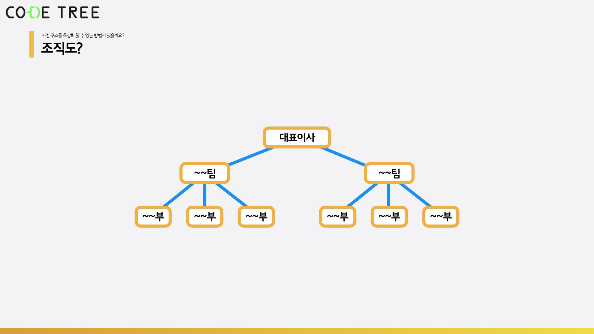
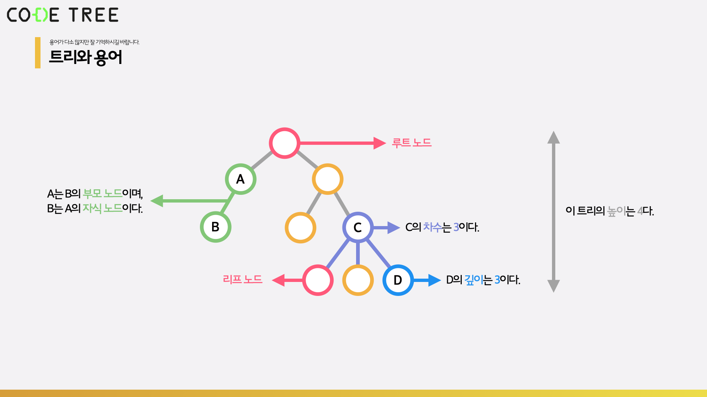
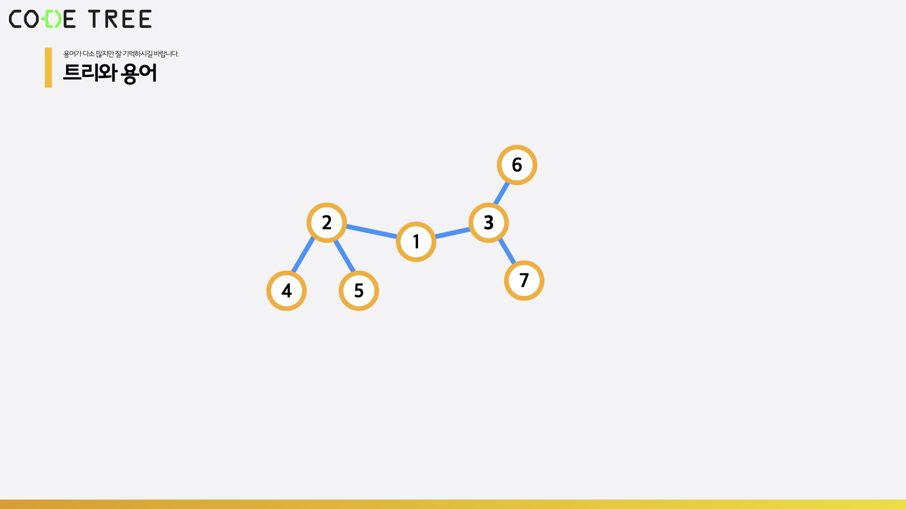
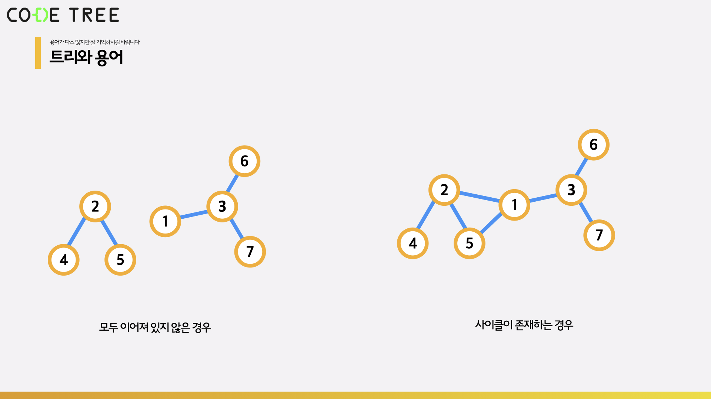

# 트리 기본 개념

 

> 참고 자료 : 《<a href="https://github.com/SangYoonLee1231/TIL/blob/main/DataStructure/data_structure_introduction.md">자료구조 소개</a>》 페이지 참고

 

### 목차

- <a href="https://github.com/SangYoonLee1231/TIL/blob/main/DataStructure/tree_basic.md#%ED%8A%B8%EB%A6%AC-tree-%EB%9E%80">트리 (Tree) 란?</a>
- <a href="https://github.com/SangYoonLee1231/TIL/blob/main/DataStructure/tree_basic.md#-%ED%8A%B8%EB%A6%AC-%EC%9A%A9%EC%96%B4-%EC%A0%95%EB%A6%AC">트리 용어 정리</a>
- <a href="https://github.com/SangYoonLee1231/TIL/blob/main/DataStructure/tree_basic.md#%ED%8A%B8%EB%A6%AC%EC%9D%B8-%EA%B2%BD%EC%9A%B0">트리인 경우</a>
  - <a href="https://github.com/SangYoonLee1231/TIL/blob/main/DataStructure/tree_basic.md#unrooted-tree">Unrooted Tree</a>
  - <a href="https://github.com/SangYoonLee1231/TIL/blob/main/DataStructure/tree_basic.md#%EB%A3%A8%ED%8A%B8-%EB%85%B8%EB%93%9C%EB%8A%94-%EC%A0%95%ED%95%98%EA%B8%B0-%EB%82%98%EB%A6%84">루트 노드는 정하기 나름</a>
  - <a href="https://github.com/SangYoonLee1231/TIL/blob/main/DataStructure/tree_basic.md#%ED%8A%B8%EB%A6%AC%EA%B0%80-%EC%95%84%EB%8B%8C-%EA%B2%BD%EC%9A%B0">트리가 아닌 경우</a>
- <a href="https://github.com/SangYoonLee1231/TIL/blob/main/DataStructure/tree_basic.md#%ED%8A%B8%EB%A6%AC%EC%9D%98-%EC%A2%85%EB%A5%98">트리의 종류</a>

  

## 트리 (Tree) 란?

- <strong>부모 - 자식 간의 관계</strong>에 따라 자료를 구성하는 자료구조이다.

- 나무를 180도 돌려서 보면, <strong>커다란 기둥에 가지가 아래로 계속 뻗어나오는 모양</strong>이다. 그렇기에 우리는 이 구조를 <strong>트리 구조</strong>라 부른다.

  

 

- 순서에 따라 자료가 저장되는 순차적 자료구조와 다른 개념이다.

- 연결 리스트 (Linked List) 는 자식 노드가 0개 또는 1개인, 특별한 케이스의 트리로 볼 수 있다.

 

  

## ✨ 트리 용어 정리

  

   

- <strong>노드 (Node) or 정점</strong>

- <strong>링크 (Link) or 에지 (Edge) or 간선</strong> : 부모 노드와 자식 노드를 잇는 연결 고리

- <strong>루트 노드 (Root Node)</strong> : 맨 꼭대기에 있는, 모든 노드의 조상이 되는 노드

- <strong>리프 노드 (Leaf Node)</strong> : 자식이 없는 노드

 

- <strong>부모 노드 (Parent Node)</strong> : 자신과 하나의 링크로 연결된, 바로 윗 레벨에 있는 노드

- <strong>자식 노드 (Child Node)</strong> : 자신과 하나의 링크로 연결된, 바로 아래 레벨에 있는 노드

- <strong>형제 노드</strong> : 자신과 같은 세대에 있는 노드. 서로 레벨값이 동일하다.

 

- <strong>차수</strong> : 특정 노드를 기준, 자식 노드의 개수

 

- <strong>레벨 (Level)</strong> : 루트 노드를 레벨 1으로 두고 한 세대씩 내려가면서 1씩 증가하는 수치. 노드 개수가 기준이다.

- <strong>깊이 (Depth)</strong> : 루트 노드를 레벨 0으로 두고 한 세대씩 내려가면서 1씩 증가하는 수치. 간선 개수가 기준이다.

- <strong>높이 (Height)</strong> : 레벨과 반대로 리프 노드를 0으로 두고 한 세대씩 올라가면서 1씩 증가하는 수치

 

- <strong>경로 (Path)</strong> : 어떤 두 노드 사이를 연결하는 노드의 순서

  - ex) 3 → 2 → 7 → 8 → 12 : 노드 3 → 12로 가는 경로

- <strong>경로 길이 (Path Length)</strong> : 경로의 애지 개수

  - ex) 경로 3 → 2 → 7 → 8 → 12 : 경로 길이 = 4

 

    트리의 레벨 (Level) 개념이 조금 헷갈린다. 교수님은 루트 노드의 레벨을 0으로 두고 설명하시는데, 막상 검색으로 찾아보니 거의 모든 블로그가 루트 노드의 레벨을 1로 설명한다.

    높이 (Height) 에서 리프 노드의 레벨을 1로 두고 설명하는 경우도 있다. 정의하기 나름인 것 같다.

  

## 트리인 경우

### Unrooted Tree

- <strong>트리의 원래 정의</strong>는 정점(Node)끼리 전부 연결되어 있으면서 사이클이 존재하지 않는 그래프이다.

- 따라서, 다음과 같이 <strong>부모 - 자식 관계가 정의되지 않은 경우</strong>도 <strong>트리</strong>라고 부른다. 이를 <strong>Unrooted Tree</strong>라 한다.

  

 

### 루트 노드는 정하기 나름

- <strong>Rooted Tree</strong>에서 루트 노드는 <strong>정하기 나름이다.</strong>

- 같은 트리라도 1번 노드를 루트로 정할지, 2번 트리로 정할지에 따라 그리는 모양이 달라진다.

  

- 정해진 이후부터 부모, 자식, 차수가 정의된다.

 

### 트리가 아닌 경우

- Node끼리 모두 이어져 있지 않은 경우, 순환 구조(사이클)이 존재하는 경우

  

  

## 트리의 종류

- 이진 트리

- 이진 탐색 트리

- 힙

  

> 사진 출처 : <a href="https://youtu.be/w-1w4ood7Bc">신찬수 교수님 유튜브 강의</a>, <a href="https://www.codetree.ai/missions">Code Tree - Novice High</a>
