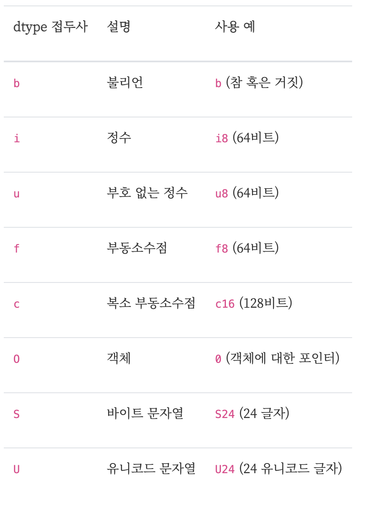
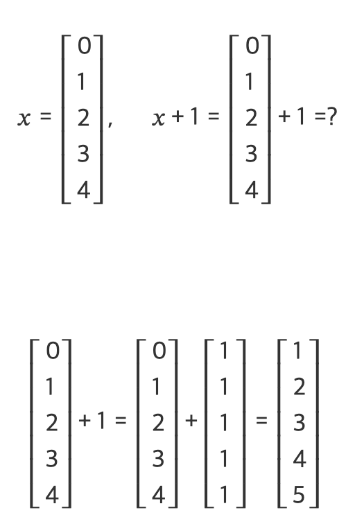

# Numpy 배열 기초

<br/>

> 참고 자료 : <a href="https://datascienceschool.net/intro.html">데이터 사이언스 스쿨</a>

<br/><br/>

### 목차

- <a href="">Numpy 배열이란?</a>
- <a href="">벡터화 연산</a>
- <a href="">2차원 배열</a>
- <a href="">배열의 차원과 크기 (shape, ndim)</a>
- <a href="">배열의 인덱싱과 슬라이싱</a>
- <a href="">팬시 인덱싱 (Fancy Indexing)</a>
- <a href="">Numpy의 자료형 (dtype)</a>
- <a href="">Inf와 NaN</a>
- <a href="">브로드캐스팅 (Broadcasting)</a>

<br/><br/>

### Numpy 배열이란?

- 넘파이(Numpy)는 파이썬에서 C언어의 배열을 쓸 수 있도록 지원해주는 표준 패키지이다.

- 배열은 리스트와 다음과 같은 차이점이 존재한다.

  - 모든 요소의 자료형이 통일되어야 한다.

  - 원소의 갯수를 바꿀 수 없다.

- 대신, 배열은 리스트에 비해 속도가 빠르며, 백터와 연산을 통해 복잡한 선형 대수 연산을 수행할 수 있다.

  ```python
  import numpy as np
  ar = np.array([0, 1, 2, 3, 4, 5])

  ar

  `array([0, 1, 2, 3, 4, 5])`

  type(ar)

  `numpy.ndarray`
  ```

<br/>

- 넘파이의 `array`함수에 리스트를 넣으면 `ndarray`클래스 객체 즉, 배열로 변환해 준다.

- 이 때 ndarray는 N-dimensional Array의 약자이다. 말 그대로 n차원 배열 자료구조를 지원한다.

<br/><br/>

### 벡터화 연산

- Numpy 배열은 각 원소에 대한 반복 연산을 하나의 명령어로 처리한다.
- 즉, 반복문을 사용하지 않고도 배열의 모든 원소에 반복 연산을 할 수 있다.

  ```python
  ar * 2
  `array([ 0,  2,  4,  6,  8, 10])`
  ```

- 벡터화 연산은 모든 수학 연산에 대해 적용된다.

  ```python
  a = np.array([1,2,3])
  b = np.array([10,20,30])

  a + b
  `array([11, 22, 33])`

  a == b
  `array([False, False, False])`

  np.all(a == b)  # 배열의 모든 원소가 전부 같은지 확인
  `False`

  10 ** a
  `array([  10,  100, 1000])`
  ```

<br/><br/>

### 2차원 배열

- 2차원 배열을 행렬(matrix)이라 한다. (선형대수에서 배우는 그 행렬 맞다.)

  - 가로 줄 : 행(row)
  - 세로 줄 : 열(col)

  ```python
  c = np.array([[0,1,2], [3,4,5]])  # 2 x 3 행렬
  c
  `array([[0, 1, 2],
      [3, 4, 5]])`

  행의 개수 : len(c)

  열의 개수 : len(c[0])
  ```

<br/><br/>

### 배열의 차원과 크기 (shape, ndim)

- 배열의 ndim 속성은 배열의 차원을 반환하고, 배열의 shape 속성은 배열의 크기를 반환한다.

  ```python
  matrix = np.array([[10,20,30,40],[50,60,70,80]])
  matrix
  `array([[10, 20, 30, 40],
      [50, 60, 70, 80]])`

  matrix.ndim
  `2`

  matrix.shape
  `(2, 4)`
  ```

<br/><br/>

### 배열의 인덱싱과 슬라이싱

```python
matrix = np.array([[10,20,30,40],[50,60,70,80]])
matrix
`array([[10, 20, 30, 40],
       [50, 60, 70, 80]])`

# 인덱싱
matrix[0][1]
`20`

matrix[0, 1]
`20`

matrix[-1, 2]
`70`

# 슬라이싱
matrix[:, 1]
`array([20, 60])`

matrix[0, :]
`array([10, 20, 30, 40])`

matrix[:2, 1]
`array([20, 60])`

matrix[1, :2]
`array([50, 60])`

matrix[1:, :2]
`array([[50, 60]])`
```

<br/><br/>

### 팬시 인덱싱 (Fancy Indexing)

- Numpy 배열의 강력한 기능이다.

- 대괄호(Bracket, [])안의 인덱스 정보로 숫자나 슬라이스가 아니라 위치 정보를 나타내는 또 다른 `ndarray` 배열을 받을 수 있다.

- 두 가지 방식이 있다.

  1. 불리언 배열 인덱싱 방식

     : 인덱스 정보로 True, False 두 값으로만 구성된 인덱스 배열 제공

     (배열의 크기 = 인덱스 배열 크기)

  ```python
  d = np.array([0, 1, 2, 3, 4, 5, 6, 7, 8, 9])

  d_idx = np.array([True, False, True, False, True, False, True, False, True, False])

  d[d_idx]
  `array([0, 2, 4, 6, 8])`

  # 조건문을 사용하여 간단하게 인덱스 정보 제공
  d % 2
  `array([0, 1, 0, 1, 0, 1, 0, 1, 0, 1])`

  d % 2 == 0
  `array([ True, False,  True, False,  True, False,  True, False,  True,
         False])`

  d[d % 2 == 0]
  `array([0, 2, 4, 6, 8])`
  ```

  1. 정수 배열 인덱싱 방식

     : 인덱스 정보로 정수 값으로 구성된 인덱스 배열 제공

     → 정수는 배열의 위치를 가리키는 인덱스 값

     (배열의 크기 ≠ 인덱스 배열의 크기)

  ```python
  d = np.array([0, 1, 2, 3, 4, 5, 6, 7, 8, 9])

  d_idx = np.array([0, 2, 4, 6, 8])

  d[d_idx]
  `array([0, 2, 4, 6, 8])`
  ```

- 배열 인덱싱은 다차원 배열에서도 적용 가능하다.

  ```python
  a = np.array([[1, 2, 3, 4], [5, 6, 7, 8], [9, 10, 11, 12]])
  a
  `array([[ 1,  2,  3,  4],
         [ 5,  6,  7,  8],
         [ 9, 10, 11, 12]])`

  # 불리언 배열 인덱싱
  a[:, [True, False, False, True]]
  `array([[ 1,  4],
         [ 5,  8],
         [ 9, 12]])`

  # 정수 배열 인덱싱
  a[[2, 0, 1], :]
  array([[ 9, 10, 11, 12],
         [ 1,  2,  3,  4],
         [ 5,  6,  7,  8]])
  ```

<br/><br/>

### Numpy의 자료형 (dtype)

- dtype은 numpy 배열(ndarray 클래스)의 각 원소의 자료형을 지정하는 명령이다.

- 만일 dtype을 처음에 지정해주지 않으면 스스로 유추해서 자료형을 판단한다.

- dtype 속성을 확인하면 numpy 배열의 자료형을 알 수 있다.

  ```python
  d = np.array([0, 1, 2, 3, 4, 5, 6, 7, 8, 9])

  d.dtype
  `dtype('int64')`

  e = np.array([1.0, 2.0, 3.0, 4.0, 5.0], dtype="i8")

  e.dtype
  `dtype('int64')`

  e[1]
  `2`
  ```

- dtype 접두사 정리

  

<br/><br/>

### Inf와 NaN

- np.inf = 무한대

  - ex) `np.array([1]) / np.array([0])` → `np([inf])`

  - ex2) `np.exp(-np.inf)` → `0.0`

    (`np.exp`는 각 요소에 자연상수를 밑으로 하는 지수함수 값을 반환)

- np.nan (not a number) = 숫자가 아님

  - ex) `np.array([0]) / np.array([0])` → `np([nan])`

<br/><br/>

### 브로드캐스팅 (Broadcasting)

- 서로 크기가 다른 두 배열간의 연산을 지원하는 기능

- 크기가 작은 배열을 자동으로 확장하여 크기가 더 큰 배열에 맞춘다.

<br/>

<div align="center">




</div>

<br/>
