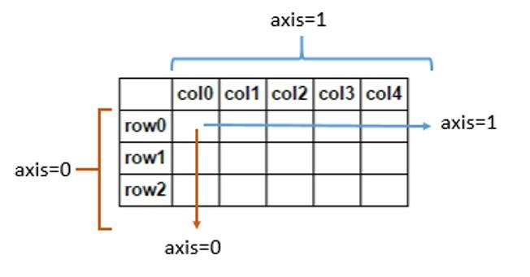

# Numpy 배열 기초 Part 2

<br/>

> 참고 자료 : <a href="https://datascienceschool.net/intro.html">데이터 사이언스 스쿨</a>

<br/><br/>

### 목차

- <a href="https://github.com/SangYoonLee1231/TIL/blob/main/Data_Science/numpy_2.md#%EB%B0%B0%EC%97%B4-%EC%83%9D%EC%84%B1-%EA%B4%80%EB%A0%A8-%EB%AA%85%EB%A0%B9%EC%96%B4">배열 생성 관련 명령어</a>
- <a href="https://github.com/SangYoonLee1231/TIL/blob/main/Data_Science/numpy_2.md#%EC%B0%A8%EC%9B%90-%EC%B6%95%EC%86%8C-%EC%97%B0%EC%82%B0">차원 축소 연산</a>
- <a href="https://github.com/SangYoonLee1231/TIL/blob/main/Data_Science/numpy_2.md#%EC%A0%95%EB%A0%AC-sort">정렬 (sort)</a>
- <a href="https://github.com/SangYoonLee1231/TIL/blob/main/Data_Science/numpy_2.md#%EA%B8%B0%EC%88%A0-%ED%86%B5%EA%B3%84-%EA%B4%80%EB%A0%A8-%EB%AA%85%EB%A0%B9%EC%96%B4">기술 통계 관련 명령어</a>
- <a href="https://github.com/SangYoonLee1231/TIL/blob/main/Data_Science/numpy_2.md#%EB%82%9C%EC%88%98-%EB%B0%9C%EC%83%9D%EA%B3%BC-%EC%B9%B4%EC%9A%B4%ED%8C%85-%EA%B4%80%EB%A0%A8-%EB%AA%85%EB%A0%B9%EC%96%B4">난수 발생과 카운팅 관련 명령어</a>
<!-- - <a href=""></a> -->

<br/><br/>

### 배열 생성 관련 명령어

- `zeros` : 모든 원소를 0으로 초기화

- `ones` : 모든 원소를 1로 초기화

- `zeros_like, ones_like` : 모든 원소를 0 또는 1로 초기화하되, 배열 크기는 인자로 준 배열의 크기를 따름
- `empty` : 원소를 초기화하지 않고 선언만 진행
- `arange` : range의 numpy 버전, 규칙에 따라 만들어진 수열을 배열로 생성
- `linspace, logspace (시작점, 끝점, 분할개수)` : 선형 구간 혹은 로그 구간을 지정한 구간 수만큼 분할한다.

- `T (전치 연산)` : 배열의 행과 열을 뒤집는다. (내부 데이터는 유지)
- `reshape : 배열의 형태를 바꾼다. (행과 열 변환, 내부 데이터는 유지)
- `flatten, ravel` : 다차원 배열을 1차원으로 변환한다.
- `newaxis` : 배열에 대해 차원만 하나 증가시킨다.
- `hstack` : 행이 같은 두 배열을 옆으로 연결하여 하나의 배열로 합친다. (r\_ : 대괄호 사용)
- `vstack` : 열이 같은 두 배열을 위아래로 연결하여 하나의 배열로 합친다.
- `dstack` : 행이나 열이 아닌 깊이(depth) 방향으로 두 배열을 합친다.
- `stack` : 사용자가 지정한 차원(축, axis)로 두 배열을 연결한다. (default axis = 0)
- `tile` : 동일한 배열을 반복하여 연결
- `meshgrid` : 2차원 그리드 포인트 생성을 도와준다.

<br/><br/>

### 차원 축소 연산

- 다차원 배열을 축소하는 연산

  - 예 : 2차원 배열의 각 행마다 평균을 구하면 각 행마다 하나의 숫자가 나오게 되고, 이를 묶으면 1열짜리 1차원 벡터가 나오게 된다.

<br/>

- 차원 축소 연산 종류

  - `min` : 최솟값

  - `max` : 최댓값

  - `argmin` : 최솟값의 위치
  - `argmax` : 최댓값의 위치
  - `mean` : 평균
  - `median` : 중간값 (중앙값)

    - 홀수 개수 = 가운데 값, 짝수 개수 = 가운데 2개 값 평균

  - `all` : 불리언이 담긴 numpy 배열의 모든 원소에 대해 AND 연산

  - `any` : 불리언이 담긴 numpy 배열의 모든 원소에 대해 OR 연산

<br/>

- 연산의 대상이 2차원 이상인 경우 axis 인수를 사용하여 어느 차원으로 계산할 지 지시한다.

  - `axis = 0` : 열 연산, 계산 후 1행만 남음 (Default 값)

  - `axis = 1` : 행 연산, 계산 후 1열만 남음 → 실제 계산 결과는 1차원(행) 벡터

    

<br/><br/>

### 정렬 (sort)

```python
a = np.array([[4,  3,  5,  7],
              [1, 12, 11,  9],
              [2, 15,  1, 14]])

a
`array([[ 4,  3,  5,  7],
       [ 1, 12, 11,  9],
       [ 2, 15,  1, 14]])`

np.sort(a)  # axis=-1 또는 axis=1 과 동일
`array([[ 3,  4,  5,  7],
       [ 1,  9, 11, 12],
       [ 1,  2, 14, 15]])`

np.sort(a, axis=0)
`array([[ 1,  3,  1,  7],
       [ 2, 12,  5,  9],
       [ 4, 15, 11, 14]])`

a.sort(axis=1)
a
`array([[ 3,  4,  5,  7],
       [ 1,  9, 11, 12],
       [ 1,  2, 14, 15]])`
```

<br/>

- `argsort` : 자료를 정렬하진 않고, 크기 순서만을 알려주는 명령어

```python
a = np.array([42, 38, 12, 25])
j = np.argsort(a)

j
`array([2, 3, 1, 0])`

a[j]
`array([12, 25, 38, 42])`
```

<br/><br/>

### 기술 통계 관련 명령어

- 데이터의 개수(count) : `len(x)`

- 표본 평균(sample average, sample mean) : `np.mean(x)`

- 표본 분산(sample variance) : `np.var(x)`

  - ‘데이터와 표본 평균간의 거리의 제곱’의 평균

- 표본 표준편차(sample standard variance) : `np.std(x)`

  - 표본 분산의 양의 제곱근 값

- 최댓값(maximum) : `np.max(x)`

- 최솟값(minimum) : `np.min(x)`

- 중앙값(median) : `np.median(x)`

  - 데이터를 크기대로 정렬하였을 때 가장 가운데에 있는 수

  - 만약 데이터의 수가 짝수이면, 가장 가운데에 있는 두 수의 평균을 사용

- 사분위수(quartile) : `np.percentile(x, 0)`

  - 데이터를 가장 작은 수부터 가장 큰 수까지 크기가 커지는 순서대로 정렬하였을 때 1/4, 2/4, 3/4 위치에 있는 수

    - `np.percentile(x, 0)  *# 최소값*`
    - `np.percentile(x, 25)  *# 1사분위 수*`
    - `np.percentile(x, 50)  *# 2사분위 수*`
    - `np.percentile(x, 75)  *# 3사분위 수*`
    - `np.percentile(x, 100)  *# 최댓값*`

<br/><br/>

### 난수 발생과 카운팅 관련 명령어

-

<br/>
