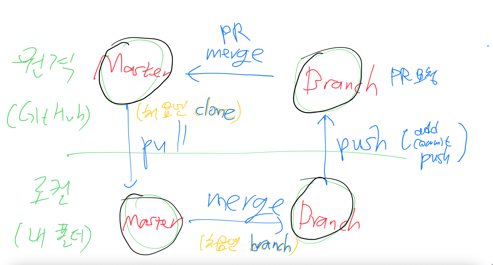

# 깃으로 Branch (브랜치) 생성하여 협업하기

> 참고 자료 : 부트캠프 학습 자료

<br/>

### 목차

- <a href="https://github.com/SangYoonLee1231/TIL/blob/main/Git/git_branch.md#%EB%B8%8C%EB%9E%9C%EC%B9%98-branch-%EB%9E%80">브랜치 (Branch) 란?</a>
- <a href="https://github.com/SangYoonLee1231/TIL/blob/main/Git/git_branch.md#%EB%B8%8C%EB%9E%9C%EC%B9%98%EB%A5%BC-%EC%83%9D%EC%84%B1%ED%95%98%EC%97%AC-%ED%98%91%EC%97%85%ED%95%98%EB%8A%94-%EB%B0%A9%EC%8B%9D">브랜치를 생성하여 협업하는 방식</a>
- <a href="https://github.com/SangYoonLee1231/TIL/blob/main/Git/git_branch.md#%EA%B9%83-%EB%AA%85%EB%A0%B9%EC%96%B4">깃 명령어</a>

<br/><br/>

## 브랜치 (Branch) 란?

- 브랜치란 깃의 하나의 Repository 내에서 특정한 작업을 진행하기 위해 독립적으로 만들어진 공간이다.

- 각각의 브랜치는 서로에게 영향을 주지 않기 때문에, 한 프로젝트 내에서 여러 작업을 동시에 진행할 수 있다.

<br/>

- 저장소 (Repository) 를 처음 생성 시, Git에서 'master' (혹은 'main') 브랜치가 만들어진다.

- 다른 브랜치를 생성하지 않으면, 깃에서 이루어지는 모든 작업(commit 등)은 master 브랜치에서 이루어진다.

<br/><br/>

## 브랜치를 생성하여 협업하는 방식

- 여러 명이서 협업을 진행할 때, 우선 master (메인) 브랜치에서 작업 전용 브랜치를 여러개 생성한다.

- 각각의 브랜치에서 서로 작업을 진행하고, 작업이 끝난 사람은 메인 브랜치에 자신의 브랜치의 변경사항을 적용한다.

- 다른 사람에 의해 업데이트 된 (원격 저장소의) 메인 브랜치를 자신(로컬 저장소)의 브랜치로 <code>pull</code>, <code>merge</code> 할 수 있다.

<br/>

### 코드가 순회하는 매커니즘



- 여기서 origin(원격 저장소)이 **upstream**, local(로컬 저장소)가 **downstream**이다.

- <a href="https://drive.google.com/file/d/18U6CgRbT8qO73DV-UBeJVka14mdKKRvy/view?usp=share_link">참고 자료 (Private 용)</a>

<br/><br/>

## 깃 명령어

- 원격 저장소 (깃허브 레포지토리) 에서 로컬 저장소로 파일 그대로 가져오기

  ```
  git clone [원격 저장소 주소]
  ```

- 브랜치 생성하기 (반드시 master 브랜치에서 진행해야 한다)

  ```
  git branch [새 브랜치 이름]
  ```

- 현재 브랜치 확인

  ```
  git branch
  ```

- 다른 브랜치로 이동하기

  ```
  git checkout [이동할 브랜치 이름]
  ```

- 브랜치 생성과 동시에 이동하기

  ```
  git checkout -b [생성 및 이동할 브랜치 이름]
  ```

- 원격 저장소에 있는 코드를 로컬 저장소로 가져오기

  ```
  git pull origin [가져올 코드의 해당 브랜치 이름 (주로 master)]
  ```

- 코드 병합하기 : 로컬 저장소에서 현재 브랜치의 코드와 다른 브랜치의 코드를 합칠 때 사용

  ```
  git merge [다른 브렌치의 이름 (주로 master)]
  ```

- 브랜치 삭제하기

  ```
  git branch -d [삭제할 브랜치 이름]
  ```

<br/><br/>

## 혐업 시 브랜치 관리 원칙

### 1. 기능 단워로 브랜치를 생성한 후 작업한다.

- 개발하고자 하는 기능에 따라 feature/[기능] 브랜치를 생성한다.

- 기능 단위로 브랜치를 생성하여 작업을 진행하면, 독립적인 공간에서 여러 개발자가 동시에 다양한 기능을 작업할 수 있다.

- 기능별로 브랜치를 나눠 작업한 뒤, 작업 완료 시 master 브랜치에 병합하는 방식으로 협업을 진행한다.

<br/>

### 2. 브랜치는 작은 단위로 나누어서 관리한다.

- 브랜치는 작은 단위로 나누어서 관리하고 병합하는 과정을 거치는 것이 좋다.

- 만일 하나의 브랜치에서 너무 많은 작업이 이루어지면, 브랜치에서 어떤 목적을 가지고 작업이 이루어졌는지 파악하기 힘들어진다. 또한 브랜치의 작업 내용을 함께 확인하고 검토할 팀원들에게도 부담이 커진다.

- 또한, 하나의 브랜치에서 과도한 작업이 진행되면, 이를 master 브랜치에 병합하는 과정에서 다른 브랜치와의 작업 이력이 겹쳐 발생하는 충돌 (Conflict) 이 대규모로 발생한다.

- 이는 곧 브랜치 병합의 어려움을 야기하고, Git을 활용한 작업 방식을 제대로 활용할 수 없게 만든다.

<br/>

### 3. feature 브랜치에서 또 다른 브랜치를 생성하지 않는다.

- git의 모든 명령어는 현재 내가 위치하고 있는 브랜치를 기준으로 동작한다.

- 브랜치 생성도 이와 마찬가지이며, 새 브랜치 생성시 내가 위치한 브랜치의 모든 커밋(작업 내역)을 가진 상태로 새 브랜치가 생성된다.

- 만일 feature 브랜치에서 또 다른 feature 브랜치를 생성한다면, master 브랜치에 있는 작업 내용이 기준이 아닌, 생성하는 시점에 위치했던 feature 브랜치가 가준이 되므로, 의도치 않은 작업 내역이 새 브랜치에 포함될 위험이 생긴다.

- 이는 브랜치마다 독립적인 기능을 작업하는 방식에도 부합하지 않으며, 추후 master 병합 과정 시 충돌이 발생할 가능성이 높아지게 된다.

- 따라서, 명백히 의도하는 경우가 아니라면, 새 브랜치는 항상 master 브랜치를 기준으로 생성해야 한다.
