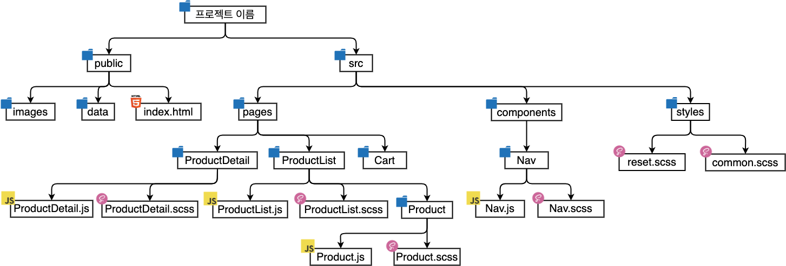

# Git - (CRA 없이) 개인 프로젝트 직접 세팅하기

> 참고 자료 : 부트캠프 및 온라인 교육 학습 자료

<br/>

### 목차

- 패키지 설치 + 설정 순서

  - <a href="https://github.com/SangYoonLee1231/TIL/blob/main/Git/git_project_setting_personal.md#npm-%EC%B4%88%EA%B8%B0%ED%99%94">NPM 초기화</a>
  - <a href="https://github.com/SangYoonLee1231/TIL/blob/main/Git/git_project_setting_personal.md#react-%EC%84%A4%EC%B9%98--router-%EC%84%A4%EC%B9%98">React 설치 (+ Router 설치)</a>
  - <a href="https://github.com/SangYoonLee1231/TIL/blob/main/Git/git_project_setting_personal.md#%EC%8A%A4%ED%83%80%EC%9D%BC%EB%A7%81-%ED%8C%A8%ED%82%A4%EC%A7%80-%EC%84%A4%EC%B9%98">스타일링 패키지 설치</a> (SASS or styled-components)
  - <a href="https://github.com/SangYoonLee1231/TIL/blob/main/Git/git_project_setting_personal.md#eslint--prettier--stylelint-%EC%B6%94%EC%B2%9C-%EC%84%B8%ED%8C%85">ESLint / Prettier / Stylelint 추천 세팅</a>
  - <a href="https://github.com/SangYoonLee1231/TIL/blob/main/Git/git_project_setting_personal.md#%ED%8F%B4%EB%8D%94-%EA%B5%AC%EC%A1%B0-%EC%83%9D%EC%84%B1-%ED%8F%B4%EB%8D%94-%EB%B0%8F-%ED%8C%8C%EC%9D%BC-%EA%B5%AC%EC%84%B1">폴더 구조 생성 (폴더 및 파일 구성)</a>
  - <a href="https://github.com/SangYoonLee1231/TIL/blob/main/Git/git_project_setting_personal.md#gitignore-%EC%84%B8%ED%8C%85"><code>.gitignore</code> 세팅</a>
  - <a href="https://github.com/SangYoonLee1231/TIL/blob/main/Git/git_project_setting_personal.md#webpack-%EC%84%A4%EC%B9%98">Webpack 설치</a>
  - <a href="https://github.com/SangYoonLee1231/TIL/blob/main/Git/git_project_setting_personal.md#babel-%EC%84%A4%EC%B9%98">Babel 설치</a>
  <!-- - <a href=""></a> -->

<br/><br/><br/>

## 패키지 설치 + 설정 순서

### NPM 초기화

- <code>npm init -y</code> : NPM 프로젝트 생성하여 package.json 생성 (-y : 기본값으로 한 번에 설정)

<br/><br/>

### React 설치 (+ Router 설치)

- <code>npm install react react-dom</code>

- <code>npm install react-router-dom</code>

<br/><br/>

### 스타일링 패키지 설치

#### <strong>SASS 사용 시 (+ ESLint / Prettier / Stylelint)</strong>

- <code>npm install sass</code> : SASS 설치

- <code>npm install -D prettier eslint-config-prettier eslint-plugin-prettier</code> : ESLint + Prettier 설치

- <code>npm install -D stylelint stylelint-scss stylelint-config-prettier-scss</code> : Stylelint 설치

- <code>npm install -D stylelint-config-recommended-scss stylelint-config-property-sort-order-smacss</code> : 추가 config 패키지 설치

  <br/>

- 설치 후 제대로 설치되었는지 확인

  ```json
  "eslintConfig": {
      "extends": "react-app",
  },
  "dependencies": {
      "@testing-library/jest-dom": "^5.16.5",
      "@testing-library/react": "^13.4.0",
      "@testing-library/user-event": "^13.5.0",
      "react": "^18.2.0",
      "react-dom": "^18.2.0",
      "react-router-dom": "^6.4.1",
      "react-scripts": "5.0.1",
      "sass": "^1.55.0",
      "web-vitals":"^2.1.4"
  },
  "devDependencies": {
      "eslint-config-prettier": "^8.1.0",
      "eslint-plugin-prettier": "^3.4.1",
      "prettier": "^2.7.1",
      "stylelint": "^14.13.0",
      "stylelint-config-prettier-scss": "^0.0.1",
      "stylelint-config-property-sort-order-smacss": "^9.0.0",
      "stylelint-config-recommended-scss": "^7.0.0",
      "stylelint-scss": "^4.3.0",
  },
  ```

<br/>

#### <strong>styled-component 사용 시</strong>

- <code>npm install styled-components styled-reset</code>

- <code>npm install -D prettier eslint-config-prettier eslint-plugin-prettier</code> : ESLint, Prettier 설치

<br/><br/>

### ESLint / Prettier / Stylelint 추천 세팅

- 다양한 설정파일이 존재할 때에는 차례대로 적용한 뒤 마지막에 적용되는 설정이 최종적으로 적용되기 때문에 settings.json → .editorconfig → .prettierrc 순서로 설정이 적용됩니다. 아래 설정들은 자동으로 포맷팅 하기 위한 최소한의 사항일 뿐이기 때문에 팀 컨벤션에 따라 원하는 옵션을 추가하거나, 빼도 무방합니다. 더 자세한 내용은 공식문서에 잘 나와 있으니 참고해 보세요. settings.json, .eslintrc, .prettierrc, .stylelint 파일을 아래와 같이 프로젝트 루트 폴더에 생성하고 내용을 기입하면, 프로젝트에 한해서, 해당 설정이 우선으로 적용됩니다.

<br/>

- <strong><code>.vscode/settings.json</code></strong>

  - 프로젝트 최상위에 .vscode 폴더를 생성하여, settings.json 파일을 만들어 아래의 코드를 입력해주세요.

    ```json
    // .vscode/settings.json

    {
      "editor.defaultFormatter": "esbenp.prettier-vscode",
      "editor.tabSize": 2,
      "editor.insertSpaces": true,
      "editor.formatOnSave": true,
      "editor.codeActionsOnSave": {
        "source.fixAll.eslint": true,
        "source.fixAll.stylelint": true
      },
      "css.validate": false,
      "scss.validate": false,
      "stylelint.validate": ["css", "scss", ".module.scss"],
      "stylelint.enable": true,
      "javascript.format.enable": false,
      "eslint.alwaysShowStatus": true,
      "files.autoSave": "onFocusChange"
    }
    ```

<br/>

- <strong><code>.eslintrc</code></strong>

  - 프로젝트 최상위에 .eslintrc 파일을 만들어 아래의 코드를 입력해주세요. 팀원이 모두 맥 유저일 경우와, 그렇지 않은 경우의 세팅이 다르니 확인 후에 적용해주세요.

    - 팀원이 모두 맥 유저일 경우

      ```json
      // .eslintrc

      {
        "extends": ["react-app", "plugin:prettier/recommended"],
        "rules": {
          "no-var": "warn", // var 금지
          "no-multiple-empty-lines": "warn", // 여러 줄 공백 금지
          "no-console": ["warn", { "allow": ["warn", "error"] }], // console.log() 금지
          "eqeqeq": "warn", // 일치 연산자 사용 필수
          "dot-notation": "warn", // 가능하다면 dot notation 사용
          "no-unused-vars": "warn", // 사용하지 않는 변수 금지
          "react/destructuring-assignment": "warn", // state, prop 등에 구조분해 할당 적용
          "react/jsx-pascal-case": "warn", // 컴포넌트 이름은 PascalCase로
          "react/no-direct-mutation-state": "warn", // state 직접 수정 금지
          "react/jsx-no-useless-fragment": "warn", // 불필요한 fragment 금지
          "react/no-unused-state": "warn", // 사용되지 않는 state
          "react/jsx-key": "warn", // 반복문으로 생성하는 요소에 key 강제
          "react/self-closing-comp": "warn", // 셀프 클로징 태그 가능하면 적용
          "react/jsx-curly-brace-presence": "warn" // jsx 내 불필요한 중괄호 금지
        }
      }
      ```

    - 팀원 중 윈도우 유저가 있을 경우

      ```json
      // .eslintrc

      {
        "extends": ["react-app", "plugin:prettier/recommended"],
        "rules": {
          "no-var": "warn", // var 금지
          "no-multiple-empty-lines": "warn", // 여러 줄 공백 금지
          "no-console": ["warn", { "allow": ["warn", "error"] }], // console.log() 금지
          "eqeqeq": "warn", // 일치 연산자 사용 필수
          "dot-notation": "warn", // 가능하다면 dot notation 사용
          "no-unused-vars": "warn", // 사용하지 않는 변수 금지
          "react/destructuring-assignment": "warn", // state, prop 등에 구조분해 할당 적용
          "react/jsx-pascal-case": "warn", // 컴포넌트 이름은 PascalCase로
          "react/no-direct-mutation-state": "warn", // state 직접 수정 금지
          "react/jsx-no-useless-fragment": "warn", // 불필요한 fragment 금지
          "react/no-unused-state": "warn", // 사용되지 않는 state
          "react/jsx-key": "warn", // 반복문으로 생성하는 요소에 key 강제
          "react/self-closing-comp": "warn", // 셀프 클로징 태그 가능하면 적용
          "react/jsx-curly-brace-presence": "warn", // jsx 내 불필요한 중괄호 금지
          "prettier/prettier": [
            "error",
            {
              "endOfLine": "auto"
            }
          ]
        }
      }
      ```

<br/>

- <strong><code>.prettierrc</code></strong>

  - 프로젝트 최상위에 .prettierrc 파일을 만들어 아래의 코드를 입력해주세요.

    ```json
    // .prettierrc

    {
      "tabWidth": 2,
      "endOfLine": "lf",
      "arrowParens": "avoid",
      "singleQuote": true
    }
    ```

<br/>

- <strong><code>.stylelintrc.js</code></strong>

  - 프로젝트 최상위에 .stylelintrc.js 파일을 만들어 아래의 코드를 입력해주세요.

    ```js
    // .stylelintrc.js

    module.exports = {
      extends: [
        "stylelint-config-recommended-scss",
        // scss standard rule 적용 (recommended로 설치했다면 recommended로 standard로 설치 했다면 standard로 입력해주세요)
        "stylelint-config-prettier-scss",
        // prettier와 충돌하는 부분을 해결
        "stylelint-config-property-sort-order-smacss", // SMACSS 기반으로 속성 정렬
      ],
      plugins: ["stylelint-scss"], // scss 문법을 위한 플러그인
      ignoreFiles: ["src/styles/reset.scss", "src/styles/common.scss"], // reset과 common scss는 ignore합니다.
      rules: {
        "at-rule-no-unknown": null,
        // scss를 사용하기 때문에 css영역에선 null로 처리합니다.
        "selector-class-pattern": "^([a-z][a-z0-9]*)(-[a-z0-9]+)*$",
        // Team내 컨벤션으로 수정 (현재 kebab-case)
        "keyframes-name-pattern": /^([a-z][a-z0-9]*)(-[a-z0-9]+)*$/,
        // Team내 컨벤션으로 수정 (현재 kebab-case)
        "max-nesting-depth": 3, // 최대 nesting은 3depth 까지
        "no-descending-specificity": null,
        "string-quotes": "single", // single quotes
        "scss/at-rule-conditional-no-parentheses": null,
        // 조건부 @ 규칙(if, elsif, while)(자동 수정 가능)에서 괄호를 허용합니다.
      },
    };
    ```

<br/><br/><br/>

### 폴더 구조 생성 (폴더 및 파일 구성)

- 폴더 구조 예시

  

  <br/>

  - 사진에 빠진 내용은 <a href="https://study.wecode.co.kr/session/content/301">여기를 참고</a>

<br/><br/>

### <code>.gitignore</code> 세팅

```
# dependencies
/node_modules
/.pnp
.pnp.js

# testing
/coverage

# production
/build

# misc
.DS_Store
.env.local
.env.development.local
.env.test.local
.env.production.local

npm-debug.log*
yarn-debug.log*
yarn-error.log*

.eslintcache
```

<br/><br/>

### Webpack 설치

#### 필요 패키지 설치

- <code>npx webpack serve --mode development</code> (모두 설치)

- <code>npm install -D webpack-cli webpack-dev-server</code>

- webpack 서버 띄울 시 경로 설정 바뀌어 있는지 확인 (<code>index.js</code>=><code>index.jsx</code>)

  ```js
  // webpack.config.js
  const HtmlWebpackPlugin = require("html-webpack-plugin"); // 'html-webpack-plugin' 외부 패키지 불러오기
  const path = require("path"); // 다른 OS 시스템에서도 문제없이 동작하도록 하기 위함

  module.exports = {
    entry: path.resolve(__dirname, "src/index.jsx"),
    mode: "development", // 개발 용도
    module: {
      rules: [
        {
          test: /\.jsx?$/, // 이 파일들만 babel-loader에게 입력으로 넣어줘
          exclude: /node_modules/, // 필요없는 js 파일들은 제외
          use: {
            loader: "babel-loader",
            options: {
              presets: ["@babel/preset-env", "@babel/preset-react"],
            },
          },
        },
      ],
    },
    plugins: [
      new HtmlWebpackPlugin({
        title: "이름은 알아서 정하면 된다",
        template: "index.html",
      }),
    ], // 외부 패키지 호출
    resolve: {
      extensions: [".js", ".jsx"],
    },
  };
  ```

- <code>.eslintrs.js</code> 파일 수정

  ```js
  // .eslintrc.js
  module.exports = {
    env: {
      browser: true,
      es2021: true,
      jest: true,
    },
    extends: ["plugin:react/recommended", "airbnb"],
    parserOptions: {
      ecmaFeatures: {
        jsx: true,
      },
      ecmaVersion: "latest",
      sourceType: "module",
    },
    plugins: ["react"],
    globals: {
      Atomics: "readonly",
      SharedArrayBuffer: "readonly",
      actor: "readonly",
      Feature: "readonly",
      Scenario: "readonly",
    },
    rules: {
      "linebreak-style": 0,
      indent: ["error", 2],
      "no-trailing-spaces": "error",
      curly: "error",
      "brace-style": "error",
      "no-multi-spaces": "error",
      "space-infix-ops": "error",
      "space-unary-ops": "error",
      "no-whitespace-before-property": "error",
      "func-call-spacing": "error",
      "space-before-blocks": "error",
      "keyword-spacing": ["error", { before: true, after: true }],
      "comma-spacing": ["error", { before: false, after: true }],
      "comma-style": ["error", "last"],
      "comma-dangle": ["error", "always-multiline"],
      "space-in-parens": ["error", "never"],
      "block-spacing": "error",
      "array-bracket-spacing": ["error", "never"],
      "object-curly-spacing": ["error", "always"],
      "key-spacing": ["error", { mode: "strict" }],
      "arrow-spacing": ["error", { before: true, after: true }],

      "react/prop-types": "off",
      "react/react-in-jsx-scope": "off",
      "react/jsx-no-bind": "off",
    },
  };
  ```

<br/>

- <strong>npm 커스텀 명령어</strong>

  - 사용자가 패키지 관리 파일(<code>package.json</code>)에서 직접 정의하여 쓰는 npm 명령어

  - 사용 예시

    ```javascript
    //package.json
    {
      ...
      "scripts" : {
        "server" : "npx webpack serve --mode development"
      }
    }
    ```

    ```sh
    npm run server
    ```

<br/><br/>

### Babel 설치

- <strong>설치 명령어</strong>

  - <code>npm i -D babel-loader</code> : Webpack에서 Babel을 쓸 수 있도록 도와줌
  - <code>webpack.config.js</code> 파일 : webpack 설정 파일
  - <code>npm i -D @babel/core</code>
  - <code>npm i -D @babel/preset-env @babel/preset-react</code>

<br/>

- <strong>config 설정</strong>

  ```javascript
  // babel.config.js
  module.exports = {
    presets: [
      [
        "@babel/preset-env",
        {
          targets: {
            node: "current",
            chrome: "79",
          },
        },
      ],
      "@babel/preset-react",
    ],
  };
  ```

<br/>
