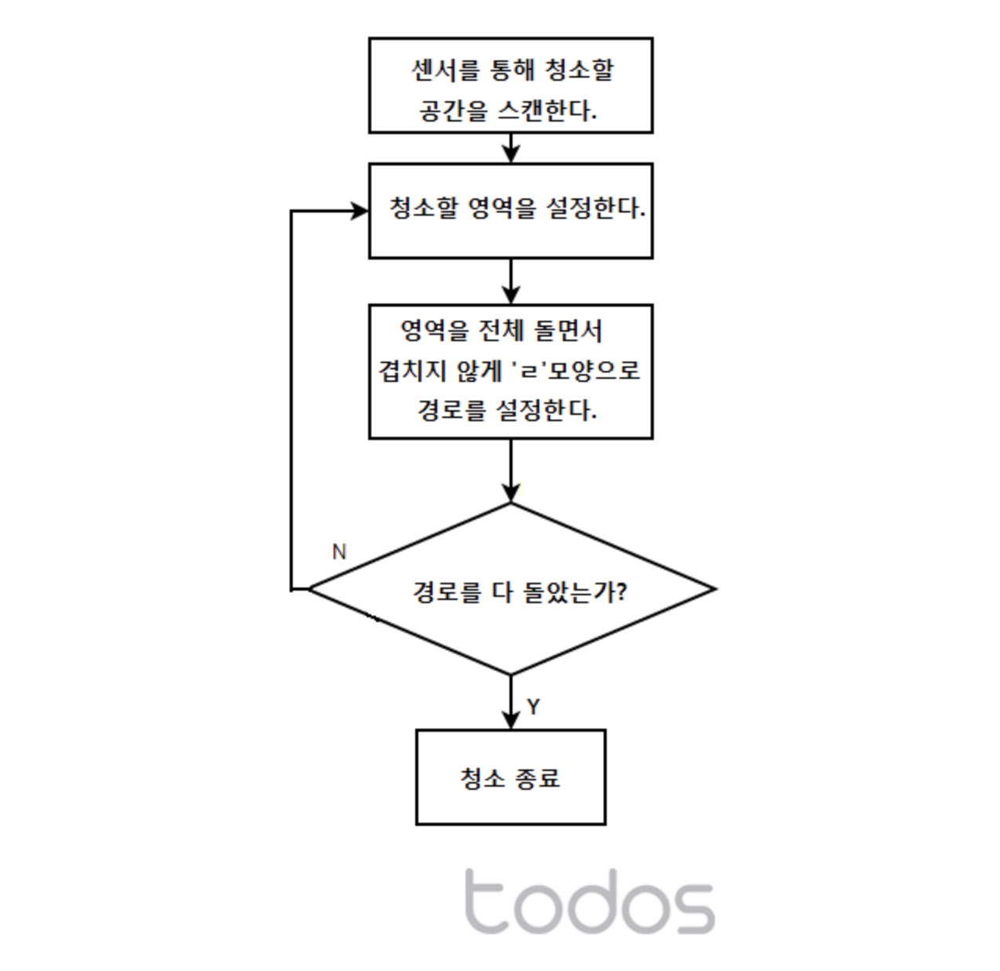

# 프로그래밍이란?

> 참고 자료 : IT 서적 ⌜모던 자바스크립트 Deep Dive⌟

<br/>

### 목차

- <a href="https://github.com/SangYoonLee1231/TIL/blob/main/Etc/what-is-programming.md#%ED%94%84%EB%A1%9C%EA%B7%B8%EB%9E%98%EB%B0%8D%EC%9D%B4%EB%9E%80-%EB%B6%80%EC%A0%9C-%ED%94%84%EB%A1%9C%EA%B7%B8%EB%9E%98%EB%A8%B8%EC%9D%98-%EA%B8%B0%EB%B3%B8-%EC%86%8C%EC%96%91">프로그래밍이란? (부제: 프로그래머의 기본 소양)</a>
- <a href="https://github.com/SangYoonLee1231/TIL/blob/main/Etc/what-is-programming.md#%ED%94%84%EB%A1%9C%EA%B7%B8%EB%9E%98%EB%B0%8D-%EC%96%B8%EC%96%B4%EB%9E%80">프로그래밍 언어란?</a>
- <a href="https://github.com/SangYoonLee1231/TIL/blob/main/Etc/what-is-programming.md#%EA%B5%AC%EB%AC%B8%EA%B3%BC-%EC%9D%98%EB%AF%B8">구문과 의미</a>

<br/><br/>

## 프로그래밍이란? (부제: 프로그래머의 기본 소양)

- 프로그래밍이란 컴퓨터가 이해할 수 있는 언어(로 번역 가능한 언어)를 바탕으로 컴퓨터와 의사소통을 하여 실행을 요구하는 것이다.

- 이 때 컴퓨터에게 어떤 실행을 요구할 지부터 우선 명확히 정의되어 있어야 하는데, 이 때 요구되는 능력이 문제 해결 능력이다.

- 즉 프로그래밍이란, 0과 1밖에 모르는 컴퓨터도 이해할 수 있도록 문제 상황(요구 사항)을 정확하고 상세하게 설명하는 작업이다.

- 따라서 프로그래머는 '복잡하고 모호한 문제를 논리적 절차에 따라 명확하고 단순한 작은 문제들로 분해하고 패턴화하는 능력', 즉 컴퓨터적 사고(Computational Thinking)를 반드시 할 줄 알아야 한다. 이것은 프로그래머의 기본 중의 기본 소양이다.

<br/>

- 컴퓨터는 "춥다" "따뜻하다"와 같이 기준이 불명확한 관념적 개념을 이해하는데 어려움이 있다. 그러나 200의 10제곱의 값을 구하는 일은 매우 쉽게 해결한다.

- 이처럼 컴퓨터는 사고, 인지의 방식이 사람과 확연한 차이가 있다.

- 프로그래머는 이 점을 이해하고 논리적, 수학적으로 사고하여 컴퓨터에게 요구할 문제를 파악한 후 이 문제의 해결 과정을 수립해야 한다.

  - 예시: 로봇 청소기의 방 청소 기능을 디자인해보자.

    <div align="center">

    

    (사진 출처 : https://m.blog.naver.com/todoskr/220839920950)

    </div>

- 이 해결 과정을 컴퓨터 언어로 작성한 것이 바로 '코드(Code)'이다.

<br/><br/>

## 프로그래밍 언어란?

- 문제를 명확히 파악하고 그 해결 과정을 정의하는 일은 프로그래머의 몫이지만, 결국 문제를 해결하는 주체는 컴퓨터이다.

- 따라서 이 (명령의 절차로 이루어진) 문제 해결 과정을 컴퓨터에게 전달해주어야 하는데, 애석하게도 컴퓨터는 사람의 말을 알아듣지 못한다.

- 따라서 프로그래머는 컴퓨터가 이해할 수 있는 기계어로 이 명령의 절차들을 전해주어야 하는데, 사람 역시 인간 언어와 체계가 완전히 다른 기계어를 이해하는 것은 매우 어려운 일이다.

- 따라서 이에 대한 유용한 대안으로 제시된 것은, 사람이 약속된 구문으로 구성된 프로그래밍 언어를 사용해 프로그램을 작성한 후, 아를 번역기를 통해 기계어로 변환하는 일종의 번역기를 이용하는 것이다.

  - 이 일종의 번역기를 컴파일러(Compiler) 혹은 인터프리터(Interpreter)라 한다.

<br/>

- 즉, 프로그래밍 언어란 사람과 컴퓨터가 서로 소통하는 데 필요한 매개체로, 둘 다 이해할 수 있는 인공 언어이다.

```python
# Python
print("Hello World")
```

```c
// C (C#, C++)
printf("Hello World");
```

```java
// Java
System.out.println("Hello World");
```

```javascript
// javaScript
console.log("Hello World");
```

<br/><br/>

## 구문과 의미

- 프로그래밍 언어는 구문(Syntax)과 의미(Semantics)의 조합으로 표현된다. 이는 인간의 언어도 마찬가지이다.

<br/>

- 언어가 그 역할을 충실히 수행하려면, 문법(구문)이 정확한 것은 물론이고 문맥(의미) 또한 맞아야 한다.

- 문법이 정확해도 의미가 없는 언어는 의사소통에 문제를 발생시키는 쓸모 없는 언어일 뿐이다.

  - 예시: <code>Colorless green ideas sleep furiously.</code>

<br/>

- 즉, (프로그래머가) 작성한 코드가 프로그래밍 언어의 문법에 어긋남이 없을 뿐만 아니라, 문제의 요구사항 또한 정확히 수행되어 있어야만 그 코드는 유의미한 코드가 된다.

<br/>
