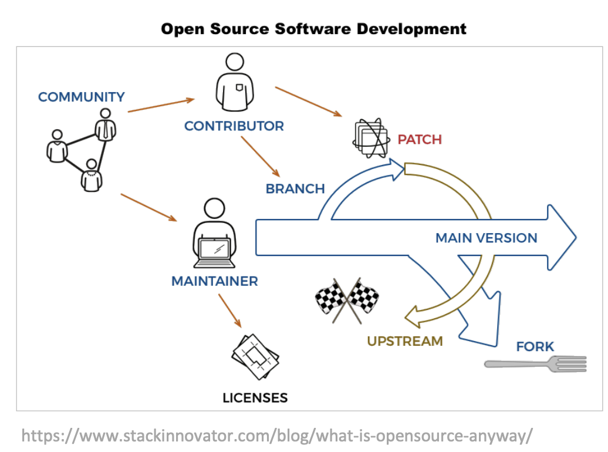
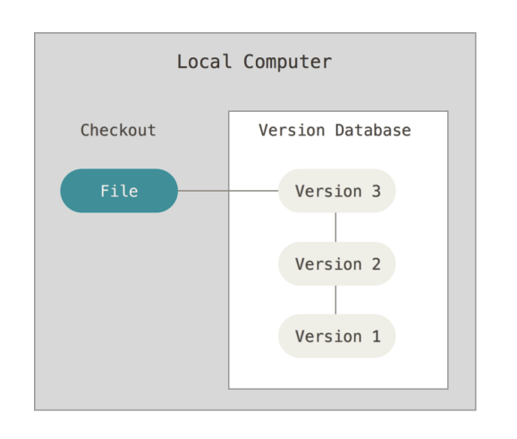
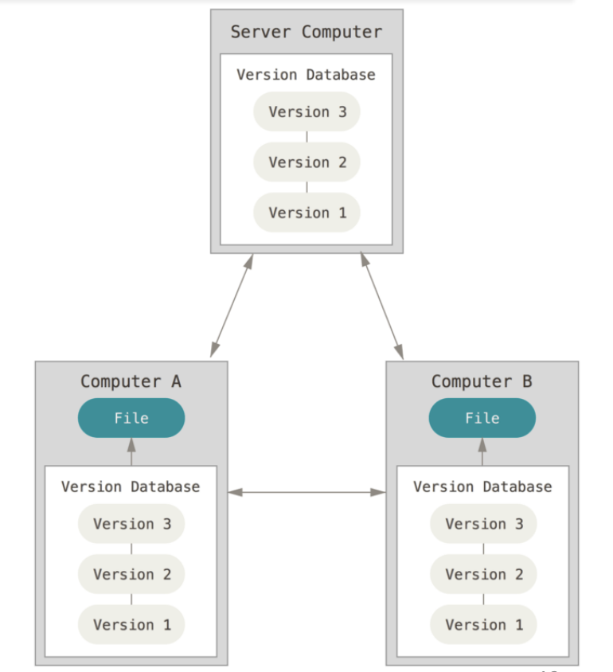
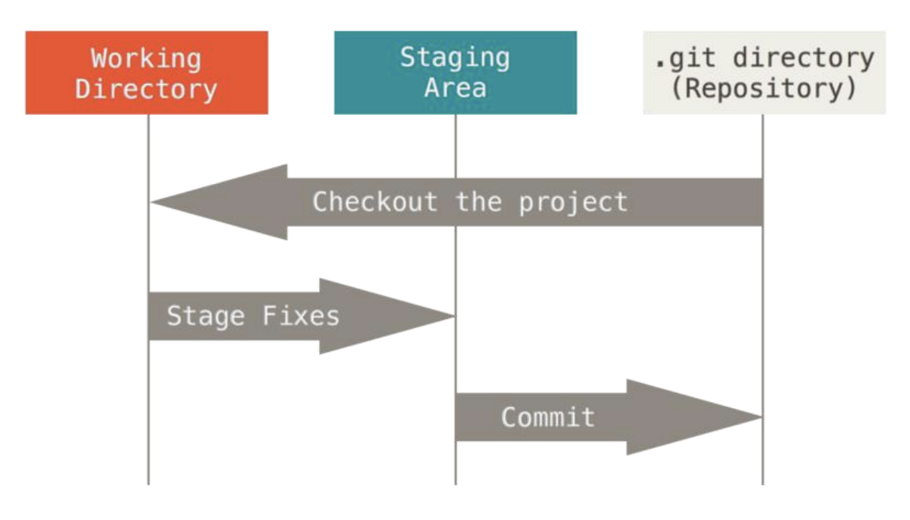
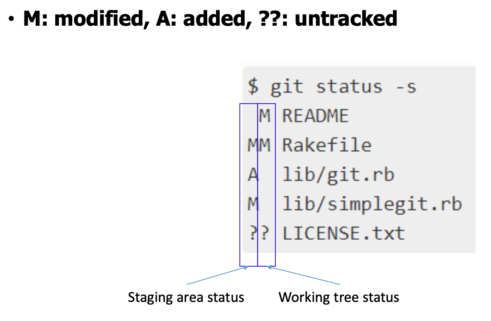

# Git - 오픈소스 이론부터 실전까지 총 정리

> 참고 자료 : '오픈소스SW및실습' 학과 수업 자료

 

### 목차

- <a href="">1. Open Source Software (OSS) 와 Git 소개</a>

  - <a href="">오픈 소스 소프트웨어 (OSS)</a>
  - <a href="">Proprietary / Closed Source Software (CSS)</a>
  - <a href="">버전 관리 시스템 (Version Control System / VCS)</a>
  - <a href="">버전 관리 시스템 - Git</a>

- <a href="">2. 오픈소스의 이점 및 Git의 기초</a>

  - 
  - 
  - 

- <a href="">3. Branching</a>

  - 
  - 
  - 

- <a href="">4. Git Remote</a>

  - 
  - 
  - 

- <a href="">5. Distributed Git</a>

  - 
  - 
  - 

<!-- -  -->

  

## 1. Open Source Software (OSS) 와 Git 소개

### 오픈 소스 소프트웨어 (OSS)

#### 정의

- 소스코드가 라이선스(License)로 인해 <strong>누구에게나 열려있다</strong>(Made Available with a License)

  - Open = "Free to Distribute"

- 누구나 접근 가능하고(<strong>Access</strong>), 수정할 수 있으며(<strong>Modify</strong>), 재배포할 수 있다(<strong>Redistribute</strong>)

 

#### 라이선스의 종류

- <strong>Permissive (관대한)</strong> : re-license 가능 (ex. BSD-License)

- <strong>Restrictive (재한적인)</strong> : re-license 불가능 (ex. GPL-License)

 

#### 오픈소스에 기여하는 이유

- 오픈소스 이력을 이력서에 추가하여 '남의 코드를 잘 이해하는 능력'을 어필할 수 있다.

- 사람들에게 좋은 이미지를 줄 수 있다.

  - Google과 Microsoft는 오픈소스 기여 수 1등 기업인데, 이는 사람들에게 좋은 기업 이미지를 준다.

 

#### OSS의 두 가지 철학

- <strong>Idealism (이상주의)</strong>

  - 실용성 고려 X, 윤리적 관점만 생각

- <strong>Pragmatisn (실용주의)</strong>

  - 실용적 측면만 생각

  - Fast and Better Development

 

#### OSS 개발 맵

- <strong>Maintainer</strong> : 관리자

- <strong>Contributor</strong> : 기여자

  - branch/patch를 만드는 사람 (patch: final version of changed version)

  - Maintainer가 수정 사항을 Accept하면, 수정한 버전이 Main Version에 반영

  - Maintainer가 수정 사항을 Accept하지 않으면, 수정 버전은 <strong>Fork</strong>으로 남음

  - 즉, Fork는 영원한 브랜치이다.

    - (다만 상황에 따라 Fork가 Main Version에 합쳐질 수도 있으므로 항상 영원한 것은 아님)

 

#### OSS 관리 모델

- **Company-led**: Closed

- **Benevolent Dictator**: 한 명이 통치 (최종관리)

- **Governing board**: 관리자가 그룹화

  

### Proprietary / Closed Source Software (CSS)

#### 개념

- Proprietary = 등록 상표가 붙은, 소유주의

- the only real model used by commercial
  projects

- <strong>소유주(Owners)만 전체 접근 권한을 가진다.</strong>

  - Owners ≠ code-author

- 라이센스를 통해 재배포 권리(Re-Distribution Rights)를 제한한다

  <!-- - Re-Distribution X, Modification X, Reuse of Code X -->

 

#### OSS와 CSS의 차이점

- <strong>가격과는 아무런 상관이 없다.</strong>

- 다만 OSS와 달리, CSS는 Re-Distribution X, Modification X, Reuse of Code X

  

### 버전 관리 시스템 (Version Control System / VCS)

#### 개념과 사용법

- <strong>파일의 변경 이력을 항상 기록하고 있는 시스템</strong>

- VCS를 통해 가능한 것

  - 파일의 이전 상태로 돌아갈 수 있다.

  - 누가 언제 무엇을 수정했는지 확인할 수 있다.

  - 누가 이슈를 언제 제시했는지 알 수 있다.

  - 등등..

 

#### VCS의 3가지 종류

- **Local VCS**

  

  

  

  - 장점: Version Tracking이 가능하다.

  - 단점: 한 컴퓨터를 사용하는 한 명의 사용자만 하나의 버전에 Contribute 할 수 있다.

 

- **Centralized VCS Server**

  

  

  

  - 장점: Many people can collaborate together

  - 단점: Single Point of Failure (서버가 망가지면 모든 것이 망가진다)

 

- **Distributed VCS**

  

  

  

  - Version Database가 모든 컴퓨터에 존재한다.

  - Centralized VCS보다 안전하다.

  - ex) GitHub

  

### 버전 관리 시스템 - Git

#### Git vs Other VCS

- **Other VCS**: 데이터 변경 이력만 저장 (Only save the changes)

  - 수정된 내용만 저장된다. 파일 전체 정보는 저장하지 않는다.

  - 따라서 Backtracking 필요

- **Git**: 파일 전체 정보를 저장

  - 각 버전마다 Snapshot을 저장한다.

  - Branching이 쉬워진다. (Backtracking 필요 X)

 

#### 3가지 파일 상태 (File States)

- Modified, Staged, Commited

 

#### 3가지 메인 섹션

- Working Directory, Staging Area, Repository

  

  

  

   

## 2. 오픈소스의 이점 및 Git의 기초

### OSS의 이점

#### Individual Users

- Less Cost, More Freedom, Can avoid Vender lock-in

  - (Vender lock-in : 버전 자동 업데이트)

#### Business

- Less Cost, Receive Free Review

#### Education

- Few and low cost, Can utilize old hardware

#### Developers

- Can reuse code, Make good Communication Skill

  

### Git의 기초

#### 깃 레포지토리 초기화하기

- `git init` : 현재 디렉토리를 깃 레포지토리로 초기화

- `git clone <링크>` : 깃 레포지토리 불러오기

 

#### 깃 레포지토리의 4가지 상태

- Untracked, Unmodified, Modified, Staged

  

  

  

 

#### 기초 깃 명령어 정리

- `git status` : 깃으로 관리되는 파일의 상태 확인하기

- `git status -s` or `git status -short` : 파일 상태 짧게 확인하기

  

  

  

 

- `git add <file명>` : 해당 파일을 Staging Area에 추가

- `git commit -m "메세지"` : Staging Area의 모든 정보를 커밋

- `git commit -a -m "메세지"` 또는 `git commit -am "메세지"` : 커밋과 스테이징을 동시에 진행 (Auto-Staging)

 

- `git commit --amend` : 이전 커밋 덮어쓰기

- `git reset HEAD <file명>` : Unstaging a staged file

- `git checkout --<file>` : 파일의 수정 사항을 초기화(Discard)

 

- `git log` : 커밋 히스토리 확인

- `git log --stat` : 커밋 히스토리를 (파일의 추가 및 삭제된 부분과 함께) 확인

- `git log --graph --oneline --all` : 커밋 히스토리를 그래프 령식으로 확인

   

## 3. Branching

### 깃 관련 데이터 구조

#### 커밋과 트리 구조

**blob** : 각 파일을 나타냄 (파일 컨텐츠를 저장)

**tree** : 모든 blob를 가리킴

**commit** : tree의 root를 가리킴

 

- <strong>하나의 커밋은 이전 커밋을 가리키는 포인터를 가지고 있다. (Backtracking 가능)</strong>

  

  

  

  

### Branch (브랜치)

####

   

## 4. Git Remote

   

## 5. Distributed Git

  
