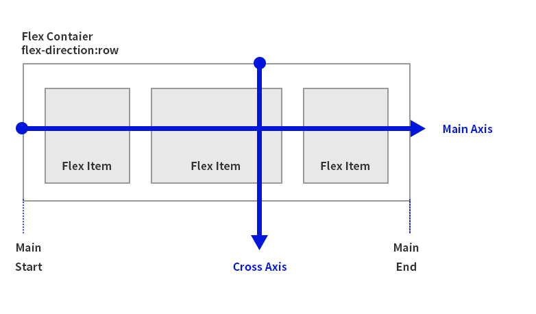
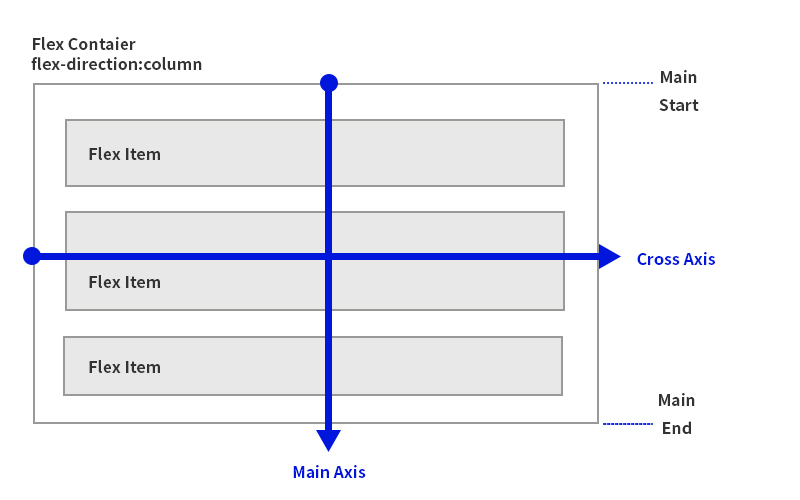

# CSS - Flexbox

<br/>

>  참고 자료 : 《<a href="https://github.com/SangYoonLee1231/TIL/blob/main/HTML%20%26%20CSS/html_basic_concept.md">HTML의 기본</a>》 페이지 참고

<br/>

## Flexbox란

* HTML 요소의 배치를 바꾸는 쉬운 방법

* display의 하나의 속성

```css
body {
    display: flex;
}
```

<br/>

## ✨ Flexbox 사용 시 유의할 점

* 반드시 flex를 적용하고자 하는 Element(요소)의 <strong>부모 Element</strong>에 display: flex를 명시해야 한다.

    * display: flex  

      == 이 박스를 flex 컨테이너로 만든다.  

      == 이 box '<strong>안</strong>'에 들어있는 Element들을 이제부터 flex로 관리한다.

    * <strong>자식 Element에 display: flex 작성 금지</strong> (처음에 하기 쉬운 실수)

```css
body {
    display: flex;    
}
/*body의 자식 요소에 flex가 적용된다.*/
```

<br/>

## 주축(main axis)과 교차축(cross axis)

* flex 컨테이너는 2개의 축을 가지고 있다.


* justify-content는 주축(main axis)에 적용할 속성을 속성값으로 받는다.

* align-items는 교차축(cross axis)에 적용할 속성을 속성값으로 받는다.

<br/>

## Flex Direction

* flex-direction : 주축의 방향을 지정하는 속성

    * row : 주축이 수직 방향 (교차축은 수평 방향) 〈Default 값〉

    

    <br/>

    * column : 주축이 수평 방향 (교차축은 수직 방향)

    
    