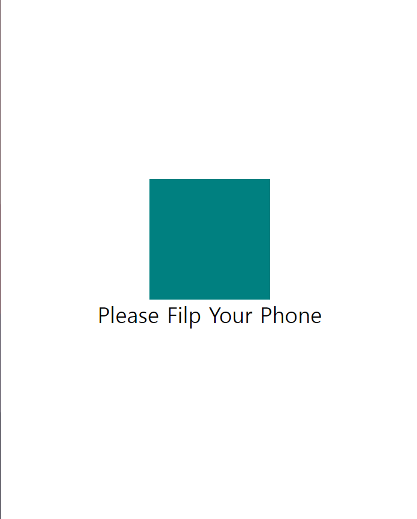

# CSS - 미디어 쿼리 (Media Query)

> 참고 자료 : 《<a href="https://github.com/SangYoonLee1231/TIL/blob/main/HTML%20%26%20CSS/html_basic_concept.md">HTML의 기본</a>》 페이지 참고

<br/>

### 목차

- <a href="https://github.com/SangYoonLee1231/TIL/blob/main/HTML%20%26%20CSS/css_media_query.md#%EB%AF%B8%EB%94%94%EC%96%B4-%EC%BF%BC%EB%A6%AC-media-query">미디어 쿼리 (Media Query)</a>
  - <a href="https://github.com/SangYoonLee1231/TIL/blob/main/HTML%20%26%20CSS/css_media_query.md#%ED%99%94%EB%A9%B4-%EC%8A%A4%ED%81%AC%EB%A6%B0%EC%9D%98-%ED%81%AC%EA%B8%B0%EC%97%90-%EB%94%B0%EB%9D%BC-%EB%8B%A4%EB%A5%B8-css-%EC%A0%81%EC%9A%A9%EC%8B%9C%ED%82%A4%EA%B8%B0">화면 스크린의 크기에 따라 다른 CSS 적용시키기</a>
  - <a href="https://github.com/SangYoonLee1231/TIL/blob/main/HTML%20%26%20CSS/css_media_query.md#%EB%AA%A8%EB%B0%94%EC%9D%BC%EC%97%90%EC%84%9C-%EA%B0%80%EB%A1%9C-%EB%AA%A8%EB%93%9C--%EC%84%B8%EB%A1%9C-%EB%AA%A8%EB%93%9C%EC%97%90-%EB%94%B0%EB%9D%BC-%EB%8B%A4%EB%A5%B8-css-%EC%A0%81%EC%9A%A9%EC%8B%9C%ED%82%A4%EA%B8%B0">모바일에서 가로 모드 / 세로 모드에 따라 다른 CSS 적용시키기</a>
  - <a href="https://github.com/SangYoonLee1231/TIL/blob/main/HTML%20%26%20CSS/css_media_query.md#%EA%B7%B8-%EC%99%B8-media-queries-%EC%A3%BC%EC%9A%94-%EA%B8%B0%EB%8A%A5">그 외 Media Queries 주요 기능</a>

<br/><br/>

## 미디어 쿼리 (Media Query)

- 오직 CSS만을 이용해서 화면 스크린의 사이즈를 알 수 있는 방법이다.

- 스크린의 크기나 상태에 따라 CSS을 다르게 적용하게 할 수 있다.

  - 반응형 웹사이트를 만들 때 유용하다.

<br/>

### 화면 스크린의 크기에 따라 다른 CSS 적용시키기

- home.html

  ```html
  <!DOCTYPE html>
  <html lang="kr">
    <head>
      <link rel="stylesheet" href="styles.css" />
    </head>
    <body>
      <div></div>
    </body>
  </html>
  ```

- styles.css

  ```css
  body {
    display: flex;
    height: 100vh;
    justify-content: center;
    align-items: center;
  }
  div {
    background-color: teal;
    width: 200px;
    height: 200px;
  }
  @media screen and (max-width: 800px) {
    div {
      background-color: tomato;
    }
  }
  @media screen and (min-width: 801px) and (max-width: 1200px) {
    div {
      background-color: wheat;
    }
  }
  @media screen and (min-width: 1200px) {
    div {
      background-color: turquoise;
    }
  }
  ```

<br/>

### 모바일에서 가로 모드 / 세로 모드에 따라 다른 CSS 적용시키기

&nbsp;&nbsp;&nbsp;&nbsp;&nbsp;&nbsp;

- home.html

  ```html
  <!DOCTYPE html>
  <html lang="kr">
    <head>
      <link rel="stylesheet" href="styles.css" />
    </head>
    <body>
      <div></div>
      <span>Please Filp Your Phone</span>
    </body>
  </html>
  ```

- styles.css

  ```css
  body {
    display: flex;
    height: 100vh;
    justify-content: center;
    align-items: center;
    flex-direction: column;
  }
  div {
    background-color: teal;
    width: 200px;
    height: 200px;
  }
  @media screen and (orientation: landscape /*portrait*/) {
    div {
      background-color: wheat;
    }
  }
  span {
    font-size: 36px;
  }
  @media screen and (orientation: landscape) {
    span {
      display: none;
    }
  }
  ```

<br/>

- 결과

  - portrait (세로 모드)

    

  - landscape (가로 모드)

    

<br/>

### 그 외 Media Queries 주요 기능

- min-device-width
- max-device-width
- orientation: landscape
- orientation: portrait
- aspect-ration - 레티나디스플레이 감지가능
- display-mode
- inverted-colors
- lightlevel
- prefers-contrast
- resolution
- monochrome

<br/>

- Media type

  - <code>@media screen{}</code>
  - <code>@media print{}</code>

<br/>

- 👉<a href="https://developer.mozilla.org/en-US/docs/Web/CSS/Media_Queries/Using_media_queries">MDN 바로가기</a>
