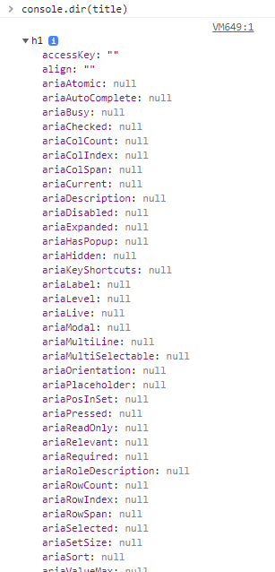
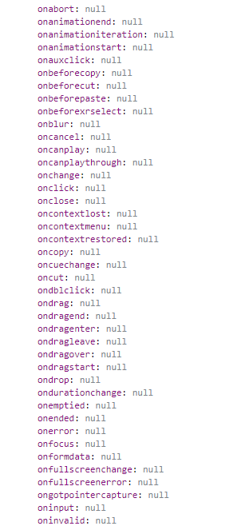

# JavaScript - 이벤트 리스너 (Event Listener)

> 참고 자료 : <a href="https://nomadcoders.co/javascript-for-beginners">노마드 코더 - 바닐라 JS로 크롬 앱 만들기</a>

<br/>

### 목차

- <a href="https://github.com/SangYoonLee1231/TIL/blob/main/JavaScript/javascript_event_listener.md#%EC%84%9C%EB%A1%A0">서론</a>
- <a href="https://github.com/SangYoonLee1231/TIL/blob/main/JavaScript/javascript_event_listener.md#%EC%9D%B4%EB%B2%A4%ED%8A%B8-%EB%A6%AC%EC%8A%A4%EB%84%88-event-listener">이벤트 리스너 (Event Listener)</a>
- <a href="https://github.com/SangYoonLee1231/TIL/blob/main/JavaScript/javascript_event_listener.md#%EC%9D%B4%EB%B2%A4%ED%8A%B8-%EC%A2%85%EB%A5%98">이벤트 종류</a>
- <a href="https://github.com/SangYoonLee1231/TIL/blob/main/JavaScript/javascript_event_listener.md#%EC%9D%B4%EB%B2%A4%ED%8A%B8-%ED%99%9C%EC%9A%A9%ED%95%98%EA%B8%B0">이벤트 활용하기</a>

<br/><br/>

## 서론

- HTML에서 특정한 요소를 JS로 가져온 후 그 요소(element)의 <strong>내부</strong>를 보려면, 다음과 같이 코드를 작성하면 된다.

  ```javascript
  console.dir(element 이름);
  ```

    <br/>

   

    <br/>

  - 그럼 위과 같이 object로 표시한 element를 전부 볼 수 있다. (✨<strong>이 항목들은 모두 JavaScript Object이다.</strong>)

  - 이 중에서 앞에 <code>on</code>이 붙은 요소들이 바로 <strong>event</strong>이다.

<br/>

- HTML의 요소 중엔 <code>style</code>이란 Object도 존재한다.

  즉, <strong>JS로 특정 요소의 style도 바꿀 수 있다</strong>는 소리다.

  ```javascript
  const title = document.querySelector(".hello:first-child h1");

  title.style.color = "blue";
  ```

<br/><br/>

## 이벤트 리스너 (Event Listener)

- <strong>이벤트 (Event)</strong> : 어떤 행위를 하는 것

  - 예) 클릭, 입력 끝내기, 이름 적기, enter 누르기, wifi에서 접속 헤제 등등

- JavaScript는 이 모든 이벤트를 listen할 수 있다.

<br/>

- <strong><code>eventListener</code></strong> : event를 listen한다.

- <strong><code>title.addEventListener("click")</code></strong> : title이 <strong>click</strong>되는 event를 listen한다.

<br/>

- 이 때, <strong>특정 이벤트가 listen될 시, 어떤 동작이 이루어지게 할 것인지</strong>를 설정하기 위해

  <strong>새로운 함수</strong>를 선언하여 <code>addEventListener</code> 인자로 준다.

  ```javascript
  function handleTitleClick() {
    console.log("Title was clicked!");
  }

  title.addEventListener("click", handleTitleClick);
  ```

<br/>

- 참고로 다음과 같은 코드로도 이벤트를 listen하여 원하는 동작이 이루어지도록 할 수 있다.

  ```javascript
  title.onclick = handleTitleClick;
  ```

<br/>

- 함수 사용 예시

  - index.html

    ```html
    <!DOCTYPE html>
    <html lang="en">
      <head>
        ...
        <title>Momentum App</title>
      </head>
      <body>
        <div id="hi" class="hello">
          <h1>Grab Me! 1</h1>
        </div>
        <div class="hello">
          <h2>Grab Me! 2</h2>
        </div>
        <div class="hello">
          <h3>Grab Me! 3</h3>
        </div>
        <script src="js/app.js"></script>
      </body>
    </html>
    ```

  - app.js

    ```javascript
    const title = document.querySelector(".hello:first-child h1");

    title.innerText = "Click Me!";

    function handleTitleClick() {
      console.log("Title was clicked!");
      title.style.color = "blue";
    }

    title.addEventListener("click", handleTitleClick);
    //title.onclick = handleTitleClick;
    ```

<br/><br/>

## 이벤트 종류

- listen하고 싶은 event를 찾는 한 가지 방법으로 <code>console.dir(element 이름);</code>을 통해 어떤 요소의 내부를 확인하면,

  앞에 <code>on</code>이 붙은 다양한 <strong>event</strong> 요소들을 확인할 수 있다.

  

<br/>

- listen하고 싶은 event를 찾는 <strong>가장 좋은 방법</strong>은 mdn web docs 페이지에 찾아가서 확인하는 것이다.

  👉 <a href="https://developer.mozilla.org/ko/docs/Web/Events">바로가기</a>

<br/>

- 대표적인 event 예시 (노마드코더 강의에서 소개한)

  - 마우스(mouse) 이벤트

    - <strong><code>click</code></strong> : 마우스로 해당 요소를 클릭할 때
    - <strong><code>mouseenter</code></strong> : 마우스를 해당 요소에 올렸을 때
    - <strong><code>mouseleave</code></strong> : 마우스를 해당 요소에 올린 후 벗어날 때

  - 윈도우(window) 이벤트

    - <strong><code>resize</code></strong> : 브라우저 창의 크기를 변경할 때
    - <strong><code>copy</code></strong> : 사용자가 '복사' 행위를 했을 때
    - <strong><code>offline</code></strong> : 인터넷 연결이 끊어졌을 때
    - <strong><code>online</code></strong> : 인터넷이 연결되었을 때

<br/>

- 코드 예시

  - index.html

    ```html
    <!DOCTYPE html>
    <html lang="en">
      <head>
        ...
        <link rel="stylesheet" href="css/style.css" />
        <title>Momentum App</title>
      </head>
      <body>
        <div id="hi" class="hello">
          <h1>Grab Me! 1</h1>
        </div>
        <div class="hello">
          <h2>Grab Me! 2</h2>
        </div>
        <div class="hello">
          <h3>Grab Me! 3</h3>
        </div>
        <script src="js/app.js"></script>
      </body>
    </html>
    ```

  - style.css

    ```css
    body {
      background-color: beige;
    }
    h1 {
      color: cornflowerblue;
      transition: color 0.5s ease-in-out;
    }
    ```

  - app.js

    ```javascript
    const title = document.querySelector(".hello:first-child h1");

    title.innerText = "Click Me!";

    //const title = document.querySelector(".hello:first-child h1");

    //title.innerText = "Click Me!";

    function handleTitleClick() {
      console.log("Title was clicked");
      title.style.color = "blue";
    }

    function handleMouseEnter() {
      title.innerText = "Mouse is here";
    }

    function handleMouseLeave() {
      title.innerText = "Mouse is gone";
    }

    function handleWindowResize() {
      document.body.style.backgroundColor = "tomato";
    }

    function handleWindowCopy() {
      alert("You Copier");
    }

    function handleWindowOffline() {
      alert("SOS no WIFI");
    }

    function handleWindowOnline() {
      alert("ALL GOOOOD");
    }

    title.addEventListener("click", handleTitleClick);
    //title.onclick = handleTitleClick;
    title.addEventListener("mouseenter", handleMouseEnter);
    //title.onmouseenter = handleMouseEnter;
    title.addEventListener("mouseleave", handleMouseLeave);
    //title.onmouseleave = handleMouseLeave;

    window.addEventListener("resize", handleWindowResize);
    window.addEventListener("copy", handleWindowCopy);
    window.addEventListener("offline", handleWindowOffline);
    window.addEventListener("online", handleWindowOnline);
    ```

<br/><br/>

## 이벤트 활용하기

### 제목을 클릭할 때마다 2개의 글씨 색이 번갈아가며 바뀌는 이벤트 만들기

- <strong>【방법 1】 style 클래스에 직접 접근하는 방법 (JS만을 활용)</strong>

  ```javascript
  const h1 = document.querySelector(".hello:first-child h1");

  // 옵션 1
  function handleTitleClick() {
    const currentColor = h1.style.color;
    let newColor;
    if (currentColor === "blue") {
      newColor = "tomato";
    } else {
      newColor = "blue";
    }
    h1.style.color = newColor;
  }

  h1.addEventListener("click", handleTitleClick);
  ```

- <strong>문제점</strong> : JS는 애니메이션에 적합한 도구고, CSS는 style 작업에 적합한 도구다. JS에서 style 작업까지 다루는 것은 좋지 않다.

<br/>

- <strong>【방법 2】 JS으로 클래스 이름을 HTML 요소에 추가하는 방법</strong>

  - style.css

    ```css
    body {
      background-color: beige;
    }
    h1 {
      color: cornflowerblue;
      transition: color 0.5s ease-in-out;
    }
    .clicked {
      color: tomato;
    }
    ```

  - app.js

    ```javascript
    const h1 = document.querySelector(".hello:first-child h1");
    function handleTitleClick() {
      const clickedClass = "clicked";
      if (h1.className === clickedClass) {
        h1.className = "";
      } else {
        h1.className = clickedClass;
      }
    }
    ```

- <strong>문제점</strong> : className으로 인해 기존 HTML 요소에 있던 클래스를 모두 잃을 수 있다.

<br/>

- <strong>【방법 3】 JS의 classList를 활용하여 클래스 이름을 HTML 요소에 추가하는 방법</strong>

  - style.css

    ```css
    body {
      background-color: beige;
    }
    h1 {
      color: cornflowerblue;
      transition: color 0.5s ease-in-out;
    }
    .clicked {
      color: tomato;
    }
    ```

  - app.js

    ```javascript
    const h1 = document.querySelector(".hello:first-child h1");

    function handleTitleClick() {
      const clickedClass = "clicked";
      if (h1.classList.contains(clickedClass)) {
        h1.classList.remove(clickedClass);
      } else {
        h1.classList.add(clickedClass);
      }
    }

    h1.addEventListener("click", handleTitleClick);
    ```

<br/>

- <strong>【방법 4】 JS classList의 toggle 함수를 활용하는 방법 (✨추천)</strong>

  - classList의 <code>toggle</code>함수는 class 이름이 요소에 존재하는지 확인한 후, <strong>해당 class 이름이 있으면 이를 제거하고, 없으면 추가한다.</strong>

  - style.css

    ```css
    body {
      background-color: beige;
    }
    h1 {
      color: cornflowerblue;
      transition: color 0.5s ease-in-out;
    }
    .clicked {
      color: tomato;
    }
    ```

  - app.js

    ```javascript
    function handleTitleClick() {
      // clicked 클래스를 한 번만 사용하기 때문에, 따로 변수를 선언해 줄 필요는 없다.
      h1.classList.toggle(clicked);
    }

    h1.addEventListener("click", handleTitleClick);
    ```
