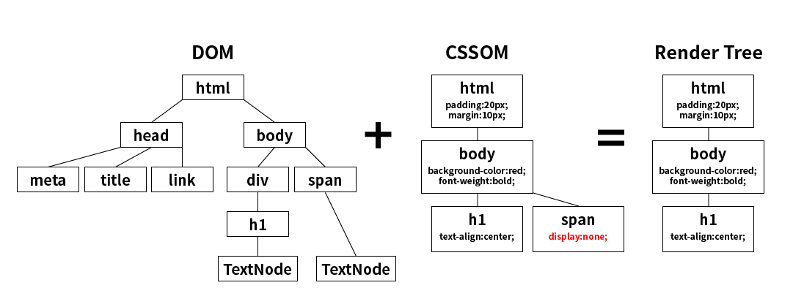

# 웹 브라우저의 동작 원리

 

- 스터디 발표를 준비하며 공부한 내용입니다.

- 브라우저 주소 창에 naver.com 을 쳤을 때 일어나는 일을 <strong>네트워크의 관점</strong>에서 정리했습니다.

- CS 지식이 거의 전무한 상태에서 학습을 시작했기 때문에 내용이 깊지는 않습니다.
  추후 CS를 공부하며 세부적인 내용을 더 보충해 나가겠습니다.

 

### 목차

- <a href="https://github.com/SangYoonLee1231/TIL/blob/main/Network/how-browser-works.md#%EC%82%AC%EC%A0%84-%EC%A7%80%EC%8B%9D">사전 지식</a>

  - <a href="https://github.com/SangYoonLee1231/TIL/blob/main/Network/how-browser-works.md#%EB%B8%8C%EB%9D%BC%EC%9A%B0%EC%A0%80-%EC%95%84%ED%82%A4%ED%85%8D%EC%B2%98">브라우저 아키텍처</a>
  - <a href="https://github.com/SangYoonLee1231/TIL/blob/main/Network/how-browser-works.md#%EB%84%A4%ED%8A%B8%EC%9B%8C%ED%81%AC-%EA%B8%B0%EC%B4%88-%EC%82%AC%EC%A0%84-%EC%A7%80%EC%8B%9D">네트워크 기초 사전 지식</a>
  - <a href="">DOM 트리</a>

- <a href="https://github.com/SangYoonLee1231/TIL/blob/main/Network/how-browser-works.md#%EB%B8%8C%EB%9D%BC%EC%9A%B0%EC%A0%80-%EC%A3%BC%EC%86%8C-%EC%B0%BD%EC%97%90-navercom%EB%A5%BC-%EC%B9%98%EA%B3%A0-enter%EC%9D%84-%EB%88%84%EB%A5%B4%EB%A9%B4-%EC%9D%BC%EC%96%B4%EB%82%98%EB%8A%94-%EA%B3%BC%EC%A0%95">브라우저 주소 창에 naver.com를 치고 Enter을 누르면 일어나는 과정</a>

  - <a href="https://github.com/SangYoonLee1231/TIL/blob/main/Network/how-browser-works.md#step-1-%EC%A3%BC%EC%86%8C%EC%B0%BD%EC%97%90-%EC%9E%85%EB%A0%A5%ED%95%9C-%ED%85%8D%EC%8A%A4%ED%8A%B8-%EC%A0%95%EB%B3%B4-%ED%99%95%EC%9D%B8">Step 1. 주소창에 입력한 텍스트 정보 확인</a>
  - <a href="https://github.com/SangYoonLee1231/TIL/blob/main/Network/how-browser-works.md#step-2-%EB%84%A4%ED%8A%B8%EC%9B%8C%ED%81%AC-%ED%98%B8%EC%B6%9C">Step 2. 네트워크 호출</a>
  - <a href="https://github.com/SangYoonLee1231/TIL/blob/main/Network/how-browser-works.md#step-3-%EB%A0%8C%EB%8D%94%EB%A7%81-%EC%9E%91%EC%97%85">Step 3. 렌더링 작업</a>

- <a href="https://github.com/SangYoonLee1231/TIL/blob/main/Network/how-browser-works.md#%EB%A0%8C%EB%8D%94%EB%A7%81-%ED%94%84%EB%A1%9C%EC%84%B8%EC%8A%A4">렌더링 프로세스</a>
  - <a href="">파싱 (Parsing) 이란?</a>
  - 
  - 
  - 
  - 
  - 
  - 

  

## 사전 지식

### 브라우저 아키텍처

- 브라우저의 주 기능은 사용자가 서버에 필요한 자원을 요청하고, 응답받은 자원을 화면에 표시하는 것이다.

 

- <strong>브라우저의 구조</strong>

   

  

  👉 <a href="https://d2.naver.com/helloworld/59361">사진 출처</a>

   

  - <strong>사용자 인터페이스 (User Interface / UI)</strong>

    - 페이지를 보여주는 창을 제외한 나머지 모든 영역.

    - 주소 표시줄, 이전, 이후 버튼, 홈버튼, 북마크 버튼 등

   

  - <strong>브라우저 엔진 / 레이아웃 엔진</strong>

    - 사용자 인터페이스와 렌더링 엔진 사이의 동작을 제어한다.

    - (UI를 그리는 <strong>UI 스레드</strong>, 네트워크 통신을 위한 <strong>네트워크 스레드</strong>, 파일에 접근하기 위한 <strong>스토리지 스레드</strong> 등이 존재한다.)

   

  - <strong>렌더링 엔진</strong>

    - 브라우저 엔진과 밀접히 관련된 엔진으로, 웹 페이지가 표시되는 모든 영역을 제어한다.

    - 요청한 콘텐츠(HTML, CSS 등)를 파싱하고, 화면에 나타내는 일을 수행한다.

   

  - <strong>자료 저장소 / 데이터 저장소</strong>

    - 말 그대로 자료 저장소다.

    - 쿠기나, localStorage, IndexedDM 같이 로컬에 저장되어 좀 더 오래 유지되어야 하는 데이터들을 보관할 수 있도록 지원하는 영역이다.

   

  - <strong>통신 (Networking)</strong>

    - HTTP/HTTPS 네트워크 처리를 한다.

    - 플랫폼과 독립적인 인터페이스로, 각 플랫폼의 하부에서 실행된다.

   

  - <strong>자바스크립트 해석기 (JS Interpreter) / 자바스크립트 엔진</strong>

    - 스크립트(JS 코드)를 파싱(해석)할 때 사용하는 JS 엔진이다.

    - HTML을 파싱(해석) 중 script 태그를 만나면, JS 엔진이 제어 권한을 넘겨받는다. 이 작업은 동기적으로 진행된다.

      - 동기적으로 진행 → JS 엔진이 작업을 마칠 때까지 HTML에서 진행 중인 과정은 잠시 중지된다.

   

  - <strong>UI 백엔드 (UI Backend)</strong>

    - 기본 위젯를 그릴 때 사용한다.

    - OS의 방법을 사용한다.

 

- 인터넷 브라우저에는 Chrome, Safari, IE, Firefox, 오페라 등 여러 종류가 있고, 각 브라우저마다 아키텍처가 조금씩 다르지만 큰 틀은 위의 구조와 같다.

- 모던 브라우저는 각각의 탭을 독립적인 프로세스로 처리한다. 덕분에 높은 보안성과 더 좋은 사용성을 제공할 수 있다.

  

### 네트워크 기초 사전 지식

- URL <code>www.\*\*\*.\*\*\*</code>에서 \*\*\*.\*\*\* 에 해당하는 부분을 <strong>도메인 네임 (또는 도메인)</strong>이라 한다.

- 웹 브라우저는 도메인 네임을 해석할 수 없기 때문에, 이 도메인을 <strong>IP 주소</strong>로 변환해주는 <strong>DNS (Domain Name System)</strong>가 필요하다.

- DNS는 <strong>네임 서버 (Name Server)</strong> 가 운영하는 장치이다.

  

### DOM 트리

- DOM 트리는 문서 객체 모델 (Document Object Model) 의 줄임말로 <strong>HTML 문서의 객체 표현</strong>이다.

- 즉, HTML/XML 문서의 <strong>모든 것을 객체로 만들고</strong>, 이를 브라우저가 읽을 수 있는 <strong>트리 구조로 구성한 것</strong>이 DOM 트리이다.

 

- DOM Tree 내 하나의 객체를 <strong>노드</strong>라 하며, DOM Tree는 4가지 노드로 구성된다.

  - <strong>문서 노드 (Document Node)</strong> : 트리의 최상위 객체. DOM 트리에 접근하기 위한 시작점.

  - <strong>요소 노드(Element Node)</strong> : HTML 요소 (태그) 를 객체로 표현한 것

  - <strong>어트리뷰트 노드(Attribute Node)</strong> : HTML 요소의 'Attribute'를 객체로 표현한 것

  - <strong>텍스트 노드(Text Node)</strong> : HTML 요소의 '텍스트'를 객체로 표현한 것

 

  

👉 <a href="https://poiemaweb.com/js-dom">사진 출처</a>

 

- 자비스크립트가 HTML 문서에 접근하고자 할 때 DOM 트리로 접근한다. 페이지를 조작할 때도 DOM 트리의 객체를 사용한다.

- DOM 생성과정에서 브라우저는 문서에 있는 에러 등, 닫는 태그가 없는 에러 등을 자동으로 처리해준다.

   

## 브라우저 주소 창에 naver.com를 치고 Enter을 누르면 일어나는 일

### Step 1. 주소창에 입력한 텍스트 정보 확인

(주소창에 n을 치면 자동완성 기능으로 검색어가 표시될 수 있다.)

- 우선, 사용자가 주소창에 입력한 텍스트가 '<strong>검색어</strong>'인지 '<strong>URL</strong>'인지 확인한다.

  (이 작업의 주체는 브라우저 엔진의 UI 스레드이다.)

   

- 입력한 텍스트가 '<strong>검색어</strong>'라면, 검색 엔진 URL에 검색어를 포함한 주소로 페이지를 이동시킨다.

- 입력한 텍스트가 '<strong>URL</strong>'라면, 브라우저 엔진에서 네트워크 스레드를 통해 '<strong>네트워크 호출</strong>'을 수행한다.

 

### Step 2. 네트워크 호출

(위에 정리해놓은 <a href="https://github.com/SangYoonLee1231/TIL/blob/main/Network/how-browser-works.md#%EB%84%A4%ED%8A%B8%EC%9B%8C%ED%81%AC-%EA%B8%B0%EC%B4%88-%EC%82%AC%EC%A0%84-%EC%A7%80%EC%8B%9D">네트워크 기초 사전 지식</a>을 숙지해야 한다)

- 사용자가 주소창에 도메인 네임이 포함된 URL (여기서는 <code>www.naver.com</code>) 를 입력하면

- <strong>클라이언트 (사용자의 컴퓨터)</strong> 는 hosts 파일에서 그 도메인 네임 (<code>naver.com</code>) 에 대응하는 <strong>IP 주소 정보</strong>가 있는지 우선 확인한다.

 

- 만일 없다면, 클라이언트는 네임 서버에게 도메인의 IP 주소를 물어보는 <strong>질의 패킷</strong>을 보낸다.

- 네임 서버는 자신의 데이터베이스 목록에 해당 IP 주소를 찾아 클라이언트에게 <strong>응답 패킷</strong>을 보낸다.

 

- 클라이언트는 이렇게 알아낸 IP 주소(<code>125.209.222.142</code>)를 바탕으로 <strong>TCP 소켓</strong>을 통해 네이버 (백엔드) 서버에 <strong>HTTP Request</strong>를 보낸다.

- HTTP Request를 받은 네이버 서버는 <strong>HTTP Reply (HTTP Response)</strong>를 클라이언트에 보낸다.

 

- 네이버 서버로부터 응답을 받은 클라이언트의 브라우저는 페이지를 띄우는데 필요한 <strong>데이터 (HTML, CSS, Javascript, 이미지 파일 등)</strong> 를 얻었다.

 

### Step 3. 렌더링 작업

- 브라우저 엔진의 네트웨크 스레드는 이렇게 얻은 데이터를 우선 <strong>검사</strong>한다.

  - 악성 바이러스가 있는지 없는지..

  - (만일 다운로드 파일 형식의 데이터가 응답될 경우, 다운로드 매니저에게 이를 전달한다.)

 

- 모든 검사가 끝나면 UI 스레드는 <strong>렌더링 엔진</strong>에게 해당 웹 페이지를 화면에 띄울 것을 요청한다.

- 요청을 받은 렌더링 엔진은 응답받은 데이터를 가지고 <strong>렌더링 프로세스</strong>를 수행한다.

   

- 렌더링이 끝나면 웹 페이지에 화면에 띄워지고 모든 과정이 종료된다.

   

## 렌더링 프로세스

- 【 Step 3. 렌더링 작업 】 중 렌더링 엔진에서 일어나는 <strong>렌더링 프로세스</strong>에 대해 좀 더 자세히 알아보자.

- <strong>렌더링 엔진</strong>은 요청받은 내용을 화면에 표시해주는 역할을 한다.

 

- <strong>웹 브라우저 별 사용하는 렌더링 엔진</strong>

  - 파이어폭스는 모질라에서 직접 만든 <strong>게코(Gecko)</strong> 엔진을 사용하고, 사파리는 <strong>웹킷(Webkit)</strong> 엔진을 사용한다.

  - 크롬은 웹킷(Webkit) 엔진을 사용했다가, 웹킷을 Fork하여 자체적으로 구현한 <strong>블링크(Blink)</strong> 엔진을 현재 사용하고 있다.

 

- ✨ <strong>렌더링 과정은 크게 아래 4가지 과정으로 이루어진다.</strong>

  1. HTML을 파싱하여 <strong>DOM 트리 구축</strong>, CSS를 파싱하여 <strong>CSSOM 트리 구축</strong> (+ JS 파싱)

  2. DOM 트리와 CSSOM 트리를 통해 <strong>render 트리 구축</strong> (Attachment / 형상 구축)

  3. <strong>render 트리 배치</strong> (Layout / Reflow)

  4. <strong>render 트리 그리기</strong> (Paint)

 

- 렌더링 과정은 브라우저 엔진에 따라 다른 명칭을 사용하나, 기본적으로는 동일한 과정으로 수행된다.

   

  

  웹킷의 렌더링 엔진 동작 과정

   

  

  게코의 렌더링 엔진 동작 과정

   

  👉 <a href="https://d2.naver.com/helloworld/59361">사진 출처</a>

  

### 파싱 (Parsing) 이란?

- 브라우저는 HTML, CSS 등 단순한 텍스트 문서를 이해하지 못한다.

- 따라서 이 문서를 브라우저가 이해할 수 있는 구조로 변환해주는 과정이 반드시 필요하다.

  이를 <strong>파싱 (Parsing)</strong> 이라 한다.

 

- 파싱은 <strong>어휘 분석</strong>과 <strong>구문 분석</strong> 두 가지 과정으로 구분할 수 있다.

  - <strong>어휘 분석</strong> (By 어휘 분석기) : 문자열을 의미 있는 <strong>토큰(token)</strong>으로 분해하는 과정

  - <strong>구문 분석</strong> (By 파서) : 문자열의 문법에 따라 토큰 간의 위계관계를 분석하여 <strong>parsing 트리</strong>를 생성하는 과정

    > 파싱 결과 생성되는 트리 형태를 <strong>parse 트리, parsing 트리, concrete syntax 트리</strong> 등 다양한 용어로 부른다.

    > parse 트리는 토큰화 된 문자열의 단순한 트리 형태에 불과하므로 <strong>랜더(render)가 불가능</strong>하다.  
    > 따라서 브라우저는 이 parse 트리를 이용해 DOM 트리를 새로 만들어 사용한다.

  

### Step 1-1. HTML 파싱 → DOM 트리 생성

- 렌더링 엔진이 HTML 데이터를 수신하면, HTML 파서가 이를 파싱하여 <strong>DOM 트리</strong>를 생성한다.

 

- <strong>HTML 파싱 과정</strong>

  1. 서버에서 <strong>바이트 형태</strong>의 HTML 문서를 응답받음

  2. 지정된 인코딩 방식(UTF-8)에 따라 이를 <strong>문자열</strong>로 변환  
     (<code>\<meta charset="UTF-8"></code>)

  3. 변환된 문자열을 <strong>토큰</strong>으로 분해

  4. 토큰을 내용에 따라 <strong>객체(노드)</strong>로 변환

  5. 객체를 <strong>트리 구조</strong>로 구성하여 <strong>DOM</strong>을 생성

 

- 더 나은 사용자 경험을 위해 렌더링 엔진은 HTML 문서가 <strong>모두 파싱될 때까지 기다리지 않고</strong> 배치와 그리기 과정을 진행한다.

  

### Step 1-2. CSS 파싱 → CSSOM 트리 생성

- HTML 파싱 과정에서 <code>link</code> 태그를 만나면, DOM 생성을 잠시 중지하고 해당 CSS 리소스를 가져온다.

- CSS 파서가 수신받은 CSS 문서를 파싱하여 <strong>CSSOM 트리</strong>를 생성한다.

 

- <strong>CSS 파싱 과정</strong> (DOM 생성 과정과 동일)

  1. 서버에서 <strong>바이트 형태</strong>의 CSS 문서를 응답받음

  2. 지정된 인코딩 방식(UTF-8)에 따라 이를 <strong>문자열</strong>로 변환  
     (<code>\<meta charset="UTF-8"></code>)

  3. 변환된 문자열을 <strong>토큰</strong>으로 분해

  4. 토큰을 내용에 따라 <strong>객체(노드)</strong>로 변환

  5. 객체를 <strong>트리 구조</strong>로 구성하여 <strong>CSSOM</strong>을 생성

 

- CSSOM 트리의 노드는 DOM 트리 요소의 선택자에 맞춰 적용될 CSS 스타일 정보가 포함되어 있다.

  

### Step 1-3. JavaScript 파싱

- HTML 파싱 과정에서 <code>script</code> 태그를 만나면, DOM 생성을 잠시 중지하고 해당 JavaScript 리소스를 가져온다.

- 그리고 JavaScript 엔진이 렌더링 엔진으로부터 제어권을 넘겨받는다.

- JavaScript 엔진은 받아온 JS 리소스를 파싱하여 AST (추상 구문 트리) 를 생성하고, 이를 바이트코드로 변환해 실행한다.

- JavaScript 파싱이 종료되면 렌더링 엔진이 다시 제어권을 돌려받고 DOM 생성을 이어나간다.

 

- (자바스크립트 파싱 과정은 생략합니다. 추후에 추가하도록 하겠습니다.)

 

- HTML 파싱이 끝나지 않은 상태에서 자바스크립트로 인해 DOM이 조작된다면 에러가 발생할 수 있으므로,

  <code>script</code> 태그는 반드시 body의 최하단에 위치해야 한다.

  - (혹은 <code>script</code> 태그에 <code>defer</code> 속성을 부여하는 방법도 있다.)

  

### Step 2. Render Tree 생성

- <strong>DOM 트리와 CSSSOM 트리를 결합</strong>하여 랜더 트리 (Render Tree)를 생성한다.

  

  👉 <a href="https://velog.io/@moonshadow/CSSOM">사진 출처</a>

 

- <strong>랜더 트리 생성 과정</strong>

  1. <code>\<html></code> 태그와 <code>\<body></code> 태그를 처리하며 <strong>랜더 트리 루트</strong>를 구성한다.

  2. <strong>DOM</strong>을 최상위 노드(<code>\<html></code>)부터 순회하며 <strong>화면에 보여지지 않는 노드를 제외</strong>한다.

  3. 화면에 보여지는 노드에 <strong>CSSOM</strong> 규칙을 찾아 일치하는 스타일을 적용한다.  
     (<code>position</code>이나 <code>float</code>를 사용했을 경우, 실제 그려지는 위치로 랜더 객체가 이동한다.)

  

### Step 3. 레이아웃 (Layout)

- 렌더 트리의 각 노드의 상대적인 위치, 크기 (너비와 높이) 를 계산하는 과정

 

- 초기 배치 이후 DOM 노드가 추가되거나 변경되면, 불필요한 레이아웃이 발생하지 않도록 전체가 아닌 일부만 다시 배치되도록 한다.

  (이를 'Reflow'라 한다.)

  - 글로벌 레이아웃 vs 로컬 레이아웃

  - 로컬 레이아웃 시 <strong>더티 비트</strong> 방식 사용

  

### Step 4. 페인트 (Paint)

- 렌더 트리를 순회하며 레이어를 만들고, 레이어의 배경, 테두리, 텍스트, 그려지는 순서, 레이어 간의 순서 등 그려지는 과정을 기록한다.

- 렌더 트리의 각 노드를 화면의 실제 픽셀로 변환하여(이를 '래스터화'라 한다) 브라우저 화면에 그려준다.

   

> 참고 자료
>
> - <a href="https://github.com/SangYoonLee1231/TIL/blob/main/HTML%20%26%20CSS/html_basic_concept.md">브라우저는 어떻게 동작하는가?</a> (NAVER D2)
> - <a href="https://youtu.be/dh406O2v_1c">What happens when you type google.com into your browser and press enter? (Detailed Analysis)</a> (유튜브 영상)
> - 책 『<a href="http://www.kyobobook.co.kr/product/detailViewKor.laf?mallGb=KOR&ejkGb=KOR&barcode=9791165921057">기초부터 완성까지, 프론트엔드</a>』 (이재성, 한전 지음 / 비제이퍼블릭 출판) - 8장. 브라우저 렌더링 과정
> - 2018학년도 수능 모의고사 국어 영억 비문학 지문 - 『DNS 스푸핑』
> - <a href="https://velog.io/@thyoondev/웹-브라우저의-동작원리를-알아보자">웹 브라우저의 동작원리를 알아보자</a> (블로그 포스트)
> - <a href="https://poiemaweb.com/js-browser">브라우저 동작 원리</a> (PoiemaWeb)
> - <a href="https://m.blog.naver.com/PostView.naver?isHttpsRedirect=true&blogId=pxkey&logNo=221216492103">IP 주소와 도메인의 관계</a> (블로그 포스트)
> - <a href="https://hanamon.kr/dns%eb%9e%80-%eb%8f%84%eb%a9%94%ec%9d%b8-%eb%84%a4%ec%9e%84-%ec%8b%9c%ec%8a%a4%ed%85%9c-%ea%b0%9c%eb%85%90%eb%b6%80%ed%84%b0-%ec%9e%91%eb%8f%99-%eb%b0%a9%ec%8b%9d%ea%b9%8c%ec%a7%80/">DNS란? (도메인 네임 시스템 개념부터 작동 방식까지)</a> (블로그 포스트)
> - <a href="https://code-lab1.tistory.com/154">[네트워크] 웹사이트 접속 과정에 대하여 (네트워크 과목 총 정리) - 주소창에 www.google.com을 입력하면 생기는 일</a> (블로그 포스트)
> - <a href="https://bythem.net/2021/04/23/%ED%94%84%EB%A1%A0%ED%8A%B8%EC%97%94%EB%93%9C-%EA%B0%9C%EB%B0%9C%EC%9E%90%EB%9D%BC%EB%A9%B4-%EC%95%8C%EA%B3%A0-%EC%9E%88%EC%96%B4%EC%95%BC-%ED%95%A0-%EB%B8%8C%EB%9D%BC%EC%9A%B0%EC%A0%80%EC%9D%98-2/">프론트엔드 개발자라면 알고 있어야 할 브라우저의 동작 과정(2)</a> (블로그 포스트)
