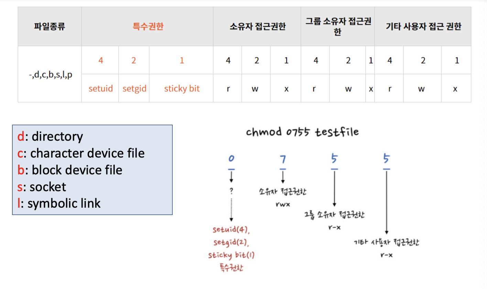

# 리눅스 파일 관리 시스템 Part 3 (파일 접근 권한)

<br/>

> 참고 자료 : '시스템 프로그래밍' 학부 수업 자료

<br/><br/>

### 목차

- <a href="">특수 권한</a>

  - <a href="">Real ID</a>
  - <a href="">Effective ID</a>
  - <a href="">Set User ID & Set Group ID</a>
  - <a href="">Sticky Bit</a>

- <a href="">파일 접근 권한 살펴보기</a>
<!-- - <a href=""></a> -->

<br/><br/>

## 특수 권한

### Real ID

- 프로그램을 실행시키면 프로세스가 만들어진다.

- 그런데 모든 사용자에겐 user id가 있다.

- 내가 어떤 프로세스를 만들면 그 프로세스 안에 나의 user id가 부여된다.

- 이 user id를 **real id**라 부른다. (실제 시스템에서 사용하는 id)

<br/>

- **`getuid` 함수** : 프로세스의 user id 확인

  - `uid_t getuid(void)`

<br/>

- (이 프로세스를 생성한) 내가 속해있는 그룹의 id를 알려면 **`getgid` 함수**를 호출하면 된다.

  - 이 또한 시스템에세 실제로 쓰는 real id이다.

  ```c
  #include <sys/types.h>
  #include <unistd.h>
  uid_t getgid(void) // process creator’s gid
  ```

  - 여기서 `sys/` 를 꼭 써주어야 한다.

<br/><br/>

### Effective ID

- 그런데 OS 입장에서는 real id보다 더 중요한 id가 존재한다. → **Effective ID**

- Effective ID는 OS 내에서 **보안 시스템 및 보안 규칙을 적용하기 위해** 관리하는 id이다.

  - **`geteuid` 함수** : effective id를 알고 싶을 때 쓰는 id

<br/>

- 마찬가지로 group id도 effective id가 존재한다.

  - **`getegid` 함수** : 이를 알기 위한 함수

    - 역시 마찬가지로 사용자의 real group id와 같은 정보가 배정된다.

<br/><br/>

### Set User ID & Set Group ID

- 일반적으로 대부분의 프로세스들은 effective id와 real id가 같다.

- 그런데 가끔 보안을 위해서 이 둘이 다른 경우가 있다.

<br/>

- mount라는 파일은 다른 사용자가 실행시킬 수 있는 파일이다.

- 이 파일은 소유자가 루트고, 속한 것도 루트 그룹에 있다. 근데 내가 이를 실행시킬 수는 있다.

- 내가 이를 실행시키면, 이 mount 파일의 real id는 나라는 유저의 id가 된다.

- 일반적으로 effective id도 나라는 유저 id가 된다.

<br/>

- 그런데 mount는 어떤 파일 시스템에 들어가서 거기에 있는 어떤 속성을 바꾸는 등 중요한 작업을 하는 파일이다.

- 이는 내 권한으로는 할 수 없는 일이지만, mount 프로세스의 real id가 ‘나’, effective id가 모두 ‘나’다.

- 그래서 이 파일에 접근은 가능하나 작업을 할 수 없는 상황이 발생한다.

<br/>

- 이런 상황을 해결하기 위해 **set user id bit, set group id bit를 설정**해줄 수 있다.

  - 어떤 특정한 파일에 set user id bit 설정 : <strong>`chmod (user에다가 set을 하겠다) +s`</strong>

  - 어떤 특정한 파일에 set group id bit 설정 : <strong>`chmod (group bit에 set을 하겠다) +gs`</strong>

- set 된 걸 확인하는 방법

  - ls로 보면 → rw**s**r

- 이렇게 하면, OS에서 프로세스의 effective id를 내 id가 아닌 이 파일에 부여된 유저(예시에선 root)의 id로 변경한다.

<br/><br/>

### Sticky Bit

- 디렉토리에 write 권한을 설정하거나

- '파일을 올릴 수는 있지만, 다른 사람의 파일을 삭제하거나 변조할 수 없다'는 설정을 디렉토리에 적용하려 할 때

- **sticky bit**를 쓴다.

<br/>

- if sticky bit = **1**,

  - 그 파일은 타인들도 거기에 파일을 올릴 수 있다.

  - 그러나 본인이 올린 파일만 수정 가능하고, 다른 사람의 파일은 수정할 수 없다.

  - 이렇게 하려면 그 디렉토리의 others에 `+t` 옵션 부여해준다.

<br/>

- `touch` : 사이즈가 0인 파일 생성

  - 파일이 생성되면 inode가 만들어진다.

  - 이 inode에 들어가면 데이터에 대한 정보가 없음 (사이즈가 0이므로)

<br/><br/>

## 파일 접근 권한 살펴보기



- 보는 법 (예: 소유자 접근권한)

  - 7 = 4 + 2 + 1 → rwx
  - 6 = 4 + 2 + 0 → rw
  - ..

<br/>

- 어떤 실행되는 프로세스의 파일에 접근하려 한다.

- 그럴려면 어떤 권한이 있어야 할까?

  - **내 프로세스의 effective id가 supervisor(최고 권위자)이면 된다.**

  - supervisor의 effective id = `0`

  - 리눅스에서 supervisor을 **root**라 부른다. (디렉토리의 root와 다름!!)

<br/>

- 프로세스의 effective user id와 내가 접근하려 하는 파일의 effective user id가 같으면, 내가 권한을 가진 파일이므로 접근할 수 있다.

  - 다만, permission(read, write, execution)에 내가 하려는 동작이 허용이 되있어야 한다.

- 나의 effective group id와 그 파일의 effective group id가 같으면

  - 그룹의 권한을 갖고 있으므로 그 파일을 읽을 수 있다. 다만 내가 할려는 동작이 permit 되어 있어야 한다.

- Others : 누구나 다 와서 이런거 봐도 된다. (write permission은 잘 안준다.)

<br/>

### Set Group ID Bit가 설정된 프로세스 파일에서 새 파일을 생성하는 경우

- 내 프로세스에서 파일을 열고 fwrite해서 파일을 하나 만들 수 있다.

- 그 파일의 user id, group id는 만드는 사람의 id로 설정된다.

- 현재 그 파일을 만드는 프로세스의 effective user id, effective group id는 그 파일의 소유자로 설정된다.

- 그런데 **예외적인 경우**가 있다.

  - 디렉토리를 봤더니 **set group id bit가 세트**되어 있다.

    - 그럴 경우, 그 디렉토리에서 만드는 파일의 group id는 내 group id로 설정되는 것이 **아니고**, 그 디렉토리에 부여된 group id로 설정된다.

<br/>

### access 시스템 콜

- access 라는 시스템 콜을 부르는 프로세스

  - 예 : 우리 코드 안에서 우리가 실행시킨 프로그램

- 우리 코드 안에서 access를 부르면 path 경로에 있는 그 파일에 내가 접근할 권한이 있는지 체크

  - 권한이 있으면 True, 없으면 False

- 이 때 그 파일에 대해 read, write, execution 등의 권한이 없는가를 확인한다.

<br/>

- 만일 read 권한과 write 권한을 모두 체크하고 싶다면, 두 개를 logical OR로 연결하면 된다.

  `(R_OK | W_OK)`

<br/>

### 시스템의 Default 권한

- 우리가 파일에 특별한 권한 모드를 지정하지 않고 **그냥 파일을 생성하면 시스템에서는 default로 permission을 준다.**

- Default 권한

  - **owner** : read, write 권한을 준다. execution 권한은 안준다.

    (c 소스가 컴파일 되고 바이너리가 만들어진 것을 확인한 후 부여해야 함)

  - **group** : read, write 부여

  - **others** : read, write 부여

  - 666

<br/>

### umask 시스템 콜

- User Mask의 약자로, **새로 생성되는 파일이나 디렉토리의 기본(Default) 권한을 설정**하는 데 사용하는 시스템 콜이다.

- 내가 만일 디렉토리를 만든다면, execution 권한을 부여해야 그 안에 있는 리스트를 볼 수 있다. (ls)

  - 666이 아닌 777을 default로 만든다.

- 그런데 파일을 생성하면서 666이 맘에 들지 않아, 어떤 기능은 끄고 싶다면,

  - 끄려고 하는 비트를 직접 설정해줄 수 있다. → **umask** 시스템 콜

<br/>

- umask 값은 3자리 숫자로 표현된다.

- 이 숫자는 파일 또는 디렉토리의 권한 비트를 나타내는 8진수 값에서 뺀 값이다.

  - 예를 들어, `022 umask` 값을 사용하면

  - 새로운 파일의 기본 권한이 `644 (-rw-r--r--)`이 되고

  - 디렉토리의 기본 권한이 `755 (drwxr-xr-x)`이 된다.

<br/>

- 앱에서 사용하는 시스템 콜 뿐만 아니라, shell에서 제공하는 쉘 명령어도 동일한 이름으로 umask이다.

  - touch 명령어를 파일을 만들고 걔가 어떤 권한으로 만들어졌는지 ls -al로 확인할 수 있다.

- umask를 8진수로 쓸 수 있지만, 앱에선 8진수를 쓰는 것을 피하는 것이 좋다. (처음 보는 사람들은 모르므로)

- 가급적이면 논리적인 의미를 갖는 모드 이름의 결합으로 표현하는 것이 좋다.

  - 다만 cmask에서 이런 비트들의 값이 들어간다는 이야기 → 그 비트를 켜겠다? 끄겠다? → 끄겠다.

- 파일의 permission 모드를 바꿀 수 있다.

  - **umask**은 파일 permission 모드의 default 값을 설정해주는 역할

  - 이미 permission이 있어도 강제로 내가 원하는 permission으로 바꾸고 싶을 때 **chmod**라는 명령어를 쓴다.

  - 많은 시스템 콜이 쉘에서 똑같은 이름의 명령어로도 제공된다.

  - read user write 등을 8진수로 주어도 되고, 앞에서 본 심볼들의 결합으로 주어도 된다.

    - 이것은 경로에 있는 파일을 지정할 때

    - 이미 파일을 열면, 파일 디스크립터 하나 할당

    - 그 파일 디스크립터가 가리키는 파일을 이렇게 바꾸자 ← 이렇게 할 수도 있다.

  - 파일의 정보를 읽는 스텟이라는 파일

    - 연 파일의 정보를 읽을 때 → fstat

  - 정상적이면 0, 비정상적이면 -1 (perror)

<br/>

- `chown`

  - owner을 바꾸어라

  - owner은 크게 두 종류가 있다.

    - owner_id, groud_id는 숫자로 지정되어 있음

- `lchown` : 링크를 따라가지 않는다.

  - 링크는 심볼릭 링크

  - target 파일에 적용하지 않고 symbolic link에 적용한다.

<br/>
