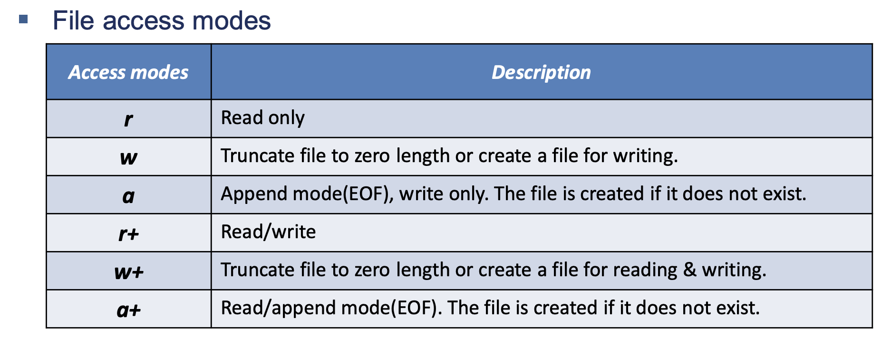
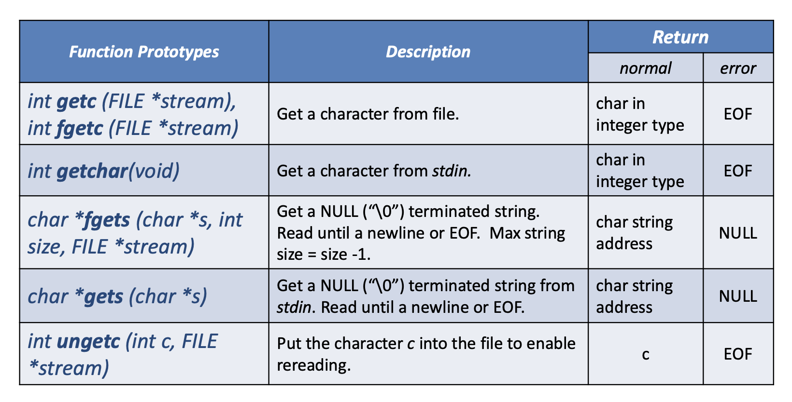

# 파일 I/O Part 2 (파일 스트림과 디스크립터, 버퍼 심화)

<br/>

> 참고 자료 : '시스템 프로그래밍' 학부 수업 자료

<br/><br/>

### 목차

- <a href="https://github.com/SangYoonLee1231/TIL/blob/main/Operating_System/System_Programming_Linux/file_io_pt2.md#%EB%A6%AC%EB%88%85%EC%8A%A4-%EB%AA%85%EB%A0%B9%EC%96%B4-%EB%A7%9B%EB%B3%B4%EA%B8%B0">리눅스 명령어 맛보기</a>
- <a href="https://github.com/SangYoonLee1231/TIL/blob/main/Operating_System/System_Programming_Linux/file_io_pt2.md#%ED%8C%8C%EC%9D%BC-io-part-1-%EB%B3%B5%EC%8A%B5">파일 I/O Part 1 복습</a>

- <a href="https://github.com/SangYoonLee1231/TIL/blob/main/Operating_System/System_Programming_Linux/file_io_pt2.md#%EB%B2%84%ED%8D%BC-buffer-%EC%8B%AC%ED%99%94">버퍼 (Buffer) 심화</a>

  - <a href="https://github.com/SangYoonLee1231/TIL/blob/main/Operating_System/System_Programming_Linux/file_io_pt2.md#%EB%9D%BC%EC%9D%B4%EB%B8%8C%EB%9F%AC%EB%A6%AC-%EB%B2%84%ED%8D%BC-library-buffer">라이브러리 버퍼 (Library Buffer)</a>
  - <a href="https://github.com/SangYoonLee1231/TIL/blob/main/Operating_System/System_Programming_Linux/file_io_pt2.md#%EC%BB%A4%EB%84%90-%EB%B2%84%ED%8D%BC-%EC%BA%90%EC%8B%9C-kernal-buffer-cache">커널 버퍼 캐시 (kernal buffer cache)</a>

- <a href="https://github.com/SangYoonLee1231/TIL/blob/main/Operating_System/System_Programming_Linux/file_io_pt2.md#%ED%8C%8C%EC%9D%BC-%EA%B4%80%EB%A0%A8-%ED%95%A8%EC%88%98">파일 관련 함수</a>
<!-- - <a href=""></a> -->

<br/><br/>

### 리눅스 명령어 맛보기

- <code>ls /</code> : 현재 디렉토리 리스트 보기 + 루트

- <code>ls /sp-resource/</code> : sp-resource 디렉토리 내부 보기

- <code>ls /sp-resource/.\*</code> : .으로 시작하는 모든 것을 보여줌

  - <code>..</code> : 현 디렉토리의 하나 위

- <code>pwd</code> : 현재 자신의 위치를 확인하는 명령어

- <code>cp -r /sp-resource/.vim\* .</code> : vim으로 시작하는 모든 디렉토리를 복사

  - <code>cp</code> : 복사

  - <code>-r</code> : 서브 디렉토리까지 모두 긁어서 가져옴

  - <code>.</code> : 현재 위치

- <code>ls -al</code> : 모든 파일과 속성 표시

- <code>vi test.c</code> : 기본 템플릿으로 소스 코드 보기

- <code>cp -r /sp-resource/ .</code> : 루트 밑 sp-resource에 있는 모든 것을 현재 디렉토리로 복사

<br/><br/>

## 파일 I/O Part 1 복습

- I/O 스탠다드 라이브러리가 제공하는 I/O Function을 지금까지 써왔다.

  - fprint() 등

- 결국은 OS가 제공하는 파일 시스템 콜을 써야 OS에게 서비스 요청이 간다.

- 라이브러리가 제공하는 함수, 그걸 왜 써야하는지?, 무슨 특징이 있는지?

  1. 라이브러리가 사용자에게 편리성을 제공한다.

  2. 라이브러리에 버퍼를 두어 커널에서 올라오는 데이터를 버퍼에 임시로 저장해서 이를 반복적으로 활용할 수 있다. (반복 호출 방지)

     1. 버퍼 = 캐시

<br/>

- 캐싱 기법은 모든 계층에 적용된다.

  - 하드디스크 보다 더 빠른 SSD의 속도에 비하면 하드디스크는 너무 느린 장치

    - SSD의 일부에 하드디스크의 저장 내용을 올려둠

    - 하드디스크에 접근하는 횟수 감소 → 성능 개선

  - 느린 장치의 데이터 → 빠른 장치의 데이터에 올려둠 : **캐싱 기법**

- 파일 스트림과 파일 디스크립터는 1대1로 대응

  - 파일 스트림 안에는 파일과 관련된 여러 정보들이 있지만

  - 그 중 중요한 정보로 파일 디스크립터가 몇 번인지 기록하고 있다

- 파일 디스크립터는 파일의 장치 정보를 담고 있는 일종의 인덱스

  - 프로세스 만들어지면 기본적으로 3개가 할당

    - stdin, stdout, stderr → 0, 1, 2번

<br/>

- 반대로, 시스템 콜을 이용해서 바로 파일을 오픈하고 작업할 수 있다.

- 시스템 콜을 이용해서 파일을 오픈하면 파일 스트림 구조체가 만들어지지 않는다.

  - 파일 스트림 구조체는 라이브러리 콜을 통해서만 만들어지는 구조체

  - 시스템 콜은 파일 스트림을 만들지 않는다.

  - fdopen : 시스템 콜을 통해 파일 디스크립터만 만들고 → 이를 가지고 오픈(read, write)모드를 갖는 파일 스트림 구조체를 만들어줘

<br/>

- 함수의 이름, 인자, 반환값, 값들의 타입 꼭 잘 기억할 것

<br/><br/>

## 버퍼 (Buffer) 심화

- 버퍼링의 종류

  - 유저 레벨의 버퍼링 : 라이브러리 버퍼 (library buffer)

    - Full, Line, Unbuffering은 이 버퍼를 어떻게 사용할 것인지에 관한 이야기이다.

  - 커널 안에서의 버퍼링 : 커널 버퍼 캐시 (kernal buffer cache)

  <br/>


<br/>

## 라이브러리 버퍼 (Library Buffer)

- 라이브러리 버퍼는 내가 쓰는 라이브러리에서 관리하는 버퍼

  - fread → 데이터 전달 → buffer에 자연스럽게 카피

  - 만일 버퍼가 없다면 바로 커널에 진입해야 함

  - 버퍼가 있으면, 엔터가 들어오거나, 버퍼에 있는 내용이 일정량 다 차야 커널에 전달

  - 버퍼를 사용할 때, (출력을 예로 듦) 내가 write 하면 버퍼링 하지 말고 바로 커널로 내려보내서 장치에 나타나게 하라 → **Unbuffering**

  - 시스템 콜로 매번 내려보내면 시간 오래 걸림, 비용 문제 발생 → 그래서 버퍼를 씀

<br/>

### 버퍼링 모드

- **Full Buffering** : 버퍼 용량이 꽉 차야 다음 과정(ex: I/O)이 수행

  - 시스템 콜 횟수 현격히 줄일 수 있음

  - 버퍼가 꽉 찰 때까지는 눈에 나타나지 않는다.

  - fflush 함수 : (버퍼의) 모든 걸 내려보내라

- **Line Buffering** : 한 줄이 찰 때마다 커널로 내려보내라

  - \n이 나와야만 한 줄로 인식

  - getchar() (키보드에서 문자 하나씩 받아들일 때) 문제
    - line buffering에선 getchar() 함수가 정상적으로 동작하지 않음

- **Unbuffering** : 버퍼를 쓰지 말고 곧바로 커널로 내려보내 장치에 결과가 나타나게 하라

<br/>

- 상황을 보고 버퍼링 모드를 사용해야 할 때 쓰고 아님 말고

- fflush() 써도 된다.

- 데이터 안정성을 추구하려면 시스템 콜을 자주 호출하여 버퍼에 있는 데이터를 내려보내야 한다.

- 시스템을 잘 이해하고 있자.

<br/>

- 리눅스에선 (디폴트 값)

  - stderr : 항상 unbuffering (긴급한 메세지)

  - stdin/stdout : 항상 line buffering

  - 그 외 나머지 : 항상 full buffering

<br/>

### 버퍼링 관련 함수

- <code>void **setbuf** (FILE *stream, char *buf);</code>

  - <code>char \*buf</code> : character array의 주소, 8KB or 16KB 잡아놓고 그 주소 가짐

  - 그 array을 <code>FILE \*stream</code>이 사용하는 버퍼로 세팅

  - <code>char \*buf</code>이 <code>NULL</code>이라면 Unbuffering으로 쓰겠다는 의미

- <code>int **setvbuf** (FILE *stream, char *buf, int type, size_t size);</code>

  - <code>int type</code> : 버퍼링 타입 지정 (Full, Line, Unbuffering)

  - <code>size_t size</code> : 버퍼 사이즈 지정

  - **return 값** : 0이면 성공적으로 수행, 0이 아니면 에러 코드 반환

<br/>

- 에러 코드를 잘 처리하는 것도 매우 중요한 일 중 하나

- 시스템 콜이든 라이브러리 콜이든 호출하면 리턴값을 확인하는 습관을 가질 것

<br/><br/>

## 커널 버퍼 캐시 (kernal buffer cache)

- 디스크에서 데이터를 읽으면, 버퍼 캐시에도 그 데이터를 카피한 다음, 위로(유저 스페이스 영역으로) 데이터를 올려보낸다.

- 커널 버퍼 캐시의 목적 : 디스크의 접근 횟수를 줄이기 위해서

  - b/c : 디스크에 접근에서 데이터를 읽어오는 시간이 (CPU 입장에서) 오래 걸린다.

- OS는 디스크에서 데이터를 **바이트 단위가 아닌** **block 단위(2KB or 4KB)로 읽어온다.**

  - 데이터 하나를 읽더라도 그 데이터가 있는 블록 전체를 가져와서 버퍼 캐시에 저장한다.

### 버퍼 캐시의 유용함

- 버퍼 캐시는 읽을 때에도 유용하다.

  - 디스크까지 내려갈 필요 없이 버퍼 캐시에서 데이터를 읽으면 되므로

- 버퍼 캐시는 쓸 때도 유용하다.

  - 먼저 캐시에 데이터를 저장하고, 나중에 디스크로 내려보낸다.

  - 만일 캐시가 없다면, 느린 기계(하드디스크)에 데이터를 계속 넣게 되므로 전체 성능이 떨어진다.

- **Delayed Write** : 디스크에 데이터가 write 되는 시점이 실제 write 시점보다 약간 늦게 일어난다.

  - 성능 개선 효과 but 갑자기 전원이 나가면 데이터가 증발할 위험이 있다.

<br/>

### `fflush` 함수

- 라이브러리 버퍼에 있는 내용을 커널 버퍼 캐시로 내려보내는 함수

- `fflush`를 쓰면 딜레이 없이 데이터를 보거나 읽을 수 있다.

- 디스크 단위로 입출력한다. → Block Device I/O

  - 디스크와 커널 사이 KB 단위로 데이터가 이동한다. → block

- buffer cache는 page cache와 동일한 개념이다.

- 커널 버퍼 캐시에 있는 데이터를 디스크로 내려보내는 함수 → `fsync()`, `sync()`

- 시스템 전원을 끄기전 `sync` 함수를 호출해줘야 데이터 손실을 방지할 수 있다.

- 파일이 닫힐 때, `fflush` 함수가 자동적으로 호출된다.

  - 파일 라이브러리에 있던 모든 데이터가 화면에 나타나고 파일이 끝난다.

- OS system의 `open` 함수

  - O_SYNC를 주면 커널 버퍼 캐시를 거치지 않고 데이터를 바로 디스크로 내려보낸다. (손실되면 큰일나는 중요한 데이터를 다룰 때 씀)

<br/>

### 그 외 버퍼 관련 함수

#### `fread`

- <code>size_t fread (void *ptr, size_t size, size_t nitems, FILE *stream)</code>

  - <code>void \*ptr : 데이터를 읽어왔을 때 데이터를 담을 버퍼의 주소</code>

  - <code>size_t size : 읽을 데이터의 크기 (객체 유닛 하나의 크기)</code>

  - <code>size_t nitems : 객체의 개수</code>

  - <code>FILE \*stream : 어떤 파일 스트림으로부터 데이터를 읽을 것인가</code>

  - return 값

    - 정상 : 성공적으로 읽은 오브젝트의 개수
    - 에러 : 0

  - <code>size_t</code>는 사이즈를 나타내며 unsigned int 타입이다. (typedef으로 변환해준다)

    - <code>typedef size_t, unsigned int</code>

#### `fwrite`

- <code>size_t fwrite (void *ptr, size_t size, size_t nitems, FILE *stream)</code>

  - <code>void \*ptr</code> : 데이터를 쓸 버퍼의 주소

  - <code>size_t size</code> : 읽을 데이터의 크기 (객체 유닛 하나의 크기)

  - <code>size_t nitems</code> : 객체의 개수

  - <code>FILE \*stream</code> : 어떤 파일 스트림에 데이터를 쓸 것인가

  - return 값

    - 정상 : 정상적으로 쓴 오브젝트의 개수
    - 에러 : 0

<br/>

### 버퍼 내용 정리

- **라이브러리 버퍼**

  - (유저 레벨에서 사용하는) 라이브러리 함수에서 사용하는 버퍼

  - 시스템 콜의 횟수를 줄일 수 있다

- **버퍼 캐시 (커널 버퍼, 페이지 캐시)**

  - 디스크 접근을 줄이기 위해 존재한다

  - 필요한 데이터(예 : n바이트)가 있는 블록의 전체를 모두 보낸다 (덩어리 단위)

    - block 단위 : 1KB, 2KB, 4KB

    - 디스크는 느린 장치 → 빠른 장치에 데이터를 큼직하게 올려두는 것이 더 이득

    - 버퍼 캐시에 실제로 데이터를 카피하고, 응용 어플리케이션이 요구하는 일부 데이터만 유저 스페이스로 올려준다.

- (읽는 용도보다) 버퍼링에서 데이터를 쓸 때 일어나는 문제

  - 버퍼에만 데이터를 쓰고 실제 장치로는 보내지 않은 상태에서 전원이 갑자기 나가게 되면 응용 프로그램에서 기록해놓은 데이터들이 유실되는 문제가 발생한다

  - 항상 라이브러리 버퍼를 커널로 내리도록 지시하는 함수 : `fflush` 함수

- 커널에서도 마찬가지 현상이 일어난다.

  - 커널에서도 데이터가 내려오면 바로 디스크로 내려보내지 않고 버퍼 캐시에 담아둔다.

    - 이유 : 디스크에 계속 접근하면 시스템이 느려지기 때문

  - 디스크로 커널에 있는 데이터를 바로 내려보내는 함수 : `sync` 함수

    - `sync` 함수 : 버퍼 캐시 → 디스크로 내려보냄 (전원 내려도 괜찮)

    - 명령어에도 `sync`가 있다.

    - 데이터를 안전하게 저장 → 전원 내려도 데이터 유실 X

<br/><br/>

## 파일 관련 함수

#### **File Open**

- <code>FILE * fopen ( const char *filename, const char \*type);</code>

  - return한 반한값이 NULL인지 항상 체크를 해주어야 한다.
    - `if (fp = NULL) { /_\*파일 오픈에 실패_\*/ }`

  

- 파일 디스크립터 개수 : 1024개

- 파일 스트림은 1024개보다 적다
  - 파일 스트림 구조체 자체가 메모리 크기를 상당부분 차지하기 때문

<br/>

#### **File Reopen**

- <code>FILE * freopen (const char *filename, const char *type, FILE *stream);</code>

  - <code>FILE \*stream</code> : 기존에 이미 만들어진 파일 스트림

  - 먼저 파일 스트림과 이미 연결되어 있는 파일을 닫는다.

  - <code>const char \*filename</code> 파일과 파일 스트림을 연결한다.

  - file descriptor와의 관계는 유지가 된다.

  - 예시 코드

    ```c
    freopen("myfile.txt", "w", stdout);
    printf("This sentence is redirected to a file.");
    fclose(stdout);
    ```

<br/>

#### File Close

- <code>int fclose( FILE \*stream);</code>

  - 파일을 닫는 함수

  - return 값 : 정상적으로 닫히면 0, 에러면 EOF

  - 프로세스가 정상적으로 종료되면, OS가 파일 디스크립터 테이블을 보고 관련 모든 파일을 종료시킨다. (자동으로 종료되는 것처럼 보임)

  - 파일 다썼으면 fclose를 꼭 해주어야 데이터 손실을 방지할 수 있다.

<br/>

#### File Write

- `size_t fwrite (void *ptr, size_t size, size_t nitems, FILE *stream)`

  - `void \*ptr` : 데이터를 쓸 버퍼의 주소

  - `size_t size` : 읽을 데이터의 크기 (객체 유닛 하나의 크기)

  - `size_t nitems` : 객체의 개수

  - `FILE \*stream` : 어떤 파일 스트림에 데이터를 쓸 것인가

  - return 값

    - 정상 : 정상적으로 쓴 오브젝트의 개수

    - 에러 : 0

<br/>

#### Character Input 함수



- `int getc()` (오타) : 표준 입력에서 읽을 때

  - Line Buffering 모드에선 정상적으로 동작하지 않는 것처럼 보일 수 있다.

- `int fgetc(FILE \*stream)`

<br/>

#### Character Output 함수


<br/>
