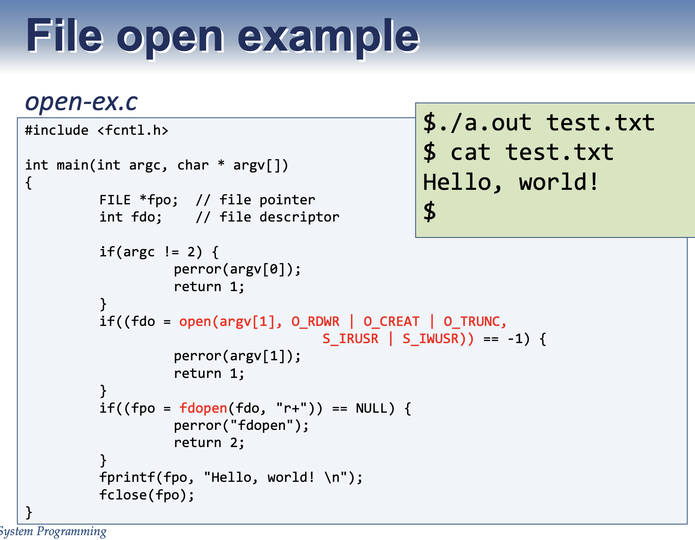

# 리눅스 파일 관리 시스템 Part 1 (inode, File Discriptor)

<br/>

> 참고 자료 : '시스템 프로그래밍' 학부 수업 자료

<br/><br/>

### 목차

- <a href="">inode</a>
- <a href="">디렉토리 파일</a>
- <a href="">inode와 하드디스크</a>
- <a href="">파일의 여러가지 타입</a>
- <a href="">파일 디스크립터 (in Linux)</a>
<!-- - <a href=""></a> -->

<br/><br/>

리눅스의 시스템 콜과 함께 리눅스가 제공하는 파일 정보들이 어떻게 관리되는 지 눈여겨볼 필요가 있다.

<br/>

### inode

- 파일 시스템의 각 파일들은 **inode**라는 것을 갖는다.

  - **inode**: 모든 정보(파일의 관리 정보)를 갖고 있는 구조체 (파일 속성)

    - file name
    - file type (regular, directory,...)
    - file owner id
    - access permission : 보안 등급
      rwxr-xr-x (for owner, group, others)
    - creation/modified time : 최근 생성/수정 시간
    - file size : 파일 크기 (Block 단위로 관리)
    - file data block addr. table : 모든 하드디스크는 Block 단위로 쪼개지고, 각 단위는 **Block Address(블락 포인터)**를 갖는다.

  - OS는 파일의 내용 보단 파일의 이름, 타입, 속성 등에 더 관심이 있다.

  - 내가 파일을 만들면 OS는 그 파일에 대한 inode를 함께 만든다.

<br/>

#### **Block Address(블락 포인터)**

- 하드 디스크의 데이터를 일정 크기로 쪼갬 → 번호 붙임→ 블락 어드레스 (블락 포인터)

- 한 블록에 데이터가 들어가지 않는다면 여러 블록에 데이터를 나눠서 저장한다.

- 대신 각 블록이 어디에 있는지는 inode에 기록되어 있다.

  - File Data Block Address Table

- 파일 개수 = inode 개수

- inode도 하드 디스크에 저장된다.

- 하드 디스크의 공간은 inode가 저장되는 공간과 데이터가 저장되는 공간으로 분할된다.

- 파일 시스템 : inode와 데이터들의 집합

<br/>

### 디렉토리 파일

- OS에서는 **디렉토리도 파일**이다.

- **디렉토리도 파일이라는 형태로 관리된다.**

- **심볼 링크** : 윈도우즈의 단축 아이콘

  - 경로명이 들어가 있다.

  - 소프트 링크라고도 부른다.

  - 자세한 내용은 Part 2를 참고

- inode도 고유한 번호가 있다.

<br/>

### inode와 하드디스크

- 리눅스 시스템에서는 파일 자체도 중요하지만 파일을 관리하는 속성 정보가 더 중요하다.

- 하드디스크를 보면 inode들이 쭉 저장되어 있다.

  - 그 뒤에 실제 데이터가 저장되어 있다.

- 디스크에 데이터를 저장할 때 기본단위는 **블록**이다.

  - 블록의 크기는 시스템마다 다르다.

  - 효율적인 이유

    - 바이트 단위로 주기 시작하면 시작 주소 정보가 길어질 수 있다.
    - 주소 정보를 단순하게 관리하기 위해 → 리스크도 물론 있음

- **inode 구조** 사진

  

<br/>

- inode 구조 ← 하드디스크에 있음

  - inode 맨 앞에 기본정보

    - 소유자, 파일 이름, 파일 사이즈, 생성/수정 시간 등

  - 나머지 15개

    - 실제 파일이 있는 곳을 가리키는 포인터들

    - 이 중 12개는 직접 블록을 가리키는 블록 정보를 담고 있고
    - 나머지 3개는 indirection 사용

  - indirection을 사용하면 정보를 읽는데 시간이 더 걸린다. → 퍼포먼스 문제

  - 합의 결과 12개의 포인터로 데이터에 직접 접근하도록 하자

<br/>

### 파일의 여러가지 타입

- 일반적인 파일

  - 텍스트, 바이너리 파일

- 디렉토리 파일

  - 파일 이름과 그 파일의 inode 번호를 가리키는 파일

- Character Special File

  - 디바이스 파일

  - 장치에 접근하려면, 그 장치에 해당되는 객체가 있어야 한다. ← **리눅스에선 모든 장치를 파일로 다룸**

  - Character-oriented device (e.g. Keyboard)

    - 바이트 by 바이트 단위로 캐릭터를 주고 받음 (Block이 아님)

    - 하드디스크는 Block 단위

  - FIFO 파일

    - 다른 이름으로 파이프

    - Named Pipe vs Unnamed Pipe

      - 많이 쓰는 건 이름을 안 쓰는 파이프 파일(unnamed pipe)

  - Symbolic link file

    - 어떤 파일의 경로 정보를 담고 있는 특별한 파일

    - (윈도우의 단추 바이커(?))

      - vs Hardlink : 하드 링크는 파일이 아니다.

<br/>

- 리눅스

  - 맨 앞은 파일 타입을 나타냄
    - d : 디렉토리
    - c : 캐릭터 디바이스
    - b : 블록 디바이스
    - l : 심볼릭 링크

<br/>

### 파일 디스크립터 (in Linux)

- 어떤 파일에 부여한 0 이상의 int

- stdin, stdout, stderr ← 0, 1, 2 (자동 생성)

- 각 프로세스가 생성이 되면 파일 디스크립터 테이블이 만들어진다.

- 파일 디스크립터 테이블

  - 그 프로세스에서 오픈하는 파일들의 정보를 관리하는 테이블

- `echo “foo bar baz” | wc - w`

  - `echo` : 뒤의 문자열을 화면에 표준 출력하라

  - `|` : 바로 표준 출력하지 않고, 뒤에 오는 응용 프로그램에 입력 데이터로 보냄

  - `wc` : word count (파일의 라인수, 캐릭터 수 등을 파악할 때 사용)

    - -w : 단어의 개수
    - -l : 라인의 개수
    - -c : 글자 수

- Relying on “magic numbers” is BAD.

  - stdin 등을 쓸 때 0, 1, 2 쓰지 말고 심볼을 써라.

    - 의미 파악을 명확히 하기 위해

    - `STDIN_FILENO`, `STDOUT_FILENO`, `STDERR_FILENO`

- 한 프로세스에서 오픈할 수 있는 최대 파일 수는 1024개

  - 리눅스 서버에서 내가 사용할 수 있는 파일 개수 등을 알아보기 위해 쓰는 명령어 : ulimit -a (모든 정보 표시)

<br/>

- 리눅스에서 제공하는 파일 I/O

  - open
  - close
  - lseek : 내가 원하는 곳으로 Offset을 옮김
  - read
  - write
  - 위 함수들의 시스템 콜 섹션은 전부 2다.

<br/>

#### File Open

```c
#include <fcntl.h>
int open(const char *path, int oflag);
int open(const char *path, int oflag, mode_t mode);
```

- `path` : 만들려는 파일의 경로명 (절대경로/상대경로)

- `oflag` (open flag) : 어떤 방식으로 read or wirte 할 것인지

  - `O_RDONLY(0)`, `O_WRONLY(1)`, `O_RDWR(2)`

  - 같이 쓰는 옵션 : `O_CREAT`, `O_EXCL`, `O_TRUNC`, `O_APPEND`, `O_SYNC`

- `mode` : file을 만들 때 이 파일은 나만 읽고 쓸 것인지, 그룹에게 읽고 쓰게 할 건지, 모두에게 읽고 쓸 것인지

- return 값 → 정상 : 파일 디스크립터 값 , 비정상 : -1

- file access mode

  - owner, group, others

  - R, W, X

  - 8진수로 표현

  - 특별한 모드

    - `S_ISUID`, `S_ISGID`, `S_ISVTX`

<br/>

#### File close

```c
#include <unistd.h>
int close(int fd);
```

- 파일 디스크립터를 주면 이를 닫는다.

<br/>

#### File Open Example

- 쉘에서 내 응용프로그램으로 정보를 전달하는 방법

  

- 우리가 리눅스에서 기본적으로 파일명을 주지 않고 컴파일을 하면 디폴드로 a.out이라는 이름이 붙여진다.

- 파일이 있는 위치를 명확히 표현해주어야 한다. (보안 문제)

  → `./a.out`

- `argv[1]`이 가리키는 문자열은 `test.txt` 문자열이 들어가있다.

- **시스템 콜로 파일을 오픈하면 파일 스트림이 만들어진다. (X)**

  - 라이브러리 함수로 오픈했을 때만 파일 스트림이 만들어진다.

  - `fdopen` : 파일 디스크립터와 오픈 모드를 인자로 준다.

  - 그 때 formatting library function을 쓸 수 있게끔 파일 스트림을 하나 만들어준다.

<br/>
