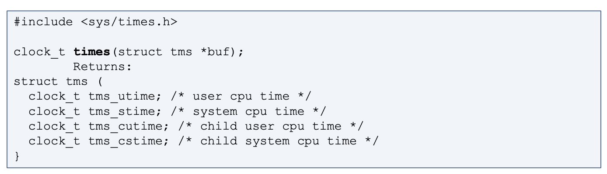

# Process를 Control하기 위한 시스템 콜 정리

 

> 참고 자료 : '시스템 프로그래밍' 학부 수업 자료

<!--   

### 목차

- 
-  -->

  

## Process Control 시스템 콜

#### `pid_t getpid(void)` (process id) : 프로세스 자신(caller process)의 pid를 리턴

 

#### `pid_t getpgrp(void)` (process group) : 프로세스 자신(caller process)의 group의 pid를 리턴

- 여기서의 group은 현재 생성된 process들이 만든 그룹으로 user group과는 다른 개념이다.

- 자기가 속해 있는 리더 (세션 리더) = 맨 처음 만들어지는 프로세스

- shell이 세션 리더이다.

- 세션 리더가 일반적으로 process group id의 역할을 한다.

 

#### `pid_t getppid(void)` (parent pid) : caller process의 부모 pid를 리턴

 

#### `pid_t getpgid(pid_t tpid)` (process group pid) : 어떤 pid값을 인자로 지정하면, 이 pid가 속해있는 process group의 id를 리턴

- 비정상시 -1이 리턴

- 서버에 접속할 때 처음 만들어지는 세션 리더, 그 프로세스의 pid가 그로부터 생성되는 프로세스 group의 process group id가 된다.

- 세션 리더에게 signal이 전파되면, 그 signal이 리더 프로세스의 그룹 내에 있는 모든 프로세스들에게 전파될 수 있다.

  - signal의 예시 : process kill signal (sigkill)
  - 세션 리더가 종료되면 그 그룹에 속해있는 모든 자식 프로세스들에게 SIGHUP signal이 전달되고, 강제 종료 된다.
  - 따라서, 어떤 굉장히 계산량이 많은 자식 프로세스가 위와 같은 상황으로 인해 세션에 로그아웃 되더라도 계속해서 계산을 수행할 수 있도록 하기 위해선, 그 프로세스를 background mode로 돌려야 한다.
    - $ nohup command …. &
    - 표준 입출력인 TTY가 없어진 상황이므로, Standard I/O에 입출력을 하는 것이 아니라, 어떤 디스크에 있는 파일에 입출력을 하도록 프로그램을 설계해야 한다.

 

#### `setpgid` 시스템 콜

- 프로세스 리더를 중간에 바꿀수도 있는데, 이때 사용하는 시스템 콜이 `setpgid`이다.

- ``int **setpgid**(pid_t pid, pid_t pgid)`

  - 기능 : `pid`가 속해있는 process group id를 `pgid`로 설정해라

    

  - return 값 : 0 (정상) or -1 (에러)

 

#### `atexit` 함수

- ``int **atexit**(void (*func)(void))`

- 기능 : 프로세스가 종료되어 exit이 호출되었을 때 `void (*func)(void)`에 지정되어 있는 함수를 실행해달라

  - 이 함수를 exit handler이라 부른다.

  - function name 또는 function pointer이라 부른다.

  - 프로그램 종료 시 마지막에 해야될 일 : 파일 닫기, 메모리 해지하기 등의 뒷정리

- `atexit` 을 상황에 따라 여러 번 부를 수 있다.

  - exit handler은 스택처럼 쌓이므로, 맨 마지막에 호출된 `atexit`의 exit handler부터 호출된다.

- return 값 : 0 (정상) or 에러에 해당하는 호출 값 (에러)

 

#### `system` 함수

- `int **system**(const char *string)`

- 기능 : string으로 원하는 명령어를 전달하면 Shell Command를 실행

- system 명령은 실제로 실행될 때 shell 프로세스가 하나 만들어지고, 그 shell process에서 전달된 명령어를 수행하고, 그것의 exit code를 돌려주도록 구성되어 있다.

  - system 명령 수행 중 process가 하나 추가적으로 생성된다.

  

### Process Time 측정 함수

#### `times` 함수

- `clock_t **times**(struct tms *buf)`

- 시스템이 실행되면 clock tick이 지나간다. (초당 1000개 혹은 10000개)

- clock tick이 계속해서 증가한다.

- times를 부르면 그 때의 clock tick이 리턴된다.

- struct tms \*buf

  - 현재 실행하고 있는 프로세스가 실제로 CPU를 얼마나 썼는지를 알려준다.

    

- 시간 구분

  - wall clock time vs CPU time ← 둘을 구분해서 사용하는 것이 좋다.

 
