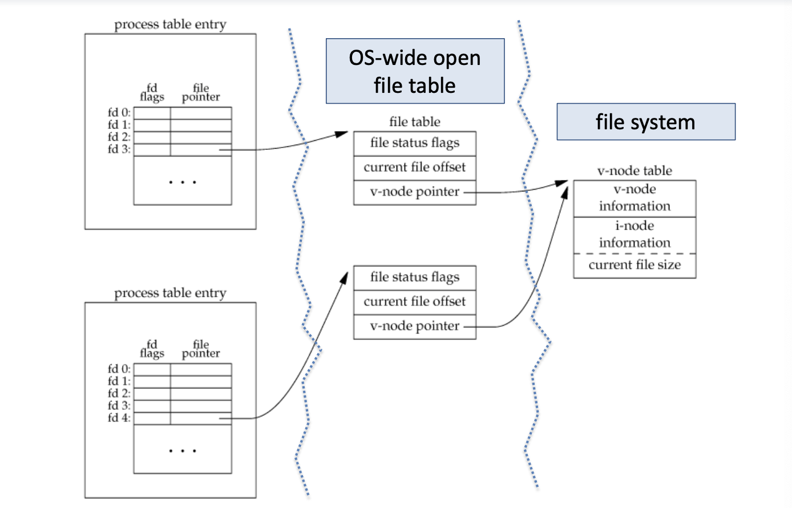
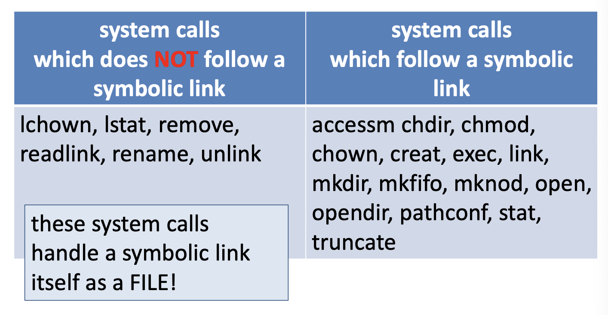

# 리눅스 파일 관리 시스템 Part 2 (v-node, Link)

<br/>

> 참고 자료 : '시스템 프로그래밍' 학부 수업 자료

<br/><br/>

### 목차

- <a href="">파일 디스크립터 시스템과 v-node</a>

  - <a href="">파일 디스크립터 (in Linux)</a>
  - <a href="">파일 테이블</a>
  - <a href="">v-node</a>

- <a href="">Hard Link vs Soft Link (Symbolic Link), Link 관련 시스템 콜</a>

  - <a href="">Hard Link</a>
  - <a href="">Soft Link</a>
  - <a href="">Hard Link Example</a>
  - <a href="">관련 시스템 콜</a>
  <!-- - <a href=""></a> -->

<br/><br/>

## 파일 디스크립터 시스템과 v-node

### 파일 디스크립터 (in Linux)



- 프로그램을 하나 실행시키면 프로세스가 생성

- 한 프로세스 안에는 그 프로세스가 오픈한 파일들의 리스트를 관리하는 테이블이 하나 있음  
  → 파일 디스크립터 테이블
- 파일 디스크립터 (넘버) : 각 엔트리에 할당된 인덱스

  - 0, 1, 2 : 표준 입력 장치, 표준 출력 장치, 표준 에러 장치

  - (파일 포인터가) 장치를 가리킴 = 시스템이 관리하는 그 장치에 관련된 정보를 가리킴

  - OS 안에 장치와 관련된 구조체들이 있음 → 파일 테이블

<br/>

### 파일 테이블

- 파일 status flag : read용인지 write용인지, 어떤 permission인지

- current file offset : 현재 Offset 값

- v-node pointer : 하드 디스크의 v-node 테이블을 가리키는 포인터

- 파일 테이블은 커널 메모리에서 관리된다.

<br/>

### v-node

- 리눅스에서 쓰는 i-node도 있고, 다른 형태의 파일 시스템도 있을 수 있다 (하둡 등)

- 이들을 통일된 형태로 인터페이스를 (위에서) 제공해주어야 한다.

  → **v-node**로 확장된 인터페이스 제공

- 리눅스만 쓰는 시스템에선 **v-node = i-node**

- **vnode는 하드 디스크에 있다.**

- dup
  - 기존의 오픈된 파일 디스크립터와 똑같은 엔트리를 만듦
  - int dup(int fd);
    - 쉘에서 파이프를 구현하려면 dup 함수가 필요함
      - 파이프 : 쉘에서 앞에서 작용한 표준 출력 결과를 뒤 프로세스에 넘겨주는 오퍼레이터

<br/><br/>

## Hard Link vs Soft Link (Symbolic Link), Link 관련 시스템 콜


### Hard Link

- 어떤 파일이 존재한다고 해보자.

- **이 파일에는 대응하는 하나의 inode가 있다.**

  - **inode는 이 파일에 대한 모든 정보를 가지고 있는 정보 구조체이다.**

  - 디렉토리 : 파일 이름과 inode의 집합

- myfile.txt를 만들면, OS에서 그것에 해당하는 inode를 자동으로 부여해준다.

- 경우에 따라 다른 지점에다가 “my-hard-link”라는 다른 이름의 파일을 만들 수 있다.

- 그리고 “myfile.txt”의 inode를 가리키도록 묶어줄 수 있다.

- 이렇게 하면 myfile.txt 뿐만 아니라 my-hard-link 파일로도 같은 파일에 접근할 수 있게 된다.

- 이렇게 같은 파일로 접근할 수 있도록 만든 링크를 **Hard Link**라 한다.

  - 이점 : 다른 이름으로 원하는 파일에 접근할 수 있다.

<br/>

### Soft Link

- 반면, 윈도우즈의 단축 아이콘은 Hard Link가 아니다.

- 어떤 아주 짧은 파일을 만들어 놓는다.

- 그 안에는 (내가 접근하려고 하는) 경로명이 들어있다.

- “my-soft-link’를 이런 방식으로 만들어 놓으면 내가 그 안에 있는 “myfile.txt”라는 이름을 읽고 그 파일로 이동한다.

- “my-soft-link”는 파일 그 자체가 경로명을 갖고 있는 short file이다.

- 이런 방식의 링크를 **Symbolic Link (Soft Link)**라 한다.

<br/>

- hard link와 soft link 이 둘의 목적은 별반 다르지 않다.

  - 다만 hard link가 좀 더 빠르게 동작한다.

- hard link는 하나의 링크를 끊는다고 해서 inode를 바로 삭제하지 않는다.

  - inode에는 **count**가 있다. (몇 개의 파일이 나를 가리키고 있는지)

  - 정확히는 **reference count**라 부른다.

    - 이 count가 0이 되어야 비로소 inode를 청소한다.

- 그럼에도 불구하고 **soft link가 유용한 이유**

  - 한 디스크에서 파일 시스템이 만들어지고, 다른 디스크에 또 다른 파일 시스템이 만들어질 수 있다.

  - 리눅스나 유닉스에선 이 둘을 연결하는 구조를 지원한다.

  - 그러나 inode는 한 개의 파일 시스템 내에서만 unique하다.

    - inode는 한 개의 파일 시스템 안에서 고유한 번호이다.

  - **즉, hard link는 서로 다른 파일 시스템 내 파일끼리 할 수 없다.**

    - 같은 파일 시스템 내에서만 hard link를 만들어놓을 수 있다.

  - **따라서 서로 다른 파일 시스템끼리 연결하고 싶으면 symbolic link를 써야 한다.**

<br/>

### Hard Link Example

  

```shell
$ ls -l my\*
drwxr-xr-x 3 oskernel oskernel 512 Jul 9 22:01 .
```

- 파일들에 대한 정보를 출력

- 여기서 3은 그 파일의 inode가 갖는 hard link의 수 (count 정확히는 reference count)

- 15는 파일 사이즈

<br/>

- 파일 네임은 링크이다. (심볼릭 링크도 있고 일반 파일 네임도 있음)


- 링크와 관련된 여러 시스템 콜들이 있는데

- 이 중에서, (symbolic link든 hard link든) 어떤 link가 있을 경우, 그 link가 가리키는 최종 목적지 파일(target file)에 가서 target file의 정보를 가져오는 시스템 콜이 있다. → 이것이 일반적이다.

- But, **link가 있으면 link 그 자체를 파일이라 생각하고, 그 link 파일에 오퍼레이션을 수행하는 명령어가 존재한다.**

- 즉, 이 명령어들은 target file까지 따라가지 않는다.

- symbolic link 파일에 오퍼레이션을 수행한다는 의미다.

  - **lchown** : link change owner (링크의 사용자 변경)

  - **lstat** : link 파일의 status 정보를 읽어낸다

  - **remove** : 대상 link 파일을 제거하거나 디렉토리를 제거한다. (일반적인 명령 rm + rmdir)

    - [비교] rmdir : 리눅스 명령어

  - **readlink** : link 파일에 있는 경로명을 읽어오는 명령어

  - **rename** : link 파일 이름을 바꾸는 명령어

  - **unlink** : 대상 link를 제거한다.

<br/>

### 관련 시스템 콜

#### `int lstat(const char *path, struct stat *buf);`

- `lstat`는 그 링크가 가리키는 target 파일이 **아닌** 그 llnk 파일의 정보를 가져온다.

- return 값 → 정상 : 0, 비정상 : 1 (perror 함수를 불러 에러의 원인을 출력할 수 있도록 한다)

<br/>

#### `int fstat(int fd, struct stat *buf);`

- 파일을 하나 열면 파일 디스크립터가 하나 할당

- 그 이미 열린 오픈된 파일의 파일 디스크립터를 이용해서 파일 정보를 가져온다.

- 경로명이 필요 없음

- `fd` : 파일 디스크립터 (번호)

<br/>

#### Macro

  

- mode 정보 인자를 macro에 적용

- macro는 이미 만들어져 있음

- ISREG = is regular file

- ISCOCK → ISSOCK = is socket

<br/>
