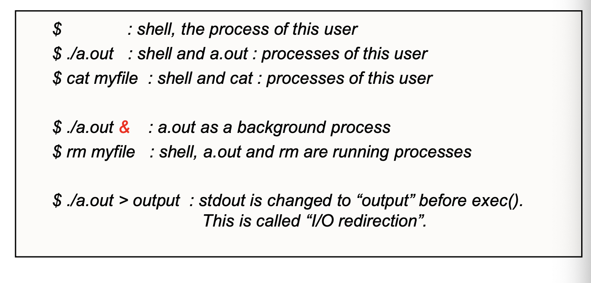
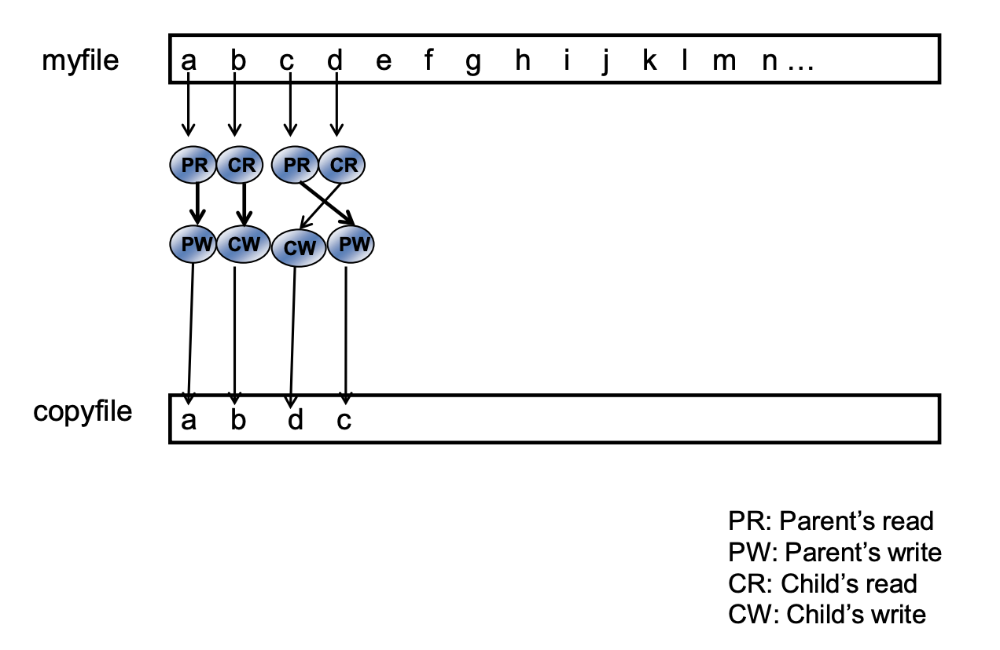

# 리눅스 파일 관리 시스템 Part 4 (프로세스 생성 및 관리 - <code>fork</code>, <code>exec</code> 시스템 콜)

 

> 참고 자료 : '시스템 프로그래밍' 학부 수업 자료

  

### 목차

- <a href="https://github.com/SangYoonLee1231/TIL/blob/main/Operating_System/System_Programming_Linux/linux_file_system_pt4.md#%ED%94%84%EB%A1%9C%EC%84%B8%EC%8A%A4-%EC%83%9D%EC%84%B1-%EA%B4%80%EB%A0%A8-%EC%8B%9C%EC%8A%A4%ED%85%9C-%EC%BD%9C">프로세스 생성 관련 시스템 콜</a>

  - <a href="https://github.com/SangYoonLee1231/TIL/blob/main/Operating_System/System_Programming_Linux/linux_file_system_pt4.md#fork-%EC%8B%9C%EC%8A%A4%ED%85%9C-%EC%BD%9C">`fork` 시스템 콜</a>
  - <a href="https://github.com/SangYoonLee1231/TIL/blob/main/Operating_System/System_Programming_Linux/linux_file_system_pt4.md#wait-%EC%8B%9C%EC%8A%A4%ED%85%9C-%EC%BD%9C">`wait` 시스템 콜</a>
  - <a href="https://github.com/SangYoonLee1231/TIL/blob/main/Operating_System/System_Programming_Linux/linux_file_system_pt4.md#concurrent-process">Concurrent Process</a>
  - <a href="https://github.com/SangYoonLee1231/TIL/blob/main/Operating_System/System_Programming_Linux/linux_file_system_pt4.md#exit-%EC%8B%9C%EC%8A%A4%ED%85%9C-%EC%BD%9C">`exit` 시스템 콜</a>
  - <a href="https://github.com/SangYoonLee1231/TIL/blob/main/Operating_System/System_Programming_Linux/linux_file_system_pt4.md#exec-%EC%8B%9C%EC%8A%A4%ED%85%9C-%EC%BD%9C">`exec` 시스템 콜</a>
  - <a href="https://github.com/SangYoonLee1231/TIL/blob/main/Operating_System/System_Programming_Linux/linux_file_system_pt4.md#user-process-tree">User Process Tree</a>
  - <a href="https://github.com/SangYoonLee1231/TIL/blob/main/Operating_System/System_Programming_Linux/linux_file_system_pt4.md#shell%EC%9D%98-%EB%8F%99%EC%9E%91-%EB%B0%A9%EC%8B%9D">Shell의 동작 방식</a>

- <a href="https://github.com/SangYoonLee1231/TIL/blob/main/Operating_System/System_Programming_Linux/linux_file_system_pt4.md#multitask-scheduling">Multitask Scheduling</a>

  - <a href="https://github.com/SangYoonLee1231/TIL/blob/main/Operating_System/System_Programming_Linux/linux_file_system_pt4.md#context-switching">Context Switching</a>
  - <a href="https://github.com/SangYoonLee1231/TIL/blob/main/Operating_System/System_Programming_Linux/linux_file_system_pt4.md#%EC%A1%B0%EC%8B%AC%ED%95%B4%EC%95%BC-%ED%95%A0-%EB%AC%B8%EC%A0%9C-%EC%83%81%ED%99%A9--race-condition">조심해야 할 문제 상황 : Race Condition</a>
  - <a href="https://github.com/SangYoonLee1231/TIL/blob/main/Operating_System/System_Programming_Linux/linux_file_system_pt4.md#%EB%AC%B8%EC%A0%9C-%EC%83%81%ED%99%A9-%EC%84%A4%EB%AA%85">문제 상황 설명</a>
  - <a href="https://github.com/SangYoonLee1231/TIL/blob/main/Operating_System/System_Programming_Linux/linux_file_system_pt4.md#%ED%95%B4%EA%B2%B0-%EB%B0%A9%EB%B2%95">해결 방법</a>
  - <a href="https://github.com/SangYoonLee1231/TIL/blob/main/Operating_System/System_Programming_Linux/linux_file_system_pt4.md#pipe">pipe</a>

<!-- -  -->

  

## 프로세스 생성 관련 시스템 콜

### `fork` 시스템 콜

- 자기와 똑같이 생긴 프로세스를 하나 복제시키는 시스템 콜이다.

- 리눅스에선 프로세스 생성하는 방식이 특이하다.

  - 리눅스에선 새로운 프로세스를 `fork` 시스템 콜을 통해 만든다.

- 자기 프로세스를 fork하여 child 프로세스를 만든다. → <strong>Clone Process</strong>

- child process는 부모가 가진 모든 것을 똑같이 상속받는다.

  - 부모가 열고 있는 open file, file discripor도 모두 똑같이 상속받는다.

    → 부모와 같은 파일에 대한 정보를 가리키고 있다.

- 부모 프로세스가 fork를 하고 나면 부모 프로세스는 fork로부터 return 값을 받아야 한다.

  - child도 마찬가지로 fork에서 돌아오는 시점부터 실행이 시작됨

- parent와 child 프로세스는 겉으로 봐선 똑같기 때문에, OS에서는 parent와 child를 구분시켜주는 역할을 수행한다.

  - return 값 : **child = 0, parent = 막 태어난 child의 pid (0보다 큰 양수 값, 보통 parent보다 큰 값)**

  - parent와 child가 각각 본인이 해야 할 일을 구별해서 할 수 있도록 코드를 짤 수 있다.

  

### `wait` 시스템 콜

- wait 시스템 콜이란?

  - 부모, 자식 프로세스가 만들어지면 각자 자신의 길을 가는 독립적인 프로세스로 인식된다.

    - OS에서도 이 둘을 각각의 구별된 프로세스로 대한다.

  - 그러나, 경우에 따라 부모가 자식을 만들어두고 **잠시 본인의 동작을 일시중지**하고 있다가, **자식이 잘 실행되고 종료될 때까지 기다릴 수도 있다.**

  - 이 때 쓰는 시스템 콜이 `wait` 시스템 콜이다.

  

### Concurrent Process

- 처음에 어떤 프로세스에서 fork가 일어나는 순간 자식 프로세스가 생성된다.

- 그 후 두 프로세스는 각각 fork으로부터 return 값을 받는다.

- 이 리턴값에 따라 코드가 다르게 동작하도록 조건문을 사용하여 코드를 작성할 수 있다.

  → 이렇게 동시에 실행하는 여러 개의 프로세스를 **Concurrent Process**라 부른다.

  

  - 여러 프로세스를 동시에 만들어서 각자 자신의 몫에 맞는 역할을 수행할 수 있도록 소프트웨이를 설계하자

  

### `exit` 시스템 콜

- `exit` 시스템 콜이란?

  - 부모가 자식 프로세스를 (fork 시스템 콜을 통해) 생성한 후  
    wait 시스템 콜로 인해 본인의 동작을 중지한 채 자식 프로세스가 끝나기를 기다리는 상황일 때,

  - **자식이 자신의 프로세스를 종료하기 위해** 쓰는 시스템 콜 → `exit` 시스템 콜

 

- exit를 코드에 작성할 때 0~255 사이의 무부호 정수를 인자값으로 준다.

  - 숫자의 의미는 개발자에 부여하는 의미에 따라 달라진다.

- 프로세스가 끝나도 OS는 이를 바로 제거하지 않고 **좀비 상태**로 보존해 둔다.

  - 그 프로세스 만들어 낸 여러가지 정보들이 일단은 잠시 메모리에 유지될 필요가 있기 때문

 

- exit 시스템 콜의 동작 과정

  - OS가 exit 시스템 콜에 준 숫자를 보고 OS는 child가 끝났음을 확인하다.

  - 그 후 OS는 해당 child 프로세스가 끝나기를 기다리고 있는 부모 프로세스가 있는지 확인한다.

  - 있다면, 해당 부모 프로세스에게 exit 코드를 전달해준다.

  - (이때 마침 wait 중인 부모 프로세스는 OS에게 어떤 변수의 주소를 전달해준다 → OS에게 어떤 정보를 이 주소에 저장해 달라)

  - return 값 (pid_t) : 방금 종료된 child의 pid (슬라이드 17)

    - (함수를 호출할 때 포인터를 전달하는 이유 : 그 포인터에 어떤 값을 넣어달라)

  - wait이 성공하면 좀비 상태의 자식 프로세스는 사라진다.

  

### `exec` 시스템 콜

- 자식 프로세스가 자신의 내용을 완전히 바꾸기 위해 사용하는 시스템 콜

- **exec는 새로운 프로세스를 생성하지 않는다.**

  - 이미 존재하는 자신의 프로세스를 바꿀 뿐이다.

  - pid, open file, priorty 등은 그대로 유지한다.

  - 자신의 몸체만 바꿀 뿐 (코드, 데이터, 힙, 스택 포함)

  - 부모-자녀 관계도 그대로 유지된다.

  

 

- 시스템 콜의 변종 (variation)

  - 핵심은 똑같다. 새로운 걸 이용하여 탈바꿈한다.
  - 인자를 전달하는 방법, 경유에 따라 부모가 갖고 있는 환경 정보 그대로 전달 등

  - (`exec-v`를 이용하면 하고 싶은 일을 대부분 할 수 있다.)

  

### User Process Tree

- **init** : 최초로 생성되는 유저 프로세스 (프로세스의 조상)

- init을 fork하면 그 순간에 init의 클론 (자식들) 생성

  → `exec(getty)` 시스템 콜 호출 → 자식 프로세스가 getty 내용으로 바뀜

- getty 프로세스 → 누군가 접근을 시도하면 login으로 바뀜 (by exec) → login에 성공하면 shell process로 변신 (exec) (**모두 다 같은 프로세스이다.**)

  - **shell의 부모는 login이 아니다.**

  - **shell의 부모는 init이다.**

  - shell도 독립된 하나의 프로세스이다. 커널과 분리되어 유저 영역에서 돌아가는 프로그램이다.

  

### Shell의 동작 방식

1. Shell에 명령이 들어오면, Shell은 우선 그 명령어를 해석한다.

2. 그 후 Shell은 해당 명령어를 실행하기 위해 프로세스를 하나 생성한다.

3. 그 때 fork를 통해 Shell의 똑같은 자식 프로세스가 하나 만들어진다.

   - 우리 눈에 보이진 않고, OS 내부에서 이미지만 똑같은 자료구조체가 만들어진다.

4. Shell이 exec을 통해 새로 만든 자식 프로세스를 실행시킬 프로그램으로 변신시킨다. (ex : 아래 한글)

   - 아래 한글의 parent process는 Shell이다.

- 즉, Shell과 그 뒤에 만들어지는 응용 프로그램은 서로 부모-자식 관계인 것이다.

 

- **예시**

  

- `$ ./a.out` : shell, a.out 프로세스 생성

  - shell은 일반적으로 자식을 만들면 그 자식이 종료될 때까지 wait한다.

  - shell 프로세스의 내부에 fork 이후 wait을 하는 코드가 존재한다.

- `$ cat myfile` : cat은 파일을 표준 출력에 띄워주는 명령어이다.

  - cat이라는 프로세스가 만들어진다.

- `$ ./a.out &`의 `&` 표시 : shell이 waiting을 하지 않는다. ‘나는 나대로 다음 실행을 하겠다’는 의미이다.

  - 이때 이 프로세스를 background process라 한다.

  - `&`을 하면 prompt가 바로 띄워진다.

- `rm myfile` : rm 프로세스도 실행된다. (shell, a.out, rm 총 3개의 프로세스가 동시에 실행되고 있다.)

- `$ .a/out > output` 의 `>` : 재지정 연산자(>, assignment operator)

  - 이 브라켓이 없으면, 모든 표준 출력이 화면에 나타난다.

  - 브라켓이 있으면, 화면에 나타나야 될 표준 출력이 지정한 이름의 file에 담긴다.

 

- Stdout을 재지정할 때

  - stderr를 출력할 때에는 꺽쇠 뒤에 2를 써주어야 한다.

    - stderr의 디스크립터 번호가 2

 

- **Simple shell example**

  

  - prompt를 통해 입력 받은 string을 읽어들이고 이를 해석한다.

  - 이러한 문자열 해석을 구문 분석 (parsing)이라 한다.

  - 위 코드는 구문 분석을 하는 코드이다.

  - fork를 하는 순간 shell과 똑같은 프로세스가 하나 생성된다.

  - 그리고 나서 fork의 리턴값을 체크한다. (pid가 0이면 자식 프로세스)

  - foreground 프로세스

    - foreground process = 자식이 끝날 때까지 기다린다.

    - VS background process

   

## Multitask Scheduling

- CPU가 하나인 상황에서 여러 개의 프로세스가 메모리에 있을 때

- CPU를 한 순간에 한 프로세스가 잠깐 쓰고 그 이후에는 다음 프로세스가 쓰는 방식으로 CPU를 서로 공유한다.

- 이러한 방식을 **Multitask Scheduling** 혹은 **Time Sharing**이라 한다.

 

- Multitask Scheduling은 굉장히 빠르게 일어나기 때문에, 우리에게는 프로그램들이 동시에 돌아가는 것처럼 보인다.

  

### Context Switching

- 두 개의 프로세스가 하나의 CPU를 공유하는 상황을 가정해보자.

- 시분할로 프로세스에 CPU가 할당되고 있다.

  - 분할 단위 = 1/100초 (10ms)

 

- 문제는 그냥 CPU를 주면, CPU 안의 레지스터 (데이터 저장소) 값들이 프로세스가 바뀔 때마다 달라지므로 그 내용이 엉망이 될 수 있다.

- 따라서 CPU가 다음 프로세스로 넘어갈 때 기존에 작업한 내용들을 어딘가에 저장해두어야 한다. 이 곳이 **PCB**이다.

- (사진 오타) state 대신 cpu context

 

- OS의 커널 안에는 각 프로세스마다 자신에 대한 모든 정보를 가지고 있는 독립적인 프로세스 자료구조들이 있다. → **Process Control Block (PCB)**

  - PCB 안에 이 CPU content를 저장하는 공간을 할당해둔다.

- 프로세스가 멈출 때 PCB에 context를 Save, 다시 작업을 이어갈 때 PCB에 context를 Reload

- 이렇게 프로세스의 상태 정보가 CPU에서 교환되는 이 작업을 **Context Switching**이라 한다.

  

### 조심해야 할 문제 상황 : Race Condition

- 만일 File 하나를 여러 개의 프로세스가 함부로 공유해서 복사하거나 협력 작업을 할 경우 조심해야 할 문제가 있다.

  

- 위 코드는 하나의 프로세스에서 read file을 1byte씩 읽어 copyfile 이름의 파일에 복사하는 작업의 코드이다.

- 부모와 자식 프로세스가 서로 협력하여 이 작업을 동시에 같이 하고 있다고 하자.

- 이 때 아래의 문제가 발생할 수 있다.

  

 

#### 문제 상황 설명

- 부모가 한 바이트 읽고, 자식이 한 바이트 읽고, 이를 반복하고 있는 상황이다.

- 이 때 File Offset이 움직이고 있기 때문에, 다음 프로세스는 전 프로세스가 읽은 데이터의 그 다음 바이트부터 데이터를 읽을 수 있다.

- 이 때, 부모 프로세스가 3번째 데이터 c를 읽고 파일에 write하기 직전에 CPU Time Up이 일어났다고 가정하자.

  - 언제 프로세스가 CPU를 뺏길 지 알 수 없으므로 이 가정은 충분히 일어날 만한 상황이다.

- 이렇게 되면 위 상황처럼 그 다음 자식 프로세스가 읽은 값인 d가 오히려 먼저 file에 write되는 문제가 발생하게 된다.

- 이렇게 데이터를 쓰고 읽는데 순서가 뒤엉킬 수 있는 상황을 **Race Condition**이라 부른다.

  - **Race Condition** : 마치 달리기의 결과를 예상할 수 없는 것처럼, (프로그램을) 실행시켜 봐야만 그 결과를 알 수 있는 예측 불허의 상황

 

#### 해결 방법

- 이를 방지하기 위한 여러 메커니즘(프로세스 동기화(싱크로나이제이션), 뮤텍스)은 나중에 배울 것이다.

- 서로 다른 프로세스 간에 협력 작업을 하기 위한 방법은 여러가지 있다.

  - 이를 <strong>IPC (= Inter Process Communication)</strong>라 한다.

- 일단 여기서 소개할 방법은 pipe를 이용하는 것이다.

 

#### pipe

- pipe는 프로세스 간에 데이터를 잘 교환할 수 있도록 OS에서 제공하는 특별한 자료구조(원형 큐)이다.

- pipe는 OS 안, 특수한 메모리에서 제공하는 자료형인데, 실제로 사용자들은 이를 파일이라 생각하고 사용하도록

- 사용자에게 제공되는 인터페이스 형식은 파일의 형식으로, 내부 구조는 메모리 buffer의 형식으로 제공된다.

 

- pipe는 시스템에서 이름을 전혀 모르는 프로세스들 끼리도 pipe를 사용할 수 있게끔 이름을 붙여서 제공하는 **named pipe**가 있고

- 이름 없이 부모 자식 간에 서로 암묵적으로 만들어서 쓰는 **unnamed pipe** 또는 anonymous pipe가 있다.

- 이 pipe는 프로세스 사이에 IPC를 제공하는 기본적인 방법이다.

 

- **내부 기능**

  - **block (waiting) & wakeup** : 멈춰야 할 지점에서 멈추고, 깨어나야 할 지점에서 깨어나도록 OS가 돕는 기능

  - 예1)

    - 파일에서 데이터를 읽으러 들어갔더니 아직 데이터가 들어오지 않는다.

    - 그럼 데이터가 들어올 때까지 멈춰야 한다. → block (waiting)

    - waiting 중에 자신이 원하는 상황이 만들어졌을 때 자고 있는 waiting process를 깨운다 → wakeup

  - 예2)

    - pipe는 원형 큐이므로 용량 제한이 있다.

    - 따라서 만일 데이터 용량이 꽉 차있으면 write 프로세스는 기다려야 한다. → block

    - 이후 빈 공간이 생기게 되면 → wakeup이 일어난다.

  

> ### ☝🏻 Q. pipe 연산의 block & wakeup 기능을 통해 Race Condition을 예방하는 방법을 자세히 설명해주세요.
>
> 파이프(pipes)는 한 프로세스에서 다른 프로세스로 데이터를 전달하는데 사용되는 IPC(Interprocess Communication) 메커니즘 중 하나입니다. 파이프는 일반적으로 읽기와 쓰기를 위해 두 개의 파일 디스크립터를 사용합니다. 하나는 읽기용이고, 다른 하나는 쓰기용입니다. 이때 파이프 연산에서 block & wakeup 기능이란, 파이프에서 데이터를 읽으려는 프로세스가 데이터를 기다리는 동안 (block) 대기하다가, 데이터가 쓰여지면 (wakeup) 프로세스를 깨워서 데이터를 읽게 만드는 것을 의미합니다.
>
> 하지만, 이러한 block & wakeup 기능에서는 Race Condition 문제가 발생할 수 있습니다. 예를 들어, 다수의 프로세스가 동시에 파이프에 데이터를 쓰는 작업을 수행할 때, 파이프에서는 데이터가 동시에 쓰여질 수 있습니다. 이 경우, 파이프에서는 데이터를 읽으려는 프로세스가 먼저 block 상태로 들어가서 다른 프로세스들의 작업이 완료될 때까지 기다린 후, 데이터를 읽게 됩니다.
>
> 이러한 Race Condition 문제를 예방하기 위해, 리눅스에서는 파이프를 사용하는 프로세스들 사이에서 데이터를 전달하는데 사용되는 큐를 관리합니다. 이 큐에서는 파이프에 데이터를 쓰는 작업을 수행하는 프로세스들이 대기하다가, 순서가 되면 데이터를 쓰게 됩니다. 이를 위해 큐는 뮤텍스(mutex)와 condition variable을 사용하여 동기화됩니다.
>
> 따라서, 파이프에서의 block & wakeup 기능에서는 데이터를 쓰는 프로세스가 데이터를 큐에 쓰기 위해 뮤텍스를 획득하고, 데이터를 쓴 후, condition variable을 통해 대기하고 있는 프로세스들 중 하나를 깨워서 데이터를 읽게 만듭니다. 이렇게 함으로써, Race Condition 문제를 예방하고 파이프에서 안전하게 데이터를 전달할 수 있게 됩니다. (이 내용은 뒤에서 배웁니다.)

 
