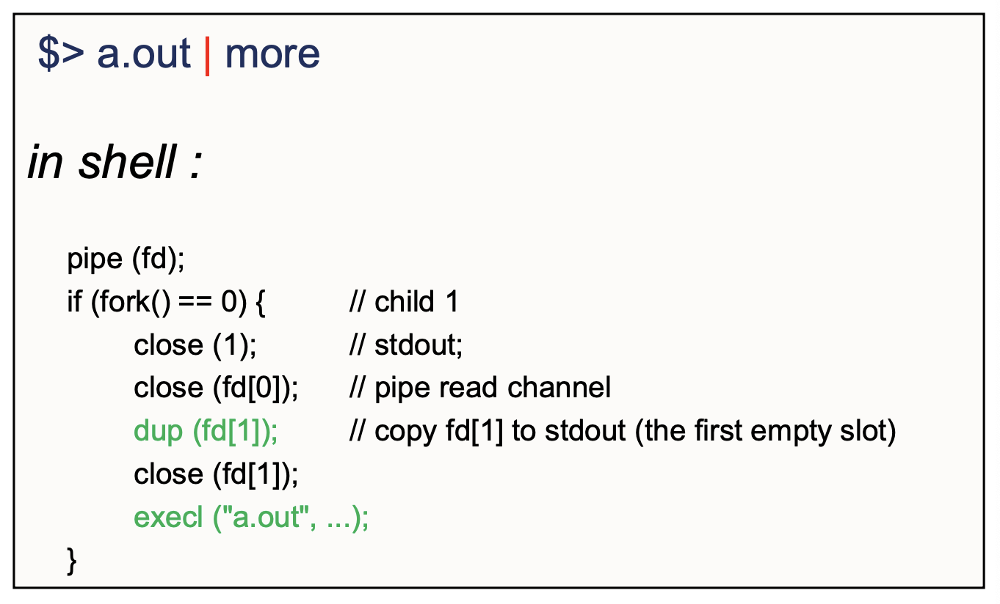

# 리눅스 프로세스 관리 Part 2 (Multitask Scheduling과 Race Condition 문제 + Process Control 시스템 콜)

 

> 참고 자료 : '시스템 프로그래밍' 학부 수업 자료

  

### 목차

- <a href="https://github.com/SangYoonLee1231/TIL/blob/main/Operating_System/System_Programming_Linux/linux_process_control_pt2.md#multitask-scheduling">Multitask Scheduling</a>

  - <a href="https://github.com/SangYoonLee1231/TIL/blob/main/Operating_System/System_Programming_Linux/linux_process_control_pt2.md#context-switching">Context Switching</a>
  - <a href="https://github.com/SangYoonLee1231/TIL/blob/main/Operating_System/System_Programming_Linux/linux_process_control_pt2.md#%EC%A1%B0%EC%8B%AC%ED%95%B4%EC%95%BC-%ED%95%A0-%EB%AC%B8%EC%A0%9C-%EC%83%81%ED%99%A9--race-condition">조심해야 할 문제 상황 : Race Condition</a>
  - <a href="https://github.com/SangYoonLee1231/TIL/blob/main/Operating_System/System_Programming_Linux/linux_process_control_pt2.md#%EB%AC%B8%EC%A0%9C-%EC%83%81%ED%99%A9-%EC%84%A4%EB%AA%85">문제 상황 설명</a>
  - <a href="https://github.com/SangYoonLee1231/TIL/blob/main/Operating_System/System_Programming_Linux/linux_process_control_pt2.md#%ED%95%B4%EA%B2%B0-%EB%B0%A9%EB%B2%95">해결 방법</a>
  - <a href="https://github.com/SangYoonLee1231/TIL/blob/main/Operating_System/System_Programming_Linux/linux_process_control_pt2.md#pipe">pipe</a>

- <a href="">Process Control 시스템 콜</a>

  

## Multitask Scheduling

- CPU가 하나인 상황에서 여러 개의 프로세스가 메모리에 있을 때

- CPU를 한 순간에 한 프로세스가 잠깐 쓰고 그 이후에는 다음 프로세스가 쓰는 방식으로 CPU를 서로 공유한다.

- 이러한 방식을 **Multitask Scheduling** 혹은 **Time Sharing**이라 한다.

 

- Multitask Scheduling은 굉장히 빠르게 일어나기 때문에, 우리에게는 프로그램들이 동시에 돌아가는 것처럼 보인다.

  

### Context Switching

- 두 개의 프로세스가 하나의 CPU를 공유하는 상황을 가정해보자.

- 시분할로 프로세스에 CPU가 할당되고 있다.

  - 분할 단위 = 1/100초 (10ms)

 

- 문제는 그냥 CPU를 주면, CPU 안의 레지스터 (데이터 저장소) 값들이 프로세스가 바뀔 때마다 달라지므로 그 내용이 엉망이 될 수 있다.

- 따라서 CPU가 다음 프로세스로 넘어갈 때 기존에 작업한 내용들을 어딘가에 저장해두어야 한다. 이 곳이 **PCB**이다.

- (사진 오타) state 대신 cpu context

 

- OS의 커널 안에는 각 프로세스마다 자신에 대한 모든 정보를 가지고 있는 독립적인 프로세스 자료구조들이 있다. → **Process Control Block (PCB)**

  - PCB 안에 이 CPU content를 저장하는 공간을 할당해둔다.

- 프로세스가 멈출 때 PCB에 context를 Save, 다시 작업을 이어갈 때 PCB에 context를 Reload

- 이렇게 프로세스의 상태 정보가 CPU에서 교환되는 이 작업을 **Context Switching**이라 한다.

  

### 조심해야 할 문제 상황 : Race Condition

- 만일 File 하나를 여러 개의 프로세스가 함부로 공유해서 복사하거나 협력 작업을 할 경우 조심해야 할 문제가 있다.

  

- 위 코드는 하나의 프로세스에서 read file을 1byte씩 읽어 copyfile 이름의 파일에 복사하는 작업의 코드이다.

- 부모와 자식 프로세스가 서로 협력하여 이 작업을 동시에 같이 하고 있다고 하자.

- 이 때 아래의 문제가 발생할 수 있다.

  

 

#### 문제 상황 설명

- 부모가 한 바이트 읽고, 자식이 한 바이트 읽고, 이를 반복하고 있는 상황이다.

- 이 때 File Offset이 움직이고 있기 때문에, 다음 프로세스는 전 프로세스가 읽은 데이터의 그 다음 바이트부터 데이터를 읽을 수 있다.

- 이 때, 부모 프로세스가 3번째 데이터 c를 읽고 파일에 write하기 직전에 CPU Time Up이 일어났다고 가정하자.

  - 언제 프로세스가 CPU를 뺏길 지 알 수 없으므로 이 가정은 충분히 일어날 만한 상황이다.

- 이렇게 되면 위 상황처럼 그 다음 자식 프로세스가 읽은 값인 d가 오히려 먼저 file에 write되는 문제가 발생하게 된다.

- 이렇게 데이터를 쓰고 읽는데 순서가 뒤엉킬 수 있는 상황을 **Race Condition**이라 부른다.

  - **Race Condition** : 마치 달리기의 결과를 예상할 수 없는 것처럼, (프로그램을) 실행시켜 봐야만 그 결과를 알 수 있는 예측 불허의 상황

 

#### 해결 방법

- 이를 방지하기 위한 여러 메커니즘(프로세스 동기화(싱크로나이제이션), 뮤텍스)은 나중에 배울 것이다.

- 서로 다른 프로세스 간에 협력 작업을 하기 위한 방법은 여러가지 있다.

  - 이를 <strong>IPC (= Inter Process Communication)</strong>라 한다.

- 일단 여기서 소개할 방법은 pipe를 이용하는 것이다.

 

#### pipe

- pipe는 프로세스 간에 데이터를 잘 교환할 수 있도록 (이를 IPC라고 함) OS에서 제공하는 특별한 자료구조(원형 큐)이다.

- pipe는 OS 안, 특수한 메모리에서 제공하는 자료형인데, 실제로 사용자들은 이를 파일이라 생각하고 사용하도록

- 사용자에게 제공되는 인터페이스 형식은 파일의 형식으로, 내부 구조는 메모리 buffer의 형식으로 제공된다.

 

- file로 access 하므로 file discriptor가 필요하다. (이를 통해 접근)

- 따리서 pipe를 생성하면 기본적으로 pipe에 2개의 디스크립터가 할당된다.

  - 하나는 reading only : pipe에서 읽는 용도

  - 다른 하나는 writing only : pipe에서 쓰는 용도

- offset도 디스크립터에 따라 각각 할당된다.

 

- pipe는 시스템에서 이름을 전혀 모르는 프로세스들 끼리도 pipe를 사용할 수 있게끔 이름을 붙여서 제공하는 **named pipe**가 있고

- 이름 없이 부모 자식 간에 서로 암묵적으로 만들어서 쓰는 **unnamed pipe** 또는 anonymous pipe가 있다.

- 이 pipe는 프로세스 사이에 IPC를 제공하는 기본적인 방법이다.

 

- **내부 기능**

  - **block (waiting) & wakeup** : 멈춰야 할 지점에서 멈추고, 깨어나야 할 지점에서 깨어나도록 OS가 돕는 기능

  - 예1)

    - 파일에서 데이터를 읽으러 들어갔더니 아직 데이터가 들어오지 않는다.

    - 그럼 데이터가 들어올 때까지 멈춰야 한다. → block (waiting)

    - waiting 중에 자신이 원하는 상황이 만들어졌을 때 자고 있는 waiting process를 깨운다 → wakeup

  - 예2)

    - pipe는 원형 큐이므로 용량 제한이 있다.

    - 따라서 만일 데이터 용량이 꽉 차있으면 write 프로세스는 기다려야 한다. → block

    - 이후 빈 공간이 생기게 되면 → wakeup이 일어난다.

  - pipe에서 block & wakeup이 지원되기 때문에 데이터가 뒤섞이는 일이 생기지 않는다.

 

- **Pipe 그림**

  

  - 읽으려면 descriptor 번호 0번, 쓰려면 descriptor 번호 1번

  - Race Condition이 발생하지 않음

 

- **pipe 코드 예시**

  

  

  - 부모 프로세스에서 fork()를 통해 자식 프로세스가 만들어질 때 → 파일 디스크립터 테이블 또한 모두 자식에게 상속 → 부모와 자식 프로세스의 파일 디스크립터 중 2개는 pipe에 접근하는 용도로 사용된다 (하나는 읽기용, 다른 하나는 쓰기용)

    - 부모와 자식이 파일에 접근하는 경로를 모두 가지고 있다.

  - read(input, buf, 10) ← 성공적으로 읽은 바이트의 수가 리턴

  - 디스트립터에 대한 처리 : 다 썼거나 더 이상 필요 없으면 무조건 닫는 것이 원칙

 

- **pipe를 사용할 때 주의할 점**

  - 그런데 만약에 fd[0]와 맞닿아 있는 상대편 지점은 fd[1]

  - 상대편 지점의 자식 프로세스가 fd[1]를 닫고 있지 않으면 파일 디스크립터를 제대로 닫아주지 않으면

  - 데이터가 다 끝났음에도 데이터가 들어올 거라 기대하고 계속 기대하고 있으므로 프로세스를 끝내지 않는다. 즉, 프로그램이 끝나지 않는다.

  - 두 프로세스 사이에 서로 양단간의 하나는 write용, 하나는 read용으로 디스크립터가 맞물려 있을 경우, 상대편에서 쓰지 않거나 다 사용했으면 닫아주어야지 이 쪽 프로세스도 끝내고 나올 수 있다.

  - 따라서 사용을 종료한 파일 디스크립터는 반드시 close를 통해 종료시켜야 한다.

- <strong>`$> a.out | more`</strong>

  - a.out의 표준 출력를 화면으로 보여주지 않고 뒤의 more 파일에 표준 입력으로 연결한다.

  - shell이 이 작업을 하는데 어떻게 코드가 구현되어 있는지 보자.

  - 내부적으로 pipe를 쓰고 있다.

    

    

- pipe를 통해 개별적으로 구성된 프로그램들을 연결하여 별도의 큰 프로그램을 만들지 않고도 큰 작업을 수행할 수 있다.

  

> ### ☝🏻 Q. pipe 연산의 block & wakeup 기능을 통해 Race Condition을 예방하는 방법을 자세히 설명해주세요.
>
> 파이프(pipes)는 한 프로세스에서 다른 프로세스로 데이터를 전달하는데 사용되는 IPC(Interprocess Communication) 메커니즘 중 하나입니다. 파이프는 일반적으로 읽기와 쓰기를 위해 두 개의 파일 디스크립터를 사용합니다. 하나는 읽기용이고, 다른 하나는 쓰기용입니다. 이때 파이프 연산에서 block & wakeup 기능이란, 파이프에서 데이터를 읽으려는 프로세스가 데이터를 기다리는 동안 (block) 대기하다가, 데이터가 쓰여지면 (wakeup) 프로세스를 깨워서 데이터를 읽게 만드는 것을 의미합니다.
>
> 하지만, 이러한 block & wakeup 기능에서는 Race Condition 문제가 발생할 수 있습니다. 예를 들어, 다수의 프로세스가 동시에 파이프에 데이터를 쓰는 작업을 수행할 때, 파이프에서는 데이터가 동시에 쓰여질 수 있습니다. 이 경우, 파이프에서는 데이터를 읽으려는 프로세스가 먼저 block 상태로 들어가서 다른 프로세스들의 작업이 완료될 때까지 기다린 후, 데이터를 읽게 됩니다.
>
> 이러한 Race Condition 문제를 예방하기 위해, 리눅스에서는 파이프를 사용하는 프로세스들 사이에서 데이터를 전달하는데 사용되는 큐를 관리합니다. 이 큐에서는 파이프에 데이터를 쓰는 작업을 수행하는 프로세스들이 대기하다가, 순서가 되면 데이터를 쓰게 됩니다. 이를 위해 큐는 뮤텍스(mutex)와 condition variable을 사용하여 동기화됩니다.
>
> 따라서, 파이프에서의 block & wakeup 기능에서는 데이터를 쓰는 프로세스가 데이터를 큐에 쓰기 위해 뮤텍스를 획득하고, 데이터를 쓴 후, condition variable을 통해 대기하고 있는 프로세스들 중 하나를 깨워서 데이터를 읽게 만듭니다. 이렇게 함으로써, Race Condition 문제를 예방하고 파이프에서 안전하게 데이터를 전달할 수 있게 됩니다. (이 내용은 뒤에 자세히 나옵니다.)

   

## Process Control 시스템 콜

#### `pid_t getpid(void)` (process id) : 프로세스 자신(caller process)의 pid를 리턴

 

#### `pid_t getpgrp(void)` (process group) : 프로세스 자신(caller process)의 group의 pid를 리턴

- 여기서의 group은 현재 생성된 process들이 만든 그룹으로 user group과는 다른 개념이다.

- 자기가 속해 있는 리더 (세션 리더) = 맨 처음 만들어지는 프로세스

- shell이 세션 리더이다.

- 세션 리더가 일반적으로 process group id의 역할을 한다.

 

#### `pid_t getppid(void)` (parent pid) : caller process의 부모 pid를 리턴

 

#### `pid_t getpgid(pid_t tpid)` (process group pid) : 어떤 pid값을 인자로 지정하면, 이 pid가 속해있는 process group의 id를 리턴

- 비정상시 -1이 리턴

- 서버에 접속할 때 처음 만들어지는 세션 리더, 그 프로세스의 pid가 그로부터 생성되는 프로세스 group의 process group id가 된다.

- 세션 리더에게 signal이 전파되면, 그 signal이 리더 프로세스의 그룹 내에 있는 모든 프로세스들에게 전파될 수 있다.

  - signal의 예시 : process kill signal (sigkill)

  - 세션 리더가 종료되면 그 그룹에 속해있는 모든 자식 프로세스들에게 SIGHUP signal이 전달되고, 강제 종료 된다.

  - 따라서, 어떤 굉장히 계산량이 많은 자식 프로세스가 위와 같은 상황으로 인해 세션에 로그아웃 되더라도 계속해서 계산을 수행할 수 있도록 하기 위해선, 그 프로세스를 background mode로 돌려야 한다.

    - `$ nohup command …. &`

    - 표준 입출력인 TTY가 없어진 상황이므로, Standard I/O에 입출력을 하는 것이 아니라, 어떤 디스크에 있는 파일에 입출력을 하도록 프로그램을 설계해야 한다.

 

#### `setpgid` 시스템 콜

- 프로세스 리더를 중간에 바꿀수도 있는데, 이때 사용하는 시스템 콜이 `setpgid`이다.

- ``int **setpgid**(pid_t pid, pid_t pgid)`

  - 기능 : `pid`가 속해있는 process group id를 `pgid`로 설정해라

    

  - return 값 : 0 (정상) or -1 (에러)

 

#### `atexit` 함수

- ``int **atexit**(void (*func)(void))`

- 기능 : 프로세스가 종료되어 exit이 호출되었을 때 `void (*func)(void)`에 지정되어 있는 함수를 실행해달라

  - 이 함수를 exit handler이라 부른다.

  - function name 또는 function pointer이라 부른다.

  - 프로그램 종료 시 마지막에 해야될 일 : 파일 닫기, 메모리 해지하기 등의 뒷정리

- `atexit` 을 상황에 따라 여러 번 부를 수 있다.

  - exit handler은 스택처럼 쌓이므로, 맨 마지막에 호출된 `atexit`의 exit handler부터 호출된다.

- return 값 : 0 (정상) or 에러에 해당하는 호출 값 (에러)

 

#### `system` 함수

- `int **system**(const char *string)`

- 기능 : string으로 원하는 명령어를 전달하면 Shell Command를 실행

- system 명령은 실제로 실행될 때 shell 프로세스가 하나 만들어지고, 그 shell process에서 전달된 명령어를 수행하고, 그것의 exit code를 돌려주도록 구성되어 있다.

  - system 명령 수행 중 process가 하나 추가적으로 생성된다.

  

### Process Time 측정 함수

#### `times` 함수

- `clock_t **times**(struct tms *buf)`

- 시스템이 실행되면 clock tick이 지나간다. (초당 1000개 혹은 10000개)

- clock tick이 계속해서 증가한다.

- times를 부르면 그 때의 clock tick이 리턴된다.

- struct tms \*buf

  - 현재 실행하고 있는 프로세스가 실제로 CPU를 얼마나 썼는지를 알려준다.

    

- 시간 구분

  - wall clock time vs CPU time ← 둘을 구분해서 사용하는 것이 좋다.

 
