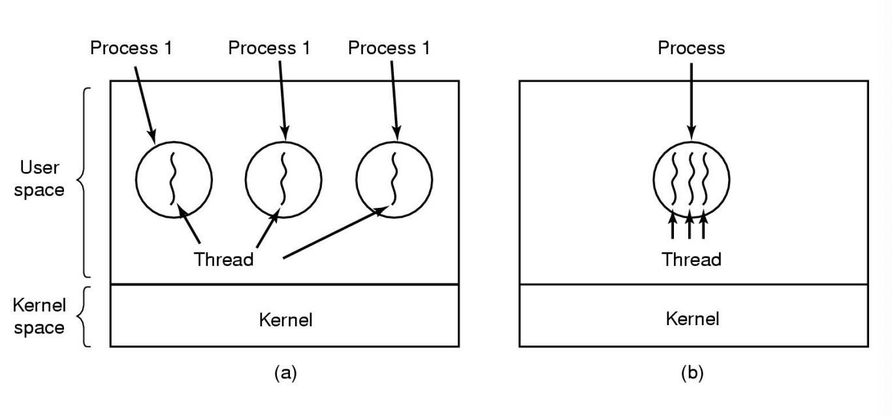

# 리눅스 프로세스 관리 Part 3 (멀티 쓰레드)

 

> 참고 자료 : '시스템 프로그래밍' 학부 수업 자료

  

### 목차

- <a href="">쓰레드의 탄생 배경</a>
- <a href="">쓰레드의 핵심 아이디어</a>
- <a href="">쓰레드 (Thread)</a>
- <a href="">쓰레드의 특징</a>
- <a href="">멀티 쓰레드로 프로그래밍 할 때 주의할 점</a>
- <a href="">멀티 쓰레드를 사용하면 유익한 점</a>
<!-- -  -->

  

## 쓰레드의 탄생 배경

- 스케쥴링의 기본 단위는 **프로세스**이다.

- 여러 개의 작업을 할 때 프로세스를 여러 개 만들어서 작업을 하는 것 : Concurrent Programming

- 예전(1990년대 초반)에는 프로세스를 기반으로 대부분의 프로그램이 만들어졌다.

- 하지만 **이런 방식은 여러 문제점을 불러일으킨다.**

 

### 스케쥴링 시 프로세스 단위로 진행하면 일어나는 문제점

#### **문제점 1. 프로세스가 무겁다** (= Heavy Weight Process)

- **프로세스 하나를 차지하는 자원이 적지 않다.**

- 프로세스 안에는 페이지 (주소 공간 정보 포함), OS 자원 (파일 디스크립터 및 개체 정보 등), 계정 정보, PCB 등이 있다.

  - PCB (Process Control Block) : 프로세스와 관련된 모든 정보를 담고 있는 자료구조

  - PCB 안에 들어있는 중요한 역할을 하는 것 : 하드웨어 실행 상태 (Hardware execution state / Context)

  - 하드웨어 실행 상태는 그 프로세스가 어디까지 실행을 해왔는지에
    대한 스냅샷을 담고 있다.

- 위와 같이 프로세스는 많은 정보를 담고 있으므로, 프로세스 하나가 차지하는 비중은 굉장히 크다.

- 이로 인해 fork를 통해 프로세스를 생성하는 데 걸리는 시간 또한 길어진다. (ms 단위이긴 하지만)

- 정보들도 초기화 해야하고, 자원들도 할당해야 하고..

- 시스템 부하 가능성이 높아짐

 

#### 문제점 2. 만일 IPC을 하기 위한 기본 단위가 프로세스이면, **프로세스끼리는 데이터를 주고받지 못하므로 항상 OS 시스템 콜을 거쳐서 프로세스 간 통신을 해야만 한다.**

- 그렇게 되면 IPC cost 또한 커지게 된다.

- syscall를 부르고, 데이터를 불필요하게 커널로 카피해서 보내고, 커널은 받은 데이터를 또 카피해서 올려 보내고..

 

#### 문제점 3. 많은 사용자의 요청으로 Concurrent Process를 통해 **프로세스가 많이 만들어질 경우** (네트워크 프로세스도 똑같은 상황), **자원 낭비가 심해진다.**

- 이 프로세스들은 모양은 똑같고 내부 구조도 굉장히 비슷한데, 유저의 요청을 받아 실행하는 실행 부분이 다르다.

  - 실행 부분 : Hardware Execution State OR Hardware Context

- 또 다른 부분은 **Stack**이다.

  - 프로세스를 구성하는 주요 요소 : **코드, 데이터, 힙, 스택**

  - 그 중에서 Function Call을 지원하기 위한 세션 : **스택**

  - 뭔가를 실행한다 = Function Call을 하는 것들이 다르다

  - 그러면 Stack도 다르게 된다.

- 만일 비슷비슷한 일을 한다면 굳이 프로세스를 새로 만들어야 하는가 하는 의문이 생긴다. 자원 낭비도 심해지고 말이다.

- 그래서 굳이 프로세스 단위를 쓰는 대신 새로운 개념을 도입하자 → 쓰레드의 탄생

  

### 쓰레드의 핵심 아이디어

- Concurent Process를 경량화해서 만들자.

- 같은 부분은 같이 쓰게 하고, 다른 부분만 분리해서 하나씩 하나씩 할당을 해주자.

- **Key idea** : 프로세스가 가지고 있는 컨셉 중에서 execution state를 지원하는 부분만 따로 분리하여 그것만 Copy를 해가자.

  

## 쓰레드 (Thread)

- Thread를 엄밀히 말하면 thread of control → 프로그램의 실행 흐름을 의미한다.

  

- 실행이 흘러가는 흐름 : Control Flow

- 기존의 하나의 프로세스에서는 이 Control Flow가 하나 존재했다.

  - 프로세스가 실행되면 하나의 실행 흐름이 생성되고, exit시 실행 흐름도 같이 끝난다.

- 이를 싱글 쓰레드(Single-Thread)라 하는데, 이 방식 대신 하나의 프로세스 안에 여러 개의 실행 흐름을 만드는 방식을 사용하고자 한다.

  - 대부분의 정보는 Parent의 정보들을 그대로 쓰고, 자신이 독립적으로 실행하는 데 필요한 정보만 별도로 구비하여 실행될 수 있도록 하자.

- Thread Control은 한 프로세스 안에서 실행되는 Control을 의미한다.

- 어떻게 멀티 쓰레드를 만드는 지는 나중에 다루고, 일단 관념적으로만 개념을 머리에 담아두자.

 

- 이제부터는 프로세스가 아닌 **쓰레드**가 CPU 스케쥴링의 단위이다.

  

### 쓰레드의 특징

- **쓰레드를 구성하는 요소**

  - 쓰레드에서 독립적으로 구비해야 되는 부분이 하나의 쓰레드를 구성하는 요소이다.

  - thread id, 그 Thread를 실행하기 위한 Hardware Context (a program counter), (CPU 안의) 레지스터 값들을 저장하는 공간, Function Call을 위한 Stack

    - Stack은 쓰레드끼리 공유할 수 없다.

    - Stack의 구성 : 어떤 함수에서 사용하는 지역 변수, 그 함수에 전달하는 인자(argument), 함수가 끝나면 돌아갈 주소

 

- 여러 개의 쓰레드를 생성하면, 그 여러 개의 쓰레드들은 기본적으로 프로세스 안에 있는 코드, 데이터, 그 프로세스가 할당받은 파일들, OS 자원들, 그 프로세스에 전달되는 Signal (ex : Signal Kill - 키보드에서 Ctrl +C 누름), 데이터 색션(전역 변수들) 등을 공유한다.

  

  - **code, data, files** : 쓰레드끼리 공유하는 부분 (쓰레드 간 데이터 교환이 가능한 부분)

  - **registers, stack** : 각 쓰레드가 독립적으로 가지는 부분 (다른 쓰레드가 접근할 수 없음)

  

### 멀티 쓰레드로 프로그래밍 할 때 주의할 점 1

- 위의 특징이 장점임과 동시에 굉장히 치명적인 약점으로 작용할 수 있다.

- 쓰레드 A가 x 변수를 수정하는 중에 쓰레드 B or C가 그 데이터를 가져갈 수 있다.

- 이는 데이터가 완결이 안 된 상태에서 데이터를 읽어들이는 것이므로, 치명적인 오류를 발생시킬 수 있는 위험한 상황이다. 반드시 막아야 한다.

- 쓰레드 프로그래밍 중에 가장 조심해야 하는 부분 중 하나가 이것이다.

 

- 뭔가를 쉽게 공유한다는 것은 어떤 상태를 굉장히 불안정하게 만드는 잠재적인 요인이 된다.

  - 예 : 실행할 때마다 결과가 다른 상황 = Race Condition

- 멀티 쓰레드 프로그래밍을 생각 없이 하면, 뒷감당이 매우 힘들어질 수 있다.

  - 가장 어려운 점은 결과가 매번 달라질 수 있다는 것이다.

- 쓰레드 프로그래밍에서 변수를 통해 데이터를 교환할 땐 굉장히 유의해야 한다.

 

- 참고로 PC 프로그램 카운터라는 정보도 저장된다.

  - 현재 어디를 실행하고 있는지를 가리키고 있는 것

  

### 멀티 쓰레드로 프로그래밍 할 때 주의할 점 2

- 라이브러리가 제공하는 API(함수)를 쓸 때 MT(multi-threaded)-safe library function을 써야한다.

- MT-safe 표시 : 이 함수는 멀티 쓰레드에서 써도 되는지, 쓰면 결과를 보장하지 못하는지 알려줌

- 이유 : 쓰레드 간에 데이터를 마구 공유했을 때 발생하는 문제를 미연에 방지하기 위해서

  

### 멀티 쓰레드를 사용하면 유익한 점

- 네트워크로 데이터를 가져온 후, 이를 내부적으로 가공하여 사용자가 보기 편하도록 가시화(visualize)해서 보여주는 앱을 만든다고 가정하자.

- 이 앱에는 사용자의 주문을 받는 기능을 넣어야 할 수도 있다.

- 만일 이러한 앱을 싱글 쓰레드로 만들게 된다면,

  - 일을 계속해서 반복하는 형태로 프로그램을 만들어야 한다. (while문을 반복해서 써야할 수 있음)

  - 동시에 다양한 일이 일어나는 경우를 절대 지원할 수 없는 구조이다.

- 따라서, 각각의 기능을 쓰레드로 만들어, 이들 사이의 스케쥴링은 OS에게 맡기게 하도록 프로그램을 설계해야 한다. → 멀티 쓰레드로 만들어야 한다.

 

- 최근에는 concurrent server가 대부분 multi-threaded server로 전환되었다.

 
