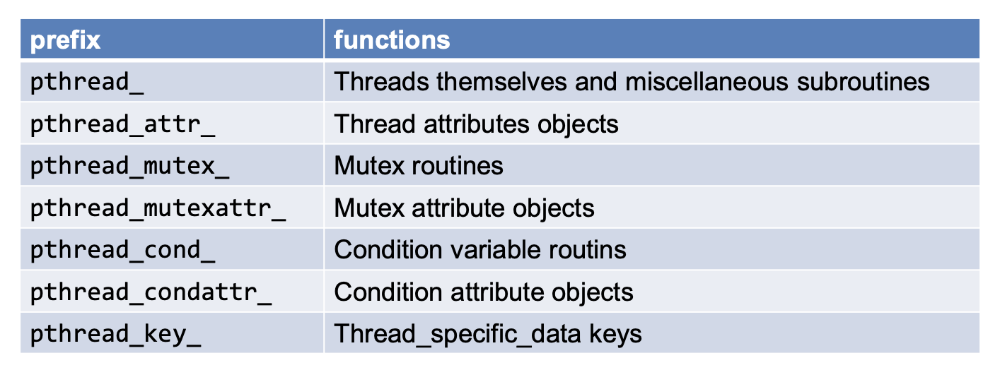
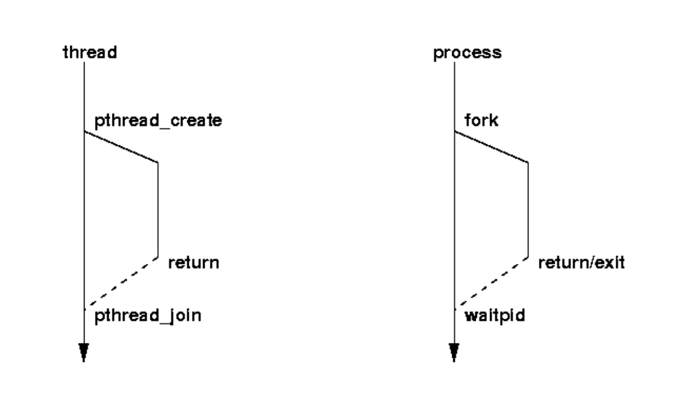
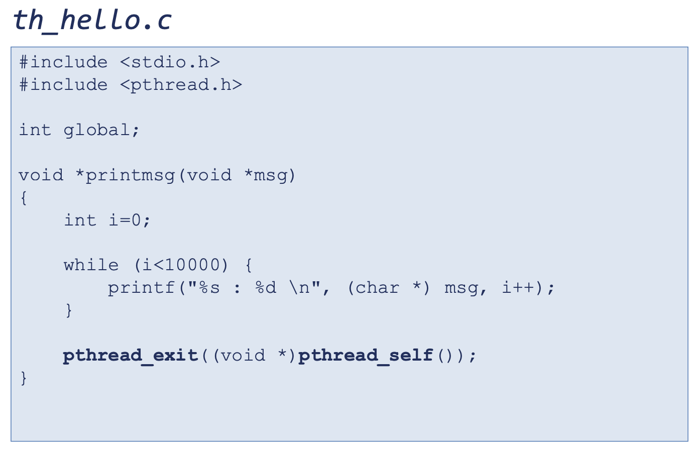
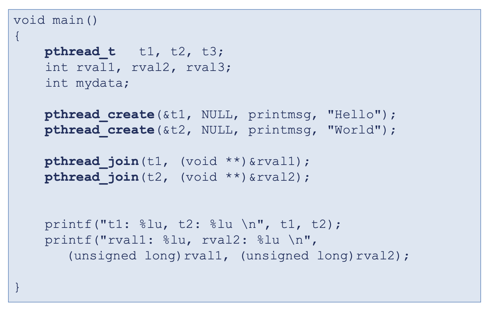

# 리눅스 프로세스 관리 Part 4 (Pthread Library)

 

> 참고 자료 : '시스템 프로그래밍' 학부 수업 자료

  

### 목차

- <a href="https://github.com/SangYoonLee1231/TIL/blob/main/Operating_System/System_Programming_Linux/linux_process_control_pt4.md#%EC%93%B0%EB%A0%88%EB%93%9C-%EB%9D%BC%EC%9D%B4%EB%B8%8C%EB%9F%AC%EB%A6%AC-thread-library">쓰레드 라이브러리 (Thread Library)</a>

- <a href="https://github.com/SangYoonLee1231/TIL/blob/main/Operating_System/System_Programming_Linux/linux_process_control_pt4.md#pthread">Pthread</a>

  - <a href="https://github.com/SangYoonLee1231/TIL/blob/main/Operating_System/System_Programming_Linux/linux_process_control_pt4.md#pthread%EC%99%80-%EA%B4%80%EB%A0%A8%EB%90%9C-api">Pthread와 관련된 API</a>
  - <a href="https://github.com/SangYoonLee1231/TIL/blob/main/Operating_System/System_Programming_Linux/linux_process_control_pt4.md#%EC%93%B0%EB%A0%88%EB%93%9C%EB%A5%BC-%EC%A2%85%EB%A3%8C%EC%8B%9C%ED%82%A4%EB%8A%94-%EB%B0%A9%EB%B2%95">쓰레드를 종료시키는 방법</a>
  - <a href="https://github.com/SangYoonLee1231/TIL/blob/main/Operating_System/System_Programming_Linux/linux_process_control_pt4.md#joinable-thread-vs-detached-thread">joinable thread VS detached thread</a>
  - <a href="https://github.com/SangYoonLee1231/TIL/blob/main/Operating_System/System_Programming_Linux/linux_process_control_pt4.md#%EC%93%B0%EB%A0%88%EB%93%9C-%EA%B0%95%EC%A0%9C-%EC%A2%85%EB%A3%8C">쓰레드 강제 종료</a>

- (🙂)

<!-- - 

  - 
  -  -->

  

### 쓰레드 라이브러리 (Thread Library)

- 쓰레드를 지원하는 쓰레드 모델 혹은 쓰레드 라이브러리는 OS마다 조금씩 다른데,
- 리눅스에서 현재 우리가 사용하려고 하는 쓰레드 라이브러리(인터페이스)는 POSIX가 재정한 Pthread(POSIX Thread)를 사용한다.

  

## Pthread

- POSIX : 리눅스나 유닉스에서 사용하는 시스템 콜들의 표준을 제정한 스펙

- Pthread는 쓰레드를 생성하거나 쓰레드 간 스케쥴링, 동기화 등을 어떤 시스템 콜로 할 것인지를 표준화한 스펙이다.

- Pthread는 오직 스펙만 제공한다.

  - 각각의 OS에서 이를 가져다가 이 스펙이 만족되도록 자신의 OS 기능을 이용하여 구현한다.

  - 구현(implementation)은 내부적으로 OS마다 조금씩 다르다. 그러나 그렇게 중요하지 않음

  - 우리에게 중요한 것은 인터페이스 (어떻게 함수명이 구성되어 있는지, 인자는 무엇을 주어야 하는지) ← 돌아가면 장땡

 

- 쓰레드 프로그래밍을 할 때 소스 코드에 `#include <pthread.h>`을 명시해야 한다.

- 라이브러리 이름 : libpthread.a ← Static Library이다.

- 컴파일을 할 땐 `$ gcc test.c -lpthread`

  

### Pthread와 관련된 API

- 쓰레드를 생성하는 방법, mutex를 사용하는 방법 이 두 가지만 알면 쓰레드 프로그래밍을 하는데 큰 어려움이 없다

 

#### `pthread_create` 함수

- 쓰레드를 하나 만드는 함수

- `int pthread_create(pthread_t *thread, pthread_attr_t *attr, void *(*start_routine)(void *), void *arg);`

- (비교 : 하나의 프로세스를 만들기 위해선 fork를 부름)

- 하나의 프로세스에는 기본적으로 하나의 쓰레드가 있다.

- 여기에서 pthread_create 함수를 부르는 순간 새로운 쓰레드가 그 프로세스 안에 만들어진다.

- 인자

  - thread: pointer variable to store a thread ID returned

  - attr: thread attributes for the new thread (default: NULL)

  - start_routine: 새 쓰레드가 해야할 일을 지정 (포인터 값을 리턴 받는 함수의 이름을 전달)

  - arg: argument passed to the thread function(i.e. start_routine) (없으면 NULL)

 

- `*thread` 인자 역할 : pthread_t라는 쓰레드 id를 받는 변수 (여기서 포인터 변수는 함수로부터 정보를 받기 위해 사용)

- pthread_create를 통해 쓰레드를 만들 때, 메인 함수에 쓰레드 하나가 기본적으로 할당된다.

- 즉, 한 프로세스 안에는 하나의 쓰레드가 기본적으로 있는 것이다. → Main Thread

- 이 외에 나머지 모든 쓰레드은 명시적으로 pthead_create를 통해 생성한다.

- 쓰레드에게 주어질 미션은 함수 형태로 전달한다.

- 쓰레드가 생성이 되면 모든 쓰레드들은 동일한 동료들이다. (누가 더 중요하고 그런거 없음)

- 프로세스에서 쓰레드를 생성하는 maximun number는 프로세스 시스템에서 관리자가 설정한다.

  - `– cat /proc/sys/kernel/threads-max (default: 388547)`

  

### 쓰레드를 종료시키는 방법

- 원칙적으로는 `pthread_exit()`라는 API를 쓰레드의 끝에 넣어주면 끝난다.

- 그리고, 쓰레드에게 함수 형태로 주어진 미션(routine)이 끝나도 쓰레드가 종료된다.

- 이 함수에도 마지막에 `pthread_exit()`을 넣어주는 것이 좋다.

- 넣어주지 않더라도 컴파일러가 우리 대신에 쓰레드 마지막에 `pthread_exit()`을 넣어준다.

- 또 하나는, 다른 쓰레드가 `pthread_cancel()` 함수를 써서 상대방의 쓰레드를 강제로 종료시킬 수 있다.

  - target thread의 id를 주면 된다.

- `exit` 콜을 통해 프로세스를 종료되면, 그 프로세스가 만들었던 모든 쓰레드들도 같이 종료한다.

 

#### `void pthread_exit(void *retval)`

- `pthread_exit()` 함수는 다음과 같은 일을 수행한다.

  1. 현재 스레드를 종료시킨다.
  2. 리소스를 해제한다.
  3. retval 값을 다른 스레드에서 참조할 수 있도록 한다.

- `*retval` : `pthread_join()`으로 인해 대기하고 있는 쓰레드에게 전달하는 return 값

  - `void` → 자료형을 특정하지 않는다. 주소값을 저장할 수 있도록 자료형을 확장한 것이다. (포인터로도 쓸 수 있도록)

- `pthread_exit()` 함수는 다른 스레드에서 `pthread_join()` 함수를 호출하여 현재 스레드의 리턴값을 얻을 수 있도록 해준다.

- 만약 `pthread_exit()` 함수를 호출하지 않고, 스레드 함수가 리턴하는 경우에는 `pthread_exit(NULL)`과 동일한 결과가 발생한다.

- `pthread_join()`은 프로세스의 wait과 비슷하다. (자세한 설명은 아래에)

 

- **프로세스에서 wait, exit과의 관계 ≒ 쓰레드에서 pthread_join, pthread_exit와의 관계**

  

- 모든 쓰레드에서 `pthread_exit()` 콜을 쓰는 것이 권장사항이다.

- 만일 main 함수가 `pthread_exit()` 콜로 인해 종료되면, 그 main 함수의 쓰레드만 종료된다. 다른 쓰레드는 종료되지 않고 계속 작업을 이어할 수 있다.

  - `pthread_exit()`를 통해 종료된 쓰레드는 자기가 열어뒀던 파일 등을 정리하지 않는다.

  - 프로세스가 종료될 때 clean up 된다.

- 만일 `pthread_exit()` 콜을 부르지 않고, `exit` 콜을 통해 프로세스를 끝내면 모든 쓰레드가 종료되어 버린다. (조심할 것)

  

### joinable thread VS detached thread

#### **joinable thread**

- **합칠 수 있는 쓰레드**

- `pthread_join()`을 통해 자식 쓰레드가 다시 자신에게 join 할 수 있다.

- 다른 쓰레드에게 join할 수도 있다. → 나의 결과물을 다른 쓰레드에게 전달 가능

  - 쓰레드를 생성하면 **기본적으로 joinable thread로 설정**된다. (default)

- joinable thread가 종료될 때, 이 쓰레드가 사용하던 여러 리소스들(메모리, 자료구조 등)은 바로 회수되지 않는다. → 좀비 쓰레드 (없는 용어)

 

#### **detached thread**

- **완전히 분리된 쓰레드**

- 쓰레드 생성 시 부모와 완전히 다른 독립된 쓰레드로 취급받는다.

- `int pthread_detach(pthread_t id);` : 일반적인 joinable thread를 detached thread로 바꾸는 API (쓰레드의 id값을 준다)

- 이 쓰레드는 다시는 join할 수 없다.

- detached thread가 종료되면, 이 쓰레드가 사용하던 모든 리소스들은 바로 회수된다.

- Concurrent Server에서 서비스 결과를 마스터에게 꼭 돌려줄 필요가 없을 때, detach thread를 사용하여 자원을 바로바로 회수할 수 있도록 서비스를 설계할 수 있다.

 

#### `int pthread_join(pthread_t tid, void **retval);`

- 어떤 쓰레드 하나를 create 했을 때, 이 쓰레드의 부모 쓰레드가 멈춰서 자식 쓰레드가 종료될 때까지 기다릴 수 있다. 이 때 사용하는 API가 `pthread_join`이다.

- `pthread_join()` 함수는 다음과 같은 일을 수행한다.

  1. 지정된 쓰레드의 종료를 기다린다.

  2. 지정된 자식 쓰레드가 종료되면, 자식 쓰레드는 retval
     포인터가 가리키는 메모리에 쓰레드의 리턴값을 저장한다.

  3. 쓰레드가 이미 종료되었다면, 즉시 반환한다.

- `pthread_join()` 함수는 `pthread_create()` 함수를 통해 생성된 스레드 ID를 전달하여 사용한다.

- 이 함수를 호출하면 현재 스레드가 대기상태가 되어, 지정된 스레드가 종료되기를 기다린다.

- `tid` : 쓰레드가 기다리는 대상 쓰레드(자식 쓰레드)의 id

- `retval` : 자식 쓰레드로부터 값을 받을 변수의 주소

- return 값 : 성공 시 0, 에러 시 에러 번호

 

- **caller vs callee**

  - `pthread_join()`을 호출할 때 그 호출하는 당사자 쓰레드을 caller(호출자)라 한다.

  - 그 호출자에 의해 불리는 쓰레드를 callee라 한다.

  - caller : 부모 쓰레드, callee : 자식 쓰레드

  - `pthread_join()` routine은 caller를 block시킨다. `pthread_exit(callee의 id)`가 호출되어 callee가 종료될 때까지.

  - `pthread_exit()`의 return 값을 `pthread_join()`의 두 번째 인자 값으로 받아 자식 쓰레드의 상태를 확인할 수 있다.

  - 만일 target thread가 비정상적인 방법으로 cancel이 되었을 경우, `retval`에 PTHREAD_CANCELED라는 지정된 매크로가 저장되어 돌아온다.

 

#### `int pthread_self(void);`

- 자신의 쓰레드 id를 알고 싶을 때 사용

 

#### `int pthread_equal(pthread_t t1, pthread_t t2);`

- 두 개의 쓰레드가 같은지 확인
- == 을 써서 확인하면 안되고, `pthread_equal()` API를 써서 확인해야 한다.
- 같은 객체를 다른 id를 가지고 접근하는 경우가 있을 수 있기 때문이다.

- pthread 예시 코드

  

  

 

### 쓰레드 강제 종료

- 쓰레드가 정상적으로 종료되기 전에 강제적으로 종료시키기

- `pthread_cancel(pthread_t tid)` API를 쓴다.

- Cancellation엔 2가지 타입이 존재한다.

  - **asynchronous cancellation**

    - **cancel 요청이 가자마자 쓰레드를 바로 종료시킨다.**

    - cancel을 요청하는 쪽과 요청을 받는 쪽이 약속 없이 서로 무작위적으로 쓰레드를 종료시킨다.

    - 어떤 일을 하고 있던 간에 쓰레드를 종료시켜버리기 때문에 썩 좋은 방법은 아니다.

    - 하지만 자원을 바로바로 clean up을 시켜야 할 경우 이러한 방법이 필요할 때가 있다.

  - **deferred cancellation**

    - cancel을 **안정된 point에 도달할 때까지 지연시킨 후** 쓰레드를 종료시킨다.

    - 안정된 지점 = cancellation point (cancel이 가능한 지점)

    - 내가 실행하는 코드 중에서 아무데서나 나는 죽을 수 없다. 나는 내가 안정적으로 죽을 수 있는 코드의 위치(cancellation point)를 직접 지정해주겠다.

    - cancellation point를 지시하는 API : `pthread_testcancel()`

    - 이 API 외에도 cancellation point를 지정해주는 API가 여러 개 존재하지만, 우선은 이 하나만 숙지해두자.

    - cancellation point에서 clean up 하려는 함수를 미리 등록해둘 수 있다. → `pthread_cleanup_push()` API

 

#### Cancellation 모드 설정하기

- `int pthread_setcancelstate(int state, int *oldstate);`

  - PTHREAD_CANCEL_DISABLE or PTHREAD_CANCEL_ENABLE 모드 설정

- `int pthread_setcanceltype(int type, int *oldtype);`

  - PTHREAD_CANCEL_DEFFERED or PTHREAD_CANCEL_ASYNCHRONOUS 모드 설정

- `oldstate`, `oldtype` 인자

  - 모드 변경 전 이전 상태를 알려주는 인자

  - 모드를 변경하면 시스템은 나의 이전 설정 상태를 알려주는 것이 일반적이다.

  - 이전 상태에 대해 관심이 없다면 이 자리를 NULL로 사용하면 된다.

 
