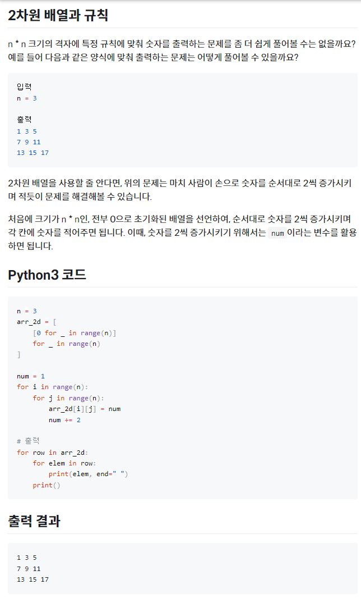
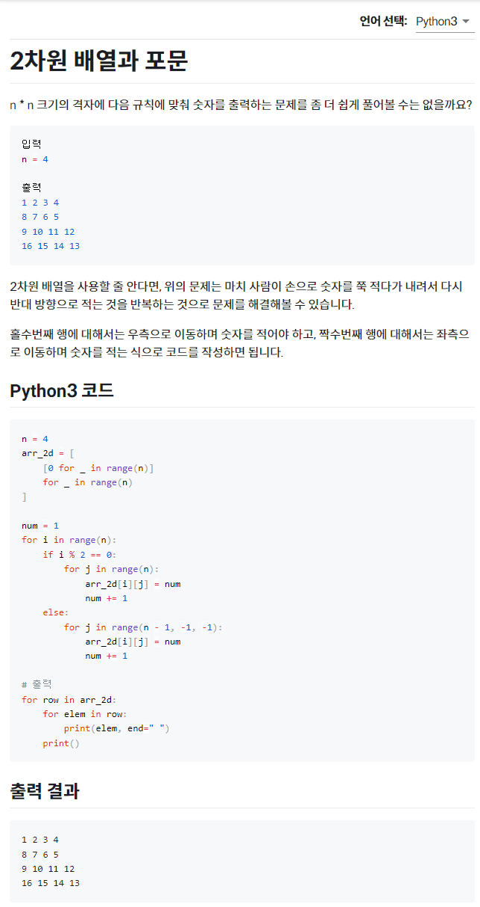

# Python - 2차원 리스트(배열)

<br/>

> 참고 자료 : <a href="https://www.codetree.ai/missions/4">Code Tree - Novice Low</a>

<br/>

## 목차

* <a href="">2차원 리스트 개념</a>
* <a href="">2차원 리스트 입력</a>
* <a href="">2차원 리스트 선언</a>
* <a href="">2차원 리스트 출력</a>
* <a href="">2차원 리스트 활용</a>

<br/>

## 2차원 리스트 개념

* 리스트를 원소로 갖는 리스트를 2차원 리스트(혹은 2중 리스트)라 한다.

    ```python
    arr_2d = [
        [1, 2, 3, 4],
        [5, 6, 7, 8],
        [9, 10, 11, 12],
        [13, 14, 15, 16]
    ]
    ```

<br/>

## 2차원 리스트 입력

* n개의 줄에 걸쳐 n개의 숫자를 입력받을 때, 이 2차원 격자 모양의 입력값들을 그대로 담아야 할 필요가 있다.

* 이 때 2차원 리스트를 활용하면 좋다.

* 각 줄마다 입력을 받아 하나의 리스트로 만들고, 이를 2차원 리스트에 <code>append()</code> 함수를 이용하여 추가한다.

    ```python
    n = int(input())
    arr_2d = []

    for _ in range(n):
        arr_1d = list(map(int, input().split()))
        arr_2d.append(arr_1d)

    print(arr_2d)
    ```

<br/>

* 이 때 <code>list comprehension</code>을 이용하면 더 간단히 입력값을 처리할 수 있다.

* 단, for loop 안에 append만 사용하는 경우여야만 가능하다.

    ```python
    n = int(input())
    arr_2d = [
        list(map(int, input().split()))
        for _ in range(n)
    ]

    print(arr_2d)
    ```

<br/>

## 2차원 리스트 선언

* 위에서 설명한 <code>list comprehension</code>을 통해 전부 0으로 초기화 된 2차원 배열을 선언해보자.

* n행 n열 격자

    ```python
    n = int(input())
    arr_2d = [
        [0] * n    # [0 for _ in range(n)]
        for _ in range(n)
    ]
    ```

<br/>

    * n행 m열 격자

    ```python
    n, m = tuple(map(int, input().split()))
    arr_2d = [
        [0] * m
        for _ in range(n)
    ]
    ```


<br/>

## 2차원 리스트 출력

* 2차원 리스트의 모든 요소를 격자 모양대로 출력하고자 할 때 (입력값 받을 때 상태 그대로)

* 중첩 반복문을 활용하여 range 함수를 사용한다.

    ```python
    n, m = 4, 3
    arr_2d = [
        [1, 2, 3],
        [4, 5, 6],
        [7, 8, 9],
        [10, 11, 12]
    ]

    for i in range(n):
        for j in range(m):
            print(arr_2d[i][j], end=" ")
        print()
    ```
    ```
    1 2 3 
    4 5 6 
    7 8 9 
    10 11 12

    ```

<br/>

* range 함수를 사용하지 않고 리스트 내 각 원소를 바로 접근하는 식으로도 표현이 가능하다.

* 2차원 배열의 원소는 각 행이 되며, 각 행에 있는 원소들을 조회하여 값을 출력해준다.

    ```python
    n, m = 4, 3
    arr_2d = [
        [1, 2, 3],
        [4, 5, 6],
        [7, 8, 9],
        [10, 11, 12]
    ]

    for row in arr_2d:
        for elem in row:
            print(elem, end=" ")
        print()
    ```
    ```
    1 2 3 
    4 5 6 
    7 8 9 
    10 11 12

    ```

<br/>

## 2차원 리스트 활용

### 2차원 배열과 규칙



<br/>

### 2차원 배열과 for문



<br/>

### 순서대로 채우기


<br/>

### 2차 격자점으로서의 배열

